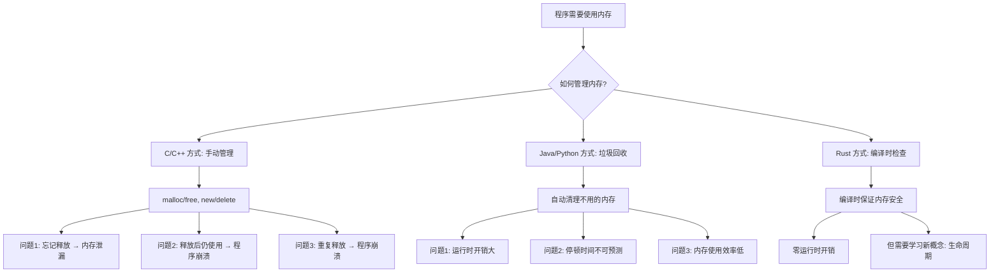
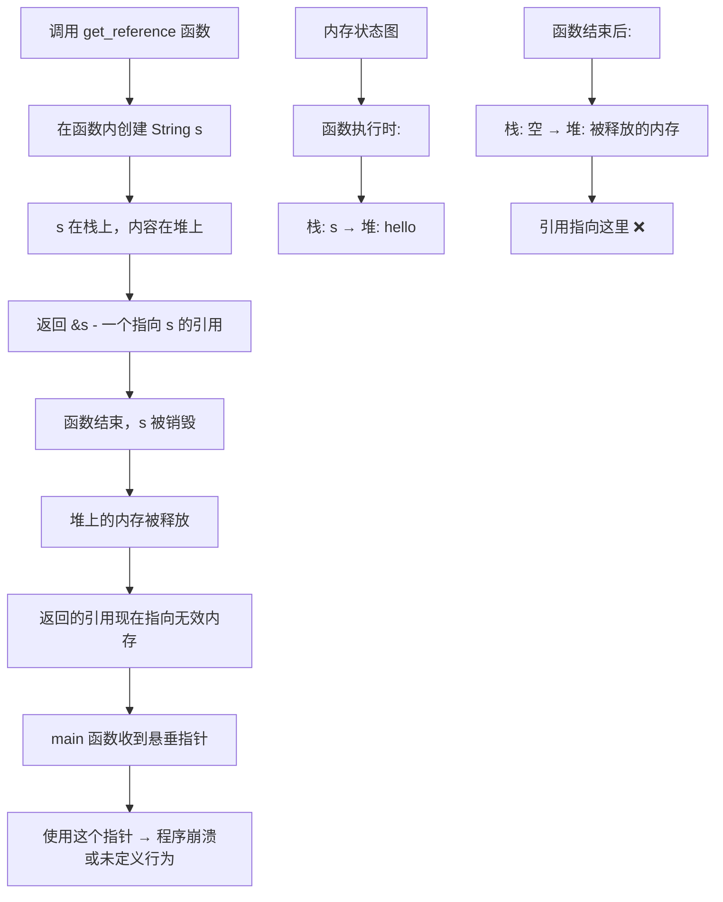
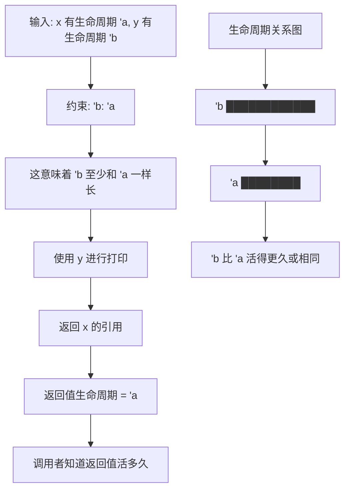

# Rust 进阶语法学习指南

> 针对有 Node.js/Python/Java 经验的开发者设计，通过对比讲解 Rust 独有概念

## 目录

1. [高级生命周期管理](#1-高级生命周期管理)
2. [高级特质系统](#2-高级特质系统)
3. [高级错误处理模式](#3-高级错误处理模式)
4. [高级异步编程](#4-高级异步编程)
5. [高级并发模式](#5-高级并发模式)
6. [高级类型系统](#6-高级类型系统)
7. [高级宏编程](#7-高级宏编程)
8. [性能优化技巧](#8-性能优化技巧)
9. [学习建议和总结](#9-学习建议和总结)

---

## 前言

基于你当前的 Rust 水平评估，你已经掌握了：
- 现代 Rust 生态系统和异步编程
- 错误处理和类型系统基础
- 内存管理和并发编程基础
- 高级语言特性的基本使用

现在可以深入学习更高级的语法特性，提升代码质量和性能。

---

## 1. 高级生命周期管理

### 与其他语言对比

| 语言 | 内存管理方式 | 特点 |
|------|--------------|------|
| **Java/Python** | 垃圾回收器自动管理内存 | 运行时开销，可能产生停顿 |
| **Node.js** | V8 引擎自动垃圾回收 | 异步友好，但内存占用较高 |
| **Rust** | 编译时生命周期检查 | 零运行时开销，内存安全 |

### 生命周期的本质理解



### 为什么需要生命周期标注？

让我用一个具体的例子来说明为什么需要生命周期：

#### 问题场景：

```rust
// 这是一个会出错的例子（实际上编译不通过）
fn get_reference() -> &str {
    let s = String::from("hello");
    &s  // 错误！s 在函数结束时被销毁
}   // s 在这里被销毁了！

fn main() {
    let r = get_reference();  // r 指向一个已经被销毁的内存
    println!("{}", r);        // 危险！使用了悬垂指针
}
```



### 显式生命周期标注详解

#### 1. 基础生命周期标注

```rust
fn longest<'a>(x: &'a str, y: &'a str) -> &'a str {
    if x.len() > y.len() { x } else { y }
}
```

**语法解释：**
- `<'a>` - 这是**生命周期参数**，`'a` 是一个名字（可以叫 `'b`、`'c` 等）
- `x: &'a str` - 参数 x 是一个字符串引用，生命周期是 `'a`
- `y: &'a str` - 参数 y 是一个字符串引用，生命周期也是 `'a`
- `-> &'a str` - 返回值也是一个字符串引用，生命周期是 `'a`

**这意味着什么？**

```mermaid
graph TB
    A[输入: x 和 y 都有生命周期 'a] --> B[比较 x.len() 和 y.len()]
    B --> C{x 更长?}
    C -->|是| D[返回 x 的引用]
    C -->|否| E[返回 y 的引用]
    D --> F[返回值生命周期 = 'a]
    E --> F
    F --> G[调用者必须确保 x 和 y 在 'a 期间都有效]
```

**实际使用示例：**

```rust
fn main() {
    let string1 = String::from("long string is long");
    let string2 = String::from("xyz");
    
    let result = longest(string1.as_str(), string2.as_str());
    println!("最长的字符串是: {}", result);
}
```

在这个例子中：
- `string1` 和 `string2` 都活到 `main` 函数结束
- `result` 引用其中一个字符串
- 因为两个字符串都活得足够长，所以没问题

#### 2. 多个生命周期参数

```rust
fn complex_function<'a, 'b>(x: &'a str, y: &'b str) -> &'a str 
where
    'b: 'a,  // 'b 的生命周期至少和 'a 一样长
{
    println!("Processing: {}", y);
    x
}
```



**约束 `'b: 'a` 的含义：**

- `'b: 'a` 读作："`'b` 比 `'a` 活得更久或相同"
- 这确保了我们可以安全地使用 `y`，即使返回值的生命周期是 `'a`

**使用示例：**

```rust
fn main() {
    let long_lived = String::from("我活得很久");
    {
        let short_lived = String::from("我活得较短");
        let result = complex_function(short_lived.as_str(), long_lived.as_str());
        println!("结果: {}", result);
    } // short_lived 在这里被销毁，但没关系，因为我们返回的是它的引用
}
```

### 生命周期省略规则

```rust
// 这些函数的生命周期是自动推断的
fn first_word(s: &str) -> &str {
    let bytes = s.as_bytes();
    for (i, &item) in bytes.iter().enumerate() {
        if item == b' ' {
            return &s[0..i];
        }
    }
    &s[..]
}

// 等价于
fn first_word_explicit<'a>(s: &'a str) -> &'a str {
    // ... 相同实现
}
```

### 高阶生命周期边界 (HRTB)

```rust
// for<'a> 语法表示对于任意生命周期 'a
fn apply_to_str<F>(f: F) -> String
where
    F: for<'a> Fn(&'a str) -> &'a str,
{
    f("hello world").to_string()
}

// 实际应用场景
fn closure_example() {
    let uppercase = |s: &str| -> &str {
        // 这里只是演示，实际需要返回处理后的字符串
        s
    };
    
    let result = apply_to_str(uppercase);
    println!("{}", result);
}
```

### 静态生命周期

```rust
// 'static 生命周期表示整个程序运行期间都有效
static HELLO: &'static str = "Hello, world!";

// 字符串字面量默认具有 'static 生命周期
fn get_static_str() -> &'static str {
    "This string lives for the entire program duration"
}

// 注意：'static 不等于永远存在
fn misleading_example() {
    let string = "hello".to_string();
    // let static_ref: &'static str = &string; // 编译错误！
}
```

---

## 2. 高级特质系统

### 关联类型 vs 泛型

#### 关联类型：每个实现只能有一个类型

```rust
trait Iterator {
    type Item;  // 关联类型
    
    fn next(&mut self) -> Option<Self::Item>;
}

// 实现 Iterator 时必须指定具体的 Item 类型
impl Iterator for Counter {
    type Item = usize;
    
    fn next(&mut self) -> Option<Self::Item> {
        // ... 实现
    }
}
```

#### 泛型：可以有多个实现

```rust
trait From<T> {
    fn from(value: T) -> Self;
}

// 可以为同一个类型实现多个 From
impl From<i32> for String {
    fn from(value: i32) -> Self {
        value.to_string()
    }
}

impl From<f64> for String {
    fn from(value: f64) -> Self {
        value.to_string()
    }
}
```

### 特质对象和动态分发

```rust
trait Draw {
    fn draw(&self);
}

struct Circle {
    radius: f64,
}

struct Rectangle {
    width: f64,
    height: f64,
}

impl Draw for Circle {
    fn draw(&self) {
        println!("Drawing circle with radius {}", self.radius);
    }
}

impl Draw for Rectangle {
    fn draw(&self) {
        println!("Drawing rectangle {}x{}", self.width, self.height);
    }
}

// 特质对象：运行时多态
struct Screen {
    components: Vec<Box<dyn Draw>>,
}

impl Screen {
    fn run(&self) {
        for component in self.components.iter() {
            component.draw(); // 动态分发
        }
    }
}

// 对比：静态分发（单态化）
fn draw_static<T: Draw>(drawable: &T) {
    drawable.draw(); // 编译时确定具体类型
}
```

### 高级特质边界

```rust
use std::fmt::Display;

// 多个特质边界
fn notify<T: Display + Clone>(item: &T) {
    println!("Breaking news! {}", item);
}

// where 子句使代码更清晰
fn some_function<T, U>(t: &T, u: &U) -> i32
where
    T: Display + Clone,
    U: Clone + std::fmt::Debug,
{
    // ...
}

// 返回实现特质的类型
fn returns_summarizable() -> impl Display {
    String::from("Hello")
}

// 条件性特质实现
struct Pair<T> {
    x: T,
    y: T,
}

impl<T> Pair<T> {
    fn new(x: T, y: T) -> Self {
        Self { x, y }
    }
}

// 只有当 T 实现了 Display + PartialOrd 时才实现 cmp_display
impl<T: Display + PartialOrd> Pair<T> {
    fn cmp_display(&self) {
        if self.x >= self.y {
            println!("The largest member is x = {}", self.x);
        } else {
            println!("The largest member is y = {}", self.y);
        }
    }
}
```

### 超级特质 (Supertraits)

```rust
trait OutlinePrint: Display {
    fn outline_print(&self) {
        let output = self.to_string();
        let len = output.len();
        println!("{}", "*".repeat(len + 4));
        println!("*{}*", " ".repeat(len + 2));
        println!("* {} *", output);
        println!("*{}*", " ".repeat(len + 2));
        println!("{}", "*".repeat(len + 4));
    }
}

// 实现 OutlinePrint 的类型必须先实现 Display
impl Display for Point {
    fn fmt(&self, f: &mut std::fmt::Formatter) -> std::fmt::Result {
        write!(f, "({}, {})", self.x, self.y)
    }
}

impl OutlinePrint for Point {}
```

### 特质中的关联常量

```rust
trait Config {
    const MAX_SIZE: usize;
    const DEFAULT_TIMEOUT: u64 = 30; // 可以有默认值
    
    fn validate(&self) -> bool;
}

struct DatabaseConfig {
    connection_string: String,
}

impl Config for DatabaseConfig {
    const MAX_SIZE: usize = 1024;
    // 使用默认的 DEFAULT_TIMEOUT
    
    fn validate(&self) -> bool {
        !self.connection_string.is_empty()
    }
}
```

---

## 3. 高级错误处理模式

### 与其他语言的错误处理对比

| 语言 | 错误处理方式 | 特点 |
|------|--------------|------|
| **Java** | 异常机制 (try-catch) | 检查异常和运行时异常 |
| **Python** | 异常机制 (try-except) | 所有错误都是异常 |
| **Node.js** | 错误优先回调 + Promise | 异步错误处理复杂 |
| **Rust** | Result<T, E> + Option<T> | 显式错误处理，无异常 |

### 自定义错误类型和错误链

```rust
use std::error::Error;
use std::fmt;

// 自定义错误类型
#[derive(Debug)]
enum MyError {
    Io(std::io::Error),
    Parse(std::num::ParseIntError),
    Network(reqwest::Error),
    Custom(String),
}

impl fmt::Display for MyError {
    fn fmt(&self, f: &mut fmt::Formatter) -> fmt::Result {
        match self {
            MyError::Io(err) => write!(f, "IO error: {}", err),
            MyError::Parse(err) => write!(f, "Parse error: {}", err),
            MyError::Network(err) => write!(f, "Network error: {}", err),
            MyError::Custom(msg) => write!(f, "Custom error: {}", msg),
        }
    }
}

impl Error for MyError {
    fn source(&self) -> Option<&(dyn Error + 'static)> {
        match self {
            MyError::Io(err) => Some(err),
            MyError::Parse(err) => Some(err),
            MyError::Network(err) => Some(err),
            MyError::Custom(_) => None,
        }
    }
}

// 自动转换实现
impl From<std::io::Error> for MyError {
    fn from(err: std::io::Error) -> Self {
        MyError::Io(err)
    }
}

impl From<std::num::ParseIntError> for MyError {
    fn from(err: std::num::ParseIntError) -> Self {
        MyError::Parse(err)
    }
}

// 使用 ? 操作符进行错误传播
fn process_file(filename: &str) -> Result<i32, MyError> {
    let content = std::fs::read_to_string(filename)?; // 自动转换 IO 错误
    let number: i32 = content.trim().parse()?; // 自动转换解析错误
    Ok(number * 2)
}
```

### 使用 thiserror 简化错误定义

```rust
use thiserror::Error;

#[derive(Error, Debug)]
enum DataStoreError {
    #[error("data store disconnected")]
    Disconnect(#[from] std::io::Error),
    
    #[error("the data for key `{key}` is not available")]
    Redaction { key: String },
    
    #[error("invalid header (expected {expected:?}, found {found:?})")]
    InvalidHeader { expected: String, found: String },
    
    #[error("unknown data store error")]
    Unknown,
}

// 使用示例
fn fetch_data(key: &str) -> Result<String, DataStoreError> {
    if key.is_empty() {
        return Err(DataStoreError::Redaction {
            key: key.to_string(),
        });
    }
    
    // 模拟网络请求
    std::fs::read_to_string("data.txt")
        .map_err(DataStoreError::from) // 自动转换
}
```

### 错误恢复和重试机制

```rust
use std::time::Duration;
use tokio::time::sleep;

#[derive(Debug)]
struct RetryConfig {
    max_attempts: usize,
    delay: Duration,
    backoff_multiplier: f64,
}

impl Default for RetryConfig {
    fn default() -> Self {
        Self {
            max_attempts: 3,
            delay: Duration::from_millis(100),
            backoff_multiplier: 2.0,
        }
    }
}

async fn retry_with_backoff<F, T, E>(
    operation: F,
    config: RetryConfig,
) -> Result<T, E>
where
    F: Fn() -> Result<T, E>,
    E: std::fmt::Debug,
{
    let mut delay = config.delay;
    
    for attempt in 0..config.max_attempts {
        match operation() {
            Ok(result) => return Ok(result),
            Err(e) => {
                if attempt == config.max_attempts - 1 {
                    return Err(e);
                }
                
                println!("Attempt {} failed: {:?}, retrying in {:?}", 
                         attempt + 1, e, delay);
                
                sleep(delay).await;
                delay = Duration::from_millis(
                    (delay.as_millis() as f64 * config.backoff_multiplier) as u64
                );
            }
        }
    }
    
    unreachable!()
}
```

### 错误的上下文信息

```rust
use anyhow::{Context, Result};

fn read_config() -> Result<Config> {
    let config_str = std::fs::read_to_string("config.toml")
        .context("Failed to read config file")?;
    
    let config: Config = toml::from_str(&config_str)
        .context("Failed to parse config file")?;
    
    Ok(config)
}

// 添加更多上下文
fn process_user_data(user_id: u64) -> Result<UserData> {
    let user = fetch_user(user_id)
        .with_context(|| format!("Failed to fetch user {}", user_id))?;
    
    let permissions = fetch_permissions(&user)
        .with_context(|| format!("Failed to fetch permissions for user {}", user.name))?;
    
    Ok(UserData { user, permissions })
}
```

---

## 4. 高级异步编程

### 异步编程模型对比

| 语言 | 异步模型 | 特点 |
|------|----------|------|
| **JavaScript** | Event Loop + Promise | 单线程，事件驱动 |
| **Python** | asyncio | 协程基础，单线程 |
| **Java** | CompletableFuture | 多线程，复杂 |
| **Rust** | async/await + Future | 零成本抽象，多线程安全 |

### Stream 和异步迭代器

```rust
use futures::stream::{Stream, StreamExt};
use tokio_stream::wrappers::IntervalStream;
use std::pin::Pin;
use std::task::{Context, Poll};

// 异步流处理
async fn process_stream() {
    let interval = tokio::time::interval(Duration::from_secs(1));
    let stream = IntervalStream::new(interval);
    
    stream
        .take(10)
        .for_each(|_| async {
            println!("Tick!");
        })
        .await;
}

// 自定义异步迭代器
struct AsyncCounter {
    current: usize,
    max: usize,
}

impl AsyncCounter {
    fn new(max: usize) -> Self {
        Self { current: 0, max }
    }
}

impl Stream for AsyncCounter {
    type Item = usize;
    
    fn poll_next(
        mut self: Pin<&mut Self>,
        _cx: &mut Context<'_>,
    ) -> Poll<Option<Self::Item>> {
        if self.current < self.max {
            let current = self.current;
            self.current += 1;
            Poll::Ready(Some(current))
        } else {
            Poll::Ready(None)
        }
    }
}

// 流的组合和转换
async fn stream_operations() {
    let counter = AsyncCounter::new(5);
    
    let doubled: Vec<usize> = counter
        .map(|x| x * 2)
        .filter(|&x| x > 2)
        .collect()
        .await;
    
    println!("Doubled and filtered: {:?}", doubled);
}
```

### 自定义 Future 实现

```rust
use std::future::Future;
use std::pin::Pin;
use std::task::{Context, Poll, Waker};
use std::thread;
use std::time::Duration;

// 自定义 Future：延时任务
struct DelayFuture {
    when: Instant,
    waker: Option<Waker>,
}

impl DelayFuture {
    fn new(delay: Duration) -> Self {
        Self {
            when: Instant::now() + delay,
            waker: None,
        }
    }
}

impl Future for DelayFuture {
    type Output = ();
    
    fn poll(mut self: Pin<&mut Self>, cx: &mut Context<'_>) -> Poll<Self::Output> {
        if Instant::now() >= self.when {
            Poll::Ready(())
        } else {
            // 保存 waker 以便稍后唤醒
            self.waker = Some(cx.waker().clone());
            
            // 在后台线程中设置唤醒
            let waker = cx.waker().clone();
            let when = self.when;
            thread::spawn(move || {
                thread::sleep(when - Instant::now());
                waker.wake();
            });
            
            Poll::Pending
        }
    }
}

// 使用自定义 Future
async fn use_delay_future() {
    println!("开始等待...");
    DelayFuture::new(Duration::from_secs(2)).await;
    println!("等待完成！");
}
```

### 异步生命周期和借用

```rust
// 异步函数中的生命周期
async fn process_data<'a>(data: &'a str) -> &'a str {
    // 异步操作
    tokio::time::sleep(Duration::from_millis(100)).await;
    data
}

// 异步闭包和生命周期
async fn with_async_closure() {
    let data = String::from("Hello");
    
    // 异步闭包
    let process = |s: &str| async move {
        tokio::time::sleep(Duration::from_millis(100)).await;
        s.to_uppercase()
    };
    
    let result = process(&data).await;
    println!("结果: {}", result);
}

// 处理异步函数中的借用问题
async fn borrowing_in_async() {
    let mut data = vec![1, 2, 3, 4, 5];
    
    // 错误的写法：跨越 await 点的借用
    // let first = &data[0];
    // some_async_operation().await;
    // println!("First: {}", first); // 编译错误
    
    // 正确的写法：重新获取引用
    let first = data[0];
    some_async_operation().await;
    println!("First: {}", first);
    
    // 或者使用 Arc 进行共享
    let shared_data = Arc::new(data);
    let shared_clone = shared_data.clone();
    
    tokio::spawn(async move {
        println!("从其他任务访问: {:?}", shared_clone);
    });
}
```

### 异步执行器和任务调度

```rust
// 构建简单的异步执行器
use std::collections::VecDeque;
use std::sync::{Arc, Mutex};
use std::task::{Context, Poll, RawWaker, RawWakerVTable, Waker};

struct SimpleExecutor {
    tasks: Arc<Mutex<VecDeque<Box<dyn Future<Output = ()> + Send + 'static>>>>,
}

impl SimpleExecutor {
    fn new() -> Self {
        Self {
            tasks: Arc::new(Mutex::new(VecDeque::new())),
        }
    }
    
    fn spawn<F>(&self, future: F)
    where
        F: Future<Output = ()> + Send + 'static,
    {
        self.tasks.lock().unwrap().push_back(Box::new(future));
    }
    
    fn run(&self) {
        loop {
            let mut tasks = self.tasks.lock().unwrap();
            if tasks.is_empty() {
                break;
            }
            
            let mut task = tasks.pop_front().unwrap();
            drop(tasks);
            
            // 创建一个简单的 waker
            let waker = create_waker();
            let mut context = Context::from_waker(&waker);
            
            match task.as_mut().poll(&mut context) {
                Poll::Ready(()) => {
                    // 任务完成
                }
                Poll::Pending => {
                    // 任务未完成，重新加入队列
                    self.tasks.lock().unwrap().push_back(task);
                }
            }
        }
    }
}

// 简单的 waker 实现
fn create_waker() -> Waker {
    fn raw_waker() -> RawWaker {
        RawWaker::new(std::ptr::null(), &VTABLE)
    }
    
    const VTABLE: RawWakerVTable = RawWakerVTable::new(
        |_| raw_waker(),
        |_| {},
        |_| {},
        |_| {},
    );
    
    unsafe { Waker::from_raw(raw_waker()) }
}
```

### 异步错误处理和恢复

```rust
use tokio::time::{timeout, Duration};

// 异步操作的超时处理
async fn with_timeout() -> Result<String, Box<dyn std::error::Error>> {
    let result = timeout(
        Duration::from_secs(5),
        slow_operation()
    ).await?;
    
    Ok(result?)
}

async fn slow_operation() -> Result<String, MyError> {
    // 模拟慢操作
    tokio::time::sleep(Duration::from_secs(2)).await;
    Ok("操作完成".to_string())
}

// 异步操作的重试机制
async fn retry_async_operation<F, T, E>(
    operation: F,
    max_attempts: usize,
) -> Result<T, E>
where
    F: Fn() -> Pin<Box<dyn Future<Output = Result<T, E>> + Send>>,
    E: std::fmt::Debug,
{
    let mut attempts = 0;
    
    loop {
        match operation().await {
            Ok(result) => return Ok(result),
            Err(e) => {
                attempts += 1;
                if attempts >= max_attempts {
                    return Err(e);
                }
                
                println!("尝试 {} 失败: {:?}", attempts, e);
                
                // 指数退避
                let delay = Duration::from_millis(100 * 2_u64.pow(attempts as u32));
                tokio::time::sleep(delay).await;
            }
        }
    }
}
```

---

## 5. 高级并发模式

### 并发模型对比

| 语言 | 并发模型 | 特点 |
|------|----------|------|
| **Java** | 共享内存 + 锁 | 复杂的同步机制 |
| **Go** | CSP (通道) | "Don't communicate by sharing memory; share memory by communicating" |
| **Node.js** | 单线程事件循环 | 避免了多线程复杂性 |
| **Rust** | 多种模式支持 | 内存安全 + 数据竞争检测 |

### 通道和消息传递

```rust
use tokio::sync::{mpsc, oneshot, broadcast};

// 多生产者单消费者通道
async fn mpsc_example() {
    let (tx, mut rx) = mpsc::channel::<String>(32);
    
    // 多个生产者
    for i in 0..3 {
        let tx = tx.clone();
        tokio::spawn(async move {
            for j in 0..5 {
                let msg = format!("Producer {} - Message {}", i, j);
                tx.send(msg).await.unwrap();
                tokio::time::sleep(Duration::from_millis(100)).await;
            }
        });
    }
    
    drop(tx); // 关闭发送端
    
    // 单个消费者
    let consumer = tokio::spawn(async move {
        let mut messages = Vec::new();
        while let Some(msg) = rx.recv().await {
            messages.push(msg);
            println!("Received: {}", messages.last().unwrap());
        }
        messages
    });
    
    let all_messages = consumer.await.unwrap();
    println!("Total messages: {}", all_messages.len());
}

// 一次性通道 (oneshot)
async fn oneshot_example() {
    let (tx, rx) = oneshot::channel::<String>();
    
    tokio::spawn(async move {
        tokio::time::sleep(Duration::from_secs(1)).await;
        tx.send("Hello from async task!".to_string()).unwrap();
    });
    
    let result = rx.await.unwrap();
    println!("Received: {}", result);
}

// 广播通道
async fn broadcast_example() {
    let (tx, mut rx1) = broadcast::channel::<String>(16);
    let mut rx2 = tx.subscribe();
    let mut rx3 = tx.subscribe();
    
    // 发送者
    tokio::spawn(async move {
        for i in 0..5 {
            let msg = format!("Broadcast message {}", i);
            tx.send(msg).unwrap();
            tokio::time::sleep(Duration::from_millis(100)).await;
        }
    });
    
    // 多个接收者
    let receiver1 = tokio::spawn(async move {
        while let Ok(msg) = rx1.recv().await {
            println!("Receiver 1: {}", msg);
        }
    });
    
    let receiver2 = tokio::spawn(async move {
        while let Ok(msg) = rx2.recv().await {
            println!("Receiver 2: {}", msg);
        }
    });
    
    tokio::join!(receiver1, receiver2);
}
```

### Actor 模式实现

```rust
use tokio::sync::mpsc;

// Actor 特质
trait Actor {
    type Message;
    
    async fn handle_message(&mut self, msg: Self::Message);
}

// 计数器 Actor
struct Counter {
    count: usize,
}

enum CounterMessage {
    Increment,
    Decrement,
    GetCount(oneshot::Sender<usize>),
    Reset,
}

impl Counter {
    fn new() -> Self {
        Self { count: 0 }
    }
}

impl Actor for Counter {
    type Message = CounterMessage;
    
    async fn handle_message(&mut self, msg: Self::Message) {
        match msg {
            CounterMessage::Increment => {
                self.count += 1;
                println!("Counter incremented to {}", self.count);
            }
            CounterMessage::Decrement => {
                if self.count > 0 {
                    self.count -= 1;
                }
                println!("Counter decremented to {}", self.count);
            }
            CounterMessage::GetCount(reply) => {
                let _ = reply.send(self.count);
            }
            CounterMessage::Reset => {
                self.count = 0;
                println!("Counter reset to 0");
            }
        }
    }
}

// Actor 系统
struct ActorSystem<A: Actor> {
    tx: mpsc::Sender<A::Message>,
}

impl<A: Actor + Send + 'static> ActorSystem<A> 
where
    A::Message: Send + 'static,
{
    fn new(mut actor: A) -> Self {
        let (tx, mut rx) = mpsc::channel::<A::Message>(32);
        
        tokio::spawn(async move {
            while let Some(msg) = rx.recv().await {
                actor.handle_message(msg).await;
            }
        });
        
        Self { tx }
    }
    
    async fn send_message(&self, msg: A::Message) -> Result<(), mpsc::error::SendError<A::Message>> {
        self.tx.send(msg).await
    }
}
```

### 无锁数据结构

```rust
use std::sync::atomic::{AtomicUsize, AtomicPtr, Ordering};
use std::ptr;

// 无锁栈
struct LockFreeStack<T> {
    head: AtomicPtr<Node<T>>,
}

struct Node<T> {
    data: T,
    next: *mut Node<T>,
}

impl<T> LockFreeStack<T> {
    fn new() -> Self {
        Self {
            head: AtomicPtr::new(ptr::null_mut()),
        }
    }
    
    fn push(&self, data: T) {
        let new_node = Box::into_raw(Box::new(Node {
            data,
            next: ptr::null_mut(),
        }));
        
        loop {
            let current_head = self.head.load(Ordering::Acquire);
            unsafe {
                (*new_node).next = current_head;
            }
            
            match self.head.compare_exchange_weak(
                current_head,
                new_node,
                Ordering::Release,
                Ordering::Relaxed,
            ) {
                Ok(_) => break,
                Err(_) => continue,
            }
        }
    }
    
    fn pop(&self) -> Option<T> {
        loop {
            let current_head = self.head.load(Ordering::Acquire);
            if current_head.is_null() {
                return None;
            }
            
            let next = unsafe { (*current_head).next };
            
            match self.head.compare_exchange_weak(
                current_head,
                next,
                Ordering::Release,
                Ordering::Relaxed,
            ) {
                Ok(_) => {
                    let data = unsafe { Box::from_raw(current_head) }.data;
                    return Some(data);
                }
                Err(_) => continue,
            }
        }
    }
}
```

---

## 6. 高级类型系统

### 幽灵类型和类型状态

```rust
use std::marker::PhantomData;

// 幽灵类型 - 编译时状态机
struct Locked;
struct Unlocked;

struct Database<State> {
    connection: String,
    _state: PhantomData<State>,
}

impl Database<Locked> {
    fn new(connection: String) -> Database<Locked> {
        Database {
            connection,
            _state: PhantomData,
        }
    }
    
    fn unlock(self, password: &str) -> Result<Database<Unlocked>, Self> {
        if password == "secret" {
            Ok(Database {
                connection: self.connection,
                _state: PhantomData,
            })
        } else {
            Err(self)
        }
    }
}

impl Database<Unlocked> {
    fn query(&self, sql: &str) -> Vec<String> {
        // 只有解锁状态才能查询
        println!("执行查询: {}", sql);
        vec!["结果".to_string()]
    }
}
```

### 类型级别的数值

```rust
// 使用类型级别的数值来保证数组长度
trait ArrayLength {
    const LENGTH: usize;
}

struct U0;
struct U1;
struct U2;
struct U3;

impl ArrayLength for U0 { const LENGTH: usize = 0; }
impl ArrayLength for U1 { const LENGTH: usize = 1; }
impl ArrayLength for U2 { const LENGTH: usize = 2; }
impl ArrayLength for U3 { const LENGTH: usize = 3; }

struct TypedArray<T, N: ArrayLength> {
    data: [T; N::LENGTH],
}

impl<T, N: ArrayLength> TypedArray<T, N> {
    fn len(&self) -> usize {
        N::LENGTH
    }
    
    fn get(&self, index: usize) -> Option<&T> {
        if index < N::LENGTH {
            Some(&self.data[index])
        } else {
            None
        }
    }
}
```

### 高阶类型和类型构造器

```rust
// 高阶类型特质
trait Functor<T> {
    type Wrapped<U>;
    
    fn fmap<U, F>(self, f: F) -> Self::Wrapped<U>
    where
        F: FnOnce(T) -> U;
}

// 为 Option 实现 Functor
impl<T> Functor<T> for Option<T> {
    type Wrapped<U> = Option<U>;
    
    fn fmap<U, F>(self, f: F) -> Self::Wrapped<U>
    where
        F: FnOnce(T) -> U,
    {
        self.map(f)
    }
}

// 单子 (Monad) 模式
trait Monad<T>: Functor<T> {
    fn pure(value: T) -> Self;
    
    fn bind<U, F>(self, f: F) -> Self::Wrapped<U>
    where
        F: FnOnce(T) -> Self::Wrapped<U>;
}

impl<T> Monad<T> for Option<T> {
    fn pure(value: T) -> Self {
        Some(value)
    }
    
    fn bind<U, F>(self, f: F) -> Self::Wrapped<U>
    where
        F: FnOnce(T) -> Self::Wrapped<U>,
    {
        self.and_then(f)
    }
}
```

---

## 7. 高级宏编程

### 声明式宏进阶

```rust
// 复杂的声明式宏
macro_rules! hash_map {
    // 空映射
    () => {
        std::collections::HashMap::new()
    };
    
    // 单个键值对
    ($key:expr => $value:expr) => {
        {
            let mut map = std::collections::HashMap::new();
            map.insert($key, $value);
            map
        }
    };
    
    // 多个键值对
    ($($key:expr => $value:expr),+ $(,)?) => {
        {
            let mut map = std::collections::HashMap::new();
            $(
                map.insert($key, $value);
            )+
            map
        }
    };
}

// 宏中的模式匹配
macro_rules! match_option {
    ($opt:expr, Some($val:ident) => $some_block:block, None => $none_block:block) => {
        match $opt {
            Some($val) => $some_block,
            None => $none_block,
        }
    };
}
```

### 过程宏基础

```rust
// 自定义派生宏
#[proc_macro_derive(Builder)]
pub fn derive_builder(input: TokenStream) -> TokenStream {
    let input = parse_macro_input!(input as DeriveInput);
    let name = &input.ident;
    let builder_name = format_ident!("{}Builder", name);
    
    let expanded = quote! {
        impl #name {
            pub fn builder() -> #builder_name {
                #builder_name::new()
            }
        }
    };
    
    TokenStream::from(expanded)
}

// 属性宏
#[proc_macro_attribute]
pub fn log_calls(args: TokenStream, input: TokenStream) -> TokenStream {
    let input = parse_macro_input!(input as ItemFn);
    let fn_name = &input.sig.ident;
    
    let expanded = quote! {
        fn #fn_name() {
            println!("Calling function: {}", stringify!(#fn_name));
            // 原始函数逻辑
        }
    };
    
    TokenStream::from(expanded)
}
```

---

## 8. 性能优化技巧

### 零成本抽象

```rust
// 迭代器优化
fn sum_optimized(data: &[i32]) -> i32 {
    data.iter()
        .filter(|&&x| x > 0)
        .map(|&x| x * 2)
        .sum() // 编译器会优化成单个循环
}

// 内联函数
#[inline]
fn fast_add(a: i32, b: i32) -> i32 {
    a + b
}

#[inline(always)]
fn always_inline_add(a: i32, b: i32) -> i32 {
    a + b
}
```

### SIMD 向量化

```rust
use std::simd::{i32x8, SimdInt};

fn simd_sum(data: &[i32]) -> i32 {
    let chunks = data.chunks_exact(8);
    let remainder = chunks.remainder();
    
    let mut sum_vector = i32x8::splat(0);
    for chunk in chunks {
        let vector = i32x8::from_slice(chunk);
        sum_vector += vector;
    }
    
    let simd_sum: i32 = sum_vector.reduce_sum();
    let remainder_sum: i32 = remainder.iter().sum();
    
    simd_sum + remainder_sum
}
```

### 内存优化

```rust
// 内存池
struct MemoryPool<T> {
    pool: Vec<T>,
    free_list: Vec<usize>,
}

impl<T: Default> MemoryPool<T> {
    fn new(capacity: usize) -> Self {
        let mut pool = Vec::with_capacity(capacity);
        let mut free_list = Vec::with_capacity(capacity);
        
        for i in 0..capacity {
            pool.push(T::default());
            free_list.push(i);
        }
        
        Self { pool, free_list }
    }
    
    fn allocate(&mut self) -> Option<&mut T> {
        if let Some(index) = self.free_list.pop() {
            Some(&mut self.pool[index])
        } else {
            None
        }
    }
}
```

---

## 9. 学习建议和总结

### 进阶学习路径

1. **深入异步编程**
   - 实现自己的异步执行器
   - 学习 Future 和 Stream 的内部机制
   - 掌握异步生命周期管理

2. **探索 unsafe Rust**
   - 了解原始指针操作
   - 学习内存安全的边界
   - 掌握 FFI 编程

3. **系统级编程**
   - 学习 no_std 编程
   - 探索嵌入式开发
   - 理解操作系统接口

### 实践建议

1. **阅读优秀的 Rust 项目源码**
   - Tokio (异步运行时)
   - Serde (序列化)
   - Actix-web (Web 框架)

2. **参与开源项目**
   - 贡献 Rust 标准库
   - 维护 crates.io 上的库
   - 参与 RFC 讨论

3. **性能优化实践**
   - 使用 cargo-bench 进行基准测试
   - 学习使用 perf 和 valgrind
   - 掌握内存分析技巧

### 常见陷阱和最佳实践

1. **生命周期管理**
   - 避免过度使用 `'static`
   - 理解生命周期省略规则
   - 合理使用 `Arc` 和 `Rc`

2. **错误处理**
   - 使用 `anyhow` 进行应用开发
   - 使用 `thiserror` 进行库开发
   - 建立错误处理的一致性

3. **并发编程**
   - 优先使用消息传递
   - 避免复杂的锁机制
   - 理解 Send 和 Sync 特质

### 资源推荐

1. **官方文档**
   - The Rust Programming Language
   - The Rustonomicon (unsafe Rust)
   - The Rust Reference

2. **进阶书籍**
   - "Programming Rust" by Jim Blandy
   - "Rust for Rustaceans" by Jon Gjengset
   - "Zero To Production In Rust" by Luca Palmieri

3. **在线资源**
   - Rust RFC 仓库
   - This Week in Rust
   - Rust 用户论坛

---

## 结语

这个指南涵盖了 Rust 的高级语法和概念，但 Rust 的学习是一个持续的过程。建议：

1. **动手实践**：理论知识需要通过实际项目来巩固
2. **逐步深入**：从感兴趣的领域开始，逐步扩展知识面
3. **社区参与**：加入 Rust 社区，与其他开发者交流学习
4. **持续更新**：关注 Rust 语言的新特性和最佳实践

记住，成为 Rust 专家需要时间和实践。保持耐心，享受学习过程！

---

*最后更新：2024年 | 基于 Rust 1.70+ 版本*