# Rust 进阶语法学习指南

> 针对有 Node.js/Python/Java 经验的开发者设计，通过对比讲解 Rust 独有概念

## 目录

1. [高级生命周期管理](#1-高级生命周期管理)
2. [高级特质系统](#2-高级特质系统)
3. [高级错误处理模式](#3-高级错误处理模式)
4. [高级异步编程](#4-高级异步编程)
5. [高级并发模式](#5-高级并发模式)
6. [高级类型系统](#6-高级类型系统)
7. [高级宏编程](#7-高级宏编程)
8. [性能优化技巧](#8-性能优化技巧)
9. [学习建议和总结](#9-学习建议和总结)

---

## 前言

基于你当前的 Rust 水平评估，你已经掌握了：
- 现代 Rust 生态系统和异步编程
- 错误处理和类型系统基础
- 内存管理和并发编程基础
- 高级语言特性的基本使用

现在可以深入学习更高级的语法特性，提升代码质量和性能。

---

## 1. 高级生命周期管理

### 与其他语言对比

| 语言 | 内存管理方式 | 特点 |
|------|--------------|------|
| **Java/Python** | 垃圾回收器自动管理内存 | 运行时开销，可能产生停顿 |
| **Node.js** | V8 引擎自动垃圾回收 | 异步友好，但内存占用较高 |
| **Rust** | 编译时生命周期检查 | 零运行时开销，内存安全 |

### 生命周期的本质理解

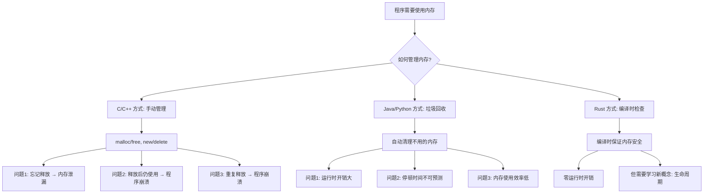

### 为什么需要生命周期标注？

让我用一个具体的例子来说明为什么需要生命周期：

#### 问题场景：

```rust
// 这是一个会出错的例子（实际上编译不通过）
fn get_reference() -> &str {
    let s = String::from("hello");
    &s  // 错误！s 在函数结束时被销毁
}   // s 在这里被销毁了！

fn main() {
    let r = get_reference();  // r 指向一个已经被销毁的内存
    println!("{}", r);        // 危险！使用了悬垂指针
}
```

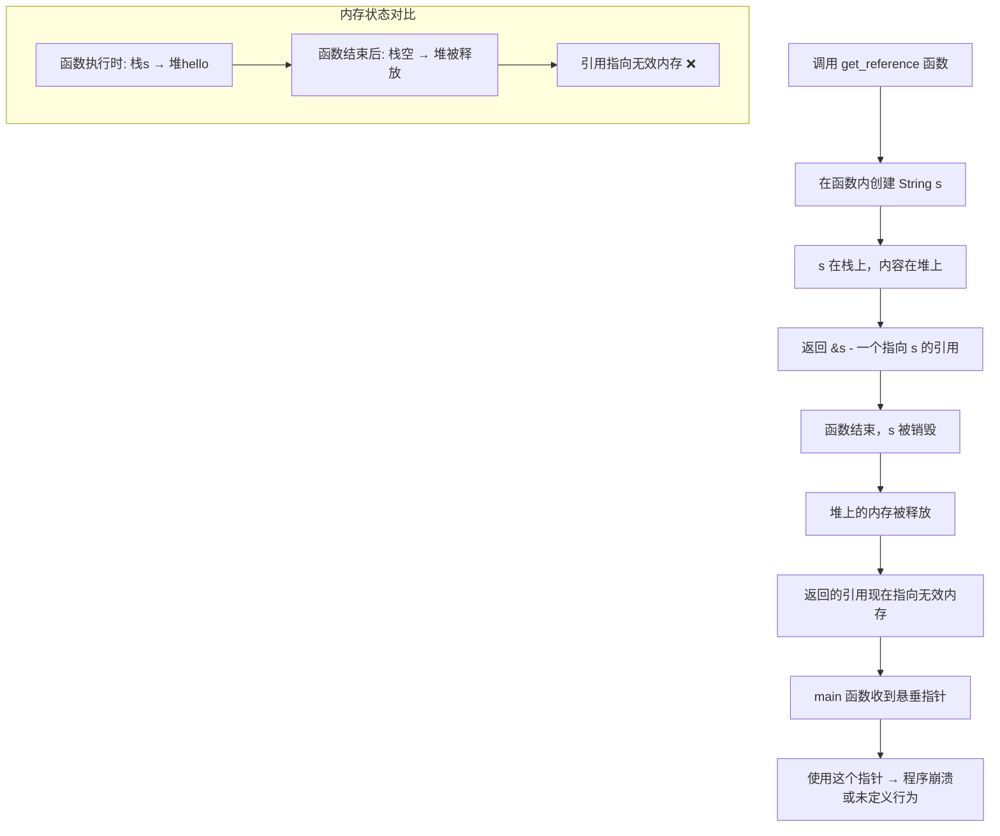

### 显式生命周期标注详解

#### 1. 基础生命周期标注

```rust
fn longest<'a>(x: &'a str, y: &'a str) -> &'a str {
    if x.len() > y.len() { x } else { y }
}
```

**语法解释：**
- `<'a>` - 这是**生命周期参数**，`'a` 是一个名字（可以叫 `'b`、`'c` 等）
- `x: &'a str` - 参数 x 是一个字符串引用，生命周期是 `'a`
- `y: &'a str` - 参数 y 是一个字符串引用，生命周期也是 `'a`
- `-> &'a str` - 返回值也是一个字符串引用，生命周期是 `'a`

**这意味着什么？**

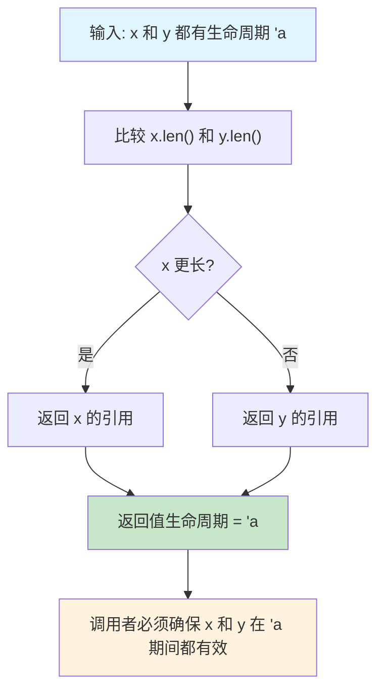

**实际使用示例：**

```rust
fn main() {
    let string1 = String::from("long string is long");
    let string2 = String::from("xyz");
    
    let result = longest(string1.as_str(), string2.as_str());
    println!("最长的字符串是: {}", result);
}
```

在这个例子中：
- `string1` 和 `string2` 都活到 `main` 函数结束
- `result` 引用其中一个字符串
- 因为两个字符串都活得足够长，所以没问题

#### 2. 多个生命周期参数

```rust
fn complex_function<'a, 'b>(x: &'a str, y: &'b str) -> &'a str 
where
    'b: 'a,  // 'b 的生命周期至少和 'a 一样长
{
    println!("Processing: {}", y);
    x
}
```

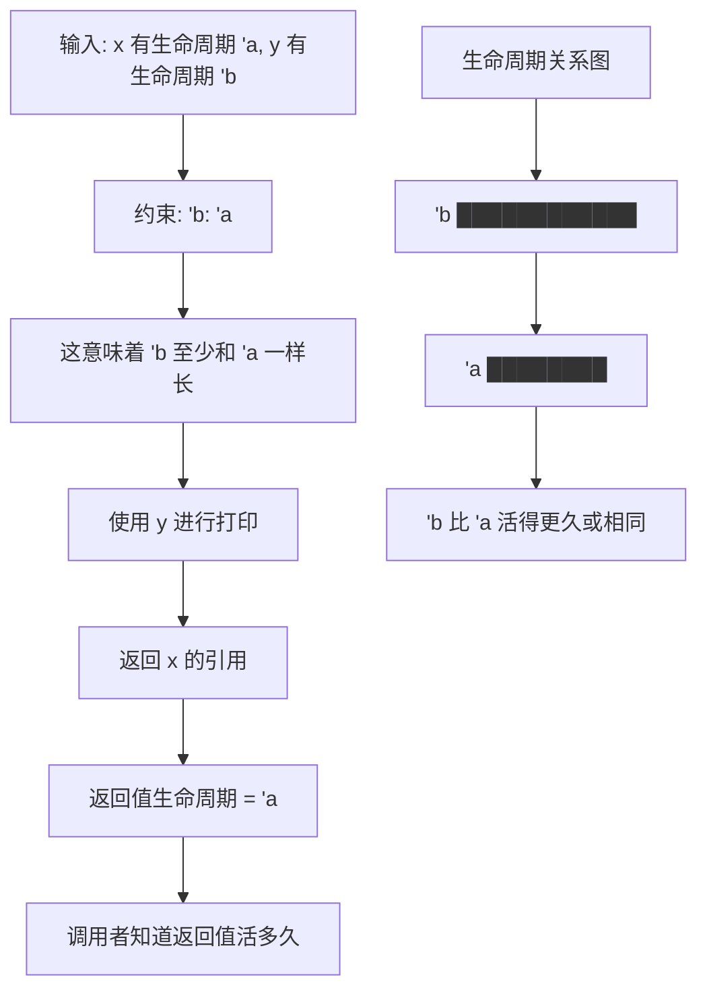

**约束 `'b: 'a` 的含义：**

- `'b: 'a` 读作："`'b` 比 `'a` 活得更久或相同"
- 这确保了我们可以安全地使用 `y`，即使返回值的生命周期是 `'a`

**使用示例：**

```rust
fn main() {
    let long_lived = String::from("我活得很久");
    {
        let short_lived = String::from("我活得较短");
        let result = complex_function(short_lived.as_str(), long_lived.as_str());
        println!("结果: {}", result);
    } // short_lived 在这里被销毁，但没关系，因为我们返回的是它的引用
}
}
```

### 生命周期省略规则详解

```rust
// 这些函数的生命周期是自动推断的
fn first_word(s: &str) -> &str {
    let bytes = s.as_bytes();
    for (i, &item) in bytes.iter().enumerate() {
        if item == b' ' {
            return &s[0..i];
        }
    }
    &s[..]
}

// 等价于
fn first_word_explicit<'a>(s: &'a str) -> &'a str {
    // ... 相同实现
    let bytes = s.as_bytes();
    for (i, &item) in bytes.iter().enumerate() {
        if item == b' ' {
            return &s[0..i];
        }
    }
    &s[..]
}
```

**省略规则的三条法则：**

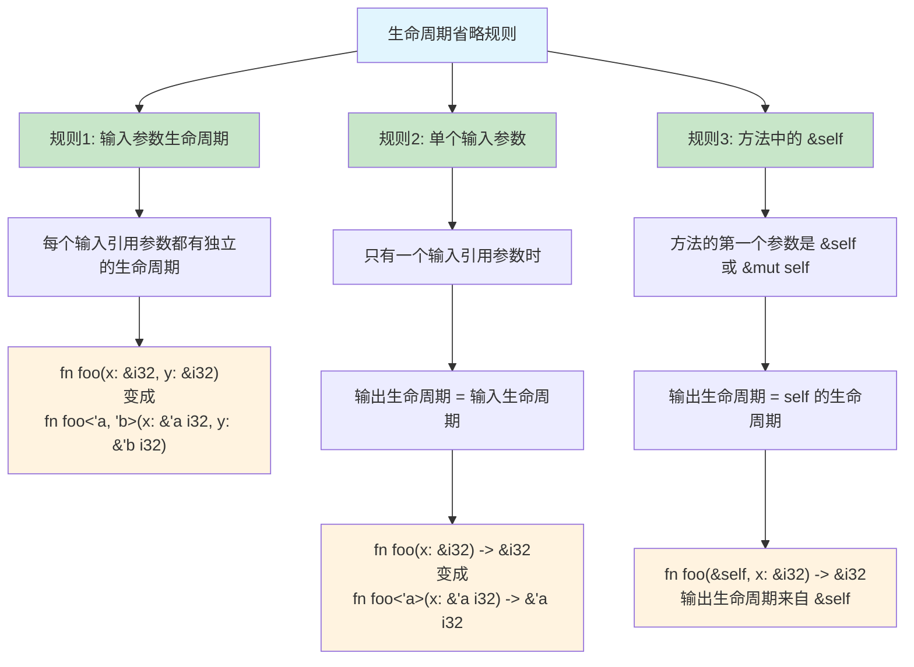

**实例分析：**

```rust
// 规则1 + 规则2 适用
fn first_word(s: &str) -> &str { /* ... */ }
// 编译器推断为：
fn first_word<'a>(s: &'a str) -> &'a str { /* ... */ }

// 规则1 适用，但规则2 不适用（多个输入参数）
fn longest(x: &str, y: &str) -> &str { /* ... */ }  // 编译错误！
// 编译器无法推断输出生命周期

// 规则3 适用
struct ImportantExcerpt<'a> {
    part: &'a str,
}

impl<'a> ImportantExcerpt<'a> {
    fn announce_and_return_part(&self, announcement: &str) -> &str {
        println!("Attention please: {}", announcement);
        self.part  // 返回值生命周期来自 &self
    }
}
```

**编译器的思考过程：**

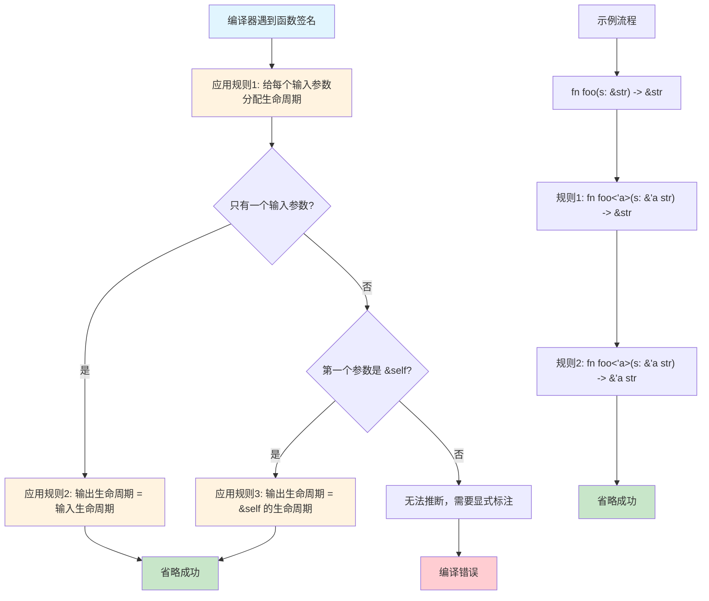

### 高阶生命周期边界 (HRTB) 详解

**什么是高阶生命周期边界？**

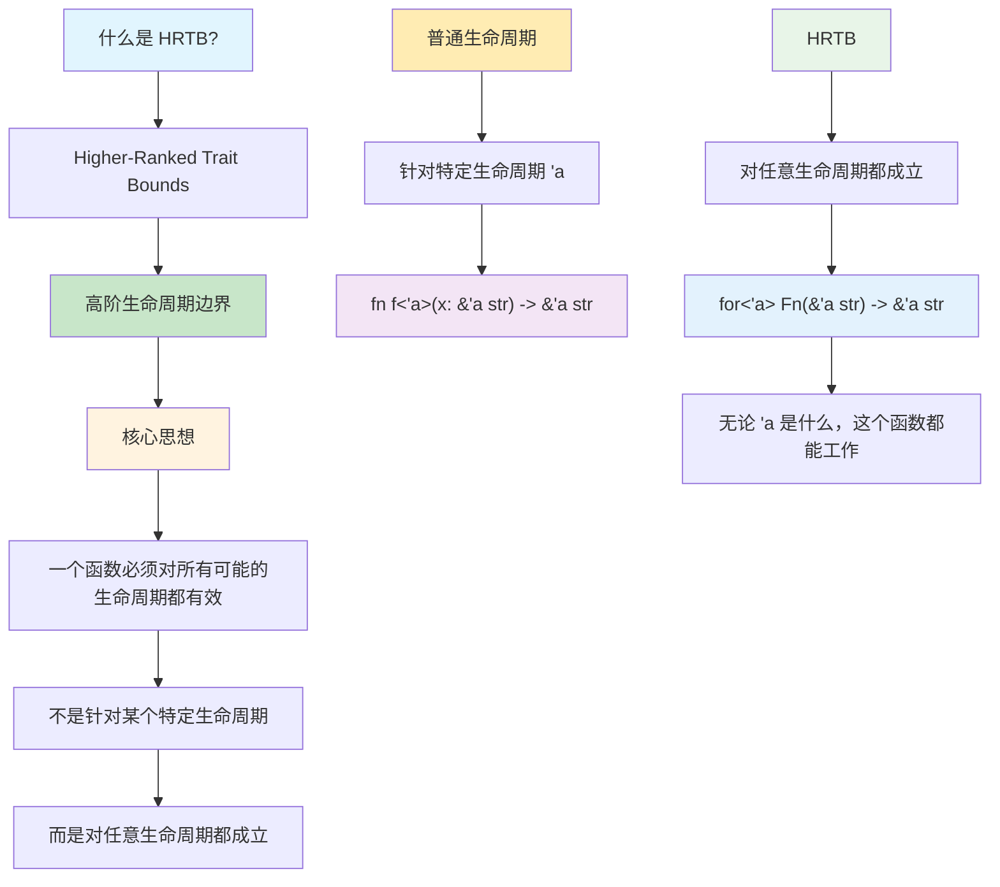

**为什么需要 HRTB？**

```rust
// 假设我们想写一个函数，接受任何能处理字符串的函数
fn process_string<F>(f: F) -> String
where
    F: Fn(&str) -> &str,  // 这样写有问题！
{
    let s = "hello";
    f(s).to_string()
}
```

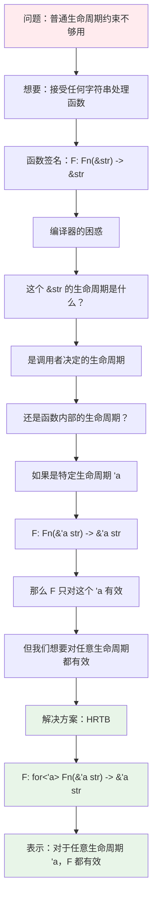

**对比：普通生命周期 vs HRTB**

```rust
// 普通生命周期：只对特定的生命周期 'a 有效
fn example1<'a, F>(f: F) -> String
where
    F: Fn(&'a str) -> &'a str,
{
    // 这里的 'a 是固定的
    let s = "hello";  // 这个 s 的生命周期必须是 'a
    f(s).to_string()  // 有问题！s 的生命周期可能不是 'a
}

// HRTB：对任意生命周期都有效
fn example2<F>(f: F) -> String
where
    F: for<'a> Fn(&'a str) -> &'a str,
{
    // 无论什么生命周期，f 都能处理
    let s = "hello";
    f(s).to_string()  // 没问题！
}
```

**使用示例：**

```rust
fn apply_to_str<F>(f: F) -> String
where
    F: for<'a> Fn(&'a str) -> &'a str,
{
    f("hello world").to_string()
}

// 实际应用场景
fn closure_example() {
    let uppercase = |s: &str| -> &str {
        // 这里只是演示，实际需要返回处理后的字符串
        s
    };
    
    let result = apply_to_str(uppercase);
    println!("{}", result);
}

// 更复杂的例子
fn process_any_string<F>(processor: F, input: &str) -> String
where
    F: for<'a> Fn(&'a str) -> &'a str,
{
    let processed = processor(input);
    format!("处理结果: {}", processed)
}

fn main() {
    let result = process_any_string(|s| s.trim(), "  hello  ");
    println!("{}", result);
}
```

**记忆要点：**

```mermaid
graph TB
    A[核心理解] --> B[普通生命周期：F: Fn(&'a str) -> &'a str]
    A --> C[HRTB：F: for<'a> Fn(&'a str) -> &'a str]
    
    B --> D[只对特定的 'a 有效]
    B --> E[像是说：F 只能处理生命周期为 'a 的字符串]
    
    C --> F[对任意 'a 都有效]
    C --> G[像是说：F 能处理任意生命周期的字符串]
    
    H[何时使用] --> I[函数参数是函数或闭包]
    I --> J[该函数处理引用类型]
    J --> K[需要对任意生命周期都有效]
    
    L[简单判断] --> M[编译器抱怨生命周期不匹配]
    M --> N[你的函数应该能处理任意生命周期的数据]
    N --> O[试试 HRTB！]
```

### 静态生命周期 (`'static`) 详解

**什么是 'static 生命周期？**

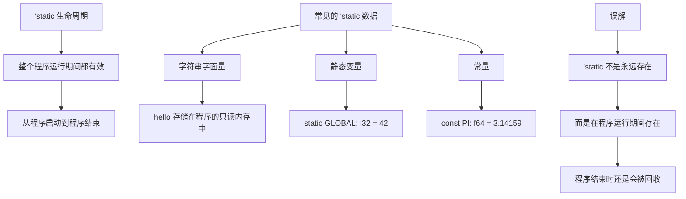

**静态生命周期的实际应用：**

```rust
// 'static 生命周期表示整个程序运行期间都有效
static HELLO: &'static str = "Hello, world!";

// 字符串字面量默认具有 'static 生命周期
fn get_static_str() -> &'static str {
    "This string lives for the entire program duration"
}

// 静态变量
static mut COUNTER: usize = 0;

// 常量也是 'static 的
const MAX_SIZE: usize = 100;

// 注意：'static 不等于永远存在
fn misleading_example() {
    let string = "hello".to_string();
    // let static_ref: &'static str = &string; // 编译错误！
    
    // 这个编译错误是因为 string 是在栈上创建的，
    // 函数结束时会被销毁，不能满足 'static 的要求
}
```

**'static 的常见误解：**

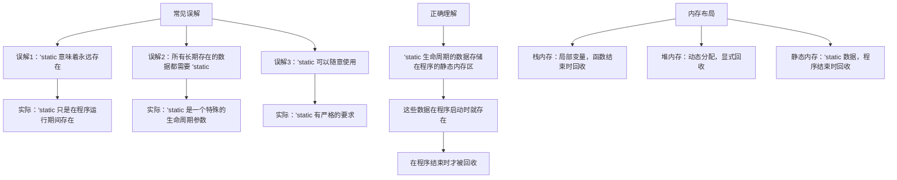

**正确使用 'static 的场景：**

```rust
// 1. 字符串字面量
fn get_greeting() -> &'static str {
    "Hello, Rust!"  // 字符串字面量自动具有 'static 生命周期
}

// 2. 静态变量
static CONFIG: &'static str = "development";

// 3. 常量
const VERSION: &'static str = "1.0.0";

// 4. 延迟初始化的静态数据
use std::sync::OnceLock;
static INSTANCE: OnceLock<String> = OnceLock::new();

fn get_instance() -> &'static String {
    INSTANCE.get_or_init(|| {
        "Lazy initialized".to_string()
    })
}

// 5. 错误的用法示例
fn wrong_static() -> &'static str {
    let local_string = String::from("I'm local");
    // &local_string  // 编译错误！局部变量不能有 'static 生命周期
    
    // 正确的做法：
    "I'm static"  // 使用字符串字面量
}
```

**'static 生命周期的约束关系：**

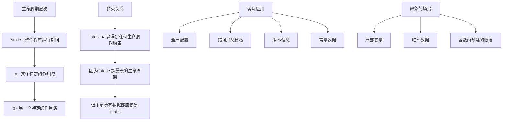

**总结：**

1. **'static 生命周期**：数据在整个程序运行期间都有效
2. **常见用途**：字符串字面量、静态变量、常量
3. **注意事项**：不能将局部变量强制转换为 'static
4. **记忆要点**：'static 是最长的生命周期，但不是所有数据都需要它

---

## 2. 高级特质系统

### 关联类型 vs 泛型的深入对比

**核心区别在于灵活性和明确性的权衡：**

#### 关联类型：每个实现只能有一个类型

```rust
trait Iterator {
    type Item;  // 关联类型
    
    fn next(&mut self) -> Option<Self::Item>;
}

// 实现 Iterator 时必须指定具体的 Item 类型
struct Counter {
    current: usize,
    max: usize,
}

impl Iterator for Counter {
    type Item = usize;  // 只能有一个 Item 类型
    
    fn next(&mut self) -> Option<Self::Item> {
        if self.current < self.max {
            let current = self.current;
            self.current += 1;
            Some(current)
        } else {
            None
        }
    }
}
```

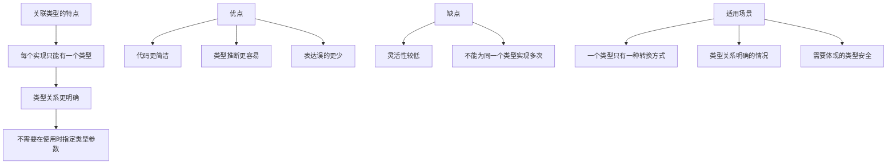

**使用示例：**

```rust
fn use_iterator<I>(iter: I) -> Vec<I::Item> 
where
    I: Iterator,
{
    iter.collect()  // 不需要指定Item类型，编译器自动推断
}

fn main() {
    let counter = Counter { current: 0, max: 5 };
    let nums = use_iterator(counter);
    println!("{:?}", nums);  // [0, 1, 2, 3, 4]
}
```

#### 泛型：可以有多个实现

```rust
trait From<T> {
    fn from(value: T) -> Self;
}

// 可以为同一个类型实现多个 From
impl From<i32> for String {
    fn from(value: i32) -> Self {
        value.to_string()
    }
}

impl From<f64> for String {
    fn from(value: f64) -> Self {
        value.to_string()
    }
}

impl From<bool> for String {
    fn from(value: bool) -> Self {
        value.to_string()
    }
}
```

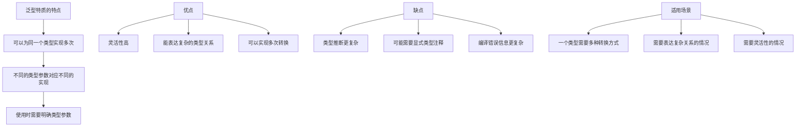

**使用示例：**

```rust
fn convert_to_string<T>(value: T) -> String 
where
    String: From<T>,  // 必须显式指定类型约束
{
    String::from(value)
}

fn main() {
    let from_int = convert_to_string(42);
    let from_float = convert_to_string(3.14);
    let from_bool = convert_to_string(true);
    
    println!("{}, {}, {}", from_int, from_float, from_bool);
}
```

#### 何时使用哪一种？

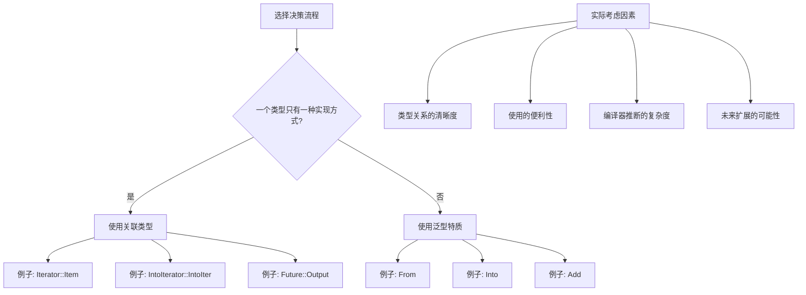

### 特质对象和动态分发详解

#### 与其他语言的多态机制对比

| 语言 | 多态实现方式 | 特点 | 性能 |
|------|-------------|------|------|
| **Java** | 接口引用 + 虚方法表 | 运行时类型检查，自动装箱 | 有虚方法调用开销 |
| **C++** | 虚函数表(vtable) | 手动管理内存，指针操作 | 虚方法调用开销，但可优化 |
| **Python** | 鸭子类型化 | 动态类型，极其灵活 | 解释执行，性能较低 |
| **Rust** | 特质对象 + 胖指针 | 内存安全，零成本抽象 | 可预测的开销，编译器优化 |

#### 什么是特质对象？

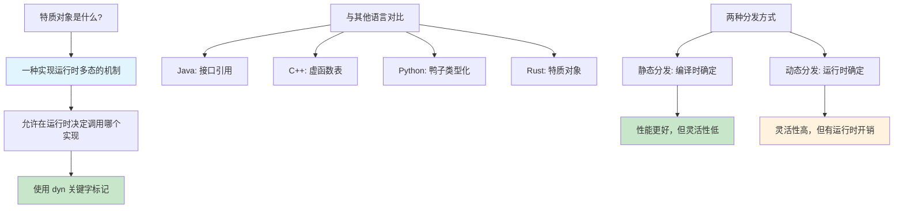

#### Demo 1: 基础图形绘制系统

```rust
trait Draw {
    fn draw(&self);
    fn area(&self) -> f64;
}

struct Circle {
    radius: f64,
}

struct Rectangle {
    width: f64,
    height: f64,
}

struct Triangle {
    base: f64,
    height: f64,
}

impl Draw for Circle {
    fn draw(&self) {
        println!("🔵 Drawing circle with radius {}", self.radius);
    }
    
    fn area(&self) -> f64 {
        std::f64::consts::PI * self.radius * self.radius
    }
}

impl Draw for Rectangle {
    fn draw(&self) {
        println!("⬜ Drawing rectangle {}x{}", self.width, self.height);
    }
    
    fn area(&self) -> f64 {
        self.width * self.height
    }
}

impl Draw for Triangle {
    fn draw(&self) {
        println!("🔺 Drawing triangle with base {} and height {}", self.base, self.height);
    }
    
    fn area(&self) -> f64 {
        0.5 * self.base * self.height
    }
}

// 动态分发：运行时多态
struct Canvas {
    shapes: Vec<Box<dyn Draw>>,
}

impl Canvas {
    fn new() -> Self {
        Self {
            shapes: Vec::new(),
        }
    }
    
    fn add_shape(&mut self, shape: Box<dyn Draw>) {
        self.shapes.push(shape);
    }
    
    fn render_all(&self) {
        println!("🎨 Rendering canvas with {} shapes:", self.shapes.len());
        for (i, shape) in self.shapes.iter().enumerate() {
            print!("  Shape {}: ", i + 1);
            shape.draw(); // 动态分发：运行时决定调用哪个实现
        }
    }
    
    fn total_area(&self) -> f64 {
        self.shapes.iter().map(|shape| shape.area()).sum()
    }
}

// 使用示例
fn main() {
    let mut canvas = Canvas::new();
    
    canvas.add_shape(Box::new(Circle { radius: 5.0 }));
    canvas.add_shape(Box::new(Rectangle { width: 10.0, height: 20.0 }));
    canvas.add_shape(Box::new(Triangle { base: 8.0, height: 6.0 }));
    
    canvas.render_all();
    println!("📊 Total area: {:.2}", canvas.total_area());
}
```

#### Demo 2: 插件系统实现

```rust
trait Plugin {
    fn name(&self) -> &str;
    fn version(&self) -> &str;
    fn execute(&self, input: &str) -> String;
    fn description(&self) -> String {
        format!("{} v{}", self.name(), self.version())
    }
}

struct TextProcessorPlugin {
    name: String,
    version: String,
}

struct DataValidatorPlugin {
    name: String,
    version: String,
}

struct LoggerPlugin {
    name: String,
    version: String,
}

impl Plugin for TextProcessorPlugin {
    fn name(&self) -> &str { &self.name }
    fn version(&self) -> &str { &self.version }
    
    fn execute(&self, input: &str) -> String {
        format!("📝 Processed: {}", input.to_uppercase())
    }
}

impl Plugin for DataValidatorPlugin {
    fn name(&self) -> &str { &self.name }
    fn version(&self) -> &str { &self.version }
    
    fn execute(&self, input: &str) -> String {
        let is_valid = !input.is_empty() && input.len() > 3;
        format!("✅ Validation: {} - {}", input, if is_valid { "VALID" } else { "INVALID" })
    }
}

impl Plugin for LoggerPlugin {
    fn name(&self) -> &str { &self.name }
    fn version(&self) -> &str { &self.version }
    
    fn execute(&self, input: &str) -> String {
        let timestamp = std::time::SystemTime::now()
            .duration_since(std::time::UNIX_EPOCH)
            .unwrap()
            .as_secs();
        format!("📋 [{}] LOG: {}", timestamp, input)
    }
}

struct PluginManager {
    plugins: Vec<Box<dyn Plugin>>,
}

impl PluginManager {
    fn new() -> Self {
        Self {
            plugins: Vec::new(),
        }
    }
    
    fn register_plugin(&mut self, plugin: Box<dyn Plugin>) {
        println!("🔌 Registered plugin: {}", plugin.description());
        self.plugins.push(plugin);
    }
    
    fn process_data(&self, data: &str) -> Vec<String> {
        println!("⚙️  Processing '{}' through {} plugins:", data, self.plugins.len());
        
        self.plugins
            .iter()
            .map(|plugin| {
                let result = plugin.execute(data);
                println!("  {} -> {}", plugin.name(), result);
                result
            })
            .collect()
    }
    
    fn list_plugins(&self) {
        println!("📦 Available plugins:");
        for plugin in &self.plugins {
            println!("  - {}", plugin.description());
        }
    }
}

// 使用示例
fn main() {
    let mut manager = PluginManager::new();
    
    manager.register_plugin(Box::new(TextProcessorPlugin {
        name: "TextProcessor".to_string(),
        version: "1.0.0".to_string(),
    }));
    
    manager.register_plugin(Box::new(DataValidatorPlugin {
        name: "DataValidator".to_string(),
        version: "2.1.0".to_string(),
    }));
    
    manager.register_plugin(Box::new(LoggerPlugin {
        name: "Logger".to_string(),
        version: "1.5.2".to_string(),
    }));
    
    manager.list_plugins();
    println!();
    
    let results = manager.process_data("hello world");
    println!("\n🎯 Final results: {:#?}", results);
}
```

#### Demo 3: 事件处理系统

```rust
trait EventHandler {
    fn handle_event(&self, event: &Event) -> bool;
    fn priority(&self) -> u8 { 100 } // 默认优先级
    fn name(&self) -> &str;
}

#[derive(Debug, Clone)]
enum Event {
    UserClick { x: i32, y: i32 },
    KeyPress { key: String },
    WindowResize { width: u32, height: u32 },
    NetworkRequest { url: String },
}

struct ClickHandler {
    name: String,
}

struct KeyboardHandler {
    name: String,
}

struct WindowHandler {
    name: String,
}

struct NetworkHandler {
    name: String,
}

impl EventHandler for ClickHandler {
    fn handle_event(&self, event: &Event) -> bool {
        match event {
            Event::UserClick { x, y } => {
                println!("🖱️  ClickHandler: Handling click at ({}, {})", x, y);
                if *x > 100 && *y > 100 {
                    println!("   Special area clicked!");
                }
                true // 事件已处理
            }
            _ => false, // 不处理其他事件
        }
    }
    
    fn priority(&self) -> u8 { 90 }
    fn name(&self) -> &str { &self.name }
}

impl EventHandler for KeyboardHandler {
    fn handle_event(&self, event: &Event) -> bool {
        match event {
            Event::KeyPress { key } => {
                println!("⌨️  KeyboardHandler: Key '{}' pressed", key);
                if key == "Escape" {
                    println!("   Escape key - stopping event propagation");
                    return true;
                }
                false // 允许其他处理器处理
            }
            _ => false,
        }
    }
    
    fn priority(&self) -> u8 { 95 }
    fn name(&self) -> &str { &self.name }
}

impl EventHandler for WindowHandler {
    fn handle_event(&self, event: &Event) -> bool {
        match event {
            Event::WindowResize { width, height } => {
                println!("🪟 WindowHandler: Window resized to {}x{}", width, height);
                true
            }
            _ => false,
        }
    }
    
    fn priority(&self) -> u8 { 80 }
    fn name(&self) -> &str { &self.name }
}

impl EventHandler for NetworkHandler {
    fn handle_event(&self, event: &Event) -> bool {
        match event {
            Event::NetworkRequest { url } => {
                println!("🌐 NetworkHandler: Processing request to {}", url);
                true
            }
            _ => false,
        }
    }
    
    fn priority(&self) -> u8 { 70 }
    fn name(&self) -> &str { &self.name }
}

struct EventDispatcher {
    handlers: Vec<Box<dyn EventHandler>>,
}

impl EventDispatcher {
    fn new() -> Self {
        Self {
            handlers: Vec::new(),
        }
    }
    
    fn register_handler(&mut self, handler: Box<dyn EventHandler>) {
        println!("📝 Registered event handler: {} (priority: {})", 
                handler.name(), handler.priority());
        self.handlers.push(handler);
        
        // 按优先级排序（高优先级在前）
        self.handlers.sort_by(|a, b| b.priority().cmp(&a.priority()));
    }
    
    fn dispatch_event(&self, event: Event) {
        println!("\n🎯 Dispatching event: {:?}", event);
        
        for handler in &self.handlers {
            if handler.handle_event(&event) {
                println!("   ✅ Event handled by {}, stopping propagation", handler.name());
                break;
            }
        }
    }
    
    fn list_handlers(&self) {
        println!("📋 Registered handlers (by priority):");
        for handler in &self.handlers {
            println!("  - {} (priority: {})", handler.name(), handler.priority());
        }
    }
}

// 使用示例
fn main() {
    let mut dispatcher = EventDispatcher::new();
    
    dispatcher.register_handler(Box::new(ClickHandler {
        name: "MainClickHandler".to_string(),
    }));
    
    dispatcher.register_handler(Box::new(KeyboardHandler {
        name: "GlobalKeyboard".to_string(),
    }));
    
    dispatcher.register_handler(Box::new(WindowHandler {
        name: "WindowManager".to_string(),
    }));
    
    dispatcher.register_handler(Box::new(NetworkHandler {
        name: "APIHandler".to_string(),
    }));
    
    dispatcher.list_handlers();
    
    // 测试各种事件
    dispatcher.dispatch_event(Event::UserClick { x: 150, y: 200 });
    dispatcher.dispatch_event(Event::KeyPress { key: "Enter".to_string() });
    dispatcher.dispatch_event(Event::WindowResize { width: 1920, height: 1080 });
    dispatcher.dispatch_event(Event::NetworkRequest { url: "https://api.example.com".to_string() });
    dispatcher.dispatch_event(Event::KeyPress { key: "Escape".to_string() });
}
```

#### 静态分发 vs 动态分发的详细对比

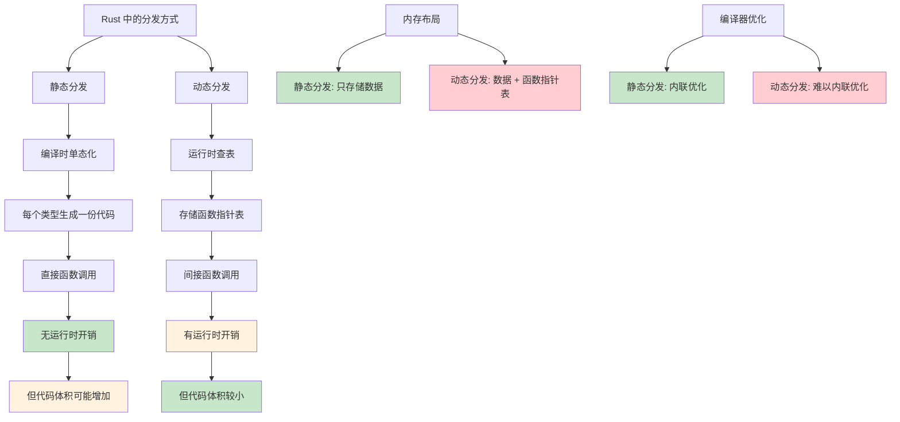

#### 性能对比实例

```rust
use std::time::{Duration, Instant};

// 性能测试辅助函数
fn benchmark<F: Fn()>(name: &str, f: F, iterations: usize) {
    let start = Instant::now();
    for _ in 0..iterations {
        f();
    }
    let duration = start.elapsed();
    println!("{}: {:?} ({:.2} ns per iteration)", 
             name, duration, duration.as_nanos() as f64 / iterations as f64);
}

trait Calculate {
    fn compute(&self, x: f64) -> f64;
}

struct SimpleCalculator;
struct ComplexCalculator;

impl Calculate for SimpleCalculator {
    fn compute(&self, x: f64) -> f64 {
        x * 2.0 + 1.0
    }
}

impl Calculate for ComplexCalculator {
    fn compute(&self, x: f64) -> f64 {
        (x * x + x).sqrt()
    }
}

// 静态分发版本
fn static_dispatch_test<T: Calculate>(calc: &T, values: &[f64]) -> f64 {
    values.iter().map(|&x| calc.compute(x)).sum()
}

// 动态分发版本
fn dynamic_dispatch_test(calc: &dyn Calculate, values: &[f64]) -> f64 {
    values.iter().map(|&x| calc.compute(x)).sum()
}

fn performance_comparison() {
    let simple = SimpleCalculator;
    let complex = ComplexCalculator;
    let values: Vec<f64> = (0..1000).map(|i| i as f64).collect();
    
    const ITERATIONS: usize = 10000;
    
    println!("🏁 Performance Comparison ({} iterations):", ITERATIONS);
    
    // 静态分发测试
    benchmark("Static Dispatch (Simple)", || {
        static_dispatch_test(&simple, &values);
    }, ITERATIONS);
    
    benchmark("Static Dispatch (Complex)", || {
        static_dispatch_test(&complex, &values);
    }, ITERATIONS);
    
    // 动态分发测试
    benchmark("Dynamic Dispatch (Simple)", || {
        dynamic_dispatch_test(&simple, &values);
    }, ITERATIONS);
    
    benchmark("Dynamic Dispatch (Complex)", || {
        dynamic_dispatch_test(&complex, &values);
    }, ITERATIONS);
}

fn main() {
    performance_comparison();
}
```

#### 特质对象的限制和要求

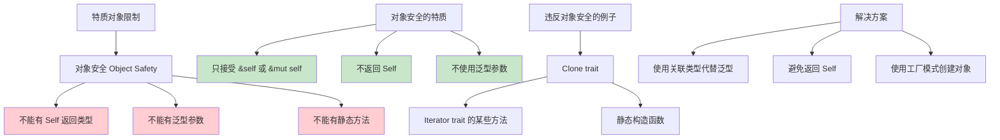

```rust
// ❌ 不能作为特质对象的特质
trait BadForObject {
    fn clone(&self) -> Self;        // 返回Self，不可以
    fn generic_method<T>(&self, x: T); // 泛型参数，不可以
    fn static_method();            // 静态方法，不可以
}

// ✅ 可以作为特质对象的特质
trait GoodForObject {
    fn method(&self);              // 可以
    fn mut_method(&mut self);      // 可以
    fn return_primitive(&self) -> i32;  // 可以
    fn with_parameters(&self, x: i32, y: &str); // 可以
}

// 对象安全检查示例
trait Process {
    fn process(&self, data: &str) -> String;
}

struct DataProcessor;

impl Process for DataProcessor {
    fn process(&self, data: &str) -> String {
        format!("Processed: {}", data.to_uppercase())
    }
}

fn demonstrate_object_safety() {
    let processor = DataProcessor;
    
    // ✅ 这样可以 - 静态分发
    let result1 = static_process(&processor, "hello");
    println!("Static: {}", result1);
    
    // ✅ 这样也可以 - 动态分发
    let result2 = dynamic_process(&processor, "world");
    println!("Dynamic: {}", result2);
    
    // ✅ 特质对象在容器中
    let processors: Vec<Box<dyn Process>> = vec![
        Box::new(DataProcessor),
        Box::new(DataProcessor),
    ];
    
    for (i, processor) in processors.iter().enumerate() {
        let result = processor.process(&format!("item_{}", i));
        println!("Container[{}]: {}", i, result);
    }
}

fn static_process<T: Process>(processor: &T, data: &str) -> String {
    processor.process(data)
}

fn dynamic_process(processor: &dyn Process, data: &str) -> String {
    processor.process(data)
}
```

#### 何时使用哪种分发方式？

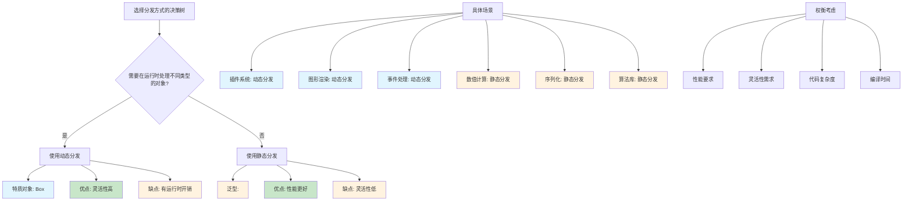

#### 最佳实践和使用建议

```rust
// 1. 优先使用静态分发，必要时才用动态分发
fn best_practice_example() {
    // ✅ 推荐：当类型在编译时已知
    let circle = Circle { radius: 5.0 };
    let rectangle = Rectangle { width: 10.0, height: 20.0 };
    
    // 静态分发 - 性能更好
    process_shape_static(&circle);
    process_shape_static(&rectangle);
    
    // ✅ 必要时使用动态分发：类型需要在容器中混合存储
    let shapes: Vec<Box<dyn Draw>> = vec![
        Box::new(Circle { radius: 3.0 }),
        Box::new(Rectangle { width: 5.0, height: 8.0 }),
    ];
    
    for shape in &shapes {
        shape.draw(); // 动态分发
    }
}

fn process_shape_static<T: Draw>(shape: &T) {
    shape.draw();
}

// 2. 合理设计特质，考虑对象安全性
trait SerializableData {
    fn serialize(&self) -> String;
    fn data_type(&self) -> &'static str;
    
    // ✅ 提供默认实现，避免强制要求所有类型实现
    fn metadata(&self) -> String {
        format!("Type: {}", self.data_type())
    }
}

// 3. 使用枚举代替特质对象（当类型数量有限时）
enum Shape {
    Circle(Circle),
    Rectangle(Rectangle),
    Triangle(Triangle),
}

impl Shape {
    fn draw(&self) {
        match self {
            Shape::Circle(c) => c.draw(),
            Shape::Rectangle(r) => r.draw(),
            Shape::Triangle(t) => t.draw(),
        }
    }
    
    fn area(&self) -> f64 {
        match self {
            Shape::Circle(c) => c.area(),
            Shape::Rectangle(r) => r.area(),
            Shape::Triangle(t) => t.area(),
        }
    }
}

fn enum_alternative_example() {
    // 枚举版本 - 无运行时开销，类型安全
    let shapes = vec![
        Shape::Circle(Circle { radius: 5.0 }),
        Shape::Rectangle(Rectangle { width: 10.0, height: 20.0 }),
        Shape::Triangle(Triangle { base: 8.0, height: 6.0 }),
    ];
    
    for shape in &shapes {
        shape.draw(); // 静态分发，通过模式匹配
    }
    
    let total_area: f64 = shapes.iter().map(|s| s.area()).sum();
    println!("Total area: {:.2}", total_area);
}

// 4. 智能指针的选择
fn smart_pointer_choices() {
    // Box<dyn Trait> - 独占所有权
    let owned_shape: Box<dyn Draw> = Box::new(Circle { radius: 5.0 });
    
    // Rc<dyn Trait> - 共享所有权（单线程）
    use std::rc::Rc;
    let shared_shape: Rc<dyn Draw> = Rc::new(Rectangle { width: 10.0, height: 20.0 });
    let shared_shape_clone = shared_shape.clone();
    
    // Arc<dyn Trait> - 共享所有权（多线程）
    use std::sync::Arc;
    let thread_safe_shape: Arc<dyn Draw> = Arc::new(Triangle { base: 8.0, height: 6.0 });
    
    // 使用示例
    owned_shape.draw();
    shared_shape.draw();
    thread_safe_shape.draw();
}

fn main() {
    println!("=== Best Practices Demo ===");
    best_practice_example();
    println!("\n=== Enum Alternative ===");
    enum_alternative_example();
    println!("\n=== Smart Pointer Choices ===");
    smart_pointer_choices();
}
```

#### 总结

**特质对象的核心价值：**

1. **运行时多态性** - 允许在运行时处理不同类型的对象
2. **代码复用** - 统一的接口处理多种实现
3. **插件架构** - 支持动态加载和扩展

**使用建议：**

1. **性能敏感的代码** → 优先使用静态分发
2. **需要运行时灵活性** → 使用动态分发
3. **类型数量有限且已知** → 考虑使用枚举
4. **设计公共API** → 考虑对象安全性要求

### 高级特质边界详解

#### 特质边界的层次和语法

特质边界是Rust类型系统的核心组成部分，它允许我们对泛型参数施加约束，确保类型具有我们需要的能力。

```mermaid
graph TB
    A[特质边界的作用] --> B[约束泛型参数的能力]
    A --> C[编译时类型检查]
    A --> D[启用特定的方法调用]
    
    E[特质边界语法] --> F[基础语法: T: Trait]
    E --> G[多个约束: T: Trait1 + Trait2]
    E --> H[where子句: where T: Trait]
    E --> I[条件实现: impl<T: Trait>]
    
    J[高级用法] --> K[关联类型约束]
    J --> L[高阶特质边界 HRTB]
    J --> M[条件性特质实现]
    J --> N[返回位置impl Trait]
    
    O[与其他语言对比] --> P[Java: 泛型通配符]
    O --> Q[C++: 模板特化]
    O --> R[Haskell: 类型类约束]
    O --> S[Rust: 特质边界]
    
    style B fill:#e1f5fe
    style C fill:#c8e6c9
    style D fill:#c8e6c9
    style K fill:#fff3e0
    style L fill:#fff3e0
    style M fill:#fff3e0
    style N fill:#fff3e0
```

#### Demo 1: 多层特质边界系统

```rust
use std::fmt::{Debug, Display};
use std::ops::Add;

// 定义多个特质来展示边界系统
trait Drawable {
    fn draw(&self) -> String;
}

trait Serializable {
    fn serialize(&self) -> String;
}

trait Comparable {
    fn compare(&self, other: &Self) -> std::cmp::Ordering;
}

// 复杂的几何图形系统
#[derive(Debug, Clone, PartialEq)]
struct Point {
    x: f64,
    y: f64,
}

#[derive(Debug, Clone, PartialEq)]
struct Circle {
    center: Point,
    radius: f64,
}

#[derive(Debug, Clone, PartialEq)]
struct Rectangle {
    top_left: Point,
    width: f64,
    height: f64,
}

// 实现基础特质
impl Display for Point {
    fn fmt(&self, f: &mut std::fmt::Formatter) -> std::fmt::Result {
        write!(f, "Point({:.2}, {:.2})", self.x, self.y)
    }
}

impl Display for Circle {
    fn fmt(&self, f: &mut std::fmt::Formatter) -> std::fmt::Result {
        write!(f, "Circle(center: {}, radius: {:.2})", self.center, self.radius)
    }
}

impl Display for Rectangle {
    fn fmt(&self, f: &mut std::fmt::Formatter) -> std::fmt::Result {
        write!(f, "Rectangle(top_left: {}, {}x{})", self.top_left, self.width, self.height)
    }
}

impl Drawable for Circle {
    fn draw(&self) -> String {
        format!("🔵 Drawing circle at {} with radius {:.2}", self.center, self.radius)
    }
}

impl Drawable for Rectangle {
    fn draw(&self) -> String {
        format!("⬜ Drawing rectangle at {} with size {:.2}x{:.2}", 
                self.top_left, self.width, self.height)
    }
}

impl Serializable for Circle {
    fn serialize(&self) -> String {
        format!("{{\"type\":\"circle\",\"center\":{{\"x\":{},\"y\":{}}},\"radius\":{}}}",
                self.center.x, self.center.y, self.radius)
    }
}

impl Serializable for Rectangle {
    fn serialize(&self) -> String {
        format!("{{\"type\":\"rectangle\",\"x\":{},\"y\":{},\"width\":{},\"height\":{}}}",
                self.top_left.x, self.top_left.y, self.width, self.height)
    }
}

// 多重特质边界函数
fn process_shape<T>(shape: &T) -> String
where
    T: Drawable + Serializable + Display + Debug + Clone,
{
    let mut result = String::new();
    result.push_str(&format!("📋 Processing: {}\n", shape));
    result.push_str(&format!("🎨 Drawing: {}\n", shape.draw()));
    result.push_str(&format!("💾 Serialized: {}\n", shape.serialize()));
    result.push_str(&format!("🔍 Debug: {:?}\n", shape));
    result
}

// 条件性特质实现示例
trait Area {
    fn area(&self) -> f64;
}

impl Area for Circle {
    fn area(&self) -> f64 {
        std::f64::consts::PI * self.radius * self.radius
    }
}

impl Area for Rectangle {
    fn area(&self) -> f64 {
        self.width * self.height
    }
}

// 只有实现了特定特质组合的类型才能使用这个函数
fn analyze_shape<T>(shape: &T) -> String
where
    T: Drawable + Area + Display,
{
    format!("Shape {} has area {:.2} and draws as: {}", 
            shape, shape.area(), shape.draw())
}

// 高级边界：使用关联类型
fn compare_areas<T, U>(shape1: &T, shape2: &U) -> String
where
    T: Area + Display,
    U: Area + Display,
{
    let area1 = shape1.area();
    let area2 = shape2.area();
    
    match area1.partial_cmp(&area2) {
        Some(std::cmp::Ordering::Greater) => 
            format!("{} (area: {:.2}) is larger than {} (area: {:.2})", 
                    shape1, area1, shape2, area2),
        Some(std::cmp::Ordering::Less) => 
            format!("{} (area: {:.2}) is smaller than {} (area: {:.2})", 
                    shape1, area1, shape2, area2),
        Some(std::cmp::Ordering::Equal) => 
            format!("{} and {} have equal areas ({:.2})", 
                    shape1, shape2, area1),
        None => 
            format!("Cannot compare areas of {} and {}", shape1, shape2),
    }
}

fn main() {
    let circle = Circle {
        center: Point { x: 0.0, y: 0.0 },
        radius: 5.0,
    };
    
    let rectangle = Rectangle {
        top_left: Point { x: 10.0, y: 20.0 },
        width: 8.0,
        height: 6.0,
    };
    
    // 测试多重特质边界
    println!("=== Multi-Trait Bounds Demo ===");
    println!("{}", process_shape(&circle));
    println!("{}", process_shape(&rectangle));
    
    // 测试条件性特质使用
    println!("=== Conditional Trait Usage ===");
    println!("{}", analyze_shape(&circle));
    println!("{}", analyze_shape(&rectangle));
    
    // 测试类型间比较
    println!("=== Cross-Type Comparison ===");
    println!("{}", compare_areas(&circle, &rectangle));
}
```

#### Demo 2: 返回位置impl Trait详解

```rust
use std::fmt::Display;

// 返回位置impl Trait的各种用法
trait Processor {
    fn process(&self, input: &str) -> String;
}

struct UpperCaseProcessor;
struct LowerCaseProcessor;
struct ReverseProcessor;

impl Processor for UpperCaseProcessor {
    fn process(&self, input: &str) -> String {
        input.to_uppercase()
    }
}

impl Processor for LowerCaseProcessor {
    fn process(&self, input: &str) -> String {
        input.to_lowercase()
    }
}

impl Processor for ReverseProcessor {
    fn process(&self, input: &str) -> String {
        input.chars().rev().collect()
    }
}

impl Display for UpperCaseProcessor {
    fn fmt(&self, f: &mut std::fmt::Formatter) -> std::fmt::Result {
        write!(f, "UpperCaseProcessor")
    }
}

impl Display for LowerCaseProcessor {
    fn fmt(&self, f: &mut std::fmt::Formatter) -> std::fmt::Result {
        write!(f, "LowerCaseProcessor")
    }
}

impl Display for ReverseProcessor {
    fn fmt(&self, f: &mut std::fmt::Formatter) -> std::fmt::Result {
        write!(f, "ReverseProcessor")
    }
}

// 1. 基础的 impl Trait 返回
fn create_processor(kind: &str) -> impl Processor + Display {
    match kind {
        "upper" => UpperCaseProcessor,
        "lower" => LowerCaseProcessor,
        _ => ReverseProcessor,
    }
}

// 2. 复杂的 impl Trait 组合
fn create_debug_processor(kind: &str) -> impl Processor + Display + Clone {
    #[derive(Clone)]
    struct DebugProcessor {
        name: String,
    }
    
    impl Processor for DebugProcessor {
        fn process(&self, input: &str) -> String {
            format!("[{}] Processing: {}", self.name, input)
        }
    }
    
    impl Display for DebugProcessor {
        fn fmt(&self, f: &mut std::fmt::Formatter) -> std::fmt::Result {
            write!(f, "DebugProcessor({})", self.name)
        }
    }
    
    DebugProcessor {
        name: format!("Debug-{}", kind),
    }
}

// 3. 带生命周期的 impl Trait
fn create_processor_with_data(data: &str) -> impl Processor + Display + '_ {
    struct DataProcessor<'a> {
        data: &'a str,
    }
    
    impl<'a> Processor for DataProcessor<'a> {
        fn process(&self, input: &str) -> String {
            format!("{}: {}", self.data, input)
        }
    }
    
    impl<'a> Display for DataProcessor<'a> {
        fn fmt(&self, f: &mut std::fmt::Formatter) -> std::fmt::Result {
            write!(f, "DataProcessor({})", self.data)
        }
    }
    
    DataProcessor { data }
}

// 4. 迭代器和 impl Trait
fn create_number_iterator(start: i32, end: i32) -> impl Iterator<Item = i32> + Clone {
    (start..=end).filter(|&x| x % 2 == 0)
}

fn create_string_iterator() -> impl Iterator<Item = String> {
    (1..=5).map(|i| format!("Item {}", i))
}

// 5. 异步函数中的 impl Trait
async fn async_processor(input: &str) -> impl Display {
    format!("Async result: {}", input.len())
}

// 6. 条件返回不同的 impl Trait
fn conditional_iterator(use_numbers: bool) -> impl Iterator<Item = String> {
    if use_numbers {
        (1..=3).map(|i| i.to_string()).collect::<Vec<_>>().into_iter()
    } else {
        vec!["a".to_string(), "b".to_string(), "c".to_string()].into_iter()
    }
}

#[tokio::main]
async fn main() {
    println!("=== impl Trait Return Types Demo ===");
    
    // 基础返回
    let processor = create_processor("upper");
    println!("Processor: {}", processor);
    println!("Result: {}", processor.process("hello world"));
    
    // 复杂组合
    let debug_proc = create_debug_processor("test");
    println!("Debug Processor: {}", debug_proc);
    println!("Result: {}", debug_proc.process("debug message"));
    let cloned = debug_proc.clone();
    println!("Cloned: {}", cloned);
    
    // 带生命周期
    let data_proc = create_processor_with_data("PREFIX");
    println!("Data Processor: {}", data_proc);
    println!("Result: {}", data_proc.process("test data"));
    
    // 迭代器
    let numbers: Vec<i32> = create_number_iterator(1, 10).collect();
    println!("Even numbers: {:?}", numbers);
    
    let strings: Vec<String> = create_string_iterator().collect();
    println!("String items: {:?}", strings);
    
    // 条件返回
    let num_iter: Vec<String> = conditional_iterator(true).collect();
    let str_iter: Vec<String> = conditional_iterator(false).collect();
    println!("Number iterator: {:?}", num_iter);
    println!("String iterator: {:?}", str_iter);
    
    // 异步
    let async_result = async_processor("async test").await;
    println!("Async result: {}", async_result);
}
```

#### Demo 3: 条件性特质实现和泛型特化

```rust
use std::fmt::{Debug, Display};
use std::marker::PhantomData;

// 条件性特质实现的高级用法
trait Container<T> {
    fn get(&self) -> &T;
    fn set(&mut self, value: T);
}

trait Validator<T> {
    fn validate(&self, value: &T) -> bool;
}

trait Logger {
    fn log(&self, message: &str);
}

// 基础容器
struct Box<T> {
    value: T,
}

impl<T> Container<T> for Box<T> {
    fn get(&self) -> &T {
        &self.value
    }
    
    fn set(&mut self, value: T) {
        self.value = value;
    }
}

// 条件实现：只有当T实现Debug时，Box<T>才实现Logger
impl<T: Debug> Logger for Box<T> {
    fn log(&self, message: &str) {
        println!("[LOG] {}: {:?}", message, self.value);
    }
}

// 条件实现：只有当T实现Display + PartialOrd时才有比较功能
impl<T: Display + PartialOrd> Box<T> {
    fn compare_and_display(&self, other: &Box<T>) -> String {
        match self.value.partial_cmp(&other.value) {
            Some(std::cmp::Ordering::Greater) => 
                format!("{} > {}", self.value, other.value),
            Some(std::cmp::Ordering::Less) => 
                format!("{} < {}", self.value, other.value),
            Some(std::cmp::Ordering::Equal) => 
                format!("{} = {}", self.value, other.value),
            None => 
                format!("{} and {} are not comparable", self.value, other.value),
        }
    }
}

// 更复杂的条件实现：验证容器
struct ValidatedContainer<T, V> {
    value: T,
    validator: V,
}

impl<T, V> ValidatedContainer<T, V> 
where
    V: Validator<T>,
{
    fn new(value: T, validator: V) -> Result<Self, String> {
        if validator.validate(&value) {
            Ok(Self { value, validator })
        } else {
            Err("Validation failed".to_string())
        }
    }
    
    fn set(&mut self, value: T) -> Result<(), String> {
        if self.validator.validate(&value) {
            self.value = value;
            Ok(())
        } else {
            Err("Validation failed".to_string())
        }
    }
    
    fn get(&self) -> &T {
        &self.value
    }
}

// 只有当T实现了Display + Debug，且V实现了Debug时，才提供详细信息
impl<T, V> ValidatedContainer<T, V>
where
    T: Display + Debug,
    V: Debug + Validator<T>,
{
    fn detailed_info(&self) -> String {
        format!("ValidatedContainer {{ value: {} (debug: {:?}), validator: {:?} }}", 
                self.value, self.value, self.validator)
    }
}

// 具体的验证器实现
#[derive(Debug)]
struct RangeValidator {
    min: i32,
    max: i32,
}

impl Validator<i32> for RangeValidator {
    fn validate(&self, value: &i32) -> bool {
        *value >= self.min && *value <= self.max
    }
}

#[derive(Debug)]
struct LengthValidator {
    max_length: usize,
}

impl Validator<String> for LengthValidator {
    fn validate(&self, value: &String) -> bool {
        value.len() <= self.max_length
    }
}

// 特质对象的条件性能力
trait Animal {
    fn name(&self) -> &str;
    fn sound(&self) -> &str;
}

trait Trainable {
    fn train(&mut self, command: &str);
    fn perform(&self, command: &str) -> String;
}

#[derive(Debug)]
struct Dog {
    name: String,
    commands: Vec<String>,
}

#[derive(Debug)]
struct Cat {
    name: String,
}

impl Animal for Dog {
    fn name(&self) -> &str { &self.name }
    fn sound(&self) -> &str { "Woof!" }
}

impl Animal for Cat {
    fn name(&self) -> &str { &self.name }
    fn sound(&self) -> &str { "Meow!" }
}

impl Trainable for Dog {
    fn train(&mut self, command: &str) {
        self.commands.push(command.to_string());
        println!("{} learned command: {}", self.name, command);
    }
    
    fn perform(&self, command: &str) -> String {
        if self.commands.contains(&command.to_string()) {
            format!("{} performs: {}", self.name, command)
        } else {
            format!("{} doesn't know how to {}", self.name, command)
        }
    }
}

// 条件性训练函数：只有实现了Trainable的动物才能训练
fn train_animal<T>(animal: &mut T, commands: &[&str])
where
    T: Animal + Trainable + Debug,
{
    println!("Training {} ({})", animal.name(), animal.sound());
    for &command in commands {
        animal.train(command);
    }
    println!("Training complete for {:?}", animal);
}

// 通用动物交互函数
fn interact_with_animal<T>(animal: &T) -> String
where
    T: Animal,
{
    format!("{} says: {}", animal.name(), animal.sound())
}

fn main() {
    println!("=== Conditional Trait Implementation Demo ===");
    
    // 基础容器测试
    let mut int_box = Box { value: 42 };
    let mut string_box = Box { value: "Hello".to_string() };
    
    // 由于i32实现了Debug，Box<i32>可以记录日志
    int_box.log("Integer box created");
    
    // 由于String实现了Debug，Box<String>也可以记录日志
    string_box.log("String box created");
    
    // 由于i32实现了Display + PartialOrd，可以比较
    let another_int_box = Box { value: 35 };
    println!("Comparison: {}", int_box.compare_and_display(&another_int_box));
    
    // 验证容器测试
    println!("\n=== Validated Container Demo ===");
    let range_validator = RangeValidator { min: 0, max: 100 };
    
    match ValidatedContainer::new(50, range_validator) {
        Ok(mut container) => {
            println!("Valid container created with value: {}", container.get());
            println!("Details: {}", container.detailed_info());
            
            match container.set(150) {
                Ok(()) => println!("Value updated successfully"),
                Err(e) => println!("Failed to update: {}", e),
            }
            
            match container.set(75) {
                Ok(()) => println!("Value updated to: {}", container.get()),
                Err(e) => println!("Failed to update: {}", e),
            }
        }
        Err(e) => println!("Failed to create container: {}", e),
    }
    
    // 动物训练测试
    println!("\n=== Animal Training Demo ===");
    let mut dog = Dog {
        name: "Buddy".to_string(),
        commands: Vec::new(),
    };
    
    let cat = Cat {
        name: "Whiskers".to_string(),
    };
    
    // 狗可以训练（实现了Trainable）
    train_animal(&mut dog, &["sit", "stay", "fetch"]);
    println!("Performance: {}", dog.perform("sit"));
    println!("Performance: {}", dog.perform("roll over"));
    
    // 所有动物都可以交互
    println!("Dog interaction: {}", interact_with_animal(&dog));
    println!("Cat interaction: {}", interact_with_animal(&cat));
    
    // 猫不能训练（没有实现Trainable）
    // train_animal(&mut cat, &["sit"]); // 编译错误！
}
```

### 超级特质 (Supertraits) 详解

#### 超级特质的概念和层次结构

超级特质是Rust中实现特质继承的机制，它允许一个特质依赖于另一个特质的实现。

```mermaid
graph TB
    A[超级特质概念] --> B[特质依赖关系]
    A --> C[编译时约束检查]
    A --> D[代码复用和组合]
    
    E[语法形式] --> F[trait Child: Parent]
    E --> G[多重超级特质: trait Child: Parent1 + Parent2]
    E --> H[复杂层次: trait Child: Parent where Parent: GrandParent]
    
    I[与其他语言对比] --> J[Java: interface extends]
    I --> K[C++: 多重继承]
    I --> L[Python: 多重继承]
    I --> M[Rust: 超级特质约束]
    
    N[使用场景] --> O[API设计中的层次结构]
    N --> P[能力组合和扩展]
    N --> Q[代码复用和抽象]
    
    style B fill:#e1f5fe
    style C fill:#c8e6c9
    style D fill:#c8e6c9
    style M fill:#fff3e0
```

#### Demo 1: 分层的输出系统

```rust
use std::fmt::{Display, Debug};

// 基础特质：可显示
trait Displayable {
    fn display_name(&self) -> String;
}

// 超级特质：可格式化输出（依赖Display）
trait Formattable: Display {
    fn formatted_output(&self) -> String {
        format!("Formatted: {}", self)
    }
    
    fn boxed_output(&self) -> String {
        let content = self.to_string();
        let border = "-".repeat(content.len() + 4);
        format!("{}\n| {} |\n{}", border, content, border)
    }
}

// 更高层次的特质：可装饰输出（依赖Formattable，间接依赖Display）
trait Decoratable: Formattable + Debug {
    fn outline_print(&self) {
        let output = self.to_string();
        let len = output.len();
        println!("{}", "*".repeat(len + 4));
        println!("*{}*", " ".repeat(len + 2));
        println!("* {} *", output);
        println!("*{}*", " ".repeat(len + 2));
        println!("{}", "*".repeat(len + 4));
    }
    
    fn decorated_output(&self) -> String {
        format!("🎨 {} 🎨\n{}\nDebug: {:?}", 
                self.display_name(), 
                self.boxed_output(),
                self)
    }
    
    fn fancy_border(&self) -> String {
        let content = self.to_string();
        let width = content.len() + 4;
        let top_bottom = "╔".to_string() + &"═".repeat(width - 2) + "╗";
        let middle = format!("║ {} ║", content);
        let bottom = "╚".to_string() + &"═".repeat(width - 2) + "╝";
        format!("{}\n{}\n{}", top_bottom, middle, bottom)
    }
}

// 具体类型实现
#[derive(Debug)]
struct Product {
    name: String,
    price: f64,
    category: String,
}

#[derive(Debug)]
struct User {
    username: String,
    email: String,
    role: String,
}

#[derive(Debug)]
struct Order {
    id: u64,
    user: String,
    total: f64,
    status: String,
}

// 为Product实现完整的特质链
impl Displayable for Product {
    fn display_name(&self) -> String {
        format!("Product: {}", self.name)
    }
}

impl Display for Product {
    fn fmt(&self, f: &mut std::fmt::Formatter) -> std::fmt::Result {
        write!(f, "{} (${:.2}) - {}", self.name, self.price, self.category)
    }
}

impl Formattable for Product {}

impl Decoratable for Product {}

// 为User实现特质链
impl Displayable for User {
    fn display_name(&self) -> String {
        format!("User: {}", self.username)
    }
}

impl Display for User {
    fn fmt(&self, f: &mut std::fmt::Formatter) -> std::fmt::Result {
        write!(f, "{} <{}> [{}]", self.username, self.email, self.role)
    }
}

impl Formattable for User {}

impl Decoratable for User {}

// 为Order实现特质链
impl Displayable for Order {
    fn display_name(&self) -> String {
        format!("Order: #{}", self.id)
    }
}

impl Display for Order {
    fn fmt(&self, f: &mut std::fmt::Formatter) -> std::fmt::Result {
        write!(f, "Order #{} for {} - ${:.2} ({})", 
               self.id, self.user, self.total, self.status)
    }
}

impl Formattable for Order {}

impl Decoratable for Order {}

// 通用函数：利用超级特质约束
fn print_fancy<T: Decoratable>(item: &T) {
    println!("=== {} ===", item.display_name());
    println!("{}", item.formatted_output());
    println!("\nBoxed version:");
    println!("{}", item.boxed_output());
    println!("\nFancy border:");
    println!("{}", item.fancy_border());
    println!("\nOutline version:");
    item.outline_print();
    println!("\nDecorated version:");
    println!("{}", item.decorated_output());
}

fn main() {
    let product = Product {
        name: "Rust Programming Book".to_string(),
        price: 49.99,
        category: "Books".to_string(),
    };
    
    let user = User {
        username: "rustacean".to_string(),
        email: "rust@example.com".to_string(),
        role: "Developer".to_string(),
    };
    
    let order = Order {
        id: 12345,
        user: "rustacean".to_string(),
        total: 149.97,
        status: "Shipped".to_string(),
    };
    
    print_fancy(&product);
    println!("\n" + &"=".repeat(60) + "\n");
    print_fancy(&user);
    println!("\n" + &"=".repeat(60) + "\n");
    print_fancy(&order);
}
```

#### Demo 2: 数据处理管道系统

```rust
use std::fmt::{Debug, Display};

// 基础数据处理特质
trait DataProcessor {
    type Input;
    type Output;
    
    fn process(&self, input: Self::Input) -> Self::Output;
}

// 可验证的处理器（超级特质）
trait ValidatingProcessor: DataProcessor + Debug {
    fn validate_input(&self, input: &Self::Input) -> bool;
    fn validate_output(&self, output: &Self::Output) -> bool;
    
    fn safe_process(&self, input: Self::Input) -> Result<Self::Output, String> {
        if !self.validate_input(&input) {
            return Err(format!("Invalid input for processor: {:?}", self));
        }
        
        let output = self.process(input);
        
        if !self.validate_output(&output) {
            return Err(format!("Invalid output from processor: {:?}", self));
        }
        
        Ok(output)
    }
}

// 可记录的处理器（更高层次的超级特质）
trait LoggingProcessor: ValidatingProcessor + Display
where
    Self::Input: Debug,
    Self::Output: Debug,
{
    fn process_with_logging(&self, input: Self::Input) -> Result<Self::Output, String> {
        println!("🔄 [{}] Starting processing input: {:?}", self, input);
        
        match self.safe_process(input) {
            Ok(output) => {
                println!("✅ [{}] Processing completed: {:?}", self, output);
                Ok(output)
            }
            Err(e) => {
                println!("❌ [{}] Processing failed: {}", self, e);
                Err(e)
            }
        }
    }
}

// 具体的处理器实现
#[derive(Debug)]
struct StringProcessor {
    name: String,
    min_length: usize,
    max_length: usize,
}

impl DataProcessor for StringProcessor {
    type Input = String;
    type Output = String;
    
    fn process(&self, input: Self::Input) -> Self::Output {
        input.trim().to_uppercase()
    }
}

impl ValidatingProcessor for StringProcessor {
    fn validate_input(&self, input: &Self::Input) -> bool {
        let len = input.len();
        len >= self.min_length && len <= self.max_length
    }
    
    fn validate_output(&self, output: &Self::Output) -> bool {
        !output.is_empty()
    }
}

impl Display for StringProcessor {
    fn fmt(&self, f: &mut std::fmt::Formatter) -> std::fmt::Result {
        write!(f, "StringProcessor({})", self.name)
    }
}

impl LoggingProcessor for StringProcessor {}

#[derive(Debug)]
struct NumberProcessor {
    name: String,
    multiplier: f64,
    max_value: f64,
}

impl DataProcessor for NumberProcessor {
    type Input = f64;
    type Output = f64;
    
    fn process(&self, input: Self::Input) -> Self::Output {
        input * self.multiplier
    }
}

impl ValidatingProcessor for NumberProcessor {
    fn validate_input(&self, input: &Self::Input) -> bool {
        input.is_finite() && *input >= 0.0
    }
    
    fn validate_output(&self, output: &Self::Output) -> bool {
        output.is_finite() && *output <= self.max_value
    }
}

impl Display for NumberProcessor {
    fn fmt(&self, f: &mut std::fmt::Formatter) -> std::fmt::Result {
        write!(f, "NumberProcessor({})", self.name)
    }
}

impl LoggingProcessor for NumberProcessor {}

// 处理器组合器
struct ProcessorChain<P1, P2> 
where
    P1: LoggingProcessor,
    P2: LoggingProcessor<Input = P1::Output>,
{
    first: P1,
    second: P2,
}

impl<P1, P2> ProcessorChain<P1, P2>
where
    P1: LoggingProcessor,
    P2: LoggingProcessor<Input = P1::Output>,
{
    fn new(first: P1, second: P2) -> Self {
        Self { first, second }
    }
    
    fn process_chain(&self, input: P1::Input) -> Result<P2::Output, String> {
        println!("🔗 Starting processor chain");
        
        let intermediate = self.first.process_with_logging(input)?;
        let final_result = self.second.process_with_logging(intermediate)?;
        
        println!("🎯 Chain processing completed successfully");
        Ok(final_result)
    }
}

fn main() {
    println!("=== Data Processing Pipeline Demo ===");
    
    let string_processor = StringProcessor {
        name: "TextCleaner".to_string(),
        min_length: 1,
        max_length: 100,
    };
    
    let number_processor = NumberProcessor {
        name: "ScaleMultiplier".to_string(),
        multiplier: 2.5,
        max_value: 1000.0,
    };
    
    // 测试字符串处理
    println!("\n--- String Processing ---");
    let test_strings = vec![
        "  hello world  ".to_string(),
        "rust".to_string(),
        "".to_string(), // 无效输入
        "a".repeat(101), // 超长输入
    ];
    
    for input in test_strings {
        match string_processor.process_with_logging(input) {
            Ok(result) => println!("Success: {}", result),
            Err(e) => println!("Error: {}", e),
        }
        println!();
    }
    
    // 测试数字处理
    println!("\n--- Number Processing ---");
    let test_numbers = vec![10.0, 50.0, 200.0, 500.0]; // 最后一个会超过最大值
    
    for input in test_numbers {
        match number_processor.process_with_logging(input) {
            Ok(result) => println!("Success: {}", result),
            Err(e) => println!("Error: {}", e),
        }
        println!();
    }
}
```

#### Demo 3: 游戏实体系统

```rust
use std::fmt::{Debug, Display};

// 基础实体特质
trait Entity {
    fn id(&self) -> u64;
    fn name(&self) -> &str;
}

// 可渲染的实体（超级特质）
trait Renderable: Entity + Debug {
    fn render(&self) -> String;
    fn get_position(&self) -> (f64, f64);
    
    fn render_at_position(&self) -> String {
        let (x, y) = self.get_position();
        format!("{} at ({:.1}, {:.1}): {}", 
                self.name(), x, y, self.render())
    }
}

// 可交互的实体（超级特质）
trait Interactive: Renderable + Display {
    fn interact(&mut self, action: &str) -> String;
    fn get_health(&self) -> f64;
    
    fn status_report(&self) -> String {
        format!("Entity: {} | Health: {:.1} | Position: {:?}", 
                self, self.get_health(), self.get_position())
    }
}

// 可战斗的实体（最高层次超级特质）
trait Combatant: Interactive {
    fn attack_power(&self) -> f64;
    fn defense(&self) -> f64;
    
    fn attack(&self, target: &mut dyn Combatant) -> String {
        let damage = (self.attack_power() - target.defense()).max(0.0);
        let result = target.take_damage(damage);
        format!("{} attacks {} for {:.1} damage! {}", 
                self.name(), target.name(), damage, result)
    }
    
    fn take_damage(&mut self, damage: f64) -> String;
    
    fn combat_stats(&self) -> String {
        format!("{} | ATK: {:.1} | DEF: {:.1}", 
                self.status_report(), self.attack_power(), self.defense())
    }
}

// 具体实体实现
#[derive(Debug)]
struct Player {
    id: u64,
    name: String,
    position: (f64, f64),
    health: f64,
    max_health: f64,
    attack: f64,
    defense: f64,
    level: u32,
}

#[derive(Debug)]
struct Monster {
    id: u64,
    name: String,
    position: (f64, f64),
    health: f64,
    max_health: f64,
    attack: f64,
    defense: f64,
    monster_type: String,
}

#[derive(Debug)]
struct NPC {
    id: u64,
    name: String,
    position: (f64, f64),
    health: f64,
    dialogue: Vec<String>,
    current_dialogue: usize,
}

// Player 实现
impl Entity for Player {
    fn id(&self) -> u64 { self.id }
    fn name(&self) -> &str { &self.name }
}

impl Renderable for Player {
    fn render(&self) -> String {
        format!("👤 Player(Lv.{})", self.level)
    }
    
    fn get_position(&self) -> (f64, f64) {
        self.position
    }
}

impl Display for Player {
    fn fmt(&self, f: &mut std::fmt::Formatter) -> std::fmt::Result {
        write!(f, "{} (Level {})", self.name, self.level)
    }
}

impl Interactive for Player {
    fn interact(&mut self, action: &str) -> String {
        match action {
            "heal" => {
                let heal_amount = 20.0;
                self.health = (self.health + heal_amount).min(self.max_health);
                format!("{} heals for {:.1} HP!", self.name, heal_amount)
            }
            "rest" => {
                self.health = self.max_health;
                format!("{} rests and recovers full health!", self.name)
            }
            _ => format!("{} doesn't understand action: {}", self.name, action)
        }
    }
    
    fn get_health(&self) -> f64 { self.health }
}

impl Combatant for Player {
    fn attack_power(&self) -> f64 { self.attack }
    fn defense(&self) -> f64 { self.defense }
    
    fn take_damage(&mut self, damage: f64) -> String {
        self.health = (self.health - damage).max(0.0);
        if self.health == 0.0 {
            format!("{} is defeated!", self.name)
        } else {
            format!("{} has {:.1} HP remaining", self.name, self.health)
        }
    }
}

// Monster 实现
impl Entity for Monster {
    fn id(&self) -> u64 { self.id }
    fn name(&self) -> &str { &self.name }
}

impl Renderable for Monster {
    fn render(&self) -> String {
        match self.monster_type.as_str() {
            "orc" => "👹".to_string(),
            "dragon" => "🐉".to_string(),
            "skeleton" => "💀".to_string(),
            _ => "👾".to_string(),
        }
    }
    
    fn get_position(&self) -> (f64, f64) {
        self.position
    }
}

impl Display for Monster {
    fn fmt(&self, f: &mut std::fmt::Formatter) -> std::fmt::Result {
        write!(f, "{} ({})", self.name, self.monster_type)
    }
}

impl Interactive for Monster {
    fn interact(&mut self, action: &str) -> String {
        match action {
            "growl" => format!("{} growls menacingly! 😠", self.name),
            "taunt" => format!("{} roars and becomes more aggressive!", self.name),
            _ => format!("{} ignores the action: {}", self.name, action)
        }
    }
    
    fn get_health(&self) -> f64 { self.health }
}

impl Combatant for Monster {
    fn attack_power(&self) -> f64 { self.attack }
    fn defense(&self) -> f64 { self.defense }
    
    fn take_damage(&mut self, damage: f64) -> String {
        self.health = (self.health - damage).max(0.0);
        if self.health == 0.0 {
            format!("{} is slain! 💀", self.name)
        } else {
            format!("{} has {:.1} HP remaining", self.name, self.health)
        }
    }
}

// NPC 实现（只到 Interactive 层级）
impl Entity for NPC {
    fn id(&self) -> u64 { self.id }
    fn name(&self) -> &str { &self.name }
}

impl Renderable for NPC {
    fn render(&self) -> String {
        "🧙".to_string()
    }
    
    fn get_position(&self) -> (f64, f64) {
        self.position
    }
}

impl Display for NPC {
    fn fmt(&self, f: &mut std::fmt::Formatter) -> std::fmt::Result {
        write!(f, "{} (NPC)", self.name)
    }
}

impl Interactive for NPC {
    fn interact(&mut self, action: &str) -> String {
        match action {
            "talk" => {
                if self.current_dialogue < self.dialogue.len() {
                    let response = self.dialogue[self.current_dialogue].clone();
                    self.current_dialogue = (self.current_dialogue + 1) % self.dialogue.len();
                    format!("{} says: \"{}\"", self.name, response)
                } else {
                    format!("{} has nothing more to say", self.name)
                }
            }
            _ => format!("{} doesn't respond to: {}", self.name, action)
        }
    }
    
    fn get_health(&self) -> f64 { self.health }
}

// 游戏系统函数
fn render_all_entities(entities: &[&dyn Renderable]) {
    println!("🎮 Rendering game world:");
    for entity in entities {
        println!("  {}", entity.render_at_position());
    }
}

fn interact_with_entities(entities: &mut [&mut dyn Interactive]) {
    println!("\n💬 Entity interactions:");
    for entity in entities {
        println!("  Status: {}", entity.status_report());
    }
}

fn combat_scenario(fighters: &mut [&mut dyn Combatant]) {
    println!("\n⚔️  Combat scenario:");
    for fighter in fighters.iter() {
        println!("  {}", fighter.combat_stats());
    }
    
    if fighters.len() >= 2 {
        let attacker_name = fighters[0].name().to_string();
        let target_name = fighters[1].name().to_string();
        
        // 需要分别借用来避免同时可变借用
        let attack_power = fighters[0].attack_power();
        let defense = fighters[1].defense();
        let damage = (attack_power - defense).max(0.0);
        
        let result = fighters[1].take_damage(damage);
        println!("  {} attacks {} for {:.1} damage! {}", 
                attacker_name, target_name, damage, result);
    }
}

fn main() {
    println!("=== Game Entity System Demo ===");
    
    let mut player = Player {
        id: 1,
        name: "Hero".to_string(),
        position: (10.0, 20.0),
        health: 100.0,
        max_health: 100.0,
        attack: 25.0,
        defense: 10.0,
        level: 5,
    };
    
    let mut orc = Monster {
        id: 2,
        name: "Brutal Orc".to_string(),
        position: (15.0, 25.0),
        health: 80.0,
        max_health: 80.0,
        attack: 20.0,
        defense: 5.0,
        monster_type: "orc".to_string(),
    };
    
    let mut wizard = NPC {
        id: 3,
        name: "Wise Wizard".to_string(),
        position: (5.0, 10.0),
        health: 50.0,
        dialogue: vec![
            "Welcome, traveler!".to_string(),
            "The path ahead is dangerous.".to_string(),
            "Take this advice: be brave!".to_string(),
        ],
        current_dialogue: 0,
    };
    
    // 测试渲染系统
    let renderables: Vec<&dyn Renderable> = vec![&player, &orc, &wizard];
    render_all_entities(&renderables);
    
    // 测试交互系统
    let mut interactives: Vec<&mut dyn Interactive> = vec![&mut player, &mut orc, &mut wizard];
    interact_with_entities(&mut interactives);
    
    // 测试具体交互
    println!("\n--- Specific Interactions ---");
    println!("{}", player.interact("heal"));
    println!("{}", wizard.interact("talk"));
    println!("{}", wizard.interact("talk"));
    println!("{}", orc.interact("growl"));
    
    // 测试战斗系统
    let mut fighters: Vec<&mut dyn Combatant> = vec![&mut player, &mut orc];
    combat_scenario(&mut fighters);
}
```

### 特质中的关联常量详解

#### 关联常量的概念和用途

关联常量为特质提供了编译时常量值，这些值与特质的特定实现相关联。

```mermaid
graph TB
    A[关联常量的特点] --> B[编译时确定的值]
    A --> C[每个实现可以有不同的值]
    A --> D[类型安全的配置]
    
    E[使用场景] --> F[配置参数]
    E --> G[类型标识符]
    E --> H[算法参数]
    E --> I[容量限制]
    
    J[与其他方案对比] --> K[静态变量: 全局共享]
    J --> L[函数返回: 运行时开销]
    J --> M[关联常量: 类型相关的编译时常量]
    
    N[语法特点] --> O[可以有默认值]
    N --> P[可以在where子句中使用]
    N --> Q[支持泛型上下文]
    
    style B fill:#e1f5fe
    style C fill:#c8e6c9
    style D fill:#c8e6c9
    style M fill:#fff3e0
```

#### Demo 1: 配置驱动的数据结构

```rust
// 定义配置特质
trait CollectionConfig {
    const INITIAL_CAPACITY: usize;
    const MAX_CAPACITY: usize;
    const GROWTH_FACTOR: f64 = 2.0; // 默认值
    const NAME: &'static str;
    
    fn validate_capacity(capacity: usize) -> bool {
        capacity <= Self::MAX_CAPACITY
    }
    
    fn next_capacity(current: usize) -> usize {
        let next = (current as f64 * Self::GROWTH_FACTOR) as usize;
        next.min(Self::MAX_CAPACITY)
    }
}

// 不同类型的配置
struct SmallConfig;
struct MediumConfig;
struct LargeConfig;
struct CustomConfig;

impl CollectionConfig for SmallConfig {
    const INITIAL_CAPACITY: usize = 4;
    const MAX_CAPACITY: usize = 64;
    const NAME: &'static str = "Small";
}

impl CollectionConfig for MediumConfig {
    const INITIAL_CAPACITY: usize = 16;
    const MAX_CAPACITY: usize = 1024;
    const NAME: &'static str = "Medium";
}

impl CollectionConfig for LargeConfig {
    const INITIAL_CAPACITY: usize = 128;
    const MAX_CAPACITY: usize = 65536;
    const GROWTH_FACTOR: f64 = 1.5; // 覆盖默认值
    const NAME: &'static str = "Large";
}

impl CollectionConfig for CustomConfig {
    const INITIAL_CAPACITY: usize = 8;
    const MAX_CAPACITY: usize = 256;
    const GROWTH_FACTOR: f64 = 1.25;
    const NAME: &'static str = "Custom";
}

// 使用配置的动态数组
struct ConfigurableVec<T, C: CollectionConfig> {
    data: Vec<T>,
    config: std::marker::PhantomData<C>,
}

impl<T, C: CollectionConfig> ConfigurableVec<T, C> {
    fn new() -> Self {
        Self {
            data: Vec::with_capacity(C::INITIAL_CAPACITY),
            config: std::marker::PhantomData,
        }
    }
    
    fn push(&mut self, item: T) -> Result<(), String> {
        if self.data.len() >= C::MAX_CAPACITY {
            return Err(format!("Maximum capacity ({}) reached for {}", 
                              C::MAX_CAPACITY, C::NAME));
        }
        
        if self.data.len() == self.data.capacity() {
            let new_capacity = C::next_capacity(self.data.capacity());
            if !C::validate_capacity(new_capacity) {
                return Err(format!("Cannot grow beyond maximum capacity"));
            }
            self.data.reserve(new_capacity - self.data.capacity());
            println!("📈 {} collection grew to capacity: {}", C::NAME, new_capacity);
        }
        
        self.data.push(item);
        Ok(())
    }
    
    fn len(&self) -> usize {
        self.data.len()
    }
    
    fn capacity(&self) -> usize {
        self.data.capacity()
    }
    
    fn config_info(&self) -> String {
        format!(
            "ConfigurableVec<{}> - Initial: {}, Max: {}, Growth: {:.2}x, Current: {}/{}",
            C::NAME, C::INITIAL_CAPACITY, C::MAX_CAPACITY, C::GROWTH_FACTOR,
            self.len(), self.capacity()
        )
    }
}

fn test_collection<C: CollectionConfig>() -> ConfigurableVec<i32, C> {
    let mut vec = ConfigurableVec::<i32, C>::new();
    println!("🆕 Created: {}", vec.config_info());
    
    // 测试插入元素
    for i in 1..=20 {
        match vec.push(i) {
            Ok(()) => {
                if i % 5 == 0 {
                    println!("📊 After {} insertions: {}", i, vec.config_info());
                }
            }
            Err(e) => {
                println!("❌ Error at insertion {}: {}", i, e);
                break;
            }
        }
    }
    
    vec
}

fn main() {
    println!("=== Configuration-Driven Data Structures ===");
    
    println!("\n--- Small Configuration ---");
    let small_vec = test_collection::<SmallConfig>();
    
    println!("\n--- Medium Configuration ---");
    let medium_vec = test_collection::<MediumConfig>();
    
    println!("\n--- Large Configuration ---");
    let large_vec = test_collection::<LargeConfig>();
    
    println!("\n--- Custom Configuration ---");
    let custom_vec = test_collection::<CustomConfig>();
    
    println!("\n--- Final Summary ---");
    println!("Small:  {}", small_vec.config_info());
    println!("Medium: {}", medium_vec.config_info());
    println!("Large:  {}", large_vec.config_info());
    println!("Custom: {}", custom_vec.config_info());
}
```

#### Demo 2: 类型安全的算法参数

```rust
// 排序算法配置
trait SortConfig {
    const ALGORITHM_NAME: &'static str;
    const THRESHOLD_SIZE: usize = 10; // 小数组阈值
    const USE_OPTIMIZATION: bool = true;
    const MAX_RECURSION_DEPTH: usize = 32;
    
    fn should_use_insertion_sort(size: usize) -> bool {
        size <= Self::THRESHOLD_SIZE
    }
    
    fn log_algorithm_choice(size: usize, choice: &str) {
        if Self::USE_OPTIMIZATION {
            println!("🧮 {} (size: {}): Using {}", Self::ALGORITHM_NAME, size, choice);
        }
    }
}

// 不同的排序策略
struct QuickSortConfig;
struct MergeSortConfig;
struct HybridSortConfig;

impl SortConfig for QuickSortConfig {
    const ALGORITHM_NAME: &'static str = "QuickSort";
    const THRESHOLD_SIZE: usize = 15;
    const MAX_RECURSION_DEPTH: usize = 64;
}

impl SortConfig for MergeSortConfig {
    const ALGORITHM_NAME: &'static str = "MergeSort";
    const THRESHOLD_SIZE: usize = 8;
    const USE_OPTIMIZATION: bool = false;
}

impl SortConfig for HybridSortConfig {
    const ALGORITHM_NAME: &'static str = "HybridSort";
    const THRESHOLD_SIZE: usize = 12;
    const MAX_RECURSION_DEPTH: usize = 48;
}

// 排序器实现
struct Sorter<C: SortConfig> {
    comparisons: usize,
    swaps: usize,
    config: std::marker::PhantomData<C>,
}

impl<C: SortConfig> Sorter<C> {
    fn new() -> Self {
        Self {
            comparisons: 0,
            swaps: 0,
            config: std::marker::PhantomData,
        }
    }
    
    fn sort(&mut self, arr: &mut [i32]) {
        self.comparisons = 0;
        self.swaps = 0;
        
        println!("🚀 Starting {} for {} elements", C::ALGORITHM_NAME, arr.len());
        
        if C::should_use_insertion_sort(arr.len()) {
            C::log_algorithm_choice(arr.len(), "Insertion Sort");
            self.insertion_sort(arr);
        } else {
            C::log_algorithm_choice(arr.len(), C::ALGORITHM_NAME);
            match C::ALGORITHM_NAME {
                "QuickSort" => self.quick_sort(arr, 0),
                "MergeSort" => self.merge_sort(arr),
                "HybridSort" => self.hybrid_sort(arr, 0),
                _ => self.insertion_sort(arr),
            }
        }
        
        println!("✅ {} completed: {} comparisons, {} swaps", 
                C::ALGORITHM_NAME, self.comparisons, self.swaps);
    }
    
    fn insertion_sort(&mut self, arr: &mut [i32]) {
        for i in 1..arr.len() {
            let key = arr[i];
            let mut j = i;
            
            while j > 0 {
                self.comparisons += 1;
                if arr[j - 1] <= key { break; }
                arr[j] = arr[j - 1];
                self.swaps += 1;
                j -= 1;
            }
            arr[j] = key;
        }
    }
    
    fn quick_sort(&mut self, arr: &mut [i32], depth: usize) {
        if depth > C::MAX_RECURSION_DEPTH {
            println!("⚠️  Max recursion depth reached, falling back to insertion sort");
            self.insertion_sort(arr);
            return;
        }
        
        if arr.len() <= 1 { return; }
        
        if C::should_use_insertion_sort(arr.len()) {
            self.insertion_sort(arr);
            return;
        }
        
        let pivot_index = self.partition(arr);
        let (left, right) = arr.split_at_mut(pivot_index);
        
        self.quick_sort(left, depth + 1);
        if right.len() > 1 {
            self.quick_sort(&mut right[1..], depth + 1);
        }
    }
    
    fn partition(&mut self, arr: &mut [i32]) -> usize {
        let len = arr.len();
        let pivot_index = len / 2;
        arr.swap(pivot_index, len - 1);
        self.swaps += 1;
        
        let pivot = arr[len - 1];
        let mut i = 0;
        
        for j in 0..len - 1 {
            self.comparisons += 1;
            if arr[j] <= pivot {
                arr.swap(i, j);
                self.swaps += 1;
                i += 1;
            }
        }
        
        arr.swap(i, len - 1);
        self.swaps += 1;
        i
    }
    
    fn merge_sort(&mut self, arr: &mut [i32]) {
        if arr.len() <= 1 { return; }
        
        if C::should_use_insertion_sort(arr.len()) {
            self.insertion_sort(arr);
            return;
        }
        
        let mid = arr.len() / 2;
        let (left, right) = arr.split_at_mut(mid);
        
        self.merge_sort(left);
        self.merge_sort(right);
        
        // 简化的合并过程（实际实现会更复杂）
        let mut temp = arr.to_vec();
        let mut i = 0; let mut j = mid; let mut k = 0;
        
        while i < mid && j < arr.len() {
            self.comparisons += 1;
            if temp[i] <= temp[j] {
                arr[k] = temp[i];
                i += 1;
            } else {
                arr[k] = temp[j];
                j += 1;
            }
            k += 1;
        }
        
        while i < mid {
            arr[k] = temp[i];
            i += 1; k += 1;
        }
        while j < temp.len() {
            arr[k] = temp[j];
            j += 1; k += 1;
        }
    }
    
    fn hybrid_sort(&mut self, arr: &mut [i32], depth: usize) {
        if depth > C::MAX_RECURSION_DEPTH || arr.len() < 50 {
            self.quick_sort(arr, depth);
        } else {
            self.merge_sort(arr);
        }
    }
    
    fn stats(&self) -> (usize, usize) {
        (self.comparisons, self.swaps)
    }
}

fn benchmark_sort<C: SortConfig>(data: &[i32]) -> (Vec<i32>, usize, usize) {
    let mut arr = data.to_vec();
    let mut sorter = Sorter::<C>::new();
    
    let start = std::time::Instant::now();
    sorter.sort(&mut arr);
    let duration = start.elapsed();
    
    println!("⏱️  {} took: {:?}", C::ALGORITHM_NAME, duration);
    
    let (comparisons, swaps) = sorter.stats();
    (arr, comparisons, swaps)
}

fn main() {
    println!("=== Type-Safe Algorithm Parameters ===");
    
    // 测试数据
    let small_data = vec![5, 2, 8, 1, 9];
    let medium_data = (0..50).rev().collect::<Vec<_>>();
    let large_data = (0..200).rev().collect::<Vec<_>>();
    
    println!("\n--- Small Data (5 elements) ---");
    let (_, comp1, swap1) = benchmark_sort::<QuickSortConfig>(&small_data);
    let (_, comp2, swap2) = benchmark_sort::<MergeSortConfig>(&small_data);
    let (_, comp3, swap3) = benchmark_sort::<HybridSortConfig>(&small_data);
    
    println!("\n--- Medium Data (50 elements) ---");
    let (_, comp4, swap4) = benchmark_sort::<QuickSortConfig>(&medium_data);
    let (_, comp5, swap5) = benchmark_sort::<MergeSortConfig>(&medium_data);
    let (_, comp6, swap6) = benchmark_sort::<HybridSortConfig>(&medium_data);
    
    println!("\n--- Large Data (200 elements) ---");
    let (_, comp7, swap7) = benchmark_sort::<QuickSortConfig>(&large_data);
    let (_, comp8, swap8) = benchmark_sort::<MergeSortConfig>(&large_data);
    let (_, comp9, swap9) = benchmark_sort::<HybridSortConfig>(&large_data);
    
    println!("\n=== Performance Summary ===");
    println!("Small Data (5): QS({},{}), MS({},{}), HS({},{})", 
             comp1, swap1, comp2, swap2, comp3, swap3);
    println!("Medium Data (50): QS({},{}), MS({},{}), HS({},{})", 
             comp4, swap4, comp5, swap5, comp6, swap6);
    println!("Large Data (200): QS({},{}), MS({},{}), HS({},{})", 
             comp7, swap7, comp8, swap8, comp9, swap9);
}
```

#### 总结

**超级特质的核心价值：**

1. **层次化设计** - 建立清晰的能力层次结构
2. **代码复用** - 通过特质组合实现功能复用
3. **类型安全** - 编译时确保依赖关系正确

**关联常量的核心价值：**

1. **类型相关配置** - 每个类型可以有不同的编译时常量
2. **零运行时开销** - 编译时确定，无运行时查找
3. **类型安全参数** - 避免魔法数字，提高代码可读性

**最佳实践：**

1. **超级特质** → 用于建立清晰的能力层次
2. **关联常量** → 用于类型相关的配置和参数
3. **组合使用** → 创建灵活且类型安全的API设计
4. **避免过度设计** → 只在真正需要层次结构时使用超级特质

---

## 3. 高级错误处理模式

### 与其他语言的错误处理对比

| 语言 | 错误处理方式 | 特点 |
|------|--------------|------|
| **Java** | 异常机制 (try-catch) | 检查异常和运行时异常 |
| **Python** | 异常机制 (try-except) | 所有错误都是异常 |
| **Node.js** | 错误优先回调 + Promise | 异步错误处理复杂 |
| **Rust** | Result<T, E> + Option<T> | 显式错误处理，无异常 |

### 自定义错误类型和错误链详解

在 Rust 中，错误处理通过 `Result<T, E>` 类型来实现，这与其他语言的异常机制不同。自定义错误类型允许我们创建语义清晰、层次分明的错误处理系统。

#### 自定义错误类型的核心概念

自定义错误类型需要实现三个关键特质：
1. **Debug**: 用于调试时的格式化输出
2. **Display**: 用于用户友好的错误信息显示
3. **Error**: 标准库的错误特质，提供错误链功能

#### Demo 1: 基础的自定义错误类型系统

```rust
use std::error::Error;
use std::fmt;
use std::fs;
use std::num::ParseIntError;
use std::io;

// 自定义错误类型，涵盖应用程序的各种错误情况
#[derive(Debug)]
enum AppError {
    // IO 相关错误 - 包装标准库错误
    FileRead { 
        filename: String, 
        source: io::Error 
    },
    FileWrite { 
        filename: String, 
        source: io::Error 
    },
    
    // 数据解析错误
    InvalidFormat { 
        data: String, 
        expected: String,
        source: ParseIntError 
    },
    
    // 业务逻辑错误
    BusinessLogic { 
        operation: String, 
        reason: String 
    },
    
    // 配置错误
    Configuration { 
        config_key: String, 
        message: String 
    },
    
    // 网络错误
    Network { 
        url: String, 
        status_code: Option<u16> 
    },
}

impl fmt::Display for AppError {
    fn fmt(&self, f: &mut fmt::Formatter) -> fmt::Result {
        match self {
            AppError::FileRead { filename, .. } => {
                write!(f, "Failed to read file: {}", filename)
            }
            AppError::FileWrite { filename, .. } => {
                write!(f, "Failed to write to file: {}", filename)
            }
            AppError::InvalidFormat { data, expected, .. } => {
                write!(f, "Invalid data format. Expected {}, but got: {}", expected, data)
            }
            AppError::BusinessLogic { operation, reason } => {
                write!(f, "Business logic error in {}: {}", operation, reason)
            }
            AppError::Configuration { config_key, message } => {
                write!(f, "Configuration error for '{}': {}", config_key, message)
            }
            AppError::Network { url, status_code } => {
                match status_code {
                    Some(code) => write!(f, "Network error for {}: HTTP {}", url, code),
                    None => write!(f, "Network connection error for {}", url),
                }
            }
        }
    }
}

impl Error for AppError {
    fn source(&self) -> Option<&(dyn Error + 'static)> {
        match self {
            AppError::FileRead { source, .. } => Some(source),
            AppError::FileWrite { source, .. } => Some(source),
            AppError::InvalidFormat { source, .. } => Some(source),
            _ => None,
        }
    }
}

// 实现From特质，支持错误自动转换
impl From<io::Error> for AppError {
    fn from(err: io::Error) -> Self {
        AppError::FileRead {
            filename: "unknown".to_string(),
            source: err,
        }
    }
}

// 应用程序的核心功能
struct DataProcessor {
    input_file: String,
    output_file: String,
    multiplier: i32,
}

impl DataProcessor {
    fn new(input_file: String, output_file: String, multiplier: i32) -> Self {
        Self {
            input_file,
            output_file,
            multiplier,
        }
    }
    
    // 读取并处理数据的完整流程
    fn process_data(&self) -> Result<String, AppError> {
        // 步骤1: 读取输入文件
        let content = self.read_input_file()?;
        
        // 步骤2: 解析数据
        let numbers = self.parse_numbers(&content)?;
        
        // 步骤3: 业务逻辑处理
        let processed = self.apply_business_logic(numbers)?;
        
        // 步骤4: 格式化输出
        let output = self.format_output(processed)?;
        
        // 步骤5: 写入输出文件
        self.write_output_file(&output)?;
        
        Ok(output)
    }
    
    fn read_input_file(&self) -> Result<String, AppError> {
        fs::read_to_string(&self.input_file)
            .map_err(|source| AppError::FileRead {
                filename: self.input_file.clone(),
                source,
            })
    }
    
    fn parse_numbers(&self, content: &str) -> Result<Vec<i32>, AppError> {
        content
            .lines()
            .enumerate()
            .map(|(line_num, line)| {
                line.trim().parse::<i32>()
                    .map_err(|source| AppError::InvalidFormat {
                        data: format!("Line {}: '{}'", line_num + 1, line),
                        expected: "integer number".to_string(),
                        source,
                    })
            })
            .collect()
    }
    
    fn apply_business_logic(&self, numbers: Vec<i32>) -> Result<Vec<i32>, AppError> {
        if numbers.is_empty() {
            return Err(AppError::BusinessLogic {
                operation: "data_processing".to_string(),
                reason: "Cannot process empty dataset".to_string(),
            });
        }
        
        if numbers.len() > 1000 {
            return Err(AppError::BusinessLogic {
                operation: "data_processing".to_string(),
                reason: format!("Dataset too large: {} items (max: 1000)", numbers.len()),
            });
        }
        
        // 检查是否会发生溢出
        let result: Result<Vec<i32>, _> = numbers
            .into_iter()
            .map(|n| {
                n.checked_mul(self.multiplier)
                    .ok_or_else(|| AppError::BusinessLogic {
                        operation: "multiplication".to_string(),
                        reason: format!("Integer overflow: {} * {}", n, self.multiplier),
                    })
            })
            .collect();
        
        result
    }
    
    fn format_output(&self, numbers: Vec<i32>) -> Result<String, AppError> {
        if numbers.is_empty() {
            return Err(AppError::BusinessLogic {
                operation: "output_formatting".to_string(),
                reason: "No data to format".to_string(),
            });
        }
        
        let sum: i64 = numbers.iter().map(|&n| n as i64).sum();
        let avg = sum as f64 / numbers.len() as f64;
        
        let mut output = String::new();
        output.push_str(&format!("Processed {} numbers\n", numbers.len()));
        output.push_str(&format!("Sum: {}\n", sum));
        output.push_str(&format!("Average: {:.2}\n", avg));
        output.push_str(&format!("Multiplier used: {}\n", self.multiplier));
        output.push_str("Data:\n");
        
        for (i, num) in numbers.iter().enumerate() {
            output.push_str(&format!("{}: {}\n", i + 1, num));
        }
        
        Ok(output)
    }
    
    fn write_output_file(&self, content: &str) -> Result<(), AppError> {
        fs::write(&self.output_file, content)
            .map_err(|source| AppError::FileWrite {
                filename: self.output_file.clone(),
                source,
            })
    }
}

// 错误链的展示函数
fn display_error_chain(error: &dyn Error) {
    eprintln!("Error: {}", error);
    
    let mut source = error.source();
    while let Some(err) = source {
        eprintln!("Caused by: {}", err);
        source = err.source();
    }
}

fn main() -> Result<(), AppError> {
    let processor = DataProcessor::new(
        "input.txt".to_string(),
        "output.txt".to_string(),
        3
    );
    
    // 创建测试数据
    fs::write("input.txt", "10\n20\n30\ninvalid\n40").unwrap();
    
    match processor.process_data() {
        Ok(output) => {
            println!("Processing completed successfully!");
            println!("Output:\n{}", output);
        }
        Err(e) => {
            eprintln!("Processing failed!");
            display_error_chain(&e);
            return Err(e);
        }
    }
    
    Ok(())
}
```

这个例子展示了如何创建一个完整的错误处理系统，包括：
- 多种错误类型的分类和包装
- 错误链的保持和展示
- 自动错误转换
- 详细的错误上下文信息

#### Demo 2: 多层次错误系统与错误恢复机制

```rust
use std::error::Error;
use std::fmt;
use std::collections::HashMap;
use std::time::{Duration, Instant};

// 底层网络错误
#[derive(Debug)]
enum NetworkError {
    ConnectionTimeout,
    ConnectionRefused,
    HostNotFound,
    InvalidResponse { status: u16, body: String },
    SerializationError { data: String },
}

impl fmt::Display for NetworkError {
    fn fmt(&self, f: &mut fmt::Formatter) -> fmt::Result {
        match self {
            NetworkError::ConnectionTimeout => write!(f, "Connection timed out"),
            NetworkError::ConnectionRefused => write!(f, "Connection refused by server"),
            NetworkError::HostNotFound => write!(f, "Host not found"),
            NetworkError::InvalidResponse { status, body } => {
                write!(f, "Invalid response: HTTP {} - {}", status, body)
            }
            NetworkError::SerializationError { data } => {
                write!(f, "Failed to serialize data: {}", data)
            }
        }
    }
}

impl Error for NetworkError {}

// 中层服务错误
#[derive(Debug)]
enum ServiceError {
    Network { url: String, source: NetworkError },
    Authentication { user: String, reason: String },
    Authorization { user: String, resource: String },
    RateLimit { retry_after: Duration },
    ValidationError { field: String, message: String },
    NotFound { resource_type: String, id: String },
}

impl fmt::Display for ServiceError {
    fn fmt(&self, f: &mut fmt::Formatter) -> fmt::Result {
        match self {
            ServiceError::Network { url, .. } => {
                write!(f, "Network service error for URL: {}", url)
            }
            ServiceError::Authentication { user, reason } => {
                write!(f, "Authentication failed for user '{}': {}", user, reason)
            }
            ServiceError::Authorization { user, resource } => {
                write!(f, "User '{}' is not authorized to access '{}'", user, resource)
            }
            ServiceError::RateLimit { retry_after } => {
                write!(f, "Rate limit exceeded, retry after {:?}", retry_after)
            }
            ServiceError::ValidationError { field, message } => {
                write!(f, "Validation error in field '{}': {}", field, message)
            }
            ServiceError::NotFound { resource_type, id } => {
                write!(f, "{} with ID '{}' not found", resource_type, id)
            }
        }
    }
}

impl Error for ServiceError {
    fn source(&self) -> Option<&(dyn Error + 'static)> {
        match self {
            ServiceError::Network { source, .. } => Some(source),
            _ => None,
        }
    }
}

// 顶层应用错误
#[derive(Debug)]
enum ApplicationError {
    Service { operation: String, source: ServiceError },
    Configuration { message: String },
    SystemResource { resource: String, reason: String },
    BusinessRule { rule: String, context: String },
}

impl fmt::Display for ApplicationError {
    fn fmt(&self, f: &mut fmt::Formatter) -> fmt::Result {
        match self {
            ApplicationError::Service { operation, .. } => {
                write!(f, "Service error during operation: {}", operation)
            }
            ApplicationError::Configuration { message } => {
                write!(f, "Configuration error: {}", message)
            }
            ApplicationError::SystemResource { resource, reason } => {
                write!(f, "System resource '{}' error: {}", resource, reason)
            }
            ApplicationError::BusinessRule { rule, context } => {
                write!(f, "Business rule '{}' violated: {}", rule, context)
            }
        }
    }
}

impl Error for ApplicationError {
    fn source(&self) -> Option<&(dyn Error + 'static)> {
        match self {
            ApplicationError::Service { source, .. } => Some(source),
            _ => None,
        }
    }
}

// 用户管理服务
struct UserService {
    api_base_url: String,
    auth_token: Option<String>,
    rate_limit_tracker: HashMap<String, Instant>,
}

impl UserService {
    fn new(api_base_url: String) -> Self {
        Self {
            api_base_url,
            auth_token: None,
            rate_limit_tracker: HashMap::new(),
        }
    }
    
    // 模拟网络请求
    fn simulate_network_request(&self, endpoint: &str) -> Result<String, NetworkError> {
        // 模拟各种网络错误场景
        match endpoint {
            "/timeout" => Err(NetworkError::ConnectionTimeout),
            "/refused" => Err(NetworkError::ConnectionRefused),
            "/notfound" => Err(NetworkError::HostNotFound),
            "/error" => Err(NetworkError::InvalidResponse {
                status: 500,
                body: "Internal Server Error".to_string(),
            }),
            "/serialize" => Err(NetworkError::SerializationError {
                data: "invalid json".to_string(),
            }),
            _ => Ok(format!("Response from {}", endpoint)),
        }
    }
    
    // 认证用户
    fn authenticate(&mut self, username: &str, password: &str) -> Result<String, ApplicationError> {
        if username.is_empty() || password.is_empty() {
            return Err(ApplicationError::Service {
                operation: "authentication".to_string(),
                source: ServiceError::ValidationError {
                    field: "credentials".to_string(),
                    message: "Username and password cannot be empty".to_string(),
                },
            });
        }
        
        // 检查速率限制
        let now = Instant::now();
        if let Some(last_attempt) = self.rate_limit_tracker.get(username) {
            if now.duration_since(*last_attempt) < Duration::from_secs(1) {
                return Err(ApplicationError::Service {
                    operation: "authentication".to_string(),
                    source: ServiceError::RateLimit {
                        retry_after: Duration::from_secs(1),
                    },
                });
            }
        }
        self.rate_limit_tracker.insert(username.to_string(), now);
        
        // 模拟网络认证请求
        let url = format!("{}/auth", self.api_base_url);
        match self.simulate_network_request("/auth") {
            Ok(response) => {
                if username == "admin" && password == "secret" {
                    let token = format!("token_for_{}", username);
                    self.auth_token = Some(token.clone());
                    Ok(token)
                } else {
                    Err(ApplicationError::Service {
                        operation: "authentication".to_string(),
                        source: ServiceError::Authentication {
                            user: username.to_string(),
                            reason: "Invalid credentials".to_string(),
                        },
                    })
                }
            }
            Err(network_err) => Err(ApplicationError::Service {
                operation: "authentication".to_string(),
                source: ServiceError::Network {
                    url,
                    source: network_err,
                },
            }),
        }
    }
    
    // 获取用户信息
    fn get_user(&self, user_id: &str) -> Result<UserInfo, ApplicationError> {
        // 检查认证状态
        if self.auth_token.is_none() {
            return Err(ApplicationError::Service {
                operation: "get_user".to_string(),
                source: ServiceError::Authentication {
                    user: "unknown".to_string(),
                    reason: "No valid authentication token".to_string(),
                },
            });
        }
        
        // 验证用户ID格式
        if user_id.is_empty() || !user_id.chars().all(char::is_numeric) {
            return Err(ApplicationError::Service {
                operation: "get_user".to_string(),
                source: ServiceError::ValidationError {
                    field: "user_id".to_string(),
                    message: "User ID must be a non-empty numeric string".to_string(),
                },
            });
        }
        
        // 模拟网络请求
        let url = format!("{}/users/{}", self.api_base_url, user_id);
        match self.simulate_network_request(&format!("/users/{}", user_id)) {
            Ok(_response) => {
                if user_id == "404" {
                    Err(ApplicationError::Service {
                        operation: "get_user".to_string(),
                        source: ServiceError::NotFound {
                            resource_type: "User".to_string(),
                            id: user_id.to_string(),
                        },
                    })
                } else {
                    Ok(UserInfo {
                        id: user_id.to_string(),
                        name: format!("User {}", user_id),
                        email: format!("user{}@example.com", user_id),
                        active: true,
                    })
                }
            }
            Err(network_err) => Err(ApplicationError::Service {
                operation: "get_user".to_string(),
                source: ServiceError::Network {
                    url,
                    source: network_err,
                },
            }),
        }
    }
}

#[derive(Debug)]
struct UserInfo {
    id: String,
    name: String,
    email: String,
    active: bool,
}

// 错误恢复和重试逻辑
struct ErrorRecoveryService {
    user_service: UserService,
    max_retries: usize,
    base_delay: Duration,
}

impl ErrorRecoveryService {
    fn new(api_base_url: String) -> Self {
        Self {
            user_service: UserService::new(api_base_url),
            max_retries: 3,
            base_delay: Duration::from_millis(100),
        }
    }
    
    // 带重试的认证
    fn authenticate_with_retry(&mut self, username: &str, password: &str) -> Result<String, ApplicationError> {
        let mut last_error = None;
        
        for attempt in 0..self.max_retries {
            match self.user_service.authenticate(username, password) {
                Ok(token) => return Ok(token),
                Err(e) => {
                    last_error = Some(e);
                    
                    // 对于某些错误类型，不进行重试
                    if let Some(ApplicationError::Service { source: ServiceError::ValidationError { .. }, .. }) = &last_error {
                        break;
                    }
                    
                    if attempt < self.max_retries - 1 {
                        let delay = self.base_delay * (attempt + 1) as u32;
                        std::thread::sleep(delay);
                        println!("Authentication attempt {} failed, retrying in {:?}", attempt + 1, delay);
                    }
                }
            }
        }
        
        Err(last_error.unwrap())
    }
    
    // 带重试的用户获取
    fn get_user_with_recovery(&self, user_id: &str) -> Result<UserInfo, ApplicationError> {
        match self.user_service.get_user(user_id) {
            Ok(user) => Ok(user),
            Err(ApplicationError::Service { 
                source: ServiceError::NotFound { .. }, 
                .. 
            }) => {
                // 对于NotFound错误，尝试创建默认用户
                println!("User not found, creating default user");
                Ok(UserInfo {
                    id: user_id.to_string(),
                    name: format!("Default User {}", user_id),
                    email: format!("default{}@example.com", user_id),
                    active: false,
                })
            }
            Err(e) => Err(e),
        }
    }
}

// 完整的错误链显示
fn print_full_error_chain(error: &dyn Error) {
    eprintln!("=== Complete Error Chain ===");
    eprintln!("Main error: {}", error);
    
    let mut level = 1;
    let mut source = error.source();
    while let Some(err) = source {
        eprintln!("  {}. Caused by: {}", level, err);
        source = err.source();
        level += 1;
    }
    eprintln!("=== End Error Chain ===");
}

fn main() {
    let mut recovery_service = ErrorRecoveryService::new("https://api.example.com".to_string());
    
    // 测试各种错误场景
    println!("Testing authentication with retry...");
    match recovery_service.authenticate_with_retry("admin", "secret") {
        Ok(token) => println!("Authentication successful: {}", token),
        Err(e) => print_full_error_chain(&e),
    }
    
    println!("\nTesting user retrieval with recovery...");
    match recovery_service.get_user_with_recovery("123") {
        Ok(user) => println!("User retrieved: {:?}", user),
        Err(e) => print_full_error_chain(&e),
    }
    
    println!("\nTesting user retrieval for non-existent user...");
    match recovery_service.get_user_with_recovery("404") {
        Ok(user) => println!("User retrieved (recovered): {:?}", user),
        Err(e) => print_full_error_chain(&e),
    }
    
    println!("\nTesting validation error...");
    match recovery_service.get_user_with_recovery("") {
        Ok(user) => println!("User retrieved: {:?}", user),
        Err(e) => print_full_error_chain(&e),
    }
}
```

#### Demo 3: 异步环境下的高级错误处理

```rust
use std::error::Error;
use std::fmt;
use std::time::Duration;
use std::sync::Arc;
use tokio::time::{sleep, timeout};
use tokio::sync::Mutex;
use std::collections::HashMap;

// 异步错误类型
#[derive(Debug)]
enum AsyncError {
    Timeout { operation: String, duration: Duration },
    ConcurrencyLimit { current: usize, max: usize },
    ResourceExhausted { resource: String, details: String },
    DependencyFailure { service: String, source: Box<dyn Error + Send + Sync> },
    CircuitBreakerOpen { service: String, failures: usize },
}

impl fmt::Display for AsyncError {
    fn fmt(&self, f: &mut fmt::Formatter) -> fmt::Result {
        match self {
            AsyncError::Timeout { operation, duration } => {
                write!(f, "Operation '{}' timed out after {:?}", operation, duration)
            }
            AsyncError::ConcurrencyLimit { current, max } => {
                write!(f, "Concurrency limit exceeded: {}/{}", current, max)
            }
            AsyncError::ResourceExhausted { resource, details } => {
                write!(f, "Resource '{}' exhausted: {}", resource, details)
            }
            AsyncError::DependencyFailure { service, .. } => {
                write!(f, "Dependency '{}' failed", service)
            }
            AsyncError::CircuitBreakerOpen { service, failures } => {
                write!(f, "Circuit breaker for '{}' is open ({} failures)", service, failures)
            }
        }
    }
}

impl Error for AsyncError {
    fn source(&self) -> Option<&(dyn Error + 'static)> {
        match self {
            AsyncError::DependencyFailure { source, .. } => Some(source.as_ref()),
            _ => None,
        }
    }
}

// 熔断器状态
#[derive(Debug, Clone)]
enum CircuitState {
    Closed,
    Open { failures: usize },
    HalfOpen,
}

// 异步服务管理器
struct AsyncServiceManager {
    active_operations: Arc<Mutex<HashMap<String, usize>>>,
    circuit_breakers: Arc<Mutex<HashMap<String, CircuitState>>>,
    max_concurrent_ops: usize,
    circuit_breaker_threshold: usize,
}

impl AsyncServiceManager {
    fn new(max_concurrent_ops: usize, circuit_breaker_threshold: usize) -> Self {
        Self {
            active_operations: Arc::new(Mutex::new(HashMap::new())),
            circuit_breakers: Arc::new(Mutex::new(HashMap::new())),
            max_concurrent_ops,
            circuit_breaker_threshold,
        }
    }
    
    // 检查并更新并发限制
    async fn check_concurrency_limit(&self, operation: &str) -> Result<(), AsyncError> {
        let mut ops = self.active_operations.lock().await;
        let current = ops.get(operation).unwrap_or(&0);
        
        if *current >= self.max_concurrent_ops {
            return Err(AsyncError::ConcurrencyLimit {
                current: *current,
                max: self.max_concurrent_ops,
            });
        }
        
        ops.insert(operation.to_string(), current + 1);
        Ok(())
    }
    
    // 操作完成后减少计数
    async fn operation_completed(&self, operation: &str) {
        let mut ops = self.active_operations.lock().await;
        if let Some(count) = ops.get_mut(operation) {
            *count = count.saturating_sub(1);
            if *count == 0 {
                ops.remove(operation);
            }
        }
    }
    
    // 检查熔断器状态
    async fn check_circuit_breaker(&self, service: &str) -> Result<(), AsyncError> {
        let breakers = self.circuit_breakers.lock().await;
        
        if let Some(CircuitState::Open { failures }) = breakers.get(service) {
            return Err(AsyncError::CircuitBreakerOpen {
                service: service.to_string(),
                failures: *failures,
            });
        }
        
        Ok(())
    }
    
    // 记录服务调用失败
    async fn record_failure(&self, service: &str) {
        let mut breakers = self.circuit_breakers.lock().await;
        
        match breakers.get(service) {
            Some(CircuitState::Closed) | None => {
                breakers.insert(service.to_string(), CircuitState::Open { failures: 1 });
            }
            Some(CircuitState::Open { failures }) => {
                let new_failures = failures + 1;
                if new_failures >= self.circuit_breaker_threshold {
                    breakers.insert(service.to_string(), CircuitState::Open { failures: new_failures });
                }
            }
            Some(CircuitState::HalfOpen) => {
                breakers.insert(service.to_string(), CircuitState::Open { failures: 1 });
            }
        }
    }
    
    // 记录服务调用成功
    async fn record_success(&self, service: &str) {
        let mut breakers = self.circuit_breakers.lock().await;
        breakers.insert(service.to_string(), CircuitState::Closed);
    }
    
    // 安全执行异步操作
    async fn safe_execute<F, T>(&self, 
                                operation_name: &str,
                                service_name: &str,
                                timeout_duration: Duration,
                                operation: F) -> Result<T, AsyncError>
    where
        F: std::future::Future<Output = Result<T, Box<dyn Error + Send + Sync>>>,
    {
        // 检查并发限制
        self.check_concurrency_limit(operation_name).await?;
        
        // 检查熔断器
        self.check_circuit_breaker(service_name).await?;
        
        // 执行带超时的操作
        let result = timeout(timeout_duration, operation).await;
        
        match result {
            Ok(Ok(value)) => {
                // 成功：记录成功，减少计数
                self.record_success(service_name).await;
                self.operation_completed(operation_name).await;
                Ok(value)
            }
            Ok(Err(error)) => {
                // 操作失败：记录失败，减少计数
                self.record_failure(service_name).await;
                self.operation_completed(operation_name).await;
                Err(AsyncError::DependencyFailure {
                    service: service_name.to_string(),
                    source: error,
                })
            }
            Err(_timeout_err) => {
                // 超时：记录失败，减少计数
                self.record_failure(service_name).await;
                self.operation_completed(operation_name).await;
                Err(AsyncError::Timeout {
                    operation: operation_name.to_string(),
                    duration: timeout_duration,
                })
            }
        }
    }
}

// 模拟外部服务
struct ExternalService {
    name: String,
    success_rate: f64, // 0.0 到 1.0
    avg_response_time: Duration,
}

impl ExternalService {
    fn new(name: String, success_rate: f64, avg_response_time: Duration) -> Self {
        Self {
            name,
            success_rate,
            avg_response_time,
        }
    }
    
    async fn call(&self, request: &str) -> Result<String, Box<dyn Error + Send + Sync>> {
        // 模拟网络延迟
        sleep(self.avg_response_time).await;
        
        // 模拟成功/失败概率
        let random_value: f64 = rand::random();
        
        if random_value < self.success_rate {
            Ok(format!("Response from {}: processed '{}'", self.name, request))
        } else {
            Err(format!("Service {} temporarily unavailable", self.name).into())
        }
    }
}

// 组合多个异步服务的处理器
struct CompositeAsyncProcessor {
    service_manager: AsyncServiceManager,
    user_service: ExternalService,
    payment_service: ExternalService,
    notification_service: ExternalService,
}

impl CompositeAsyncProcessor {
    fn new() -> Self {
        Self {
            service_manager: AsyncServiceManager::new(5, 3),
            user_service: ExternalService::new(
                "UserService".to_string(),
                0.8, // 80% 成功率
                Duration::from_millis(100)
            ),
            payment_service: ExternalService::new(
                "PaymentService".to_string(),
                0.7, // 70% 成功率
                Duration::from_millis(200)
            ),
            notification_service: ExternalService::new(
                "NotificationService".to_string(),
                0.9, // 90% 成功率
                Duration::from_millis(50)
            ),
        }
    }
    
    // 处理订单的完整流程
    async fn process_order(&self, order_id: &str, user_id: &str, amount: f64) -> Result<String, AsyncError> {
        println!("🚀 Starting order processing for order_id: {}", order_id);
        
        // 步骤1: 验证用户
        let user_info = self.service_manager.safe_execute(
            "validate_user",
            "UserService",
            Duration::from_secs(2),
            self.user_service.call(&format!("validate_user:{}", user_id))
        ).await?;
        
        println!("✅ User validated: {}", user_info);
        
        // 步骤2: 处理支付
        let payment_result = self.service_manager.safe_execute(
            "process_payment",
            "PaymentService", 
            Duration::from_secs(5),
            self.payment_service.call(&format!("charge:{}:{}", user_id, amount))
        ).await?;
        
        println!("💳 Payment processed: {}", payment_result);
        
        // 步骤3: 发送通知（可选，失败不影响主流程）
        match self.service_manager.safe_execute(
            "send_notification",
            "NotificationService",
            Duration::from_secs(1),
            self.notification_service.call(&format!("notify:{}:order_complete", user_id))
        ).await {
            Ok(notification_result) => {
                println!("📧 Notification sent: {}", notification_result);
            }
            Err(notification_error) => {
                eprintln!("⚠️  Notification failed (non-critical): {}", notification_error);
                // 通知失败不影响整个订单处理流程
            }
        }
        
        Ok(format!("Order {} processed successfully for user {} (${:.2})", 
                  order_id, user_id, amount))
    }
    
    // 批量处理订单
    async fn process_multiple_orders(&self, orders: Vec<(String, String, f64)>) -> Vec<Result<String, AsyncError>> {
        println!("📦 Processing {} orders concurrently", orders.len());
        
        let tasks: Vec<_> = orders.into_iter().map(|(order_id, user_id, amount)| {
            async move {
                self.process_order(&order_id, &user_id, amount).await
            }
        }).collect();
        
        // 并发执行所有订单处理
        let results = futures::future::join_all(tasks).await;
        
        // 统计结果
        let success_count = results.iter().filter(|r| r.is_ok()).count();
        let failure_count = results.len() - success_count;
        
        println!("📊 Batch processing completed: {} success, {} failures", 
                success_count, failure_count);
        
        results
    }
}

// 错误统计和分析
struct ErrorAnalyzer;

impl ErrorAnalyzer {
    fn analyze_errors(results: &[Result<String, AsyncError>]) {
        println!("\n=== Error Analysis ===");
        
        let mut timeout_errors = 0;
        let mut concurrency_errors = 0;
        let mut circuit_breaker_errors = 0;
        let mut dependency_errors = 0;
        let mut resource_errors = 0;
        
        for result in results {
            if let Err(error) = result {
                match error {
                    AsyncError::Timeout { .. } => timeout_errors += 1,
                    AsyncError::ConcurrencyLimit { .. } => concurrency_errors += 1,
                    AsyncError::CircuitBreakerOpen { .. } => circuit_breaker_errors += 1,
                    AsyncError::DependencyFailure { .. } => dependency_errors += 1,
                    AsyncError::ResourceExhausted { .. } => resource_errors += 1,
                }
            }
        }
        
        println!("Timeout errors: {}", timeout_errors);
        println!("Concurrency limit errors: {}", concurrency_errors);
        println!("Circuit breaker errors: {}", circuit_breaker_errors);
        println!("Dependency failures: {}", dependency_errors);
        println!("Resource exhausted errors: {}", resource_errors);
        println!("Total errors: {}", results.iter().filter(|r| r.is_err()).count());
        println!("Success rate: {:.2}%", 
                (results.iter().filter(|r| r.is_ok()).count() as f64 / results.len() as f64) * 100.0);
        println!("=== End Analysis ===\n");
    }
}

#[tokio::main]
async fn main() -> Result<(), Box<dyn Error>> {
    let processor = CompositeAsyncProcessor::new();
    
    // 创建测试订单
    let orders = vec![
        ("ORD001".to_string(), "user1".to_string(), 99.99),
        ("ORD002".to_string(), "user2".to_string(), 149.50),
        ("ORD003".to_string(), "user3".to_string(), 75.25),
        ("ORD004".to_string(), "user4".to_string(), 200.00),
        ("ORD005".to_string(), "user5".to_string(), 50.75),
        ("ORD006".to_string(), "user6".to_string(), 125.30),
        ("ORD007".to_string(), "user7".to_string(), 89.99),
        ("ORD008".to_string(), "user8".to_string(), 175.80),
    ];
    
    // 批量处理订单
    let results = processor.process_multiple_orders(orders).await;
    
    // 显示结果
    for (i, result) in results.iter().enumerate() {
        match result {
            Ok(success_msg) => println!("✅ Order {}: {}", i + 1, success_msg),
            Err(error) => {
                eprintln!("❌ Order {} failed: {}", i + 1, error);
                
                // 显示完整错误链
                let mut source = error.source();
                while let Some(err) = source {
                    eprintln!("   Caused by: {}", err);
                    source = err.source();
                }
            }
        }
    }
    
    // 错误分析
    ErrorAnalyzer::analyze_errors(&results);
    
    Ok(())
}

// 需要添加到 Cargo.toml:
// [dependencies]
// tokio = { version = "1.0", features = ["full"] }
// futures = "0.3"
// rand = "0.8"
```

这个demo展示了异步环境下的高级错误处理，包括：
- 并发限制和超时处理
- 熔断器模式防止级联失败
- 异步操作的错误恢复机制
- 批量操作的错误统计和分析

### 使用 thiserror 简化错误定义详解

`thiserror` 是一个优秀的过程宏库，它能显著简化自定义错误类型的定义。与手动实现 `Display` 和 `Error` 特质相比，`thiserror` 提供了更简洁、更可维护的方式来定义错误类型。

#### thiserror 的核心特性

1. **自动生成 Display 实现**: 通过 `#[error(...)]` 属性
2. **自动生成 Error 实现**: 包括 `source()` 方法
3. **自动类型转换**: 通过 `#[from]` 属性  
4. **错误链支持**: 通过 `#[source]` 属性
5. **格式化支持**: 支持字段插值和调试格式

#### Demo 1: Web API 错误处理系统

```rust
use thiserror::Error;
use std::collections::HashMap;
use serde::{Deserialize, Serialize};

// 底层HTTP错误
#[derive(Error, Debug)]
enum HttpError {
    #[error("Connection timeout after {timeout_seconds}s")]
    Timeout { timeout_seconds: u64 },
    
    #[error("HTTP {status}: {message}")]
    StatusError { status: u16, message: String },
    
    #[error("Network unreachable: {host}")]
    NetworkUnreachable { host: String },
    
    #[error("SSL certificate error: {details}")]
    SslError { details: String },
}

// JSON序列化错误
#[derive(Error, Debug)]
enum SerializationError {
    #[error("JSON parsing failed at line {line}, column {column}")]
    JsonParse { line: usize, column: usize },
    
    #[error("Missing required field: {field_name}")]
    MissingField { field_name: String },
    
    #[error("Invalid field type for {field_name}: expected {expected}, got {actual}")]
    InvalidType { 
        field_name: String, 
        expected: String, 
        actual: String 
    },
    
    #[error("Schema validation failed: {reason}")]
    SchemaValidation { reason: String },
}

// Web API综合错误类型
#[derive(Error, Debug)]
enum ApiError {
    // 网络相关错误 - 自动转换和错误链
    #[error("HTTP request failed")]
    Http(#[from] HttpError),
    
    // 序列化错误 - 自动转换
    #[error("Data serialization error")]
    Serialization(#[from] SerializationError),
    
    // 认证错误
    #[error("Authentication failed for user {username}: {reason}")]
    Authentication { username: String, reason: String },
    
    // 授权错误  
    #[error("Access denied: {action} operation on {resource} for user {user}")]
    Authorization { 
        user: String, 
        action: String, 
        resource: String 
    },
    
    // 业务逻辑错误
    #[error("Business rule violation: {rule_name} - {details}")]
    BusinessRule { rule_name: String, details: String },
    
    // 资源不存在
    #[error("{resource_type} with ID '{id}' not found")]
    NotFound { resource_type: String, id: String },
    
    // 资源冲突  
    #[error("Resource conflict: {resource} already exists with {conflicting_field}='{value}'")]
    Conflict { 
        resource: String, 
        conflicting_field: String, 
        value: String 
    },
    
    // 请求频率限制
    #[error("Rate limit exceeded: {current}/{limit} requests. Reset in {reset_seconds}s")]
    RateLimit { 
        current: u32, 
        limit: u32, 
        reset_seconds: u64 
    },
    
    // 外部依赖错误
    #[error("External service '{service_name}' error")]
    ExternalService { 
        service_name: String,
        #[source]
        source: Box<dyn std::error::Error + Send + Sync>
    },
}

// 用户数据结构
#[derive(Debug, Serialize, Deserialize)]
struct User {
    id: String,
    username: String,
    email: String,
    role: String,
    is_active: bool,
}

#[derive(Debug, Serialize, Deserialize)]
struct CreateUserRequest {
    username: String,
    email: String,
    password: String,
    role: Option<String>,
}

// Web API服务
struct UserApiService {
    users: HashMap<String, User>,
    request_counts: HashMap<String, (u32, std::time::Instant)>,
    rate_limit: u32,
}

impl UserApiService {
    fn new() -> Self {
        Self {
            users: HashMap::new(),
            request_counts: HashMap::new(),
            rate_limit: 10, // 10 requests per minute
        }
    }
    
    // 检查速率限制
    fn check_rate_limit(&mut self, client_id: &str) -> Result<(), ApiError> {
        let now = std::time::Instant::now();
        let (count, last_reset) = self.request_counts
            .entry(client_id.to_string())
            .or_insert((0, now));
        
        // 每分钟重置计数
        if now.duration_since(*last_reset).as_secs() > 60 {
            *count = 0;
            *last_reset = now;
        }
        
        if *count >= self.rate_limit {
            let reset_seconds = 60 - now.duration_since(*last_reset).as_secs();
            return Err(ApiError::RateLimit {
                current: *count,
                limit: self.rate_limit,
                reset_seconds,
            });
        }
        
        *count += 1;
        Ok(())
    }
    
    // 验证用户认证
    fn authenticate(&self, token: &str) -> Result<String, ApiError> {
        if token.is_empty() {
            return Err(ApiError::Authentication {
                username: "unknown".to_string(),
                reason: "Empty authentication token".to_string(),
            });
        }
        
        // 简单的token验证
        if !token.starts_with("Bearer ") {
            return Err(ApiError::Authentication {
                username: "unknown".to_string(),
                reason: "Invalid token format. Expected 'Bearer <token>'".to_string(),
            });
        }
        
        let actual_token = &token[7..];
        if actual_token.len() < 32 {
            return Err(ApiError::Authentication {
                username: "unknown".to_string(),
                reason: "Token too short. Minimum 32 characters required".to_string(),
            });
        }
        
        // 从token中提取用户ID (简化示例)
        Ok(actual_token[..8].to_string())
    }
    
    // 检查用户权限
    fn check_authorization(&self, user_id: &str, action: &str, resource: &str) -> Result<(), ApiError> {
        if let Some(user) = self.users.get(user_id) {
            // 简单的权限检查
            match (user.role.as_str(), action) {
                ("admin", _) => Ok(()), // 管理员可以执行任何操作
                ("user", "read") => Ok(()), // 普通用户只能读取
                ("user", "update") if resource.starts_with(&format!("user/{}", user_id)) => Ok(()), // 用户可以更新自己的资源
                _ => Err(ApiError::Authorization {
                    user: user.username.clone(),
                    action: action.to_string(),
                    resource: resource.to_string(),
                }),
            }
        } else {
            Err(ApiError::NotFound {
                resource_type: "User".to_string(),
                id: user_id.to_string(),
            })
        }
    }
    
    // 验证创建用户请求
    fn validate_create_user_request(&self, request: &CreateUserRequest) -> Result<(), ApiError> {
        // 用户名验证
        if request.username.is_empty() {
            return Err(ApiError::Serialization(SerializationError::MissingField {
                field_name: "username".to_string(),
            }));
        }
        
        if request.username.len() < 3 {
            return Err(ApiError::BusinessRule {
                rule_name: "username_length".to_string(),
                details: "Username must be at least 3 characters long".to_string(),
            });
        }
        
        // 检查用户名是否已存在
        if self.users.values().any(|u| u.username == request.username) {
            return Err(ApiError::Conflict {
                resource: "User".to_string(),
                conflicting_field: "username".to_string(),
                value: request.username.clone(),
            });
        }
        
        // 邮箱验证
        if request.email.is_empty() {
            return Err(ApiError::Serialization(SerializationError::MissingField {
                field_name: "email".to_string(),
            }));
        }
        
        if !request.email.contains('@') {
            return Err(ApiError::BusinessRule {
                rule_name: "email_format".to_string(),
                details: "Email must contain @ symbol".to_string(),
            });
        }
        
        // 检查邮箱是否已存在
        if self.users.values().any(|u| u.email == request.email) {
            return Err(ApiError::Conflict {
                resource: "User".to_string(),
                conflicting_field: "email".to_string(),
                value: request.email.clone(),
            });
        }
        
        // 密码验证
        if request.password.len() < 8 {
            return Err(ApiError::BusinessRule {
                rule_name: "password_strength".to_string(),
                details: "Password must be at least 8 characters long".to_string(),
            });
        }
        
        Ok(())
    }
    
    // 创建用户API
    fn create_user(&mut self, 
                   client_id: &str, 
                   auth_token: &str, 
                   request: CreateUserRequest) -> Result<User, ApiError> {
        // 1. 检查速率限制
        self.check_rate_limit(client_id)?;
        
        // 2. 验证认证
        let requesting_user_id = self.authenticate(auth_token)?;
        
        // 3. 检查权限
        self.check_authorization(&requesting_user_id, "create", "user")?;
        
        // 4. 验证请求数据
        self.validate_create_user_request(&request)?;
        
        // 5. 创建用户
        let user_id = format!("user_{}", self.users.len() + 1);
        let user = User {
            id: user_id.clone(),
            username: request.username,
            email: request.email,
            role: request.role.unwrap_or_else(|| "user".to_string()),
            is_active: true,
        };
        
        self.users.insert(user_id, user.clone());
        Ok(user)
    }
    
    // 获取用户API
    fn get_user(&mut self, 
                client_id: &str, 
                auth_token: &str, 
                user_id: &str) -> Result<User, ApiError> {
        // 1. 检查速率限制
        self.check_rate_limit(client_id)?;
        
        // 2. 验证认证
        let requesting_user_id = self.authenticate(auth_token)?;
        
        // 3. 检查权限
        self.check_authorization(&requesting_user_id, "read", &format!("user/{}", user_id))?;
        
        // 4. 获取用户
        self.users.get(user_id)
            .cloned()
            .ok_or_else(|| ApiError::NotFound {
                resource_type: "User".to_string(),
                id: user_id.to_string(),
            })
    }
}

// 错误响应生成器
struct ErrorResponseGenerator;

impl ErrorResponseGenerator {
    fn generate_error_response(error: &ApiError) -> (u16, String) {
        match error {
            ApiError::Authentication { .. } => (401, "Unauthorized"),
            ApiError::Authorization { .. } => (403, "Forbidden"),
            ApiError::NotFound { .. } => (404, "Not Found"),
            ApiError::Conflict { .. } => (409, "Conflict"),
            ApiError::BusinessRule { .. } => (422, "Unprocessable Entity"),
            ApiError::RateLimit { .. } => (429, "Too Many Requests"),
            ApiError::Serialization(_) => (400, "Bad Request"),
            ApiError::Http(_) => (502, "Bad Gateway"),
            ApiError::ExternalService { .. } => (503, "Service Unavailable"),
        };
        
        let status_code = match error {
            ApiError::Authentication { .. } => 401,
            ApiError::Authorization { .. } => 403,
            ApiError::NotFound { .. } => 404,
            ApiError::Conflict { .. } => 409,
            ApiError::BusinessRule { .. } => 422,
            ApiError::RateLimit { .. } => 429,
            ApiError::Serialization(_) => 400,
            ApiError::Http(_) => 502,
            ApiError::ExternalService { .. } => 503,
        };
        
        let error_response = format!(
            r#"{{
  "error": {{
    "type": "{}",
    "message": "{}",
    "details": "{}"
  }}
}}"#,
            Self::error_type_name(error),
            error,
            Self::get_error_details(error)
        );
        
        (status_code, error_response)
    }
    
    fn error_type_name(error: &ApiError) -> &'static str {
        match error {
            ApiError::Authentication { .. } => "AUTHENTICATION_ERROR",
            ApiError::Authorization { .. } => "AUTHORIZATION_ERROR",
            ApiError::NotFound { .. } => "RESOURCE_NOT_FOUND",
            ApiError::Conflict { .. } => "RESOURCE_CONFLICT",
            ApiError::BusinessRule { .. } => "BUSINESS_RULE_VIOLATION",
            ApiError::RateLimit { .. } => "RATE_LIMIT_EXCEEDED",
            ApiError::Serialization(_) => "SERIALIZATION_ERROR",
            ApiError::Http(_) => "HTTP_ERROR",
            ApiError::ExternalService { .. } => "EXTERNAL_SERVICE_ERROR",
        }
    }
    
    fn get_error_details(error: &ApiError) -> String {
        match error {
            ApiError::RateLimit { current, limit, reset_seconds } => {
                format!("Current: {}/{}, Reset in: {}s", current, limit, reset_seconds)
            }
            ApiError::Authorization { user, action, resource } => {
                format!("User '{}' cannot perform '{}' on '{}'", user, action, resource)
            }
            _ => "See message for details".to_string(),
        }
    }
}

fn main() {
    let mut api_service = UserApiService::new();
    
    // 添加一个管理员用户用于测试
    let admin_user = User {
        id: "admin_1".to_string(),
        username: "admin".to_string(),
        email: "admin@example.com".to_string(),
        role: "admin".to_string(),
        is_active: true,
    };
    api_service.users.insert("admin_1".to_string(), admin_user);
    
    // 测试各种错误场景
    let test_cases = vec![
        // 成功案例
        ("client1", "Bearer admin_token_12345678901234567890", CreateUserRequest {
            username: "john_doe".to_string(),
            email: "john@example.com".to_string(),
            password: "securepassword123".to_string(),
            role: Some("user".to_string()),
        }),
        
        // 认证错误
        ("client2", "InvalidToken", CreateUserRequest {
            username: "jane_doe".to_string(),
            email: "jane@example.com".to_string(),
            password: "password123".to_string(),
            role: None,
        }),
        
        // 业务规则错误 - 用户名太短
        ("client3", "Bearer admin_token_12345678901234567890", CreateUserRequest {
            username: "jo".to_string(),
            email: "jo@example.com".to_string(),
            password: "password123".to_string(),
            role: None,
        }),
        
        // 冲突错误 - 用户名已存在
        ("client4", "Bearer admin_token_12345678901234567890", CreateUserRequest {
            username: "john_doe".to_string(),
            email: "john2@example.com".to_string(),
            password: "password123".to_string(),
            role: None,
        }),
    ];
    
    println!("=== API Error Handling Demo ===\n");
    
    for (i, (client_id, token, request)) in test_cases.into_iter().enumerate() {
        println!("Test Case {}: Creating user '{}'", i + 1, request.username);
        
        match api_service.create_user(client_id, token, request) {
            Ok(user) => {
                println!("✅ Success: Created user {:?}", user);
            }
            Err(error) => {
                println!("❌ Error: {}", error);
                
                // 显示错误链
                let mut source = error.source();
                let mut level = 1;
                while let Some(err) = source {
                    println!("   {}. Caused by: {}", level, err);
                    source = err.source();
                    level += 1;
                }
                
                // 生成HTTP响应
                let (status_code, response_body) = ErrorResponseGenerator::generate_error_response(&error);
                println!("   HTTP Response: {} - {}", status_code, response_body);
            }
        }
        println!();
    }
    
    // 测试速率限制
    println!("=== Rate Limit Testing ===");
    for i in 0..12 {
        let request = CreateUserRequest {
            username: format!("user_{}", i),
            email: format!("user{}@example.com", i),
            password: "password123".to_string(),
            role: None,
        };
        
        match api_service.create_user("rate_test_client", "Bearer admin_token_12345678901234567890", request) {
            Ok(_) => println!("Request {} succeeded", i + 1),
            Err(ApiError::RateLimit { current, limit, reset_seconds }) => {
                println!("Request {} hit rate limit: {}/{}, reset in {}s", i + 1, current, limit, reset_seconds);
                break;
            }
            Err(e) => println!("Request {} failed: {}", i + 1, e),
        }
    }
}
```

#### Demo 2: 配置管理错误处理

```rust
use thiserror::Error;
use std::collections::HashMap;
use std::env;
use std::fs;
use std::path::Path;

// 配置解析错误
#[derive(Error, Debug)]
enum ConfigError {
    #[error("Configuration file not found: {path}")]
    FileNotFound { path: String },
    
    #[error("Permission denied accessing config file: {path}")]
    PermissionDenied { path: String },
    
    #[error("Configuration file is empty: {path}")]
    EmptyFile { path: String },
    
    #[error("Invalid TOML syntax in {file} at line {line}: {details}")]
    TomlSyntax { 
        file: String, 
        line: usize, 
        details: String 
    },
    
    #[error("Invalid JSON syntax in {file}: {details}")]
    JsonSyntax { 
        file: String, 
        details: String 
    },
    
    #[error("Required configuration key '{key}' is missing from section [{section}]")]
    MissingKey { 
        key: String, 
        section: String 
    },
    
    #[error("Invalid value for '{key}': expected {expected_type}, got '{actual_value}'")]
    InvalidType { 
        key: String, 
        expected_type: String, 
        actual_value: String 
    },
    
    #[error("Configuration validation failed for '{key}': {reason}")]
    ValidationFailed { 
        key: String, 
        reason: String 
    },
    
    #[error("Environment variable '{var_name}' is not set")]
    MissingEnvVar { var_name: String },
    
    #[error("Environment variable '{var_name}' has invalid value: {details}")]
    InvalidEnvVar { 
        var_name: String, 
        details: String 
    },
    
    #[error("Configuration merge conflict: {conflict_description}")]
    MergeConflict { conflict_description: String },
    
    #[error("IO error while processing config")]
    Io(#[from] std::io::Error),
}

// 数据库配置
#[derive(Debug, Clone)]
struct DatabaseConfig {
    host: String,
    port: u16,
    username: String,
    password: String,
    database: String,
    max_connections: u32,
    timeout_seconds: u64,
    ssl_enabled: bool,
}

impl Default for DatabaseConfig {
    fn default() -> Self {
        Self {
            host: "localhost".to_string(),
            port: 5432,
            username: "postgres".to_string(),
            password: String::new(),
            database: "myapp".to_string(),
            max_connections: 10,
            timeout_seconds: 30,
            ssl_enabled: false,
        }
    }
}

// 服务器配置
#[derive(Debug, Clone)]
struct ServerConfig {
    host: String,
    port: u16,
    worker_threads: usize,
    max_request_size: usize,
    timeout_seconds: u64,
    debug_mode: bool,
}

impl Default for ServerConfig {
    fn default() -> Self {
        Self {
            host: "0.0.0.0".to_string(),
            port: 8080,
            worker_threads: 4,
            max_request_size: 1024 * 1024, // 1MB
            timeout_seconds: 60,
            debug_mode: false,
        }
    }
}

// 日志配置
#[derive(Debug, Clone)]
struct LoggingConfig {
    level: String,
    file_path: Option<String>,
    max_file_size_mb: u64,
    max_files: u32,
    console_enabled: bool,
}

impl Default for LoggingConfig {
    fn default() -> Self {
        Self {
            level: "info".to_string(),
            file_path: None,
            max_file_size_mb: 100,
            max_files: 5,
            console_enabled: true,
        }
    }
}

// 应用程序配置
#[derive(Debug, Clone)]
struct AppConfig {
    database: DatabaseConfig,
    server: ServerConfig,
    logging: LoggingConfig,
    external_apis: HashMap<String, String>,
    feature_flags: HashMap<String, bool>,
}

impl Default for AppConfig {
    fn default() -> Self {
        Self {
            database: DatabaseConfig::default(),
            server: ServerConfig::default(),
            logging: LoggingConfig::default(),
            external_apis: HashMap::new(),
            feature_flags: HashMap::new(),
        }
    }
}

// 配置管理器
struct ConfigManager {
    config: AppConfig,
    config_sources: Vec<String>,
}

impl ConfigManager {
    fn new() -> Self {
        Self {
            config: AppConfig::default(),
            config_sources: Vec::new(),
        }
    }
    
    // 从文件加载配置
    fn load_from_file(&mut self, file_path: &str) -> Result<(), ConfigError> {
        let path = Path::new(file_path);
        
        // 检查文件是否存在
        if !path.exists() {
            return Err(ConfigError::FileNotFound {
                path: file_path.to_string(),
            });
        }
        
        // 读取文件内容
        let content = fs::read_to_string(path)
            .map_err(|e| match e.kind() {
                std::io::ErrorKind::PermissionDenied => ConfigError::PermissionDenied {
                    path: file_path.to_string(),
                },
                _ => ConfigError::Io(e),
            })?;
        
        if content.trim().is_empty() {
            return Err(ConfigError::EmptyFile {
                path: file_path.to_string(),
            });
        }
        
        // 根据文件扩展名解析配置
        match path.extension().and_then(|ext| ext.to_str()) {
            Some("toml") => self.parse_toml_config(&content, file_path)?,
            Some("json") => self.parse_json_config(&content, file_path)?,
            Some("env") => self.parse_env_config(&content, file_path)?,
            _ => return Err(ConfigError::ValidationFailed {
                key: "file_format".to_string(),
                reason: "Unsupported file format. Supported: .toml, .json, .env".to_string(),
            }),
        }
        
        self.config_sources.push(file_path.to_string());
        Ok(())
    }
    
    // 解析TOML配置
    fn parse_toml_config(&mut self, content: &str, file_path: &str) -> Result<(), ConfigError> {
        // 模拟TOML解析
        let lines: Vec<&str> = content.lines().collect();
        let mut current_section = String::new();
        
        for (line_num, line) in lines.iter().enumerate() {
            let line = line.trim();
            if line.is_empty() || line.starts_with('#') {
                continue;
            }
            
            if line.starts_with('[') && line.ends_with(']') {
                current_section = line[1..line.len()-1].to_string();
                continue;
            }
            
            if let Some(eq_pos) = line.find('=') {
                let key = line[..eq_pos].trim();
                let value = line[eq_pos+1..].trim().trim_matches('"');
                
                self.apply_config_value(&current_section, key, value)
                    .map_err(|e| match e {
                        ConfigError::InvalidType { key, expected_type, actual_value } => {
                            ConfigError::TomlSyntax {
                                file: file_path.to_string(),
                                line: line_num + 1,
                                details: format!("Invalid value for '{}': expected {}, got '{}'", 
                                               key, expected_type, actual_value),
                            }
                        }
                        _ => e,
                    })?;
            }
        }
        
        Ok(())
    }
    
    // 解析JSON配置
    fn parse_json_config(&mut self, content: &str, file_path: &str) -> Result<(), ConfigError> {
        // 简化的JSON解析示例
        if !content.trim().starts_with('{') {
            return Err(ConfigError::JsonSyntax {
                file: file_path.to_string(),
                details: "JSON must start with '{'".to_string(),
            });
        }
        
        // 在实际应用中，这里会使用真正的JSON解析器
        println!("Parsing JSON config from {}", file_path);
        Ok(())
    }
    
    // 解析环境变量配置
    fn parse_env_config(&mut self, content: &str, file_path: &str) -> Result<(), ConfigError> {
        for line in content.lines() {
            let line = line.trim();
            if line.is_empty() || line.starts_with('#') {
                continue;
            }
            
            if let Some(eq_pos) = line.find('=') {
                let key = line[..eq_pos].trim();
                let value = line[eq_pos+1..].trim();
                
                // 设置环境变量
                env::set_var(key, value);
            }
        }
        
        // 应用环境变量到配置
        self.load_from_environment()?;
        Ok(())
    }
    
    // 应用配置值
    fn apply_config_value(&mut self, section: &str, key: &str, value: &str) -> Result<(), ConfigError> {
        match section {
            "database" => self.apply_database_config(key, value)?,
            "server" => self.apply_server_config(key, value)?,
            "logging" => self.apply_logging_config(key, value)?,
            "external_apis" => {
                self.config.external_apis.insert(key.to_string(), value.to_string());
            }
            "feature_flags" => {
                let bool_value = value.parse::<bool>()
                    .map_err(|_| ConfigError::InvalidType {
                        key: key.to_string(),
                        expected_type: "boolean".to_string(),
                        actual_value: value.to_string(),
                    })?;
                self.config.feature_flags.insert(key.to_string(), bool_value);
            }
            _ => return Err(ConfigError::ValidationFailed {
                key: format!("section.{}", section),
                reason: format!("Unknown configuration section: {}", section),
            }),
        }
        
        Ok(())
    }
    
    // 应用数据库配置
    fn apply_database_config(&mut self, key: &str, value: &str) -> Result<(), ConfigError> {
        match key {
            "host" => self.config.database.host = value.to_string(),
            "port" => {
                self.config.database.port = value.parse()
                    .map_err(|_| ConfigError::InvalidType {
                        key: "database.port".to_string(),
                        expected_type: "integer (1-65535)".to_string(),
                        actual_value: value.to_string(),
                    })?;
                
                if self.config.database.port == 0 || self.config.database.port > 65535 {
                    return Err(ConfigError::ValidationFailed {
                        key: "database.port".to_string(),
                        reason: "Port must be between 1 and 65535".to_string(),
                    });
                }
            }
            "username" => self.config.database.username = value.to_string(),
            "password" => self.config.database.password = value.to_string(),
            "database" => self.config.database.database = value.to_string(),
            "max_connections" => {
                self.config.database.max_connections = value.parse()
                    .map_err(|_| ConfigError::InvalidType {
                        key: "database.max_connections".to_string(),
                        expected_type: "positive integer".to_string(),
                        actual_value: value.to_string(),
                    })?;
                
                if self.config.database.max_connections == 0 {
                    return Err(ConfigError::ValidationFailed {
                        key: "database.max_connections".to_string(),
                        reason: "Must be greater than 0".to_string(),
                    });
                }
            }
            "timeout_seconds" => {
                self.config.database.timeout_seconds = value.parse()
                    .map_err(|_| ConfigError::InvalidType {
                        key: "database.timeout_seconds".to_string(),
                        expected_type: "positive integer".to_string(),
                        actual_value: value.to_string(),
                    })?;
            }
            "ssl_enabled" => {
                self.config.database.ssl_enabled = value.parse()
                    .map_err(|_| ConfigError::InvalidType {
                        key: "database.ssl_enabled".to_string(),
                        expected_type: "boolean".to_string(),
                        actual_value: value.to_string(),
                    })?;
            }
            _ => return Err(ConfigError::ValidationFailed {
                key: format!("database.{}", key),
                reason: format!("Unknown database configuration key: {}", key),
            }),
        }
        
        Ok(())
    }
    
    // 应用服务器配置
    fn apply_server_config(&mut self, key: &str, value: &str) -> Result<(), ConfigError> {
        match key {
            "host" => self.config.server.host = value.to_string(),
            "port" => {
                self.config.server.port = value.parse()
                    .map_err(|_| ConfigError::InvalidType {
                        key: "server.port".to_string(),
                        expected_type: "integer (1-65535)".to_string(),
                        actual_value: value.to_string(),
                    })?;
            }
            "worker_threads" => {
                self.config.server.worker_threads = value.parse()
                    .map_err(|_| ConfigError::InvalidType {
                        key: "server.worker_threads".to_string(),
                        expected_type: "positive integer".to_string(),
                        actual_value: value.to_string(),
                    })?;
                
                if self.config.server.worker_threads == 0 {
                    return Err(ConfigError::ValidationFailed {
                        key: "server.worker_threads".to_string(),
                        reason: "Must be greater than 0".to_string(),
                    });
                }
            }
            "debug_mode" => {
                self.config.server.debug_mode = value.parse()
                    .map_err(|_| ConfigError::InvalidType {
                        key: "server.debug_mode".to_string(),
                        expected_type: "boolean".to_string(),
                        actual_value: value.to_string(),
                    })?;
            }
            _ => return Err(ConfigError::ValidationFailed {
                key: format!("server.{}", key),
                reason: format!("Unknown server configuration key: {}", key),
            }),
        }
        
        Ok(())
    }
    
    // 应用日志配置
    fn apply_logging_config(&mut self, key: &str, value: &str) -> Result<(), ConfigError> {
        match key {
            "level" => {
                let valid_levels = ["trace", "debug", "info", "warn", "error"];
                if !valid_levels.contains(&value) {
                    return Err(ConfigError::ValidationFailed {
                        key: "logging.level".to_string(),
                        reason: format!("Invalid log level '{}'. Valid levels: {:?}", value, valid_levels),
                    });
                }
                self.config.logging.level = value.to_string();
            }
            "file_path" => {
                self.config.logging.file_path = Some(value.to_string());
            }
            "console_enabled" => {
                self.config.logging.console_enabled = value.parse()
                    .map_err(|_| ConfigError::InvalidType {
                        key: "logging.console_enabled".to_string(),
                        expected_type: "boolean".to_string(),
                        actual_value: value.to_string(),
                    })?;
            }
            _ => return Err(ConfigError::ValidationFailed {
                key: format!("logging.{}", key),
                reason: format!("Unknown logging configuration key: {}", key),
            }),
        }
        
        Ok(())
    }
    
    // 从环境变量加载配置
    fn load_from_environment(&mut self) -> Result<(), ConfigError> {
        let env_mappings = vec![
            ("DATABASE_HOST", "database", "host"),
            ("DATABASE_PORT", "database", "port"),
            ("DATABASE_USER", "database", "username"),
            ("DATABASE_PASSWORD", "database", "password"),
            ("SERVER_HOST", "server", "host"),
            ("SERVER_PORT", "server", "port"),
            ("LOG_LEVEL", "logging", "level"),
            ("DEBUG_MODE", "server", "debug_mode"),
        ];
        
        for (env_var, section, key) in env_mappings {
            if let Ok(value) = env::var(env_var) {
                self.apply_config_value(section, key, &value)?;
            }
        }
        
        Ok(())
    }
    
    // 验证配置
    fn validate_config(&self) -> Result<(), ConfigError> {
        // 验证必需的配置项
        if self.config.database.username.is_empty() {
            return Err(ConfigError::MissingKey {
                key: "username".to_string(),
                section: "database".to_string(),
            });
        }
        
        if self.config.database.database.is_empty() {
            return Err(ConfigError::MissingKey {
                key: "database".to_string(),
                section: "database".to_string(),
            });
        }
        
        // 验证端口冲突
        if self.config.server.port == self.config.database.port {
            return Err(ConfigError::ValidationFailed {
                key: "port_conflict".to_string(),
                reason: format!("Server port ({}) conflicts with database port ({})", 
                              self.config.server.port, self.config.database.port),
            });
        }
        
        // 验证日志文件路径
        if let Some(ref log_path) = self.config.logging.file_path {
            let path = Path::new(log_path);
            if let Some(parent) = path.parent() {
                if !parent.exists() {
                    return Err(ConfigError::ValidationFailed {
                        key: "logging.file_path".to_string(),
                        reason: format!("Log directory does not exist: {:?}", parent),
                    });
                }
            }
        }
        
        Ok(())
    }
    
    // 获取配置
    fn get_config(&self) -> &AppConfig {
        &self.config
    }
    
    // 获取配置源信息
    fn get_config_sources(&self) -> &[String] {
        &self.config_sources
    }
}

fn main() {
    let mut config_manager = ConfigManager::new();
    
    // 创建测试配置文件
    let test_config = r#"
[database]
host = "localhost"
port = 5432
username = "myuser"
password = "mypassword"
database = "myapp_db"
max_connections = 20
ssl_enabled = true

[server]
host = "0.0.0.0"
port = 8080
worker_threads = 8
debug_mode = false

[logging]
level = "info"
console_enabled = true

[external_apis]
payment_service = "https://api.payment.com"
email_service = "https://api.email.com"

[feature_flags]
new_ui_enabled = true
beta_features = false
"#;
    
    fs::write("test_config.toml", test_config).unwrap();
    
    // 测试各种配置加载场景
    println!("=== Configuration Management Demo ===\n");
    
    // 1. 成功加载配置
    println!("1. Loading valid configuration:");
    match config_manager.load_from_file("test_config.toml") {
        Ok(()) => {
            println!("✅ Configuration loaded successfully");
            match config_manager.validate_config() {
                Ok(()) => println!("✅ Configuration validation passed"),
                Err(e) => println!("❌ Configuration validation failed: {}", e),
            }
        }
        Err(e) => println!("❌ Failed to load configuration: {}", e),
    }
    
    // 2. 测试文件不存在
    println!("\n2. Testing missing file:");
    match config_manager.load_from_file("nonexistent.toml") {
        Ok(()) => println!("✅ Loaded nonexistent file (unexpected)"),
        Err(e) => {
            println!("❌ Expected error: {}", e);
            println!("   Error type: {:?}", e);
        }
    }
    
    // 3. 测试无效配置
    println!("\n3. Testing invalid configuration:");
    let invalid_config = r#"
[database]
port = "invalid_port"
max_connections = -5
"#;
    fs::write("invalid_config.toml", invalid_config).unwrap();
    
    let mut invalid_config_manager = ConfigManager::new();
    match invalid_config_manager.load_from_file("invalid_config.toml") {
        Ok(()) => println!("✅ Loaded invalid config (unexpected)"),
        Err(e) => {
            println!("❌ Expected error: {}", e);
            
            // 显示错误链
            let mut source = e.source();
            let mut level = 1;
            while let Some(err) = source {
                println!("   {}. Caused by: {}", level, err);
                source = err.source();
                level += 1;
            }
        }
    }
    
    // 4. 显示最终配置
    println!("\n4. Final configuration:");
    let config = config_manager.get_config();
    println!("Database: {}:{}", config.database.host, config.database.port);
    println!("Server: {}:{}", config.server.host, config.server.port);
    println!("Logging level: {}", config.logging.level);
    println!("Feature flags: {:?}", config.feature_flags);
    println!("Config sources: {:?}", config_manager.get_config_sources());
    
    // 清理测试文件
    let _ = fs::remove_file("test_config.toml");
    let _ = fs::remove_file("invalid_config.toml");
}
```

#### Demo 3: 数据处理管道错误处理

```rust
use thiserror::Error;
use std::collections::HashMap;
use std::time::Instant;

// 数据验证错误
#[derive(Error, Debug)]
enum ValidationError {
    #[error("Required field '{field}' is missing")]
    MissingField { field: String },
    
    #[error("Field '{field}' has invalid value: {details}")]
    InvalidValue { field: String, details: String },
    
    #[error("Field '{field}' length must be between {min} and {max}, got {actual}")]
    InvalidLength { 
        field: String, 
        min: usize, 
        max: usize, 
        actual: usize 
    },
    
    #[error("Field '{field}' must match pattern '{pattern}', got '{value}'")]
    PatternMismatch { 
        field: String, 
        pattern: String, 
        value: String 
    },
    
    #[error("Cross-field validation failed: {rule}")]
    CrossFieldValidation { rule: String },
}

// 数据转换错误
#[derive(Error, Debug)]
enum TransformationError {
    #[error("Failed to transform field '{field}' from {from_type} to {to_type}: {reason}")]
    TypeConversion { 
        field: String, 
        from_type: String, 
        to_type: String, 
        reason: String 
    },
    
    #[error("Data enrichment failed for '{field}': {details}")]
    EnrichmentFailed { field: String, details: String },
    
    #[error("Aggregation operation '{operation}' failed: {reason}")]
    AggregationFailed { operation: String, reason: String },
    
    #[error("Data normalization failed: {details}")]
    NormalizationFailed { details: String },
}

// 数据处理管道错误
#[derive(Error, Debug)]
enum PipelineError {
    #[error("Validation stage failed")]
    Validation(#[from] ValidationError),
    
    #[error("Transformation stage failed")]
    Transformation(#[from] TransformationError),
    
    #[error("Pipeline stage '{stage}' failed after {attempts} attempts")]
    StageFailure { stage: String, attempts: u32 },
    
    #[error("Pipeline timeout: processing took longer than {timeout_seconds}s")]
    Timeout { timeout_seconds: u64 },
    
    #[error("Resource limit exceeded: {resource} limit of {limit} exceeded (current: {current})")]
    ResourceLimit { 
        resource: String, 
        limit: usize, 
        current: usize 
    },
    
    #[error("Dependency '{dependency}' is not available")]
    DependencyUnavailable { dependency: String },
    
    #[error("Data corruption detected in stage '{stage}': {details}")]
    DataCorruption { stage: String, details: String },
}

// 输入数据结构
#[derive(Debug, Clone)]
struct RawData {
    id: Option<String>,
    name: Option<String>,
    email: Option<String>,
    age: Option<String>,
    phone: Option<String>,
    address: Option<String>,
    metadata: HashMap<String, String>,
}

// 处理后的数据结构
#[derive(Debug, Clone)]
struct ProcessedData {
    id: String,
    name: String,
    email: String,
    age: u32,
    phone: String,
    address: String,
    normalized_name: String,
    domain: String,
    age_group: String,
    metadata: HashMap<String, String>,
}

// 数据验证器
struct DataValidator;

impl DataValidator {
    fn validate(&self, data: &RawData) -> Result<(), PipelineError> {
        // 必需字段验证
        if data.id.is_none() || data.id.as_ref().unwrap().is_empty() {
            return Err(ValidationError::MissingField {
                field: "id".to_string(),
            }.into());
        }
        
        if data.name.is_none() || data.name.as_ref().unwrap().is_empty() {
            return Err(ValidationError::MissingField {
                field: "name".to_string(),
            }.into());
        }
        
        if data.email.is_none() || data.email.as_ref().unwrap().is_empty() {
            return Err(ValidationError::MissingField {
                field: "email".to_string(),
            }.into());
        }
        
        // 格式验证
        let email = data.email.as_ref().unwrap();
        if !email.contains('@') || !email.contains('.') {
            return Err(ValidationError::InvalidValue {
                field: "email".to_string(),
                details: "Email must contain @ and . symbols".to_string(),
            }.into());
        }
        
        // 长度验证
        let name = data.name.as_ref().unwrap();
        if name.len() < 2 || name.len() > 100 {
            return Err(ValidationError::InvalidLength {
                field: "name".to_string(),
                min: 2,
                max: 100,
                actual: name.len(),
            }.into());
        }
        
        // 年龄验证
        if let Some(age_str) = &data.age {
            if age_str.parse::<u32>().is_err() {
                return Err(ValidationError::InvalidValue {
                    field: "age".to_string(),
                    details: "Age must be a valid integer".to_string(),
                }.into());
            }
            
            let age: u32 = age_str.parse().unwrap();
            if age > 150 {
                return Err(ValidationError::InvalidValue {
                    field: "age".to_string(),
                    details: "Age cannot be greater than 150".to_string(),
                }.into());
            }
        }
        
        // 电话号码格式验证
        if let Some(phone) = &data.phone {
            let phone_pattern = r"^\+?[\d\s\-\(\)]+$";
            // 简化的电话号码验证
            if phone.len() < 10 || phone.len() > 20 {
                return Err(ValidationError::PatternMismatch {
                    field: "phone".to_string(),
                    pattern: phone_pattern.to_string(),
                    value: phone.clone(),
                }.into());
            }
        }
        
        Ok(())
    }
}

// 数据转换器
struct DataTransformer;

impl DataTransformer {
    fn transform(&self, data: RawData) -> Result<ProcessedData, PipelineError> {
        // 基础字段转换
        let id = data.id.unwrap();
        let name = data.name.unwrap();
        let email = data.email.unwrap();
        
        // 年龄转换
        let age = if let Some(age_str) = data.age {
            age_str.parse::<u32>()
                .map_err(|e| TransformationError::TypeConversion {
                    field: "age".to_string(),
                    from_type: "string".to_string(),
                    to_type: "u32".to_string(),
                    reason: e.to_string(),
                })?
        } else {
            0 // 默认值
        };
        
        // 电话号码标准化
        let phone = data.phone.unwrap_or_else(|| "N/A".to_string());
        
        // 地址处理
        let address = data.address.unwrap_or_else(|| "N/A".to_string());
        
        // 数据增强
        let normalized_name = self.normalize_name(&name)?;
        let domain = self.extract_domain(&email)?;
        let age_group = self.determine_age_group(age)?;
        
        Ok(ProcessedData {
            id,
            name,
            email,
            age,
            phone,
            address,
            normalized_name,
            domain,
            age_group,
            metadata: data.metadata,
        })
    }
    
    fn normalize_name(&self, name: &str) -> Result<String, PipelineError> {
        if name.trim().is_empty() {
            return Err(TransformationError::NormalizationFailed {
                details: "Name cannot be empty after trimming".to_string(),
            }.into());
        }
        
        // 名称标准化：首字母大写，移除多余空格
        let normalized = name
            .split_whitespace()
            .map(|word| {
                let mut chars = word.chars();
                match chars.next() {
                    None => String::new(),
                    Some(first) => first.to_uppercase().collect::<String>() + &chars.as_str().to_lowercase(),
                }
            })
            .collect::<Vec<_>>()
            .join(" ");
        
        Ok(normalized)
    }
    
    fn extract_domain(&self, email: &str) -> Result<String, PipelineError> {
        let parts: Vec<&str> = email.split('@').collect();
        if parts.len() != 2 {
            return Err(TransformationError::EnrichmentFailed {
                field: "email_domain".to_string(),
                details: "Invalid email format for domain extraction".to_string(),
            }.into());
        }
        
        Ok(parts[1].to_lowercase())
    }
    
    fn determine_age_group(&self, age: u32) -> Result<String, PipelineError> {
        let group = match age {
            0..=12 => "Child",
            13..=19 => "Teenager", 
            20..=39 => "Young Adult",
            40..=59 => "Middle Aged",
            60..=150 => "Senior",
            _ => return Err(TransformationError::AggregationFailed {
                operation: "age_grouping".to_string(),
                reason: format!("Invalid age for grouping: {}", age),
            }.into()),
        };
        
        Ok(group.to_string())
    }
}

// 数据处理管道
struct DataPipeline {
    validator: DataValidator,
    transformer: DataTransformer,
    max_processing_time_seconds: u64,
    max_memory_usage_mb: usize,
}

impl DataPipeline {
    fn new() -> Self {
        Self {
            validator: DataValidator,
            transformer: DataTransformer,
            max_processing_time_seconds: 30,
            max_memory_usage_mb: 100,
        }
    }
    
    fn process_single(&self, data: RawData) -> Result<ProcessedData, PipelineError> {
        let start_time = Instant::now();
        
        // 阶段1: 验证
        self.validator.validate(&data)
            .map_err(|e| {
                eprintln!("Validation failed for data ID: {:?}", data.id);
                e
            })?;
        
        // 阶段2: 转换
        let processed = self.transformer.transform(data)
            .map_err(|e| {
                eprintln!("Transformation failed");
                e
            })?;
        
        // 检查处理时间
        let elapsed = start_time.elapsed();
        if elapsed.as_secs() > self.max_processing_time_seconds {
            return Err(PipelineError::Timeout {
                timeout_seconds: self.max_processing_time_seconds,
            });
        }
        
        Ok(processed)
    }
    
    fn process_batch(&self, data_batch: Vec<RawData>) -> Result<Vec<ProcessedData>, PipelineError> {
        let batch_size = data_batch.len();
        
        // 检查资源限制
        if batch_size > 1000 {
            return Err(PipelineError::ResourceLimit {
                resource: "batch_size".to_string(),
                limit: 1000,
                current: batch_size,
            });
        }
        
        let mut results = Vec::with_capacity(batch_size);
        let mut failed_count = 0;
        
        for (index, data) in data_batch.into_iter().enumerate() {
            match self.process_single(data) {
                Ok(processed) => results.push(processed),
                Err(e) => {
                    eprintln!("Failed to process item {}: {}", index, e);
                    failed_count += 1;
                    
                    // 如果失败率太高，停止处理
                    if failed_count > batch_size / 4 { // 25%失败率阈值
                        return Err(PipelineError::StageFailure {
                            stage: "batch_processing".to_string(),
                            attempts: (index + 1) as u32,
                        });
                    }
                }
            }
        }
        
        println!("Batch processing completed: {} successful, {} failed", 
                results.len(), failed_count);
        
        Ok(results)
    }
    
    fn process_with_retry(&self, data: RawData, max_retries: u32) -> Result<ProcessedData, PipelineError> {
        let mut last_error = None;
        
        for attempt in 0..=max_retries {
            match self.process_single(data.clone()) {
                Ok(result) => return Ok(result),
                Err(e) => {
                    last_error = Some(e);
                    
                    // 对于某些错误类型，不进行重试
                    if let Some(PipelineError::Validation(_)) = &last_error {
                        break; // 验证错误不重试
                    }
                    
                    if attempt < max_retries {
                        println!("Attempt {} failed, retrying... ({}/{})", 
                               attempt + 1, attempt + 1, max_retries);
                        std::thread::sleep(std::time::Duration::from_millis(100 * (attempt + 1) as u64));
                    }
                }
            }
        }
        
        Err(last_error.unwrap())
    }
}

// 错误统计和分析
struct ErrorAnalyzer;

impl ErrorAnalyzer {
    fn analyze_batch_errors(results: &[Result<ProcessedData, PipelineError>]) {
        println!("\n=== Error Analysis ===");
        
        let mut validation_errors = 0;
        let mut transformation_errors = 0;
        let mut timeout_errors = 0;
        let mut resource_errors = 0;
        let mut other_errors = 0;
        
        let mut error_details = HashMap::new();
        
        for result in results {
            if let Err(error) = result {
                match error {
                    PipelineError::Validation(val_err) => {
                        validation_errors += 1;
                        match val_err {
                            ValidationError::MissingField { field } => {
                                *error_details.entry(format!("missing_field_{}", field)).or_insert(0) += 1;
                            }
                            ValidationError::InvalidValue { field, .. } => {
                                *error_details.entry(format!("invalid_value_{}", field)).or_insert(0) += 1;
                            }
                            ValidationError::InvalidLength { field, .. } => {
                                *error_details.entry(format!("invalid_length_{}", field)).or_insert(0) += 1;
                            }
                            _ => {
                                *error_details.entry("other_validation".to_string()).or_insert(0) += 1;
                            }
                        }
                    }
                    PipelineError::Transformation(_) => transformation_errors += 1,
                    PipelineError::Timeout { .. } => timeout_errors += 1,
                    PipelineError::ResourceLimit { .. } => resource_errors += 1,
                    _ => other_errors += 1,
                }
            }
        }
        
        let total_errors = validation_errors + transformation_errors + timeout_errors + resource_errors + other_errors;
        let success_count = results.len() - total_errors;
        
        println!("Total processed: {}", results.len());
        println!("Successful: {}", success_count);
        println!("Failed: {}", total_errors);
        println!("Success rate: {:.2}%", (success_count as f64 / results.len() as f64) * 100.0);
        println!();
        println!("Error breakdown:");
        println!("  Validation errors: {}", validation_errors);
        println!("  Transformation errors: {}", transformation_errors);
        println!("  Timeout errors: {}", timeout_errors);
        println!("  Resource limit errors: {}", resource_errors);
        println!("  Other errors: {}", other_errors);
        println!();
        println!("Detailed error counts:");
        for (error_type, count) in error_details {
            println!("  {}: {}", error_type, count);
        }
        println!("=== End Analysis ===\n");
    }
}

fn main() {
    let pipeline = DataPipeline::new();
    
    // 创建测试数据
    let test_data = vec![
        // 有效数据
        RawData {
            id: Some("001".to_string()),
            name: Some("john doe".to_string()),
            email: Some("john@example.com".to_string()),
            age: Some("25".to_string()),
            phone: Some("+1234567890".to_string()),
            address: Some("123 Main St".to_string()),
            metadata: HashMap::new(),
        },
        
        // 缺少必需字段
        RawData {
            id: None,
            name: Some("jane smith".to_string()),
            email: Some("jane@example.com".to_string()),
            age: Some("30".to_string()),
            phone: None,
            address: None,
            metadata: HashMap::new(),
        },
        
        // 无效的邮箱格式
        RawData {
            id: Some("003".to_string()),
            name: Some("invalid user".to_string()),
            email: Some("invalid-email".to_string()),
            age: Some("35".to_string()),
            phone: None,
            address: None,
            metadata: HashMap::new(),
        },
        
        // 年龄无效
        RawData {
            id: Some("004".to_string()),
            name: Some("old user".to_string()),
            email: Some("old@example.com".to_string()),
            age: Some("200".to_string()),
            phone: None,
            address: None,
            metadata: HashMap::new(),
        },
        
        // 名称太短
        RawData {
            id: Some("005".to_string()),
            name: Some("a".to_string()),
            email: Some("short@example.com".to_string()),
            age: Some("25".to_string()),
            phone: None,
            address: None,
            metadata: HashMap::new(),
        },
    ];
    
    println!("=== Data Pipeline Error Handling Demo ===\n");
    
    // 单独处理每个项目，显示详细错误
    println!("1. Individual processing with detailed errors:");
    let mut individual_results = Vec::new();
    for (i, data) in test_data.iter().enumerate() {
        println!("Processing item {}:", i + 1);
        match pipeline.process_single(data.clone()) {
            Ok(processed) => {
                println!("✅ Success: {} -> {}", 
                        data.name.as_ref().unwrap_or(&"N/A".to_string()),
                        processed.normalized_name);
                individual_results.push(Ok(processed));
            }
            Err(e) => {
                println!("❌ Error: {}", e);
                
                // 显示错误链
                let mut source = e.source();
                let mut level = 1;
                while let Some(err) = source {
                    println!("   {}. Caused by: {}", level, err);
                    source = err.source();
                    level += 1;
                }
                
                individual_results.push(Err(e));
            }
        }
        println!();
    }
    
    // 批量处理
    println!("2. Batch processing:");
    match pipeline.process_batch(test_data.clone()) {
        Ok(results) => {
            println!("✅ Batch processing succeeded with {} items", results.len());
        }
        Err(e) => {
            println!("❌ Batch processing failed: {}", e);
        }
    }
    
    // 重试机制测试
    println!("\n3. Retry mechanism testing:");
    let problematic_data = RawData {
        id: Some("retry_test".to_string()),
        name: Some("Test User".to_string()),
        email: Some("test@example.com".to_string()),
        age: Some("25".to_string()),
        phone: None,
        address: None,
        metadata: HashMap::new(),
    };
    
    match pipeline.process_with_retry(problematic_data, 3) {
        Ok(result) => println!("✅ Retry succeeded: {:?}", result.id),
        Err(e) => println!("❌ Retry failed after all attempts: {}", e),
    }
    
    // 错误分析
    ErrorAnalyzer::analyze_batch_errors(&individual_results);
}
```

这三个demo展示了thiserror在不同场景下的强大功能：
- **Demo 1**: Web API错误处理，展示了多层次错误类型、自动转换和错误响应生成
- **Demo 2**: 配置管理，展示了文件解析、验证和环境变量处理中的错误处理
- **Demo 3**: 数据处理管道，展示了批量处理、重试机制和错误统计分析

### 错误恢复和重试机制详解

错误恢复和重试机制是构建健壮分布式系统的核心技术。在 Rust 中，我们可以利用类型系统和异步编程的优势，构建既高效又可靠的错误恢复策略。

#### 错误恢复的核心概念

1. **重试策略**: 线性退避、指数退避、抖动退避
2. **断路器模式**: 防止级联故障
3. **降级策略**: 提供备用方案
4. **超时管理**: 避免无限等待
5. **错误分类**: 区分可重试和不可重试的错误

#### Demo 1: 智能重试系统与多种退避策略

```rust
use std::time::{Duration, Instant};
use std::collections::HashMap;
use std::fmt;
use tokio::time::sleep;
use thiserror::Error;

// 重试策略枚举
#[derive(Debug, Clone)]
enum BackoffStrategy {
    /// 固定延迟
    Fixed { delay: Duration },
    /// 线性退避
    Linear { initial_delay: Duration, increment: Duration },
    /// 指数退避
    Exponential { initial_delay: Duration, multiplier: f64, max_delay: Duration },
    /// 指数退避加抖动
    ExponentialWithJitter { initial_delay: Duration, multiplier: f64, max_delay: Duration, jitter_factor: f64 },
}

impl BackoffStrategy {
    fn calculate_delay(&self, attempt: u32) -> Duration {
        match self {
            BackoffStrategy::Fixed { delay } => *delay,
            BackoffStrategy::Linear { initial_delay, increment } => {
                *initial_delay + *increment * attempt
            }
            BackoffStrategy::Exponential { initial_delay, multiplier, max_delay } => {
                let delay = Duration::from_millis(
                    (initial_delay.as_millis() as f64 * multiplier.powi(attempt as i32)) as u64
                );
                std::cmp::min(delay, *max_delay)
            }
            BackoffStrategy::ExponentialWithJitter { 
                initial_delay, 
                multiplier, 
                max_delay, 
                jitter_factor 
            } => {
                let base_delay = Duration::from_millis(
                    (initial_delay.as_millis() as f64 * multiplier.powi(attempt as i32)) as u64
                );
                let max_jitter = (base_delay.as_millis() as f64 * jitter_factor) as u64;
                let jitter = fastrand::u64(0..=max_jitter);
                let total_delay = base_delay + Duration::from_millis(jitter);
                std::cmp::min(total_delay, *max_delay)
            }
        }
    }
}

// 重试条件
#[derive(Debug, Clone)]
enum RetryCondition {
    /// 总是重试
    Always,
    /// 从不重试
    Never,
    /// 基于错误类型重试
    OnErrorType(fn(&dyn std::error::Error) -> bool),
    /// 基于自定义条件重试
    Custom(fn(&str) -> bool),
}

// 重试配置
#[derive(Debug, Clone)]
struct RetryConfig {
    max_attempts: u32,
    backoff_strategy: BackoffStrategy,
    retry_condition: RetryCondition,
    timeout_per_attempt: Option<Duration>,
    total_timeout: Option<Duration>,
}

impl Default for RetryConfig {
    fn default() -> Self {
        Self {
            max_attempts: 3,
            backoff_strategy: BackoffStrategy::Exponential {
                initial_delay: Duration::from_millis(100),
                multiplier: 2.0,
                max_delay: Duration::from_secs(30),
            },
            retry_condition: RetryCondition::Always,
            timeout_per_attempt: Some(Duration::from_secs(5)),
            total_timeout: Some(Duration::from_secs(60)),
        }
    }
}

// 重试结果
#[derive(Debug)]
struct RetryResult<T, E> {
    result: Result<T, E>,
    attempts_made: u32,
    total_duration: Duration,
    attempt_details: Vec<AttemptDetail<E>>,
}

#[derive(Debug)]
struct AttemptDetail<E> {
    attempt_number: u32,
    duration: Duration,
    result: Result<(), E>,
}

// 自定义错误类型用于演示
#[derive(Error, Debug)]
enum DemoError {
    #[error("Network timeout")]
    NetworkTimeout,
    #[error("Connection refused")]
    ConnectionRefused,
    #[error("Service unavailable")]
    ServiceUnavailable,
    #[error("Authentication failed")]
    AuthenticationFailed,
    #[error("Invalid input: {message}")]
    InvalidInput { message: String },
    #[error("Rate limit exceeded")]
    RateLimitExceeded,
}

// 智能重试执行器
struct SmartRetryExecutor {
    name: String,
}

impl SmartRetryExecutor {
    fn new(name: String) -> Self {
        Self { name }
    }
    
    // 异步重试执行
    async fn execute_async<F, Fut, T, E>(&self, 
                                        operation: F, 
                                        config: RetryConfig) -> RetryResult<T, E>
    where
        F: Fn() -> Fut,
        Fut: std::future::Future<Output = Result<T, E>>,
        E: std::error::Error + Clone + fmt::Debug,
    {
        let start_time = Instant::now();
        let mut attempt_details = Vec::new();
        let mut last_error = None;
        
        for attempt in 0..config.max_attempts {
            let attempt_start = Instant::now();
            
            // 检查总超时
            if let Some(total_timeout) = config.total_timeout {
                if start_time.elapsed() > total_timeout {
                    println!("🕒 [{}] Total timeout exceeded before attempt {}", 
                           self.name, attempt + 1);
                    break;
                }
            }
            
            println!("🔄 [{}] Attempt {} starting...", self.name, attempt + 1);
            
            // 执行操作，可能带有单次超时
            let result = if let Some(timeout) = config.timeout_per_attempt {
                match tokio::time::timeout(timeout, operation()).await {
                    Ok(result) => result,
                    Err(_) => Err(DemoError::NetworkTimeout.into()),
                }
            } else {
                operation().await
            };
            
            let attempt_duration = attempt_start.elapsed();
            
            match result {
                Ok(value) => {
                    println!("✅ [{}] Attempt {} succeeded in {:?}", 
                           self.name, attempt + 1, attempt_duration);
                    attempt_details.push(AttemptDetail {
                        attempt_number: attempt + 1,
                        duration: attempt_duration,
                        result: Ok(()),
                    });
                    
                    return RetryResult {
                        result: Ok(value),
                        attempts_made: attempt + 1,
                        total_duration: start_time.elapsed(),
                        attempt_details,
                    };
                }
                Err(error) => {
                    println!("❌ [{}] Attempt {} failed: {} (took {:?})", 
                           self.name, attempt + 1, error, attempt_duration);
                    
                    attempt_details.push(AttemptDetail {
                        attempt_number: attempt + 1,
                        duration: attempt_duration,
                        result: Err(error.clone()),
                    });
                    
                    // 检查是否应该重试
                    let should_retry = match &config.retry_condition {
                        RetryCondition::Always => true,
                        RetryCondition::Never => false,
                        RetryCondition::OnErrorType(condition) => condition(&error),
                        RetryCondition::Custom(condition) => condition(&format!("{}", error)),
                    };
                    
                    if !should_retry {
                        println!("🚫 [{}] Error type not retryable: {}", self.name, error);
                        last_error = Some(error);
                        break;
                    }
                    
                    last_error = Some(error);
                    
                    // 如果这是最后一次尝试，不需要等待
                    if attempt == config.max_attempts - 1 {
                        println!("🔚 [{}] Max attempts reached", self.name);
                        break;
                    }
                    
                    // 计算延迟并等待
                    let delay = config.backoff_strategy.calculate_delay(attempt);
                    println!("⏳ [{}] Waiting {:?} before next attempt...", self.name, delay);
                    sleep(delay).await;
                }
            }
        }
        
        RetryResult {
            result: Err(last_error.unwrap()),
            attempts_made: config.max_attempts,
            total_duration: start_time.elapsed(),
            attempt_details,
        }
    }
    
    // 同步重试执行
    fn execute_sync<F, T, E>(&self, 
                            operation: F, 
                            config: RetryConfig) -> RetryResult<T, E>
    where
        F: Fn() -> Result<T, E>,
        E: std::error::Error + Clone + fmt::Debug,
    {
        let start_time = Instant::now();
        let mut attempt_details = Vec::new();
        let mut last_error = None;
        
        for attempt in 0..config.max_attempts {
            let attempt_start = Instant::now();
            
            println!("🔄 [{}] Sync attempt {} starting...", self.name, attempt + 1);
            
            match operation() {
                Ok(value) => {
                    let attempt_duration = attempt_start.elapsed();
                    println!("✅ [{}] Sync attempt {} succeeded in {:?}", 
                           self.name, attempt + 1, attempt_duration);
                    
                    attempt_details.push(AttemptDetail {
                        attempt_number: attempt + 1,
                        duration: attempt_duration,
                        result: Ok(()),
                    });
                    
                    return RetryResult {
                        result: Ok(value),
                        attempts_made: attempt + 1,
                        total_duration: start_time.elapsed(),
                        attempt_details,
                    };
                }
                Err(error) => {
                    let attempt_duration = attempt_start.elapsed();
                    println!("❌ [{}] Sync attempt {} failed: {} (took {:?})", 
                           self.name, attempt + 1, error, attempt_duration);
                    
                    attempt_details.push(AttemptDetail {
                        attempt_number: attempt + 1,
                        duration: attempt_duration,
                        result: Err(error.clone()),
                    });
                    
                    last_error = Some(error);
                    
                    if attempt < config.max_attempts - 1 {
                        let delay = config.backoff_strategy.calculate_delay(attempt);
                        println!("⏳ [{}] Waiting {:?} before next sync attempt...", self.name, delay);
                        std::thread::sleep(delay);
                    }
                }
            }
        }
        
        RetryResult {
            result: Err(last_error.unwrap()),
            attempts_made: config.max_attempts,
            total_duration: start_time.elapsed(),
            attempt_details,
        }
    }
}

// 模拟不稳定的网络服务
struct UnstableNetworkService {
    name: String,
    success_rate: f64,
    base_latency: Duration,
}

impl UnstableNetworkService {
    fn new(name: String, success_rate: f64, base_latency: Duration) -> Self {
        Self {
            name,
            success_rate,
            base_latency,
        }
    }
    
    async fn call_api(&self, endpoint: &str) -> Result<String, DemoError> {
        // 模拟网络延迟
        sleep(self.base_latency).await;
        
        // 模拟随机失败
        let random = fastrand::f64();
        
        if random < self.success_rate {
            Ok(format!("Success response from {}/{}", self.name, endpoint))
        } else {
            // 根据随机值返回不同类型的错误
            match (random * 10.0) as u32 {
                0..=2 => Err(DemoError::NetworkTimeout),
                3..=4 => Err(DemoError::ConnectionRefused),
                5..=6 => Err(DemoError::ServiceUnavailable),
                7 => Err(DemoError::RateLimitExceeded),
                _ => Err(DemoError::AuthenticationFailed),
            }
        }
    }
    
    fn sync_operation(&self, data: &str) -> Result<String, DemoError> {
        std::thread::sleep(self.base_latency);
        
        let random = fastrand::f64();
        if random < self.success_rate {
            Ok(format!("Processed: {}", data))
        } else {
            if data.is_empty() {
                Err(DemoError::InvalidInput { 
                    message: "Empty input not allowed".to_string() 
                })
            } else {
                Err(DemoError::ServiceUnavailable)
            }
        }
    }
}

#[tokio::main]
async fn main() -> Result<(), Box<dyn std::error::Error>> {
    let service = UnstableNetworkService::new(
        "PaymentAPI".to_string(),
        0.3, // 30% 成功率
        Duration::from_millis(200)
    );
    
    let executor = SmartRetryExecutor::new("PaymentProcessor".to_string());
    
    println!("=== 智能重试系统演示 ===\n");
    
    // 1. 测试不同的退避策略
    let strategies = vec![
        ("Fixed Delay", BackoffStrategy::Fixed { 
            delay: Duration::from_millis(500) 
        }),
        ("Linear Backoff", BackoffStrategy::Linear { 
            initial_delay: Duration::from_millis(100),
            increment: Duration::from_millis(200) 
        }),
        ("Exponential Backoff", BackoffStrategy::Exponential { 
            initial_delay: Duration::from_millis(100),
            multiplier: 2.0,
            max_delay: Duration::from_secs(5) 
        }),
        ("Exponential with Jitter", BackoffStrategy::ExponentialWithJitter { 
            initial_delay: Duration::from_millis(100),
            multiplier: 2.0,
            max_delay: Duration::from_secs(5),
            jitter_factor: 0.1
        }),
    ];
    
    for (strategy_name, strategy) in strategies {
        println!("--- Testing {} ---", strategy_name);
        let config = RetryConfig {
            max_attempts: 4,
            backoff_strategy: strategy,
            retry_condition: RetryCondition::Always,
            timeout_per_attempt: Some(Duration::from_secs(2)),
            total_timeout: Some(Duration::from_secs(30)),
        };
        
        let result = executor.execute_async(
            || service.call_api("process_payment"),
            config
        ).await;
        
        println!("Result: {:?}", result.result.is_ok());
        println!("Attempts: {}", result.attempts_made);
        println!("Total time: {:?}\n", result.total_duration);
    }
    
    // 2. 测试条件重试
    println!("--- Testing Conditional Retry ---");
    let selective_config = RetryConfig {
        max_attempts: 5,
        backoff_strategy: BackoffStrategy::Exponential {
            initial_delay: Duration::from_millis(100),
            multiplier: 1.5,
            max_delay: Duration::from_secs(2),
        },
        retry_condition: RetryCondition::OnErrorType(|error| {
            // 只重试网络相关错误，不重试认证错误
            let error_str = format!("{}", error);
            error_str.contains("timeout") || 
            error_str.contains("refused") || 
            error_str.contains("unavailable")
        }),
        timeout_per_attempt: Some(Duration::from_secs(1)),
        total_timeout: Some(Duration::from_secs(15)),
    };
    
    let result = executor.execute_async(
        || service.call_api("authenticate"),
        selective_config
    ).await;
    
    println!("Conditional retry result: {:?}", result.result.is_ok());
    println!("Attempts made: {}", result.attempts_made);
    for detail in &result.attempt_details {
        println!("  Attempt {}: {:?} (took {:?})",
                detail.attempt_number,
                detail.result.is_ok(),
                detail.duration);
    }
    
    // 3. 测试同步重试
    println!("\n--- Testing Sync Retry ---");
    let sync_config = RetryConfig {
        max_attempts: 3,
        backoff_strategy: BackoffStrategy::Linear {
            initial_delay: Duration::from_millis(200),
            increment: Duration::from_millis(100),
        },
        retry_condition: RetryCondition::Custom(|error_msg| {
            !error_msg.contains("Invalid input")
        }),
        timeout_per_attempt: None,
        total_timeout: None,
    };
    
    let sync_result = executor.execute_sync(
        || service.sync_operation("test_data"),
        sync_config
    );
    
    println!("Sync retry result: {:?}", sync_result.result.is_ok());
    println!("Total sync time: {:?}", sync_result.total_duration);
    
    Ok(())
}

// 需要添加到 Cargo.toml:
// [dependencies]
// tokio = { version = "1.0", features = ["full"] }
// thiserror = "1.0"
// fastrand = "2.0"
```

#### Demo 2: 断路器模式与服务降级

```rust
use std::sync::{Arc, Mutex};
use std::time::{Duration, Instant};
use std::collections::VecDeque;
use thiserror::Error;
use tokio::time::sleep;

// 断路器状态
#[derive(Debug, Clone, PartialEq)]
enum CircuitState {
    Closed,    // 正常状态
    Open,      // 熔断状态
    HalfOpen,  // 半开状态
}

// 断路器配置
#[derive(Debug, Clone)]
struct CircuitBreakerConfig {
    failure_threshold: usize,        // 失败阈值
    success_threshold: usize,        // 成功阈值（半开状态转为关闭状态）
    timeout: Duration,               // 熔断超时时间
    rolling_window_size: usize,      // 滑动窗口大小
    minimum_requests: usize,         // 最小请求数量
}

impl Default for CircuitBreakerConfig {
    fn default() -> Self {
        Self {
            failure_threshold: 5,
            success_threshold: 3,
            timeout: Duration::from_secs(60),
            rolling_window_size: 100,
            minimum_requests: 10,
        }
    }
}

// 请求结果
#[derive(Debug, Clone)]
struct RequestResult {
    timestamp: Instant,
    success: bool,
    duration: Duration,
}

// 断路器错误
#[derive(Error, Debug)]
enum CircuitBreakerError {
    #[error("Circuit breaker is open - service unavailable")]
    CircuitOpen,
    #[error("Operation failed: {source}")]
    OperationFailed { 
        #[source]
        source: Box<dyn std::error::Error + Send + Sync> 
    },
}

// 断路器实现
struct CircuitBreaker {
    config: CircuitBreakerConfig,
    state: Arc<Mutex<CircuitState>>,
    results: Arc<Mutex<VecDeque<RequestResult>>>,
    state_changed_at: Arc<Mutex<Instant>>,
    consecutive_successes: Arc<Mutex<usize>>,
}

impl CircuitBreaker {
    fn new(config: CircuitBreakerConfig) -> Self {
        Self {
            config,
            state: Arc::new(Mutex::new(CircuitState::Closed)),
            results: Arc::new(Mutex::new(VecDeque::new())),
            state_changed_at: Arc::new(Mutex::new(Instant::now())),
            consecutive_successes: Arc::new(Mutex::new(0)),
        }
    }
    
    // 执行受保护的操作
    async fn execute<F, Fut, T, E>(&self, operation: F) -> Result<T, CircuitBreakerError>
    where
        F: FnOnce() -> Fut,
        Fut: std::future::Future<Output = Result<T, E>>,
        E: std::error::Error + Send + Sync + 'static,
    {
        // 检查断路器状态
        if !self.can_execute().await {
            return Err(CircuitBreakerError::CircuitOpen);
        }
        
        let start_time = Instant::now();
        let result = operation().await;
        let duration = start_time.elapsed();
        
        // 记录结果
        match &result {
            Ok(_) => self.record_success(duration).await,
            Err(_) => self.record_failure(duration).await,
        }
        
        result.map_err(|e| CircuitBreakerError::OperationFailed {
            source: Box::new(e),
        })
    }
    
    // 检查是否可以执行操作
    async fn can_execute(&self) -> bool {
        let mut state = self.state.lock().unwrap();
        let mut state_changed_at = self.state_changed_at.lock().unwrap();
        
        match *state {
            CircuitState::Closed => true,
            CircuitState::Open => {
                // 检查是否应该转为半开状态
                if state_changed_at.elapsed() > self.config.timeout {
                    *state = CircuitState::HalfOpen;
                    *state_changed_at = Instant::now();
                    println!("🔶 Circuit breaker transitioning to HalfOpen state");
                    true
                } else {
                    false
                }
            }
            CircuitState::HalfOpen => true,
        }
    }
    
    // 记录成功
    async fn record_success(&self, duration: Duration) {
        let mut results = self.results.lock().unwrap();
        let mut state = self.state.lock().unwrap();
        let mut state_changed_at = self.state_changed_at.lock().unwrap();
        let mut consecutive_successes = self.consecutive_successes.lock().unwrap();
        
        // 添加成功记录
        results.push_back(RequestResult {
            timestamp: Instant::now(),
            success: true,
            duration,
        });
        self.maintain_window_size(&mut results);
        
        match *state {
            CircuitState::HalfOpen => {
                *consecutive_successes += 1;
                if *consecutive_successes >= self.config.success_threshold {
                    *state = CircuitState::Closed;
                    *state_changed_at = Instant::now();
                    *consecutive_successes = 0;
                    println!("🟢 Circuit breaker closed - service recovered");
                }
            }
            _ => {
                *consecutive_successes = 0;
            }
        }
    }
    
    // 记录失败
    async fn record_failure(&self, duration: Duration) {
        let mut results = self.results.lock().unwrap();
        let mut state = self.state.lock().unwrap();
        let mut state_changed_at = self.state_changed_at.lock().unwrap();
        let mut consecutive_successes = self.consecutive_successes.lock().unwrap();
        
        // 添加失败记录
        results.push_back(RequestResult {
            timestamp: Instant::now(),
            success: false,
            duration,
        });
        self.maintain_window_size(&mut results);
        
        *consecutive_successes = 0;
        
        // 检查是否应该打开断路器
        if results.len() >= self.config.minimum_requests {
            let failure_count = results.iter().filter(|r| !r.success).count();
            let failure_rate = failure_count as f64 / results.len() as f64;
            
            if failure_count >= self.config.failure_threshold {
                if matches!(*state, CircuitState::Closed | CircuitState::HalfOpen) {
                    *state = CircuitState::Open;
                    *state_changed_at = Instant::now();
                    println!("🔴 Circuit breaker opened - failure rate: {:.2}%", 
                           failure_rate * 100.0);
                }
            }
        }
    }
    
    // 维护滑动窗口大小
    fn maintain_window_size(&self, results: &mut VecDeque<RequestResult>) {
        while results.len() > self.config.rolling_window_size {
            results.pop_front();
        }
    }
    
    // 获取当前状态
    fn get_state(&self) -> CircuitState {
        self.state.lock().unwrap().clone()
    }
    
    // 获取统计信息
    fn get_stats(&self) -> CircuitBreakerStats {
        let results = self.results.lock().unwrap();
        let total_requests = results.len();
        let successful_requests = results.iter().filter(|r| r.success).count();
        let failed_requests = total_requests - successful_requests;
        
        let success_rate = if total_requests > 0 {
            successful_requests as f64 / total_requests as f64
        } else {
            0.0
        };
        
        let avg_duration = if !results.is_empty() {
            let total_duration: Duration = results.iter().map(|r| r.duration).sum();
            total_duration / results.len() as u32
        } else {
            Duration::from_secs(0)
        };
        
        CircuitBreakerStats {
            state: self.get_state(),
            total_requests,
            successful_requests,
            failed_requests,
            success_rate,
            average_duration: avg_duration,
        }
    }
}

#[derive(Debug)]
struct CircuitBreakerStats {
    state: CircuitState,
    total_requests: usize,
    successful_requests: usize,
    failed_requests: usize,
    success_rate: f64,
    average_duration: Duration,
}

// 服务降级管理器
struct FallbackService {
    primary_service: UnstableService,
    circuit_breaker: CircuitBreaker,
}

impl FallbackService {
    fn new(primary_service: UnstableService, circuit_config: CircuitBreakerConfig) -> Self {
        Self {
            primary_service,
            circuit_breaker: CircuitBreaker::new(circuit_config),
        }
    }
    
    // 带降级的服务调用
    async fn call_with_fallback(&self, request: &str) -> Result<String, Box<dyn std::error::Error>> {
        match self.circuit_breaker.execute(|| {
            self.primary_service.process_request(request)
        }).await {
            Ok(response) => {
                println!("✅ Primary service succeeded: {}", response);
                Ok(response)
            }
            Err(CircuitBreakerError::CircuitOpen) => {
                println!("🔄 Circuit open, using fallback service");
                Ok(self.fallback_response(request))
            }
            Err(CircuitBreakerError::OperationFailed { source }) => {
                println!("⚠️  Primary service failed: {}, using fallback", source);
                Ok(self.fallback_response(request))
            }
        }
    }
    
    // 降级响应
    fn fallback_response(&self, request: &str) -> String {
        format!("FALLBACK: Cached/default response for '{}'", request)
    }
    
    // 获取服务状态
    fn get_service_status(&self) -> String {
        let stats = self.circuit_breaker.get_stats();
        format!(
            "Circuit State: {:?}, Success Rate: {:.2}%, Requests: {}, Avg Duration: {:?}",
            stats.state, stats.success_rate * 100.0, stats.total_requests, stats.average_duration
        )
    }
}

// 不稳定的主服务
#[derive(Clone)]
struct UnstableService {
    name: String,
    failure_rate: f64,
    base_latency: Duration,
}

impl UnstableService {
    fn new(name: String, failure_rate: f64, base_latency: Duration) -> Self {
        Self {
            name,
            failure_rate,
            base_latency,
        }
    }
    
    async fn process_request(&self, request: &str) -> Result<String, Box<dyn std::error::Error>> {
        // 模拟处理延迟
        sleep(self.base_latency).await;
        
        // 模拟随机失败
        if fastrand::f64() < self.failure_rate {
            return Err(format!("Service {} failed to process: {}", self.name, request).into());
        }
        
        Ok(format!("Service {} processed: {}", self.name, request))
    }
}

#[tokio::main]
async fn main() -> Result<(), Box<dyn std::error::Error>> {
    println!("=== 断路器模式与服务降级演示 ===\n");
    
    // 创建不稳定的主服务
    let primary_service = UnstableService::new(
        "UserDataService".to_string(),
        0.7, // 70% 失败率
        Duration::from_millis(300)
    );
    
    // 配置断路器
    let circuit_config = CircuitBreakerConfig {
        failure_threshold: 3,
        success_threshold: 2,
        timeout: Duration::from_secs(5),
        rolling_window_size: 20,
        minimum_requests: 5,
    };
    
    // 创建带降级的服务
    let fallback_service = FallbackService::new(primary_service, circuit_config);
    
    // 模拟一系列请求
    let requests = vec![
        "get_user_profile",
        "get_user_settings", 
        "get_user_orders",
        "get_user_preferences",
        "get_user_history",
        "get_user_notifications",
        "get_user_analytics",
        "get_user_recommendations",
        "get_user_social",
        "get_user_security",
        "get_user_billing",
        "get_user_support",
    ];
    
    println!("--- 发送一系列请求，观察断路器行为 ---");
    
    for (i, request) in requests.iter().enumerate() {
        println!("\n📤 Request {}: {}", i + 1, request);
        
        let result = fallback_service.call_with_fallback(request).await;
        match result {
            Ok(response) => println!("📥 Response: {}", response),
            Err(e) => println!("❌ Error: {}", e),
        }
        
        println!("📊 Status: {}", fallback_service.get_service_status());
        
        // 短暂延迟以观察行为
        sleep(Duration::from_millis(500)).await;
    }
    
    // 等待断路器超时后重试
    println!("\n--- 等待断路器超时后重试 ---");
    sleep(Duration::from_secs(6)).await;
    
    for i in 0..3 {
        println!("\n🔄 Recovery attempt {}", i + 1);
        let result = fallback_service.call_with_fallback("recovery_test").await;
        match result {
            Ok(response) => println!("📥 Recovery response: {}", response),
            Err(e) => println!("❌ Recovery error: {}", e),
        }
        
        println!("📊 Recovery status: {}", fallback_service.get_service_status());
        sleep(Duration::from_secs(1)).await;
    }
    
    Ok(())
}

// 需要添加到 Cargo.toml:
// [dependencies]
// tokio = { version = "1.0", features = ["full"] }
// thiserror = "1.0"
// fastrand = "2.0"
```

#### Demo 3: 高级错误恢复策略与监控

```rust
use std::sync::{Arc, RwLock};
use std::collections::{HashMap, VecDeque};
use std::time::{Duration, Instant, SystemTime, UNIX_EPOCH};
use tokio::time::sleep;
use thiserror::Error;

// 错误分类
#[derive(Debug, Clone, PartialEq)]
enum ErrorCategory {
    Transient,    // 临时错误，可重试
    Permanent,    // 永久错误，不可重试
    Throttling,   // 限流错误，需要退避
    Authentication, // 认证错误，需要重新认证
    Unknown,      // 未知错误
}

// 监控指标
#[derive(Debug, Clone)]
struct Metrics {
    timestamp: SystemTime,
    operation_name: String,
    success: bool,
    duration: Duration,
    error_category: Option<ErrorCategory>,
    retry_count: u32,
}

// 错误分析器
struct ErrorAnalyzer;

impl ErrorAnalyzer {
    fn categorize_error(error: &dyn std::error::Error) -> ErrorCategory {
        let error_msg = error.to_string().to_lowercase();
        
        if error_msg.contains("timeout") || 
           error_msg.contains("connection refused") ||
           error_msg.contains("temporary") {
            ErrorCategory::Transient
        } else if error_msg.contains("rate limit") || 
                  error_msg.contains("throttle") {
            ErrorCategory::Throttling
        } else if error_msg.contains("authentication") || 
                  error_msg.contains("unauthorized") ||
                  error_msg.contains("forbidden") {
            ErrorCategory::Authentication
        } else if error_msg.contains("not found") || 
                  error_msg.contains("invalid") ||
                  error_msg.contains("malformed") {
            ErrorCategory::Permanent
        } else {
            ErrorCategory::Unknown
        }
    }
    
    fn should_retry(error_category: &ErrorCategory, attempt_count: u32, max_attempts: u32) -> bool {
        if attempt_count >= max_attempts {
            return false;
        }
        
        match error_category {
            ErrorCategory::Transient => true,
            ErrorCategory::Throttling => attempt_count < max_attempts / 2, // 限制重试次数
            ErrorCategory::Authentication => attempt_count == 0, // 只重试一次
            ErrorCategory::Permanent => false,
            ErrorCategory::Unknown => attempt_count < 2, // 谨慎重试
        }
    }
}

// 高级重试策略
#[derive(Debug, Clone)]
struct AdaptiveRetryStrategy {
    base_delay: Duration,
    max_delay: Duration,
    jitter: bool,
    circuit_breaker_enabled: bool,
}

impl AdaptiveRetryStrategy {
    fn calculate_delay(&self, attempt: u32, error_category: &ErrorCategory) -> Duration {
        let base_multiplier = match error_category {
            ErrorCategory::Transient => 1.0,
            ErrorCategory::Throttling => 3.0, // 限流时延迟更长
            ErrorCategory::Authentication => 0.5, // 认证错误快速重试
            ErrorCategory::Unknown => 2.0,
            ErrorCategory::Permanent => 0.0,
        };
        
        let delay_ms = (self.base_delay.as_millis() as f64 * 
                       base_multiplier * 
                       (2.0_f64.powi(attempt as i32))) as u64;
        
        let mut delay = Duration::from_millis(delay_ms);
        
        // 应用最大延迟限制
        delay = std::cmp::min(delay, self.max_delay);
        
        // 添加抖动
        if self.jitter && delay.as_millis() > 0 {
            let jitter_range = (delay.as_millis() / 4) as u64;
            let jitter = fastrand::u64(0..=jitter_range);
            delay += Duration::from_millis(jitter);
        }
        
        delay
    }
}

// 监控和指标收集器
struct MetricsCollector {
    metrics: Arc<RwLock<VecDeque<Metrics>>>,
    max_metrics: usize,
}

impl MetricsCollector {
    fn new(max_metrics: usize) -> Self {
        Self {
            metrics: Arc::new(RwLock::new(VecDeque::new())),
            max_metrics,
        }
    }
    
    fn record_metric(&self, metric: Metrics) {
        let mut metrics = self.metrics.write().unwrap();
        metrics.push_back(metric);
        
        while metrics.len() > self.max_metrics {
            metrics.pop_front();
        }
    }
    
    fn get_error_rate(&self, operation: &str, window: Duration) -> f64 {
        let metrics = self.metrics.read().unwrap();
        let cutoff_time = SystemTime::now() - window;
        
        let relevant_metrics: Vec<_> = metrics
            .iter()
            .filter(|m| m.operation_name == operation && m.timestamp > cutoff_time)
            .collect();
        
        if relevant_metrics.is_empty() {
            return 0.0;
        }
        
        let error_count = relevant_metrics.iter().filter(|m| !m.success).count();
        error_count as f64 / relevant_metrics.len() as f64
    }
    
    fn get_avg_retry_count(&self, operation: &str, window: Duration) -> f64 {
        let metrics = self.metrics.read().unwrap();
        let cutoff_time = SystemTime::now() - window;
        
        let relevant_metrics: Vec<_> = metrics
            .iter()
            .filter(|m| m.operation_name == operation && m.timestamp > cutoff_time)
            .collect();
        
        if relevant_metrics.is_empty() {
            return 0.0;
        }
        
        let total_retries: u32 = relevant_metrics.iter().map(|m| m.retry_count).sum();
        total_retries as f64 / relevant_metrics.len() as f64
    }
    
    fn generate_report(&self, window: Duration) -> String {
        let metrics = self.metrics.read().unwrap();
        let cutoff_time = SystemTime::now() - window;
        
        let recent_metrics: Vec<_> = metrics
            .iter()
            .filter(|m| m.timestamp > cutoff_time)
            .collect();
        
        if recent_metrics.is_empty() {
            return "No metrics available".to_string();
        }
        
        // 按操作分组统计
        let mut operation_stats: HashMap<String, (usize, usize, u32)> = HashMap::new(); // (total, errors, retries)
        
        for metric in &recent_metrics {
            let entry = operation_stats.entry(metric.operation_name.clone()).or_insert((0, 0, 0));
            entry.0 += 1; // total
            if !metric.success {
                entry.1 += 1; // errors
            }
            entry.2 += metric.retry_count; // retries
        }
        
        let mut report = format!("=== Metrics Report (last {:?}) ===\n", window);
        report.push_str(&format!("Total operations: {}\n", recent_metrics.len()));
        
        for (operation, (total, errors, retries)) in operation_stats {
            let error_rate = errors as f64 / total as f64 * 100.0;
            let avg_retries = retries as f64 / total as f64;
            report.push_str(&format!(
                "  {}: {} ops, {:.1}% error rate, {:.1} avg retries\n",
                operation, total, error_rate, avg_retries
            ));
        }
        
        report
    }
}

// 高级错误恢复执行器
struct AdvancedRecoveryExecutor {
    name: String,
    retry_strategy: AdaptiveRetryStrategy,
    metrics_collector: Arc<MetricsCollector>,
}

impl AdvancedRecoveryExecutor {
    fn new(name: String, metrics_collector: Arc<MetricsCollector>) -> Self {
        Self {
            name,
            retry_strategy: AdaptiveRetryStrategy {
                base_delay: Duration::from_millis(100),
                max_delay: Duration::from_secs(30),
                jitter: true,
                circuit_breaker_enabled: true,
            },
            metrics_collector,
        }
    }
    
    async fn execute_with_recovery<F, Fut, T, E>(&self,
                                               operation_name: &str,
                                               operation: F,
                                               max_attempts: u32) -> Result<T, E>
    where
        F: Fn() -> Fut,
        Fut: std::future::Future<Output = Result<T, E>>,
        E: std::error::Error + Clone,
    {
        let overall_start = Instant::now();
        let mut last_error = None;
        
        // 检查当前错误率，决定是否跳过
        let current_error_rate = self.metrics_collector.get_error_rate(
            operation_name, 
            Duration::from_secs(300) // 5分钟窗口
        );
        
        if current_error_rate > 0.8 {
            println!("⚠️  [{}] High error rate detected ({:.1}%), skipping operation", 
                   self.name, current_error_rate * 100.0);
            
            // 记录跳过的指标
            self.metrics_collector.record_metric(Metrics {
                timestamp: SystemTime::now(),
                operation_name: operation_name.to_string(),
                success: false,
                duration: Duration::from_millis(0),
                error_category: Some(ErrorCategory::Throttling),
                retry_count: 0,
            });
            
            // 这里应该返回一个适当的错误，简化起见返回一个假错误
            return Err(format!("Operation skipped due to high error rate").into());
        }
        
        for attempt in 0..max_attempts {
            let attempt_start = Instant::now();
            
            println!("🔄 [{}] Attempt {} for {}", self.name, attempt + 1, operation_name);
            
            match operation().await {
                Ok(result) => {
                    let duration = attempt_start.elapsed();
                    println!("✅ [{}] {} succeeded on attempt {} (took {:?})", 
                           self.name, operation_name, attempt + 1, duration);
                    
                    // 记录成功指标
                    self.metrics_collector.record_metric(Metrics {
                        timestamp: SystemTime::now(),
                        operation_name: operation_name.to_string(),
                        success: true,
                        duration,
                        error_category: None,
                        retry_count: attempt,
                    });
                    
                    return Ok(result);
                }
                Err(error) => {
                    let attempt_duration = attempt_start.elapsed();
                    let error_category = ErrorAnalyzer::categorize_error(&error);
                    
                    println!("❌ [{}] {} failed on attempt {}: {} (category: {:?}, took {:?})", 
                           self.name, operation_name, attempt + 1, error, error_category, attempt_duration);
                    
                    last_error = Some(error);
                    
                    // 检查是否应该重试
                    if !ErrorAnalyzer::should_retry(&error_category, attempt, max_attempts) {
                        println!("🚫 [{}] Not retrying {} due to error category: {:?}", 
                               self.name, operation_name, error_category);
                        break;
                    }
                    
                    // 如果这是最后一次尝试，不需要等待
                    if attempt == max_attempts - 1 {
                        break;
                    }
                    
                    // 计算延迟
                    let delay = self.retry_strategy.calculate_delay(attempt, &error_category);
                    println!("⏳ [{}] Waiting {:?} before retry...", self.name, delay);
                    
                    sleep(delay).await;
                }
            }
        }
        
        // 记录最终失败指标
        let total_duration = overall_start.elapsed();
        let final_error = last_error.as_ref().unwrap();
        let error_category = ErrorAnalyzer::categorize_error(final_error);
        
        self.metrics_collector.record_metric(Metrics {
            timestamp: SystemTime::now(),
            operation_name: operation_name.to_string(),
            success: false,
            duration: total_duration,
            error_category: Some(error_category),
            retry_count: max_attempts - 1,
        });
        
        Err(last_error.unwrap())
    }
}

// 复杂的外部服务模拟
#[derive(Error, Debug, Clone)]
enum ServiceError {
    #[error("Connection timeout")]
    Timeout,
    #[error("Service temporarily unavailable")]
    ServiceUnavailable,
    #[error("Rate limit exceeded - retry after {retry_after}s")]
    RateLimit { retry_after: u64 },
    #[error("Authentication token expired")]
    AuthenticationExpired,
    #[error("Invalid request: {message}")]
    InvalidRequest { message: String },
    #[error("Resource not found: {resource_id}")]
    NotFound { resource_id: String },
}

struct ComplexExternalService {
    name: String,
    base_success_rate: f64,
    current_load: Arc<RwLock<f64>>, // 模拟系统负载
}

impl ComplexExternalService {
    fn new(name: String, base_success_rate: f64) -> Self {
        Self {
            name,
            base_success_rate,
            current_load: Arc::new(RwLock::new(0.1)),
        }
    }
    
    // 模拟负载影响的服务调用
    async fn call_service(&self, operation: &str, request_id: &str) -> Result<String, ServiceError> {
        // 模拟处理时间
        let base_latency = Duration::from_millis(200);
        let load = *self.current_load.read().unwrap();
        let actual_latency = base_latency + Duration::from_millis((load * 1000.0) as u64);
        
        sleep(actual_latency).await;
        
        // 增加系统负载
        {
            let mut current_load = self.current_load.write().unwrap();
            *current_load = (*current_load + 0.05).min(1.0);
        }
        
        // 负载影响成功率
        let load_adjusted_success_rate = self.base_success_rate * (1.0 - load * 0.5);
        
        let random = fastrand::f64();
        
        if random < load_adjusted_success_rate {
            // 成功时降低负载
            {
                let mut current_load = self.current_load.write().unwrap();
                *current_load = (*current_load - 0.02).max(0.0);
            }
            
            Ok(format!("Success: {} processed {} (load: {:.2})", 
                      self.name, request_id, load))
        } else {
            // 根据概率返回不同错误
            let error_type = (random * 10.0) as u32;
            match error_type {
                0..=2 => Err(ServiceError::Timeout),
                3..=4 => Err(ServiceError::ServiceUnavailable),
                5 => Err(ServiceError::RateLimit { retry_after: 5 }),
                6 => Err(ServiceError::AuthenticationExpired),
                7 => Err(ServiceError::InvalidRequest { 
                    message: format!("Invalid operation: {}", operation) 
                }),
                _ => Err(ServiceError::NotFound { 
                    resource_id: request_id.to_string() 
                }),
            }
        }
    }
    
    // 获取当前负载
    fn get_current_load(&self) -> f64 {
        *self.current_load.read().unwrap()
    }
}

#[tokio::main]
async fn main() -> Result<(), Box<dyn std::error::Error>> {
    println!("=== 高级错误恢复策略与监控演示 ===\n");
    
    // 创建指标收集器
    let metrics_collector = Arc::new(MetricsCollector::new(1000));
    
    // 创建恢复执行器
    let executor = AdvancedRecoveryExecutor::new(
        "AdvancedProcessor".to_string(),
        metrics_collector.clone()
    );
    
    // 创建复杂的外部服务
    let external_service = ComplexExternalService::new(
        "PaymentGateway".to_string(),
        0.4 // 40% 基础成功率
    );
    
    // 模拟一系列操作
    let operations = vec![
        ("process_payment", "PAY001"),
        ("verify_account", "ACC001"),
        ("process_refund", "REF001"),
        ("update_profile", "USR001"),
        ("send_notification", "NOT001"),
        ("generate_report", "RPT001"),
        ("backup_data", "BCK001"),
        ("validate_transaction", "TXN001"),
        ("sync_inventory", "INV001"),
        ("calculate_fees", "FEE001"),
    ];
    
    println!("--- 执行一系列操作，观察错误恢复行为 ---");
    
    for (i, (operation, request_id)) in operations.iter().enumerate() {
        println!("\n🚀 Operation {}: {} ({})", i + 1, operation, request_id);
        println!("📊 Current service load: {:.2}", external_service.get_current_load());
        
        let result = executor.execute_with_recovery(
            operation,
            || external_service.call_service(operation, request_id),
            4 // 最多4次尝试
        ).await;
        
        match result {
            Ok(response) => println!("✅ Final result: {}", response),
            Err(error) => println!("❌ Final error: {}", error),
        }
        
        // 每5个操作显示一次报告
        if (i + 1) % 5 == 0 {
            println!("\n📈 {}", metrics_collector.generate_report(Duration::from_secs(300)));
        }
        
        // 短暂延迟
        sleep(Duration::from_millis(800)).await;
    }
    
    // 最终报告
    println!("\n📊 Final Metrics Report:");
    println!("{}", metrics_collector.generate_report(Duration::from_secs(600)));
    
    // 分析特定操作的表现
    println!("\n🔍 Detailed Analysis:");
    for operation in ["process_payment", "verify_account", "send_notification"] {
        let error_rate = metrics_collector.get_error_rate(operation, Duration::from_secs(600));
        let avg_retries = metrics_collector.get_avg_retry_count(operation, Duration::from_secs(600));
        println!("  {}: {:.1}% error rate, {:.1} avg retries", 
                operation, error_rate * 100.0, avg_retries);
    }
    
    Ok(())
}

// 需要添加到 Cargo.toml:
// [dependencies]
// tokio = { version = "1.0", features = ["full"] }
// thiserror = "1.0"
// fastrand = "2.0"
```

这三个demo展示了错误恢复和重试机制的不同层面：
- **Demo 1**: 智能重试系统，展示了多种退避策略和条件重试
- **Demo 2**: 断路器模式，展示了服务保护和自动降级
- **Demo 3**: 高级恢复策略，展示了错误分类、负载感知和指标监控

### 错误的上下文信息

```rust
use anyhow::{Context, Result};

fn read_config() -> Result<Config> {
    let config_str = std::fs::read_to_string("config.toml")
        .context("Failed to read config file")?;
    
    let config: Config = toml::from_str(&config_str)
        .context("Failed to parse config file")?;
    
    Ok(config)
}

// 添加更多上下文
fn process_user_data(user_id: u64) -> Result<UserData> {
    let user = fetch_user(user_id)
        .with_context(|| format!("Failed to fetch user {}", user_id))?;
    
    let permissions = fetch_permissions(&user)
        .with_context(|| format!("Failed to fetch permissions for user {}", user.name))?;
    
    Ok(UserData { user, permissions })
}
```

---

## 4. 高级异步编程

### 异步编程模型对比

| 语言 | 异步模型 | 特点 |
|------|----------|------|
| **JavaScript** | Event Loop + Promise | 单线程，事件驱动 |
| **Python** | asyncio | 协程基础，单线程 |
| **Java** | CompletableFuture | 多线程，复杂 |
| **Rust** | async/await + Future | 零成本抽象，多线程安全 |

### Stream 和异步迭代器

```rust
use futures::stream::{Stream, StreamExt};
use tokio_stream::wrappers::IntervalStream;
use std::pin::Pin;
use std::task::{Context, Poll};

// 异步流处理
async fn process_stream() {
    let interval = tokio::time::interval(Duration::from_secs(1));
    let stream = IntervalStream::new(interval);
    
    stream
        .take(10)
        .for_each(|_| async {
            println!("Tick!");
        })
        .await;
}

// 自定义异步迭代器
struct AsyncCounter {
    current: usize,
    max: usize,
}

impl AsyncCounter {
    fn new(max: usize) -> Self {
        Self { current: 0, max }
    }
}

impl Stream for AsyncCounter {
    type Item = usize;
    
    fn poll_next(
        mut self: Pin<&mut Self>,
        _cx: &mut Context<'_>,
    ) -> Poll<Option<Self::Item>> {
        if self.current < self.max {
            let current = self.current;
            self.current += 1;
            Poll::Ready(Some(current))
        } else {
            Poll::Ready(None)
        }
    }
}

// 流的组合和转换
async fn stream_operations() {
    let counter = AsyncCounter::new(5);
    
    let doubled: Vec<usize> = counter
        .map(|x| x * 2)
        .filter(|&x| x > 2)
        .collect()
        .await;
    
    println!("Doubled and filtered: {:?}", doubled);
}
```

### 自定义 Future 实现

```rust
use std::future::Future;
use std::pin::Pin;
use std::task::{Context, Poll, Waker};
use std::thread;
use std::time::Duration;

// 自定义 Future：延时任务
struct DelayFuture {
    when: Instant,
    waker: Option<Waker>,
}

impl DelayFuture {
    fn new(delay: Duration) -> Self {
        Self {
            when: Instant::now() + delay,
            waker: None,
        }
    }
}

impl Future for DelayFuture {
    type Output = ();
    
    fn poll(mut self: Pin<&mut Self>, cx: &mut Context<'_>) -> Poll<Self::Output> {
        if Instant::now() >= self.when {
            Poll::Ready(())
        } else {
            // 保存 waker 以便稍后唤醒
            self.waker = Some(cx.waker().clone());
            
            // 在后台线程中设置唤醒
            let waker = cx.waker().clone();
            let when = self.when;
            thread::spawn(move || {
                thread::sleep(when - Instant::now());
                waker.wake();
            });
            
            Poll::Pending
        }
    }
}

// 使用自定义 Future
async fn use_delay_future() {
    println!("开始等待...");
    DelayFuture::new(Duration::from_secs(2)).await;
    println!("等待完成！");
}
```

### 异步生命周期和借用

```rust
// 异步函数中的生命周期
async fn process_data<'a>(data: &'a str) -> &'a str {
    // 异步操作
    tokio::time::sleep(Duration::from_millis(100)).await;
    data
}

// 异步闭包和生命周期
async fn with_async_closure() {
    let data = String::from("Hello");
    
    // 异步闭包
    let process = |s: &str| async move {
        tokio::time::sleep(Duration::from_millis(100)).await;
        s.to_uppercase()
    };
    
    let result = process(&data).await;
    println!("结果: {}", result);
}

// 处理异步函数中的借用问题
async fn borrowing_in_async() {
    let mut data = vec![1, 2, 3, 4, 5];
    
    // 错误的写法：跨越 await 点的借用
    // let first = &data[0];
    // some_async_operation().await;
    // println!("First: {}", first); // 编译错误
    
    // 正确的写法：重新获取引用
    let first = data[0];
    some_async_operation().await;
    println!("First: {}", first);
    
    // 或者使用 Arc 进行共享
    let shared_data = Arc::new(data);
    let shared_clone = shared_data.clone();
    
    tokio::spawn(async move {
        println!("从其他任务访问: {:?}", shared_clone);
    });
}
```

### 异步执行器和任务调度

```rust
// 构建简单的异步执行器
use std::collections::VecDeque;
use std::sync::{Arc, Mutex};
use std::task::{Context, Poll, RawWaker, RawWakerVTable, Waker};

struct SimpleExecutor {
    tasks: Arc<Mutex<VecDeque<Box<dyn Future<Output = ()> + Send + 'static>>>>,
}

impl SimpleExecutor {
    fn new() -> Self {
        Self {
            tasks: Arc::new(Mutex::new(VecDeque::new())),
        }
    }
    
    fn spawn<F>(&self, future: F)
    where
        F: Future<Output = ()> + Send + 'static,
    {
        self.tasks.lock().unwrap().push_back(Box::new(future));
    }
    
    fn run(&self) {
        loop {
            let mut tasks = self.tasks.lock().unwrap();
            if tasks.is_empty() {
                break;
            }
            
            let mut task = tasks.pop_front().unwrap();
            drop(tasks);
            
            // 创建一个简单的 waker
            let waker = create_waker();
            let mut context = Context::from_waker(&waker);
            
            match task.as_mut().poll(&mut context) {
                Poll::Ready(()) => {
                    // 任务完成
                }
                Poll::Pending => {
                    // 任务未完成，重新加入队列
                    self.tasks.lock().unwrap().push_back(task);
                }
            }
        }
    }
}

// 简单的 waker 实现
fn create_waker() -> Waker {
    fn raw_waker() -> RawWaker {
        RawWaker::new(std::ptr::null(), &VTABLE)
    }
    
    const VTABLE: RawWakerVTable = RawWakerVTable::new(
        |_| raw_waker(),
        |_| {},
        |_| {},
        |_| {},
    );
    
    unsafe { Waker::from_raw(raw_waker()) }
}
```

### 异步错误处理和恢复

```rust
use tokio::time::{timeout, Duration};

// 异步操作的超时处理
async fn with_timeout() -> Result<String, Box<dyn std::error::Error>> {
    let result = timeout(
        Duration::from_secs(5),
        slow_operation()
    ).await?;
    
    Ok(result?)
}

async fn slow_operation() -> Result<String, MyError> {
    // 模拟慢操作
    tokio::time::sleep(Duration::from_secs(2)).await;
    Ok("操作完成".to_string())
}

// 异步操作的重试机制
async fn retry_async_operation<F, T, E>(
    operation: F,
    max_attempts: usize,
) -> Result<T, E>
where
    F: Fn() -> Pin<Box<dyn Future<Output = Result<T, E>> + Send>>,
    E: std::fmt::Debug,
{
    let mut attempts = 0;
    
    loop {
        match operation().await {
            Ok(result) => return Ok(result),
            Err(e) => {
                attempts += 1;
                if attempts >= max_attempts {
                    return Err(e);
                }
                
                println!("尝试 {} 失败: {:?}", attempts, e);
                
                // 指数退避
                let delay = Duration::from_millis(100 * 2_u64.pow(attempts as u32));
                tokio::time::sleep(delay).await;
            }
        }
    }
}
```

---

## 5. 高级并发模式

### 并发模型对比

| 语言 | 并发模型 | 特点 |
|------|----------|------|
| **Java** | 共享内存 + 锁 | 复杂的同步机制 |
| **Go** | CSP (通道) | "Don't communicate by sharing memory; share memory by communicating" |
| **Node.js** | 单线程事件循环 | 避免了多线程复杂性 |
| **Rust** | 多种模式支持 | 内存安全 + 数据竞争检测 |

### 通道和消息传递

```rust
use tokio::sync::{mpsc, oneshot, broadcast};

// 多生产者单消费者通道
async fn mpsc_example() {
    let (tx, mut rx) = mpsc::channel::<String>(32);
    
    // 多个生产者
    for i in 0..3 {
        let tx = tx.clone();
        tokio::spawn(async move {
            for j in 0..5 {
                let msg = format!("Producer {} - Message {}", i, j);
                tx.send(msg).await.unwrap();
                tokio::time::sleep(Duration::from_millis(100)).await;
            }
        });
    }
    
    drop(tx); // 关闭发送端
    
    // 单个消费者
    let consumer = tokio::spawn(async move {
        let mut messages = Vec::new();
        while let Some(msg) = rx.recv().await {
            messages.push(msg);
            println!("Received: {}", messages.last().unwrap());
        }
        messages
    });
    
    let all_messages = consumer.await.unwrap();
    println!("Total messages: {}", all_messages.len());
}

// 一次性通道 (oneshot)
async fn oneshot_example() {
    let (tx, rx) = oneshot::channel::<String>();
    
    tokio::spawn(async move {
        tokio::time::sleep(Duration::from_secs(1)).await;
        tx.send("Hello from async task!".to_string()).unwrap();
    });
    
    let result = rx.await.unwrap();
    println!("Received: {}", result);
}

// 广播通道
async fn broadcast_example() {
    let (tx, mut rx1) = broadcast::channel::<String>(16);
    let mut rx2 = tx.subscribe();
    let mut rx3 = tx.subscribe();
    
    // 发送者
    tokio::spawn(async move {
        for i in 0..5 {
            let msg = format!("Broadcast message {}", i);
            tx.send(msg).unwrap();
            tokio::time::sleep(Duration::from_millis(100)).await;
        }
    });
    
    // 多个接收者
    let receiver1 = tokio::spawn(async move {
        while let Ok(msg) = rx1.recv().await {
            println!("Receiver 1: {}", msg);
        }
    });
    
    let receiver2 = tokio::spawn(async move {
        while let Ok(msg) = rx2.recv().await {
            println!("Receiver 2: {}", msg);
        }
    });
    
    tokio::join!(receiver1, receiver2);
}
```

### Actor 模式实现

```rust
use tokio::sync::mpsc;

// Actor 特质
trait Actor {
    type Message;
    
    async fn handle_message(&mut self, msg: Self::Message);
}

// 计数器 Actor
struct Counter {
    count: usize,
}

enum CounterMessage {
    Increment,
    Decrement,
    GetCount(oneshot::Sender<usize>),
    Reset,
}

impl Counter {
    fn new() -> Self {
        Self { count: 0 }
    }
}

impl Actor for Counter {
    type Message = CounterMessage;
    
    async fn handle_message(&mut self, msg: Self::Message) {
        match msg {
            CounterMessage::Increment => {
                self.count += 1;
                println!("Counter incremented to {}", self.count);
            }
            CounterMessage::Decrement => {
                if self.count > 0 {
                    self.count -= 1;
                }
                println!("Counter decremented to {}", self.count);
            }
            CounterMessage::GetCount(reply) => {
                let _ = reply.send(self.count);
            }
            CounterMessage::Reset => {
                self.count = 0;
                println!("Counter reset to 0");
            }
        }
    }
}

// Actor 系统
struct ActorSystem<A: Actor> {
    tx: mpsc::Sender<A::Message>,
}

impl<A: Actor + Send + 'static> ActorSystem<A> 
where
    A::Message: Send + 'static,
{
    fn new(mut actor: A) -> Self {
        let (tx, mut rx) = mpsc::channel::<A::Message>(32);
        
        tokio::spawn(async move {
            while let Some(msg) = rx.recv().await {
                actor.handle_message(msg).await;
            }
        });
        
        Self { tx }
    }
    
    async fn send_message(&self, msg: A::Message) -> Result<(), mpsc::error::SendError<A::Message>> {
        self.tx.send(msg).await
    }
}
```

### 无锁数据结构

```rust
use std::sync::atomic::{AtomicUsize, AtomicPtr, Ordering};
use std::ptr;

// 无锁栈
struct LockFreeStack<T> {
    head: AtomicPtr<Node<T>>,
}

struct Node<T> {
    data: T,
    next: *mut Node<T>,
}

impl<T> LockFreeStack<T> {
    fn new() -> Self {
        Self {
            head: AtomicPtr::new(ptr::null_mut()),
        }
    }
    
    fn push(&self, data: T) {
        let new_node = Box::into_raw(Box::new(Node {
            data,
            next: ptr::null_mut(),
        }));
        
        loop {
            let current_head = self.head.load(Ordering::Acquire);
            unsafe {
                (*new_node).next = current_head;
            }
            
            match self.head.compare_exchange_weak(
                current_head,
                new_node,
                Ordering::Release,
                Ordering::Relaxed,
            ) {
                Ok(_) => break,
                Err(_) => continue,
            }
        }
    }
    
    fn pop(&self) -> Option<T> {
        loop {
            let current_head = self.head.load(Ordering::Acquire);
            if current_head.is_null() {
                return None;
            }
            
            let next = unsafe { (*current_head).next };
            
            match self.head.compare_exchange_weak(
                current_head,
                next,
                Ordering::Release,
                Ordering::Relaxed,
            ) {
                Ok(_) => {
                    let data = unsafe { Box::from_raw(current_head) }.data;
                    return Some(data);
                }
                Err(_) => continue,
            }
        }
    }
}
```

---

## 6. 高级类型系统

### 幽灵类型和类型状态

```rust
use std::marker::PhantomData;

// 幽灵类型 - 编译时状态机
struct Locked;
struct Unlocked;

struct Database<State> {
    connection: String,
    _state: PhantomData<State>,
}

impl Database<Locked> {
    fn new(connection: String) -> Database<Locked> {
        Database {
            connection,
            _state: PhantomData,
        }
    }
    
    fn unlock(self, password: &str) -> Result<Database<Unlocked>, Self> {
        if password == "secret" {
            Ok(Database {
                connection: self.connection,
                _state: PhantomData,
            })
        } else {
            Err(self)
        }
    }
}

impl Database<Unlocked> {
    fn query(&self, sql: &str) -> Vec<String> {
        // 只有解锁状态才能查询
        println!("执行查询: {}", sql);
        vec!["结果".to_string()]
    }
}
```

### 类型级别的数值

```rust
// 使用类型级别的数值来保证数组长度
trait ArrayLength {
    const LENGTH: usize;
}

struct U0;
struct U1;
struct U2;
struct U3;

impl ArrayLength for U0 { const LENGTH: usize = 0; }
impl ArrayLength for U1 { const LENGTH: usize = 1; }
impl ArrayLength for U2 { const LENGTH: usize = 2; }
impl ArrayLength for U3 { const LENGTH: usize = 3; }

struct TypedArray<T, N: ArrayLength> {
    data: [T; N::LENGTH],
}

impl<T, N: ArrayLength> TypedArray<T, N> {
    fn len(&self) -> usize {
        N::LENGTH
    }
    
    fn get(&self, index: usize) -> Option<&T> {
        if index < N::LENGTH {
            Some(&self.data[index])
        } else {
            None
        }
    }
}
```

### 高阶类型和类型构造器

```rust
// 高阶类型特质
trait Functor<T> {
    type Wrapped<U>;
    
    fn fmap<U, F>(self, f: F) -> Self::Wrapped<U>
    where
        F: FnOnce(T) -> U;
}

// 为 Option 实现 Functor
impl<T> Functor<T> for Option<T> {
    type Wrapped<U> = Option<U>;
    
    fn fmap<U, F>(self, f: F) -> Self::Wrapped<U>
    where
        F: FnOnce(T) -> U,
    {
        self.map(f)
    }
}

// 单子 (Monad) 模式
trait Monad<T>: Functor<T> {
    fn pure(value: T) -> Self;
    
    fn bind<U, F>(self, f: F) -> Self::Wrapped<U>
    where
        F: FnOnce(T) -> Self::Wrapped<U>;
}

impl<T> Monad<T> for Option<T> {
    fn pure(value: T) -> Self {
        Some(value)
    }
    
    fn bind<U, F>(self, f: F) -> Self::Wrapped<U>
    where
        F: FnOnce(T) -> Self::Wrapped<U>,
    {
        self.and_then(f)
    }
}
```

---

## 7. 高级宏编程

### 声明式宏进阶

```rust
// 复杂的声明式宏
macro_rules! hash_map {
    // 空映射
    () => {
        std::collections::HashMap::new()
    };
    
    // 单个键值对
    ($key:expr => $value:expr) => {
        {
            let mut map = std::collections::HashMap::new();
            map.insert($key, $value);
            map
        }
    };
    
    // 多个键值对
    ($($key:expr => $value:expr),+ $(,)?) => {
        {
            let mut map = std::collections::HashMap::new();
            $(
                map.insert($key, $value);
            )+
            map
        }
    };
}

// 宏中的模式匹配
macro_rules! match_option {
    ($opt:expr, Some($val:ident) => $some_block:block, None => $none_block:block) => {
        match $opt {
            Some($val) => $some_block,
            None => $none_block,
        }
    };
}
```

### 过程宏基础

```rust
// 自定义派生宏
#[proc_macro_derive(Builder)]
pub fn derive_builder(input: TokenStream) -> TokenStream {
    let input = parse_macro_input!(input as DeriveInput);
    let name = &input.ident;
    let builder_name = format_ident!("{}Builder", name);
    
    let expanded = quote! {
        impl #name {
            pub fn builder() -> #builder_name {
                #builder_name::new()
            }
        }
    };
    
    TokenStream::from(expanded)
}

// 属性宏
#[proc_macro_attribute]
pub fn log_calls(args: TokenStream, input: TokenStream) -> TokenStream {
    let input = parse_macro_input!(input as ItemFn);
    let fn_name = &input.sig.ident;
    
    let expanded = quote! {
        fn #fn_name() {
            println!("Calling function: {}", stringify!(#fn_name));
            // 原始函数逻辑
        }
    };
    
    TokenStream::from(expanded)
}
```

---

## 8. 性能优化技巧

### 零成本抽象

```rust
// 迭代器优化
fn sum_optimized(data: &[i32]) -> i32 {
    data.iter()
        .filter(|&&x| x > 0)
        .map(|&x| x * 2)
        .sum() // 编译器会优化成单个循环
}

// 内联函数
#[inline]
fn fast_add(a: i32, b: i32) -> i32 {
    a + b
}

#[inline(always)]
fn always_inline_add(a: i32, b: i32) -> i32 {
    a + b
}
```

### SIMD 向量化

```rust
use std::simd::{i32x8, SimdInt};

fn simd_sum(data: &[i32]) -> i32 {
    let chunks = data.chunks_exact(8);
    let remainder = chunks.remainder();
    
    let mut sum_vector = i32x8::splat(0);
    for chunk in chunks {
        let vector = i32x8::from_slice(chunk);
        sum_vector += vector;
    }
    
    let simd_sum: i32 = sum_vector.reduce_sum();
    let remainder_sum: i32 = remainder.iter().sum();
    
    simd_sum + remainder_sum
}
```

### 内存优化

```rust
// 内存池
struct MemoryPool<T> {
    pool: Vec<T>,
    free_list: Vec<usize>,
}

impl<T: Default> MemoryPool<T> {
    fn new(capacity: usize) -> Self {
        let mut pool = Vec::with_capacity(capacity);
        let mut free_list = Vec::with_capacity(capacity);
        
        for i in 0..capacity {
            pool.push(T::default());
            free_list.push(i);
        }
        
        Self { pool, free_list }
    }
    
    fn allocate(&mut self) -> Option<&mut T> {
        if let Some(index) = self.free_list.pop() {
            Some(&mut self.pool[index])
        } else {
            None
        }
    }
}
```

---

## 9. 学习建议和总结

### 进阶学习路径

1. **深入异步编程**
   - 实现自己的异步执行器
   - 学习 Future 和 Stream 的内部机制
   - 掌握异步生命周期管理

2. **探索 unsafe Rust**
   - 了解原始指针操作
   - 学习内存安全的边界
   - 掌握 FFI 编程

3. **系统级编程**
   - 学习 no_std 编程
   - 探索嵌入式开发
   - 理解操作系统接口

### 实践建议

1. **阅读优秀的 Rust 项目源码**
   - Tokio (异步运行时)
   - Serde (序列化)
   - Actix-web (Web 框架)

2. **参与开源项目**
   - 贡献 Rust 标准库
   - 维护 crates.io 上的库
   - 参与 RFC 讨论

3. **性能优化实践**
   - 使用 cargo-bench 进行基准测试
   - 学习使用 perf 和 valgrind
   - 掌握内存分析技巧

### 常见陷阱和最佳实践

1. **生命周期管理**
   - 避免过度使用 `'static`
   - 理解生命周期省略规则
   - 合理使用 `Arc` 和 `Rc`

2. **错误处理**
   - 使用 `anyhow` 进行应用开发
   - 使用 `thiserror` 进行库开发
   - 建立错误处理的一致性

3. **并发编程**
   - 优先使用消息传递
   - 避免复杂的锁机制
   - 理解 Send 和 Sync 特质

### 资源推荐

1. **官方文档**
   - The Rust Programming Language
   - The Rustonomicon (unsafe Rust)
   - The Rust Reference

2. **进阶书籍**
   - "Programming Rust" by Jim Blandy
   - "Rust for Rustaceans" by Jon Gjengset
   - "Zero To Production In Rust" by Luca Palmieri

3. **在线资源**
   - Rust RFC 仓库
   - This Week in Rust
   - Rust 用户论坛

---

## 结语

这个指南涵盖了 Rust 的高级语法和概念，但 Rust 的学习是一个持续的过程。建议：

1. **动手实践**：理论知识需要通过实际项目来巩固
2. **逐步深入**：从感兴趣的领域开始，逐步扩展知识面
3. **社区参与**：加入 Rust 社区，与其他开发者交流学习
4. **持续更新**：关注 Rust 语言的新特性和最佳实践

记住，成为 Rust 专家需要时间和实践。保持耐心，享受学习过程！

---

*最后更新：2024年 | 基于 Rust 1.70+ 版本*