# Rust 进阶语法学习指南

> 针对有 Node.js/Python/Java 经验的开发者设计，通过对比讲解 Rust 独有概念

## 目录

1. [高级生命周期管理](#1-高级生命周期管理)
2. [高级特质系统](#2-高级特质系统)
3. [高级错误处理模式](#3-高级错误处理模式)
4. [高级异步编程](#4-高级异步编程)
5. [高级并发模式](#5-高级并发模式)
6. [高级类型系统](#6-高级类型系统)
7. [高级宏编程](#7-高级宏编程)
8. [性能优化技巧](#8-性能优化技巧)
9. [学习建议和总结](#9-学习建议和总结)

---

## 前言

基于你当前的 Rust 水平评估，你已经掌握了：
- 现代 Rust 生态系统和异步编程
- 错误处理和类型系统基础
- 内存管理和并发编程基础
- 高级语言特性的基本使用

现在可以深入学习更高级的语法特性，提升代码质量和性能。

---

## 1. 高级生命周期管理

### 与其他语言对比

| 语言 | 内存管理方式 | 特点 |
|------|--------------|------|
| **Java/Python** | 垃圾回收器自动管理内存 | 运行时开销，可能产生停顿 |
| **Node.js** | V8 引擎自动垃圾回收 | 异步友好，但内存占用较高 |
| **Rust** | 编译时生命周期检查 | 零运行时开销，内存安全 |

### 生命周期的本质理解

```mermaid
graph TB
    A[程序需要使用内存] --> B{如何管理内存?}
    
    B --> C[C/C++ 方式: 手动管理]
    B --> D[Java/Python 方式: 垃圾回收]
    B --> E[Rust 方式: 编译时检查]
    
    C --> F[malloc/free, new/delete]
    F --> G[问题1: 忘记释放 → 内存泄漏]
    F --> H[问题2: 释放后仍使用 → 程序崩溃]
    F --> I[问题3: 重复释放 → 程序崩溃]
    
    D --> J[自动清理不用的内存]
    J --> K[问题1: 运行时开销大]
    J --> L[问题2: 停顿时间不可预测]
    J --> M[问题3: 内存使用效率低]
    
    E --> N[编译时保证内存安全]
    N --> O[零运行时开销]
    N --> P[但需要学习新概念: 生命周期]
```

### 为什么需要生命周期标注？

让我用一个具体的例子来说明为什么需要生命周期：

#### 问题场景：

```rust
// 这是一个会出错的例子（实际上编译不通过）
fn get_reference() -> &str {
    let s = String::from("hello");
    &s  // 错误！s 在函数结束时被销毁
}   // s 在这里被销毁了！

fn main() {
    let r = get_reference();  // r 指向一个已经被销毁的内存
    println!("{}", r);        // 危险！使用了悬垂指针
}
```

```mermaid
graph TB
    A[调用 get_reference 函数] --> B[在函数内创建 String s]
    B --> C[s 在栈上，内容在堆上]
    C --> D[返回 &s - 一个指向 s 的引用]
    D --> E[函数结束，s 被销毁]
    E --> F[堆上的内存被释放]
    F --> G[返回的引用现在指向无效内存]
    G --> H[main 函数收到悬垂指针]
    H --> I[使用这个指针 → 程序崩溃或未定义行为]
    
    subgraph "内存状态对比"
        J[函数执行时: 栈s → 堆hello]
        K[函数结束后: 栈空 → 堆被释放]
        L[引用指向无效内存 ❌]
        J --> K
        K --> L
    end
```

### 显式生命周期标注详解

#### 1. 基础生命周期标注

```rust
fn longest<'a>(x: &'a str, y: &'a str) -> &'a str {
    if x.len() > y.len() { x } else { y }
}
```

**语法解释：**
- `<'a>` - 这是**生命周期参数**，`'a` 是一个名字（可以叫 `'b`、`'c` 等）
- `x: &'a str` - 参数 x 是一个字符串引用，生命周期是 `'a`
- `y: &'a str` - 参数 y 是一个字符串引用，生命周期也是 `'a`
- `-> &'a str` - 返回值也是一个字符串引用，生命周期是 `'a`

**这意味着什么？**

```mermaid
graph TB
    A["输入: x 和 y 都有生命周期 'a"] --> B["比较 x.len() 和 y.len()"]
    B --> C{x 更长?}
    C -->|是| D["返回 x 的引用"]
    C -->|否| E["返回 y 的引用"]
    D --> F["返回值生命周期 = 'a"]
    E --> F
    F --> G["调用者必须确保 x 和 y 在 'a 期间都有效"]
    
    style A fill:#e1f5fe
    style F fill:#c8e6c9
    style G fill:#fff3e0
```

**实际使用示例：**

```rust
fn main() {
    let string1 = String::from("long string is long");
    let string2 = String::from("xyz");
    
    let result = longest(string1.as_str(), string2.as_str());
    println!("最长的字符串是: {}", result);
}
```

在这个例子中：
- `string1` 和 `string2` 都活到 `main` 函数结束
- `result` 引用其中一个字符串
- 因为两个字符串都活得足够长，所以没问题

#### 2. 多个生命周期参数

```rust
fn complex_function<'a, 'b>(x: &'a str, y: &'b str) -> &'a str 
where
    'b: 'a,  // 'b 的生命周期至少和 'a 一样长
{
    println!("Processing: {}", y);
    x
}
```

```mermaid
graph TB
    A[输入: x 有生命周期 'a, y 有生命周期 'b] --> B[约束: 'b: 'a]
    B --> C[这意味着 'b 至少和 'a 一样长]
    C --> D[使用 y 进行打印]
    D --> E[返回 x 的引用]
    E --> F[返回值生命周期 = 'a]
    F --> G[调用者知道返回值活多久]
    
    H[生命周期关系图] --> I['b ████████████]
    I --> J['a ████████]
    J --> K['b 比 'a 活得更久或相同]
```

**约束 `'b: 'a` 的含义：**

- `'b: 'a` 读作："`'b` 比 `'a` 活得更久或相同"
- 这确保了我们可以安全地使用 `y`，即使返回值的生命周期是 `'a`

**使用示例：**

```rust
fn main() {
    let long_lived = String::from("我活得很久");
    {
        let short_lived = String::from("我活得较短");
        let result = complex_function(short_lived.as_str(), long_lived.as_str());
        println!("结果: {}", result);
    } // short_lived 在这里被销毁，但没关系，因为我们返回的是它的引用
}
}
```

### 生命周期省略规则详解

```rust
// 这些函数的生命周期是自动推断的
fn first_word(s: &str) -> &str {
    let bytes = s.as_bytes();
    for (i, &item) in bytes.iter().enumerate() {
        if item == b' ' {
            return &s[0..i];
        }
    }
    &s[..]
}

// 等价于
fn first_word_explicit<'a>(s: &'a str) -> &'a str {
    // ... 相同实现
    let bytes = s.as_bytes();
    for (i, &item) in bytes.iter().enumerate() {
        if item == b' ' {
            return &s[0..i];
        }
    }
    &s[..]
}
```

**省略规则的三条法则：**

```mermaid
graph TB
    A[生命周期省略规则] --> B[规则1: 输入参数生命周期]
    A --> C[规则2: 单个输入参数]
    A --> D["规则3: 方法中的 &self"]
    
    B --> E[每个输入引用参数都有独立的生命周期]
    E --> F["fn foo(x: &i32, y: &i32)<br/>变成<br/>fn foo&lt;'a, 'b&gt;(x: &'a i32, y: &'b i32)"]
    
    C --> G[只有一个输入引用参数时]
    G --> H[输出生命周期 = 输入生命周期]
    H --> I["fn foo(x: &i32) -> &i32<br/>变成<br/>fn foo&lt;'a&gt;(x: &'a i32) -> &'a i32"]
    
    D --> J["方法的第一个参数是 &self 或 &mut self"]
    J --> K[输出生命周期 = self 的生命周期]
    K --> L["fn foo(&self, x: &i32) -> &i32<br/>输出生命周期来自 &self"]
    
    style A fill:#e1f5fe
    style B fill:#c8e6c9
    style C fill:#c8e6c9
    style D fill:#c8e6c9
    style F fill:#fff3e0
    style I fill:#fff3e0
    style L fill:#fff3e0
```

**实例分析：**

```rust
// 规则1 + 规则2 适用
fn first_word(s: &str) -> &str { /* ... */ }
// 编译器推断为：
fn first_word<'a>(s: &'a str) -> &'a str { /* ... */ }

// 规则1 适用，但规则2 不适用（多个输入参数）
fn longest(x: &str, y: &str) -> &str { /* ... */ }  // 编译错误！
// 编译器无法推断输出生命周期

// 规则3 适用
struct ImportantExcerpt<'a> {
    part: &'a str,
}

impl<'a> ImportantExcerpt<'a> {
    fn announce_and_return_part(&self, announcement: &str) -> &str {
        println!("Attention please: {}", announcement);
        self.part  // 返回值生命周期来自 &self
    }
}
```

**编译器的思考过程：**

```mermaid
graph TB
    A[编译器遇到函数签名] --> B[应用规则1: 给每个输入参数分配生命周期]
    B --> C{只有一个输入参数?}
    C -->|是| D[应用规则2: 输出生命周期 = 输入生命周期]
    C -->|否| E{"第一个参数是 &self?"}
    E -->|是| F["应用规则3: 输出生命周期 = &self 的生命周期"]
    E -->|否| G[无法推断，需要显式标注]
    
    D --> H[省略成功]
    F --> H
    G --> I[编译错误]
    
    J[示例流程] --> K["fn foo(s: &str) -> &str"]
    K --> L["规则1: fn foo&lt;'a&gt;(s: &'a str) -> &str"]
    L --> M["规则2: fn foo&lt;'a&gt;(s: &'a str) -> &'a str"]
    M --> N[省略成功]
    
    style A fill:#e1f5fe
    style H fill:#c8e6c9
    style I fill:#ffcdd2
    style N fill:#c8e6c9
    style B fill:#fff3e0
    style D fill:#fff3e0
    style F fill:#fff3e0
```

### 高阶生命周期边界 (HRTB) 详解

**什么是高阶生命周期边界？**

```mermaid
graph TB
    A[什么是 HRTB?] --> B[Higher-Ranked Trait Bounds]
    B --> C[高阶生命周期边界]
    
    C --> D[核心思想]
    D --> E[一个函数必须对所有可能的生命周期都有效]
    E --> F[不是针对某个特定生命周期]
    F --> G[而是对任意生命周期都成立]
    
    H[普通生命周期] --> I["针对特定生命周期 'a"]
    I --> J["fn f&lt;'a&gt;(x: &'a str) -> &'a str"]
    
    K[HRTB] --> L[对任意生命周期都成立]
    L --> M["for&lt;'a&gt; Fn(&'a str) -> &'a str"]
    M --> N["无论 'a 是什么，这个函数都能工作"]
    
    style A fill:#e1f5fe
    style C fill:#c8e6c9
    style D fill:#fff3e0
    style H fill:#ffecb3
    style K fill:#e8f5e8
    style J fill:#f3e5f5
    style M fill:#e3f2fd
```

**为什么需要 HRTB？**

```rust
// 假设我们想写一个函数，接受任何能处理字符串的函数
fn process_string<F>(f: F) -> String
where
    F: Fn(&str) -> &str,  // 这样写有问题！
{
    let s = "hello";
    f(s).to_string()
}
```

```mermaid
graph TB
    A["问题：普通生命周期约束不够用"] --> B["想要：接受任何字符串处理函数"]
    B --> C["函数签名：F: Fn(&str) -> &str"]
    
    C --> D["编译器的困惑"]
    D --> E["这个 &str 的生命周期是什么？"]
    E --> F["是调用者决定的生命周期"]
    F --> G["还是函数内部的生命周期？"]
    
    G --> H["如果是特定生命周期 'a"]
    H --> I["F: Fn(&'a str) -> &'a str"]
    I --> J["那么 F 只对这个 'a 有效"]
    J --> K["但我们想要对任意生命周期都有效"]
    
    K --> L["解决方案：HRTB"]
    L --> M["F: for&lt;'a&gt; Fn(&'a str) -> &'a str"]
    M --> N["表示：对于任意生命周期 'a，F 都有效"]
    
    style A fill:#ffebee
    style L fill:#e8f5e8
    style M fill:#e8f5e8
    style N fill:#e8f5e8
```

**对比：普通生命周期 vs HRTB**

```rust
// 普通生命周期：只对特定的生命周期 'a 有效
fn example1<'a, F>(f: F) -> String
where
    F: Fn(&'a str) -> &'a str,
{
    // 这里的 'a 是固定的
    let s = "hello";  // 这个 s 的生命周期必须是 'a
    f(s).to_string()  // 有问题！s 的生命周期可能不是 'a
}

// HRTB：对任意生命周期都有效
fn example2<F>(f: F) -> String
where
    F: for<'a> Fn(&'a str) -> &'a str,
{
    // 无论什么生命周期，f 都能处理
    let s = "hello";
    f(s).to_string()  // 没问题！
}
```

**使用示例：**

```rust
fn apply_to_str<F>(f: F) -> String
where
    F: for<'a> Fn(&'a str) -> &'a str,
{
    f("hello world").to_string()
}

// 实际应用场景
fn closure_example() {
    let uppercase = |s: &str| -> &str {
        // 这里只是演示，实际需要返回处理后的字符串
        s
    };
    
    let result = apply_to_str(uppercase);
    println!("{}", result);
}

// 更复杂的例子
fn process_any_string<F>(processor: F, input: &str) -> String
where
    F: for<'a> Fn(&'a str) -> &'a str,
{
    let processed = processor(input);
    format!("处理结果: {}", processed)
}

fn main() {
    let result = process_any_string(|s| s.trim(), "  hello  ");
    println!("{}", result);
}
```

**记忆要点：**

```mermaid
graph TB
    A["核心理解"] --> B["普通生命周期：F: Fn(&'a str) -> &'a str"]
    A --> C["HRTB：F: for&lt;'a&gt; Fn(&'a str) -> &'a str"]
    
    B --> D["只对特定的 'a 有效"]
    B --> E["像是说：F 只能处理生命周期为 'a 的字符串"]
    
    C --> F["对任意 'a 都有效"]
    C --> G["像是说：F 能处理任意生命周期的字符串"]
    
    H["何时使用"] --> I["函数参数是函数或闭包"]
    I --> J["该函数处理引用类型"]
    J --> K["需要对任意生命周期都有效"]
    
    L["简单判断"] --> M["编译器抱怨生命周期不匹配"]
    M --> N["你的函数应该能处理任意生命周期的数据"]
    N --> O["试试 HRTB！"]
    
    style A fill:#e3f2fd
    style H fill:#f3e5f5
    style L fill:#e8f5e8
    style C fill:#fff3e0
    style K fill:#fce4ec
    style O fill:#fff3e0
```

### 静态生命周期 (`'static`) 详解

**什么是 'static 生命周期？**

```mermaid
graph TB
    A['static 生命周期] --> B[整个程序运行期间都有效]
    B --> C[从程序启动到程序结束]
    
    D[常见的 'static 数据] --> E[字符串字面量]
    D --> F[静态变量]
    D --> G[常量]
    
    E --> H["hello" 存储在程序的只读内存中]
    F --> I[static GLOBAL: i32 = 42]
    G --> J[const PI: f64 = 3.14159]
    
    K[误解] --> L['static 不是永远存在]
    L --> M[而是在程序运行期间存在]
    M --> N[程序结束时还是会被回收]
```

**静态生命周期的实际应用：**

```rust
// 'static 生命周期表示整个程序运行期间都有效
static HELLO: &'static str = "Hello, world!";

// 字符串字面量默认具有 'static 生命周期
fn get_static_str() -> &'static str {
    "This string lives for the entire program duration"
}

// 静态变量
static mut COUNTER: usize = 0;

// 常量也是 'static 的
const MAX_SIZE: usize = 100;

// 注意：'static 不等于永远存在
fn misleading_example() {
    let string = "hello".to_string();
    // let static_ref: &'static str = &string; // 编译错误！
    
    // 这个编译错误是因为 string 是在栈上创建的，
    // 函数结束时会被销毁，不能满足 'static 的要求
}
```

**'static 的常见误解：**

```mermaid
graph TB
    A[常见误解] --> B[误解1：'static 意味着永远存在]
    A --> C[误解2：所有长期存在的数据都需要 'static]
    A --> D[误解3：'static 可以随意使用]
    
    B --> E[实际：'static 只是在程序运行期间存在]
    C --> F[实际：'static 是一个特殊的生命周期参数]
    D --> G[实际：'static 有严格的要求]
    
    H[正确理解] --> I['static 生命周期的数据存储在程序的静态内存区]
    I --> J[这些数据在程序启动时就存在]
    J --> K[在程序结束时才被回收]
    
    L[内存布局] --> M[栈内存：局部变量，函数结束时回收]
    L --> N[堆内存：动态分配，显式回收]
    L --> O[静态内存：'static 数据，程序结束时回收]
```

**正确使用 'static 的场景：**

```rust
// 1. 字符串字面量
fn get_greeting() -> &'static str {
    "Hello, Rust!"  // 字符串字面量自动具有 'static 生命周期
}

// 2. 静态变量
static CONFIG: &'static str = "development";

// 3. 常量
const VERSION: &'static str = "1.0.0";

// 4. 延迟初始化的静态数据
use std::sync::OnceLock;
static INSTANCE: OnceLock<String> = OnceLock::new();

fn get_instance() -> &'static String {
    INSTANCE.get_or_init(|| {
        "Lazy initialized".to_string()
    })
}

// 5. 错误的用法示例
fn wrong_static() -> &'static str {
    let local_string = String::from("I'm local");
    // &local_string  // 编译错误！局部变量不能有 'static 生命周期
    
    // 正确的做法：
    "I'm static"  // 使用字符串字面量
}
```

**'static 生命周期的约束关系：**

```mermaid
graph TB
    A[生命周期层次] --> B['static - 整个程序运行期间]
    B --> C['a - 某个特定的作用域]
    C --> D['b - 另一个特定的作用域]
    
    E[约束关系] --> F['static 可以满足任何生命周期约束]
    F --> G[因为 'static 是最长的生命周期]
    G --> H[但不是所有数据都应该是 'static]
    
    I[实际应用] --> J[全局配置]
    I --> K[错误消息模板]
    I --> L[版本信息]
    I --> M[常量数据]
    
    N[避免的场景] --> O[局部变量]
    N --> P[临时数据]
    N --> Q[函数内创建的数据]
```

**总结：**

1. **'static 生命周期**：数据在整个程序运行期间都有效
2. **常见用途**：字符串字面量、静态变量、常量
3. **注意事项**：不能将局部变量强制转换为 'static
4. **记忆要点**：'static 是最长的生命周期，但不是所有数据都需要它

---

## 2. 高级特质系统

### 关联类型 vs 泛型的深入对比

**核心区别在于灵活性和明确性的权衡：**

#### 关联类型：每个实现只能有一个类型

```rust
trait Iterator {
    type Item;  // 关联类型
    
    fn next(&mut self) -> Option<Self::Item>;
}

// 实现 Iterator 时必须指定具体的 Item 类型
struct Counter {
    current: usize,
    max: usize,
}

impl Iterator for Counter {
    type Item = usize;  // 只能有一个 Item 类型
    
    fn next(&mut self) -> Option<Self::Item> {
        if self.current < self.max {
            let current = self.current;
            self.current += 1;
            Some(current)
        } else {
            None
        }
    }
}
```

```mermaid
graph TB
    A[关联类型的特点] --> B[每个实现只能有一个类型]
    B --> C[类型关系更明确]
    C --> D[不需要在使用时指定类型参数]
    
    E[优点] --> F[代码更简洁]
    E --> G[类型推断更容易]
    E --> H[表达误的更少]
    
    I[缺点] --> J[灵活性较低]
    I --> K[不能为同一个类型实现多次]
    
    L[适用场景] --> M[一个类型只有一种转换方式]
    L --> N[类型关系明确的情况]
    L --> O[需要体现的类型安全]
```

**使用示例：**

```rust
fn use_iterator<I>(iter: I) -> Vec<I::Item> 
where
    I: Iterator,
{
    iter.collect()  // 不需要指定Item类型，编译器自动推断
}

fn main() {
    let counter = Counter { current: 0, max: 5 };
    let nums = use_iterator(counter);
    println!("{:?}", nums);  // [0, 1, 2, 3, 4]
}
```

#### 泛型：可以有多个实现

```rust
trait From<T> {
    fn from(value: T) -> Self;
}

// 可以为同一个类型实现多个 From
impl From<i32> for String {
    fn from(value: i32) -> Self {
        value.to_string()
    }
}

impl From<f64> for String {
    fn from(value: f64) -> Self {
        value.to_string()
    }
}

impl From<bool> for String {
    fn from(value: bool) -> Self {
        value.to_string()
    }
}
```

```mermaid
graph TB
    A[泛型特质的特点] --> B[可以为同一个类型实现多次]
    B --> C[不同的类型参数对应不同的实现]
    C --> D[使用时需要明确类型参数]
    
    E[优点] --> F[灵活性高]
    E --> G[能表达复杂的类型关系]
    E --> H[可以实现多次转换]
    
    I[缺点] --> J[类型推断更复杂]
    I --> K[可能需要显式类型注释]
    I --> L[编译错误信息更复杂]
    
    M[适用场景] --> N[一个类型需要多种转换方式]
    M --> O[需要表达复杂关系的情况]
    M --> P[需要灵活性的情况]
```

**使用示例：**

```rust
fn convert_to_string<T>(value: T) -> String 
where
    String: From<T>,  // 必须显式指定类型约束
{
    String::from(value)
}

fn main() {
    let from_int = convert_to_string(42);
    let from_float = convert_to_string(3.14);
    let from_bool = convert_to_string(true);
    
    println!("{}, {}, {}", from_int, from_float, from_bool);
}
```

#### 何时使用哪一种？

```mermaid
graph TB
    A[选择决策流程] --> B{一个类型只有一种实现方式?}
    
    B -->|是| C[使用关联类型]
    C --> D[例子: Iterator::Item]
    C --> E[例子: IntoIterator::IntoIter]
    C --> F[例子: Future::Output]
    
    B -->|否| G[使用泛型特质]
    G --> H[例子: From<T>]
    G --> I[例子: Into<T>]
    G --> J[例子: Add<T>]
    
    K[实际考虑因素] --> L[类型关系的清晰度]
    K --> M[使用的便利性]
    K --> N[编译器推断的复杂度]
    K --> O[未来扩展的可能性]
```

### 特质对象和动态分发详解

#### 与其他语言的多态机制对比

| 语言 | 多态实现方式 | 特点 | 性能 |
|------|-------------|------|------|
| **Java** | 接口引用 + 虚方法表 | 运行时类型检查，自动装箱 | 有虚方法调用开销 |
| **C++** | 虚函数表(vtable) | 手动管理内存，指针操作 | 虚方法调用开销，但可优化 |
| **Python** | 鸭子类型化 | 动态类型，极其灵活 | 解释执行，性能较低 |
| **Rust** | 特质对象 + 胖指针 | 内存安全，零成本抽象 | 可预测的开销，编译器优化 |

#### 什么是特质对象？

```mermaid
graph TB
    A[特质对象是什么?] --> B[一种实现运行时多态的机制]
    B --> C[允许在运行时决定调用哪个实现]
    C --> D[使用 dyn 关键字标记]
    
    E[与其他语言对比] --> F[Java: 接口引用]
    E --> G[C++: 虚函数表]
    E --> H[Python: 鸭子类型化]
    E --> I[Rust: 特质对象]
    
    J[两种分发方式] --> K[静态分发: 编译时确定]
    J --> L[动态分发: 运行时确定]
    
    K --> M[性能更好，但灵活性低]
    L --> N[灵活性高，但有运行时开销]
    
    style B fill:#e1f5fe
    style D fill:#c8e6c9
    style M fill:#c8e6c9
    style N fill:#fff3e0
```

#### Demo 1: 基础图形绘制系统

```rust
trait Draw {
    fn draw(&self);
    fn area(&self) -> f64;
}

struct Circle {
    radius: f64,
}

struct Rectangle {
    width: f64,
    height: f64,
}

struct Triangle {
    base: f64,
    height: f64,
}

impl Draw for Circle {
    fn draw(&self) {
        println!("🔵 Drawing circle with radius {}", self.radius);
    }
    
    fn area(&self) -> f64 {
        std::f64::consts::PI * self.radius * self.radius
    }
}

impl Draw for Rectangle {
    fn draw(&self) {
        println!("⬜ Drawing rectangle {}x{}", self.width, self.height);
    }
    
    fn area(&self) -> f64 {
        self.width * self.height
    }
}

impl Draw for Triangle {
    fn draw(&self) {
        println!("🔺 Drawing triangle with base {} and height {}", self.base, self.height);
    }
    
    fn area(&self) -> f64 {
        0.5 * self.base * self.height
    }
}

// 动态分发：运行时多态
struct Canvas {
    shapes: Vec<Box<dyn Draw>>,
}

impl Canvas {
    fn new() -> Self {
        Self {
            shapes: Vec::new(),
        }
    }
    
    fn add_shape(&mut self, shape: Box<dyn Draw>) {
        self.shapes.push(shape);
    }
    
    fn render_all(&self) {
        println!("🎨 Rendering canvas with {} shapes:", self.shapes.len());
        for (i, shape) in self.shapes.iter().enumerate() {
            print!("  Shape {}: ", i + 1);
            shape.draw(); // 动态分发：运行时决定调用哪个实现
        }
    }
    
    fn total_area(&self) -> f64 {
        self.shapes.iter().map(|shape| shape.area()).sum()
    }
}

// 使用示例
fn main() {
    let mut canvas = Canvas::new();
    
    canvas.add_shape(Box::new(Circle { radius: 5.0 }));
    canvas.add_shape(Box::new(Rectangle { width: 10.0, height: 20.0 }));
    canvas.add_shape(Box::new(Triangle { base: 8.0, height: 6.0 }));
    
    canvas.render_all();
    println!("📊 Total area: {:.2}", canvas.total_area());
}
```

#### Demo 2: 插件系统实现

```rust
trait Plugin {
    fn name(&self) -> &str;
    fn version(&self) -> &str;
    fn execute(&self, input: &str) -> String;
    fn description(&self) -> String {
        format!("{} v{}", self.name(), self.version())
    }
}

struct TextProcessorPlugin {
    name: String,
    version: String,
}

struct DataValidatorPlugin {
    name: String,
    version: String,
}

struct LoggerPlugin {
    name: String,
    version: String,
}

impl Plugin for TextProcessorPlugin {
    fn name(&self) -> &str { &self.name }
    fn version(&self) -> &str { &self.version }
    
    fn execute(&self, input: &str) -> String {
        format!("📝 Processed: {}", input.to_uppercase())
    }
}

impl Plugin for DataValidatorPlugin {
    fn name(&self) -> &str { &self.name }
    fn version(&self) -> &str { &self.version }
    
    fn execute(&self, input: &str) -> String {
        let is_valid = !input.is_empty() && input.len() > 3;
        format!("✅ Validation: {} - {}", input, if is_valid { "VALID" } else { "INVALID" })
    }
}

impl Plugin for LoggerPlugin {
    fn name(&self) -> &str { &self.name }
    fn version(&self) -> &str { &self.version }
    
    fn execute(&self, input: &str) -> String {
        let timestamp = std::time::SystemTime::now()
            .duration_since(std::time::UNIX_EPOCH)
            .unwrap()
            .as_secs();
        format!("📋 [{}] LOG: {}", timestamp, input)
    }
}

struct PluginManager {
    plugins: Vec<Box<dyn Plugin>>,
}

impl PluginManager {
    fn new() -> Self {
        Self {
            plugins: Vec::new(),
        }
    }
    
    fn register_plugin(&mut self, plugin: Box<dyn Plugin>) {
        println!("🔌 Registered plugin: {}", plugin.description());
        self.plugins.push(plugin);
    }
    
    fn process_data(&self, data: &str) -> Vec<String> {
        println!("⚙️  Processing '{}' through {} plugins:", data, self.plugins.len());
        
        self.plugins
            .iter()
            .map(|plugin| {
                let result = plugin.execute(data);
                println!("  {} -> {}", plugin.name(), result);
                result
            })
            .collect()
    }
    
    fn list_plugins(&self) {
        println!("📦 Available plugins:");
        for plugin in &self.plugins {
            println!("  - {}", plugin.description());
        }
    }
}

// 使用示例
fn main() {
    let mut manager = PluginManager::new();
    
    manager.register_plugin(Box::new(TextProcessorPlugin {
        name: "TextProcessor".to_string(),
        version: "1.0.0".to_string(),
    }));
    
    manager.register_plugin(Box::new(DataValidatorPlugin {
        name: "DataValidator".to_string(),
        version: "2.1.0".to_string(),
    }));
    
    manager.register_plugin(Box::new(LoggerPlugin {
        name: "Logger".to_string(),
        version: "1.5.2".to_string(),
    }));
    
    manager.list_plugins();
    println!();
    
    let results = manager.process_data("hello world");
    println!("\n🎯 Final results: {:#?}", results);
}
```

#### Demo 3: 事件处理系统

```rust
trait EventHandler {
    fn handle_event(&self, event: &Event) -> bool;
    fn priority(&self) -> u8 { 100 } // 默认优先级
    fn name(&self) -> &str;
}

#[derive(Debug, Clone)]
enum Event {
    UserClick { x: i32, y: i32 },
    KeyPress { key: String },
    WindowResize { width: u32, height: u32 },
    NetworkRequest { url: String },
}

struct ClickHandler {
    name: String,
}

struct KeyboardHandler {
    name: String,
}

struct WindowHandler {
    name: String,
}

struct NetworkHandler {
    name: String,
}

impl EventHandler for ClickHandler {
    fn handle_event(&self, event: &Event) -> bool {
        match event {
            Event::UserClick { x, y } => {
                println!("🖱️  ClickHandler: Handling click at ({}, {})", x, y);
                if *x > 100 && *y > 100 {
                    println!("   Special area clicked!");
                }
                true // 事件已处理
            }
            _ => false, // 不处理其他事件
        }
    }
    
    fn priority(&self) -> u8 { 90 }
    fn name(&self) -> &str { &self.name }
}

impl EventHandler for KeyboardHandler {
    fn handle_event(&self, event: &Event) -> bool {
        match event {
            Event::KeyPress { key } => {
                println!("⌨️  KeyboardHandler: Key '{}' pressed", key);
                if key == "Escape" {
                    println!("   Escape key - stopping event propagation");
                    return true;
                }
                false // 允许其他处理器处理
            }
            _ => false,
        }
    }
    
    fn priority(&self) -> u8 { 95 }
    fn name(&self) -> &str { &self.name }
}

impl EventHandler for WindowHandler {
    fn handle_event(&self, event: &Event) -> bool {
        match event {
            Event::WindowResize { width, height } => {
                println!("🪟 WindowHandler: Window resized to {}x{}", width, height);
                true
            }
            _ => false,
        }
    }
    
    fn priority(&self) -> u8 { 80 }
    fn name(&self) -> &str { &self.name }
}

impl EventHandler for NetworkHandler {
    fn handle_event(&self, event: &Event) -> bool {
        match event {
            Event::NetworkRequest { url } => {
                println!("🌐 NetworkHandler: Processing request to {}", url);
                true
            }
            _ => false,
        }
    }
    
    fn priority(&self) -> u8 { 70 }
    fn name(&self) -> &str { &self.name }
}

struct EventDispatcher {
    handlers: Vec<Box<dyn EventHandler>>,
}

impl EventDispatcher {
    fn new() -> Self {
        Self {
            handlers: Vec::new(),
        }
    }
    
    fn register_handler(&mut self, handler: Box<dyn EventHandler>) {
        println!("📝 Registered event handler: {} (priority: {})", 
                handler.name(), handler.priority());
        self.handlers.push(handler);
        
        // 按优先级排序（高优先级在前）
        self.handlers.sort_by(|a, b| b.priority().cmp(&a.priority()));
    }
    
    fn dispatch_event(&self, event: Event) {
        println!("\n🎯 Dispatching event: {:?}", event);
        
        for handler in &self.handlers {
            if handler.handle_event(&event) {
                println!("   ✅ Event handled by {}, stopping propagation", handler.name());
                break;
            }
        }
    }
    
    fn list_handlers(&self) {
        println!("📋 Registered handlers (by priority):");
        for handler in &self.handlers {
            println!("  - {} (priority: {})", handler.name(), handler.priority());
        }
    }
}

// 使用示例
fn main() {
    let mut dispatcher = EventDispatcher::new();
    
    dispatcher.register_handler(Box::new(ClickHandler {
        name: "MainClickHandler".to_string(),
    }));
    
    dispatcher.register_handler(Box::new(KeyboardHandler {
        name: "GlobalKeyboard".to_string(),
    }));
    
    dispatcher.register_handler(Box::new(WindowHandler {
        name: "WindowManager".to_string(),
    }));
    
    dispatcher.register_handler(Box::new(NetworkHandler {
        name: "APIHandler".to_string(),
    }));
    
    dispatcher.list_handlers();
    
    // 测试各种事件
    dispatcher.dispatch_event(Event::UserClick { x: 150, y: 200 });
    dispatcher.dispatch_event(Event::KeyPress { key: "Enter".to_string() });
    dispatcher.dispatch_event(Event::WindowResize { width: 1920, height: 1080 });
    dispatcher.dispatch_event(Event::NetworkRequest { url: "https://api.example.com".to_string() });
    dispatcher.dispatch_event(Event::KeyPress { key: "Escape".to_string() });
}
```

#### 静态分发 vs 动态分发的详细对比

```mermaid
graph TB
    A[Rust 中的分发方式] --> B[静态分发]
    A --> C[动态分发]
    
    B --> D[编译时单态化]
    D --> E[每个类型生成一份代码]
    E --> F[直接函数调用]
    F --> G[无运行时开销]
    G --> H[但代码体积可能增加]
    
    C --> I[运行时查表]
    I --> J[存储函数指针表]
    J --> K[间接函数调用]
    K --> L[有运行时开销]
    L --> M[但代码体积较小]
    
    N[内存布局] --> O[静态分发: 只存储数据]
    N --> P[动态分发: 数据 + 函数指针表]
    
    Q[编译器优化] --> R[静态分发: 内联优化]
    Q --> S[动态分发: 难以内联优化]
    
    style G fill:#c8e6c9
    style H fill:#fff3e0
    style L fill:#fff3e0
    style M fill:#c8e6c9
    style O fill:#c8e6c9
    style P fill:#ffcdd2
    style R fill:#c8e6c9
    style S fill:#ffcdd2
```

#### 性能对比实例

```rust
use std::time::{Duration, Instant};

// 性能测试辅助函数
fn benchmark<F: Fn()>(name: &str, f: F, iterations: usize) {
    let start = Instant::now();
    for _ in 0..iterations {
        f();
    }
    let duration = start.elapsed();
    println!("{}: {:?} ({:.2} ns per iteration)", 
             name, duration, duration.as_nanos() as f64 / iterations as f64);
}

trait Calculate {
    fn compute(&self, x: f64) -> f64;
}

struct SimpleCalculator;
struct ComplexCalculator;

impl Calculate for SimpleCalculator {
    fn compute(&self, x: f64) -> f64 {
        x * 2.0 + 1.0
    }
}

impl Calculate for ComplexCalculator {
    fn compute(&self, x: f64) -> f64 {
        (x * x + x).sqrt()
    }
}

// 静态分发版本
fn static_dispatch_test<T: Calculate>(calc: &T, values: &[f64]) -> f64 {
    values.iter().map(|&x| calc.compute(x)).sum()
}

// 动态分发版本
fn dynamic_dispatch_test(calc: &dyn Calculate, values: &[f64]) -> f64 {
    values.iter().map(|&x| calc.compute(x)).sum()
}

fn performance_comparison() {
    let simple = SimpleCalculator;
    let complex = ComplexCalculator;
    let values: Vec<f64> = (0..1000).map(|i| i as f64).collect();
    
    const ITERATIONS: usize = 10000;
    
    println!("🏁 Performance Comparison ({} iterations):", ITERATIONS);
    
    // 静态分发测试
    benchmark("Static Dispatch (Simple)", || {
        static_dispatch_test(&simple, &values);
    }, ITERATIONS);
    
    benchmark("Static Dispatch (Complex)", || {
        static_dispatch_test(&complex, &values);
    }, ITERATIONS);
    
    // 动态分发测试
    benchmark("Dynamic Dispatch (Simple)", || {
        dynamic_dispatch_test(&simple, &values);
    }, ITERATIONS);
    
    benchmark("Dynamic Dispatch (Complex)", || {
        dynamic_dispatch_test(&complex, &values);
    }, ITERATIONS);
}

fn main() {
    performance_comparison();
}
```

#### 特质对象的限制和要求

```mermaid
graph TB
    A[特质对象限制] --> B[对象安全 Object Safety]
    B --> C[不能有 Self 返回类型]
    B --> D[不能有泛型参数]
    B --> E[不能有静态方法]
    
    F[对象安全的特质] --> G[只接受 &self 或 &mut self]
    F --> H[不返回 Self]
    F --> I[不使用泛型参数]
    
    J[违反对象安全的例子] --> K[Clone trait]
    K --> L[Iterator trait 的某些方法]
    K --> M[静态构造函数]
    
    N[解决方案] --> O[使用关联类型代替泛型]
    N --> P[避免返回 Self]
    N --> Q[使用工厂模式创建对象]
    
    style C fill:#ffcdd2
    style D fill:#ffcdd2
    style E fill:#ffcdd2
    style G fill:#c8e6c9
    style H fill:#c8e6c9
    style I fill:#c8e6c9
```

```rust
// ❌ 不能作为特质对象的特质
trait BadForObject {
    fn clone(&self) -> Self;        // 返回Self，不可以
    fn generic_method<T>(&self, x: T); // 泛型参数，不可以
    fn static_method();            // 静态方法，不可以
}

// ✅ 可以作为特质对象的特质
trait GoodForObject {
    fn method(&self);              // 可以
    fn mut_method(&mut self);      // 可以
    fn return_primitive(&self) -> i32;  // 可以
    fn with_parameters(&self, x: i32, y: &str); // 可以
}

// 对象安全检查示例
trait Process {
    fn process(&self, data: &str) -> String;
}

struct DataProcessor;

impl Process for DataProcessor {
    fn process(&self, data: &str) -> String {
        format!("Processed: {}", data.to_uppercase())
    }
}

fn demonstrate_object_safety() {
    let processor = DataProcessor;
    
    // ✅ 这样可以 - 静态分发
    let result1 = static_process(&processor, "hello");
    println!("Static: {}", result1);
    
    // ✅ 这样也可以 - 动态分发
    let result2 = dynamic_process(&processor, "world");
    println!("Dynamic: {}", result2);
    
    // ✅ 特质对象在容器中
    let processors: Vec<Box<dyn Process>> = vec![
        Box::new(DataProcessor),
        Box::new(DataProcessor),
    ];
    
    for (i, processor) in processors.iter().enumerate() {
        let result = processor.process(&format!("item_{}", i));
        println!("Container[{}]: {}", i, result);
    }
}

fn static_process<T: Process>(processor: &T, data: &str) -> String {
    processor.process(data)
}

fn dynamic_process(processor: &dyn Process, data: &str) -> String {
    processor.process(data)
}
```

#### 何时使用哪种分发方式？

```mermaid
graph TB
    A[选择分发方式的决策树] --> B{需要在运行时处理不同类型的对象?}
    
    B -->|是| C[使用动态分发]
    C --> D[特质对象: Box<dyn Trait>]
    C --> E[优点: 灵活性高]
    C --> F[缺点: 有运行时开销]
    
    B -->|否| G[使用静态分发]
    G --> H[泛型: <T: Trait>]
    G --> I[优点: 性能更好]
    G --> J[缺点: 灵活性低]
    
    K[具体场景] --> L[插件系统: 动态分发]
    K --> M[图形渲染: 动态分发]
    K --> N[事件处理: 动态分发]
    
    K --> O[数值计算: 静态分发]
    K --> P[序列化: 静态分发]
    K --> Q[算法库: 静态分发]
    
    R[权衡考虑] --> S[性能要求]
    R --> T[灵活性需求]
    R --> U[代码复杂度]
    R --> V[编译时间]
    
    style D fill:#e1f5fe
    style E fill:#c8e6c9
    style F fill:#fff3e0
    style H fill:#fff3e0
    style I fill:#c8e6c9
    style J fill:#fff3e0
    style L fill:#e1f5fe
    style M fill:#e1f5fe
    style N fill:#e1f5fe
    style O fill:#fff3e0
    style P fill:#fff3e0
    style Q fill:#fff3e0
```

#### 最佳实践和使用建议

```rust
// 1. 优先使用静态分发，必要时才用动态分发
fn best_practice_example() {
    // ✅ 推荐：当类型在编译时已知
    let circle = Circle { radius: 5.0 };
    let rectangle = Rectangle { width: 10.0, height: 20.0 };
    
    // 静态分发 - 性能更好
    process_shape_static(&circle);
    process_shape_static(&rectangle);
    
    // ✅ 必要时使用动态分发：类型需要在容器中混合存储
    let shapes: Vec<Box<dyn Draw>> = vec![
        Box::new(Circle { radius: 3.0 }),
        Box::new(Rectangle { width: 5.0, height: 8.0 }),
    ];
    
    for shape in &shapes {
        shape.draw(); // 动态分发
    }
}

fn process_shape_static<T: Draw>(shape: &T) {
    shape.draw();
}

// 2. 合理设计特质，考虑对象安全性
trait SerializableData {
    fn serialize(&self) -> String;
    fn data_type(&self) -> &'static str;
    
    // ✅ 提供默认实现，避免强制要求所有类型实现
    fn metadata(&self) -> String {
        format!("Type: {}", self.data_type())
    }
}

// 3. 使用枚举代替特质对象（当类型数量有限时）
enum Shape {
    Circle(Circle),
    Rectangle(Rectangle),
    Triangle(Triangle),
}

impl Shape {
    fn draw(&self) {
        match self {
            Shape::Circle(c) => c.draw(),
            Shape::Rectangle(r) => r.draw(),
            Shape::Triangle(t) => t.draw(),
        }
    }
    
    fn area(&self) -> f64 {
        match self {
            Shape::Circle(c) => c.area(),
            Shape::Rectangle(r) => r.area(),
            Shape::Triangle(t) => t.area(),
        }
    }
}

fn enum_alternative_example() {
    // 枚举版本 - 无运行时开销，类型安全
    let shapes = vec![
        Shape::Circle(Circle { radius: 5.0 }),
        Shape::Rectangle(Rectangle { width: 10.0, height: 20.0 }),
        Shape::Triangle(Triangle { base: 8.0, height: 6.0 }),
    ];
    
    for shape in &shapes {
        shape.draw(); // 静态分发，通过模式匹配
    }
    
    let total_area: f64 = shapes.iter().map(|s| s.area()).sum();
    println!("Total area: {:.2}", total_area);
}

// 4. 智能指针的选择
fn smart_pointer_choices() {
    // Box<dyn Trait> - 独占所有权
    let owned_shape: Box<dyn Draw> = Box::new(Circle { radius: 5.0 });
    
    // Rc<dyn Trait> - 共享所有权（单线程）
    use std::rc::Rc;
    let shared_shape: Rc<dyn Draw> = Rc::new(Rectangle { width: 10.0, height: 20.0 });
    let shared_shape_clone = shared_shape.clone();
    
    // Arc<dyn Trait> - 共享所有权（多线程）
    use std::sync::Arc;
    let thread_safe_shape: Arc<dyn Draw> = Arc::new(Triangle { base: 8.0, height: 6.0 });
    
    // 使用示例
    owned_shape.draw();
    shared_shape.draw();
    thread_safe_shape.draw();
}

fn main() {
    println!("=== Best Practices Demo ===");
    best_practice_example();
    println!("\n=== Enum Alternative ===");
    enum_alternative_example();
    println!("\n=== Smart Pointer Choices ===");
    smart_pointer_choices();
}
```

#### 总结

**特质对象的核心价值：**

1. **运行时多态性** - 允许在运行时处理不同类型的对象
2. **代码复用** - 统一的接口处理多种实现
3. **插件架构** - 支持动态加载和扩展

**使用建议：**

1. **性能敏感的代码** → 优先使用静态分发
2. **需要运行时灵活性** → 使用动态分发
3. **类型数量有限且已知** → 考虑使用枚举
4. **设计公共API** → 考虑对象安全性要求

### 高级特质边界详解

#### 特质边界的层次和语法

特质边界是Rust类型系统的核心组成部分，它允许我们对泛型参数施加约束，确保类型具有我们需要的能力。

```mermaid
graph TB
    A[特质边界的作用] --> B[约束泛型参数的能力]
    A --> C[编译时类型检查]
    A --> D[启用特定的方法调用]
    
    E[特质边界语法] --> F[基础语法: T: Trait]
    E --> G[多个约束: T: Trait1 + Trait2]
    E --> H[where子句: where T: Trait]
    E --> I[条件实现: impl<T: Trait>]
    
    J[高级用法] --> K[关联类型约束]
    J --> L[高阶特质边界 HRTB]
    J --> M[条件性特质实现]
    J --> N[返回位置impl Trait]
    
    O[与其他语言对比] --> P[Java: 泛型通配符]
    O --> Q[C++: 模板特化]
    O --> R[Haskell: 类型类约束]
    O --> S[Rust: 特质边界]
    
    style B fill:#e1f5fe
    style C fill:#c8e6c9
    style D fill:#c8e6c9
    style K fill:#fff3e0
    style L fill:#fff3e0
    style M fill:#fff3e0
    style N fill:#fff3e0
```

#### Demo 1: 多层特质边界系统

```rust
use std::fmt::{Debug, Display};
use std::ops::Add;

// 定义多个特质来展示边界系统
trait Drawable {
    fn draw(&self) -> String;
}

trait Serializable {
    fn serialize(&self) -> String;
}

trait Comparable {
    fn compare(&self, other: &Self) -> std::cmp::Ordering;
}

// 复杂的几何图形系统
#[derive(Debug, Clone, PartialEq)]
struct Point {
    x: f64,
    y: f64,
}

#[derive(Debug, Clone, PartialEq)]
struct Circle {
    center: Point,
    radius: f64,
}

#[derive(Debug, Clone, PartialEq)]
struct Rectangle {
    top_left: Point,
    width: f64,
    height: f64,
}

// 实现基础特质
impl Display for Point {
    fn fmt(&self, f: &mut std::fmt::Formatter) -> std::fmt::Result {
        write!(f, "Point({:.2}, {:.2})", self.x, self.y)
    }
}

impl Display for Circle {
    fn fmt(&self, f: &mut std::fmt::Formatter) -> std::fmt::Result {
        write!(f, "Circle(center: {}, radius: {:.2})", self.center, self.radius)
    }
}

impl Display for Rectangle {
    fn fmt(&self, f: &mut std::fmt::Formatter) -> std::fmt::Result {
        write!(f, "Rectangle(top_left: {}, {}x{})", self.top_left, self.width, self.height)
    }
}

impl Drawable for Circle {
    fn draw(&self) -> String {
        format!("🔵 Drawing circle at {} with radius {:.2}", self.center, self.radius)
    }
}

impl Drawable for Rectangle {
    fn draw(&self) -> String {
        format!("⬜ Drawing rectangle at {} with size {:.2}x{:.2}", 
                self.top_left, self.width, self.height)
    }
}

impl Serializable for Circle {
    fn serialize(&self) -> String {
        format!("{{\"type\":\"circle\",\"center\":{{\"x\":{},\"y\":{}}},\"radius\":{}}}",
                self.center.x, self.center.y, self.radius)
    }
}

impl Serializable for Rectangle {
    fn serialize(&self) -> String {
        format!("{{\"type\":\"rectangle\",\"x\":{},\"y\":{},\"width\":{},\"height\":{}}}",
                self.top_left.x, self.top_left.y, self.width, self.height)
    }
}

// 多重特质边界函数
fn process_shape<T>(shape: &T) -> String
where
    T: Drawable + Serializable + Display + Debug + Clone,
{
    let mut result = String::new();
    result.push_str(&format!("📋 Processing: {}\n", shape));
    result.push_str(&format!("🎨 Drawing: {}\n", shape.draw()));
    result.push_str(&format!("💾 Serialized: {}\n", shape.serialize()));
    result.push_str(&format!("🔍 Debug: {:?}\n", shape));
    result
}

// 条件性特质实现示例
trait Area {
    fn area(&self) -> f64;
}

impl Area for Circle {
    fn area(&self) -> f64 {
        std::f64::consts::PI * self.radius * self.radius
    }
}

impl Area for Rectangle {
    fn area(&self) -> f64 {
        self.width * self.height
    }
}

// 只有实现了特定特质组合的类型才能使用这个函数
fn analyze_shape<T>(shape: &T) -> String
where
    T: Drawable + Area + Display,
{
    format!("Shape {} has area {:.2} and draws as: {}", 
            shape, shape.area(), shape.draw())
}

// 高级边界：使用关联类型
fn compare_areas<T, U>(shape1: &T, shape2: &U) -> String
where
    T: Area + Display,
    U: Area + Display,
{
    let area1 = shape1.area();
    let area2 = shape2.area();
    
    match area1.partial_cmp(&area2) {
        Some(std::cmp::Ordering::Greater) => 
            format!("{} (area: {:.2}) is larger than {} (area: {:.2})", 
                    shape1, area1, shape2, area2),
        Some(std::cmp::Ordering::Less) => 
            format!("{} (area: {:.2}) is smaller than {} (area: {:.2})", 
                    shape1, area1, shape2, area2),
        Some(std::cmp::Ordering::Equal) => 
            format!("{} and {} have equal areas ({:.2})", 
                    shape1, shape2, area1),
        None => 
            format!("Cannot compare areas of {} and {}", shape1, shape2),
    }
}

fn main() {
    let circle = Circle {
        center: Point { x: 0.0, y: 0.0 },
        radius: 5.0,
    };
    
    let rectangle = Rectangle {
        top_left: Point { x: 10.0, y: 20.0 },
        width: 8.0,
        height: 6.0,
    };
    
    // 测试多重特质边界
    println!("=== Multi-Trait Bounds Demo ===");
    println!("{}", process_shape(&circle));
    println!("{}", process_shape(&rectangle));
    
    // 测试条件性特质使用
    println!("=== Conditional Trait Usage ===");
    println!("{}", analyze_shape(&circle));
    println!("{}", analyze_shape(&rectangle));
    
    // 测试类型间比较
    println!("=== Cross-Type Comparison ===");
    println!("{}", compare_areas(&circle, &rectangle));
}
```

#### Demo 2: 返回位置impl Trait详解

```rust
use std::fmt::Display;

// 返回位置impl Trait的各种用法
trait Processor {
    fn process(&self, input: &str) -> String;
}

struct UpperCaseProcessor;
struct LowerCaseProcessor;
struct ReverseProcessor;

impl Processor for UpperCaseProcessor {
    fn process(&self, input: &str) -> String {
        input.to_uppercase()
    }
}

impl Processor for LowerCaseProcessor {
    fn process(&self, input: &str) -> String {
        input.to_lowercase()
    }
}

impl Processor for ReverseProcessor {
    fn process(&self, input: &str) -> String {
        input.chars().rev().collect()
    }
}

impl Display for UpperCaseProcessor {
    fn fmt(&self, f: &mut std::fmt::Formatter) -> std::fmt::Result {
        write!(f, "UpperCaseProcessor")
    }
}

impl Display for LowerCaseProcessor {
    fn fmt(&self, f: &mut std::fmt::Formatter) -> std::fmt::Result {
        write!(f, "LowerCaseProcessor")
    }
}

impl Display for ReverseProcessor {
    fn fmt(&self, f: &mut std::fmt::Formatter) -> std::fmt::Result {
        write!(f, "ReverseProcessor")
    }
}

// 1. 基础的 impl Trait 返回
fn create_processor(kind: &str) -> impl Processor + Display {
    match kind {
        "upper" => UpperCaseProcessor,
        "lower" => LowerCaseProcessor,
        _ => ReverseProcessor,
    }
}

// 2. 复杂的 impl Trait 组合
fn create_debug_processor(kind: &str) -> impl Processor + Display + Clone {
    #[derive(Clone)]
    struct DebugProcessor {
        name: String,
    }
    
    impl Processor for DebugProcessor {
        fn process(&self, input: &str) -> String {
            format!("[{}] Processing: {}", self.name, input)
        }
    }
    
    impl Display for DebugProcessor {
        fn fmt(&self, f: &mut std::fmt::Formatter) -> std::fmt::Result {
            write!(f, "DebugProcessor({})", self.name)
        }
    }
    
    DebugProcessor {
        name: format!("Debug-{}", kind),
    }
}

// 3. 带生命周期的 impl Trait
fn create_processor_with_data(data: &str) -> impl Processor + Display + '_ {
    struct DataProcessor<'a> {
        data: &'a str,
    }
    
    impl<'a> Processor for DataProcessor<'a> {
        fn process(&self, input: &str) -> String {
            format!("{}: {}", self.data, input)
        }
    }
    
    impl<'a> Display for DataProcessor<'a> {
        fn fmt(&self, f: &mut std::fmt::Formatter) -> std::fmt::Result {
            write!(f, "DataProcessor({})", self.data)
        }
    }
    
    DataProcessor { data }
}

// 4. 迭代器和 impl Trait
fn create_number_iterator(start: i32, end: i32) -> impl Iterator<Item = i32> + Clone {
    (start..=end).filter(|&x| x % 2 == 0)
}

fn create_string_iterator() -> impl Iterator<Item = String> {
    (1..=5).map(|i| format!("Item {}", i))
}

// 5. 异步函数中的 impl Trait
async fn async_processor(input: &str) -> impl Display {
    format!("Async result: {}", input.len())
}

// 6. 条件返回不同的 impl Trait
fn conditional_iterator(use_numbers: bool) -> impl Iterator<Item = String> {
    if use_numbers {
        (1..=3).map(|i| i.to_string()).collect::<Vec<_>>().into_iter()
    } else {
        vec!["a".to_string(), "b".to_string(), "c".to_string()].into_iter()
    }
}

#[tokio::main]
async fn main() {
    println!("=== impl Trait Return Types Demo ===");
    
    // 基础返回
    let processor = create_processor("upper");
    println!("Processor: {}", processor);
    println!("Result: {}", processor.process("hello world"));
    
    // 复杂组合
    let debug_proc = create_debug_processor("test");
    println!("Debug Processor: {}", debug_proc);
    println!("Result: {}", debug_proc.process("debug message"));
    let cloned = debug_proc.clone();
    println!("Cloned: {}", cloned);
    
    // 带生命周期
    let data_proc = create_processor_with_data("PREFIX");
    println!("Data Processor: {}", data_proc);
    println!("Result: {}", data_proc.process("test data"));
    
    // 迭代器
    let numbers: Vec<i32> = create_number_iterator(1, 10).collect();
    println!("Even numbers: {:?}", numbers);
    
    let strings: Vec<String> = create_string_iterator().collect();
    println!("String items: {:?}", strings);
    
    // 条件返回
    let num_iter: Vec<String> = conditional_iterator(true).collect();
    let str_iter: Vec<String> = conditional_iterator(false).collect();
    println!("Number iterator: {:?}", num_iter);
    println!("String iterator: {:?}", str_iter);
    
    // 异步
    let async_result = async_processor("async test").await;
    println!("Async result: {}", async_result);
}
```

#### Demo 3: 条件性特质实现和泛型特化

```rust
use std::fmt::{Debug, Display};
use std::marker::PhantomData;

// 条件性特质实现的高级用法
trait Container<T> {
    fn get(&self) -> &T;
    fn set(&mut self, value: T);
}

trait Validator<T> {
    fn validate(&self, value: &T) -> bool;
}

trait Logger {
    fn log(&self, message: &str);
}

// 基础容器
struct Box<T> {
    value: T,
}

impl<T> Container<T> for Box<T> {
    fn get(&self) -> &T {
        &self.value
    }
    
    fn set(&mut self, value: T) {
        self.value = value;
    }
}

// 条件实现：只有当T实现Debug时，Box<T>才实现Logger
impl<T: Debug> Logger for Box<T> {
    fn log(&self, message: &str) {
        println!("[LOG] {}: {:?}", message, self.value);
    }
}

// 条件实现：只有当T实现Display + PartialOrd时才有比较功能
impl<T: Display + PartialOrd> Box<T> {
    fn compare_and_display(&self, other: &Box<T>) -> String {
        match self.value.partial_cmp(&other.value) {
            Some(std::cmp::Ordering::Greater) => 
                format!("{} > {}", self.value, other.value),
            Some(std::cmp::Ordering::Less) => 
                format!("{} < {}", self.value, other.value),
            Some(std::cmp::Ordering::Equal) => 
                format!("{} = {}", self.value, other.value),
            None => 
                format!("{} and {} are not comparable", self.value, other.value),
        }
    }
}

// 更复杂的条件实现：验证容器
struct ValidatedContainer<T, V> {
    value: T,
    validator: V,
}

impl<T, V> ValidatedContainer<T, V> 
where
    V: Validator<T>,
{
    fn new(value: T, validator: V) -> Result<Self, String> {
        if validator.validate(&value) {
            Ok(Self { value, validator })
        } else {
            Err("Validation failed".to_string())
        }
    }
    
    fn set(&mut self, value: T) -> Result<(), String> {
        if self.validator.validate(&value) {
            self.value = value;
            Ok(())
        } else {
            Err("Validation failed".to_string())
        }
    }
    
    fn get(&self) -> &T {
        &self.value
    }
}

// 只有当T实现了Display + Debug，且V实现了Debug时，才提供详细信息
impl<T, V> ValidatedContainer<T, V>
where
    T: Display + Debug,
    V: Debug + Validator<T>,
{
    fn detailed_info(&self) -> String {
        format!("ValidatedContainer {{ value: {} (debug: {:?}), validator: {:?} }}", 
                self.value, self.value, self.validator)
    }
}

// 具体的验证器实现
#[derive(Debug)]
struct RangeValidator {
    min: i32,
    max: i32,
}

impl Validator<i32> for RangeValidator {
    fn validate(&self, value: &i32) -> bool {
        *value >= self.min && *value <= self.max
    }
}

#[derive(Debug)]
struct LengthValidator {
    max_length: usize,
}

impl Validator<String> for LengthValidator {
    fn validate(&self, value: &String) -> bool {
        value.len() <= self.max_length
    }
}

// 特质对象的条件性能力
trait Animal {
    fn name(&self) -> &str;
    fn sound(&self) -> &str;
}

trait Trainable {
    fn train(&mut self, command: &str);
    fn perform(&self, command: &str) -> String;
}

#[derive(Debug)]
struct Dog {
    name: String,
    commands: Vec<String>,
}

#[derive(Debug)]
struct Cat {
    name: String,
}

impl Animal for Dog {
    fn name(&self) -> &str { &self.name }
    fn sound(&self) -> &str { "Woof!" }
}

impl Animal for Cat {
    fn name(&self) -> &str { &self.name }
    fn sound(&self) -> &str { "Meow!" }
}

impl Trainable for Dog {
    fn train(&mut self, command: &str) {
        self.commands.push(command.to_string());
        println!("{} learned command: {}", self.name, command);
    }
    
    fn perform(&self, command: &str) -> String {
        if self.commands.contains(&command.to_string()) {
            format!("{} performs: {}", self.name, command)
        } else {
            format!("{} doesn't know how to {}", self.name, command)
        }
    }
}

// 条件性训练函数：只有实现了Trainable的动物才能训练
fn train_animal<T>(animal: &mut T, commands: &[&str])
where
    T: Animal + Trainable + Debug,
{
    println!("Training {} ({})", animal.name(), animal.sound());
    for &command in commands {
        animal.train(command);
    }
    println!("Training complete for {:?}", animal);
}

// 通用动物交互函数
fn interact_with_animal<T>(animal: &T) -> String
where
    T: Animal,
{
    format!("{} says: {}", animal.name(), animal.sound())
}

fn main() {
    println!("=== Conditional Trait Implementation Demo ===");
    
    // 基础容器测试
    let mut int_box = Box { value: 42 };
    let mut string_box = Box { value: "Hello".to_string() };
    
    // 由于i32实现了Debug，Box<i32>可以记录日志
    int_box.log("Integer box created");
    
    // 由于String实现了Debug，Box<String>也可以记录日志
    string_box.log("String box created");
    
    // 由于i32实现了Display + PartialOrd，可以比较
    let another_int_box = Box { value: 35 };
    println!("Comparison: {}", int_box.compare_and_display(&another_int_box));
    
    // 验证容器测试
    println!("\n=== Validated Container Demo ===");
    let range_validator = RangeValidator { min: 0, max: 100 };
    
    match ValidatedContainer::new(50, range_validator) {
        Ok(mut container) => {
            println!("Valid container created with value: {}", container.get());
            println!("Details: {}", container.detailed_info());
            
            match container.set(150) {
                Ok(()) => println!("Value updated successfully"),
                Err(e) => println!("Failed to update: {}", e),
            }
            
            match container.set(75) {
                Ok(()) => println!("Value updated to: {}", container.get()),
                Err(e) => println!("Failed to update: {}", e),
            }
        }
        Err(e) => println!("Failed to create container: {}", e),
    }
    
    // 动物训练测试
    println!("\n=== Animal Training Demo ===");
    let mut dog = Dog {
        name: "Buddy".to_string(),
        commands: Vec::new(),
    };
    
    let cat = Cat {
        name: "Whiskers".to_string(),
    };
    
    // 狗可以训练（实现了Trainable）
    train_animal(&mut dog, &["sit", "stay", "fetch"]);
    println!("Performance: {}", dog.perform("sit"));
    println!("Performance: {}", dog.perform("roll over"));
    
    // 所有动物都可以交互
    println!("Dog interaction: {}", interact_with_animal(&dog));
    println!("Cat interaction: {}", interact_with_animal(&cat));
    
    // 猫不能训练（没有实现Trainable）
    // train_animal(&mut cat, &["sit"]); // 编译错误！
}
```

### 超级特质 (Supertraits) 详解

#### 超级特质的概念和层次结构

超级特质是Rust中实现特质继承的机制，它允许一个特质依赖于另一个特质的实现。

```mermaid
graph TB
    A[超级特质概念] --> B[特质依赖关系]
    A --> C[编译时约束检查]
    A --> D[代码复用和组合]
    
    E[语法形式] --> F[trait Child: Parent]
    E --> G[多重超级特质: trait Child: Parent1 + Parent2]
    E --> H[复杂层次: trait Child: Parent where Parent: GrandParent]
    
    I[与其他语言对比] --> J[Java: interface extends]
    I --> K[C++: 多重继承]
    I --> L[Python: 多重继承]
    I --> M[Rust: 超级特质约束]
    
    N[使用场景] --> O[API设计中的层次结构]
    N --> P[能力组合和扩展]
    N --> Q[代码复用和抽象]
    
    style B fill:#e1f5fe
    style C fill:#c8e6c9
    style D fill:#c8e6c9
    style M fill:#fff3e0
```

#### Demo 1: 分层的输出系统

```rust
use std::fmt::{Display, Debug};

// 基础特质：可显示
trait Displayable {
    fn display_name(&self) -> String;
}

// 超级特质：可格式化输出（依赖Display）
trait Formattable: Display {
    fn formatted_output(&self) -> String {
        format!("Formatted: {}", self)
    }
    
    fn boxed_output(&self) -> String {
        let content = self.to_string();
        let border = "-".repeat(content.len() + 4);
        format!("{}\n| {} |\n{}", border, content, border)
    }
}

// 更高层次的特质：可装饰输出（依赖Formattable，间接依赖Display）
trait Decoratable: Formattable + Debug {
    fn outline_print(&self) {
        let output = self.to_string();
        let len = output.len();
        println!("{}", "*".repeat(len + 4));
        println!("*{}*", " ".repeat(len + 2));
        println!("* {} *", output);
        println!("*{}*", " ".repeat(len + 2));
        println!("{}", "*".repeat(len + 4));
    }
    
    fn decorated_output(&self) -> String {
        format!("🎨 {} 🎨\n{}\nDebug: {:?}", 
                self.display_name(), 
                self.boxed_output(),
                self)
    }
    
    fn fancy_border(&self) -> String {
        let content = self.to_string();
        let width = content.len() + 4;
        let top_bottom = "╔".to_string() + &"═".repeat(width - 2) + "╗";
        let middle = format!("║ {} ║", content);
        let bottom = "╚".to_string() + &"═".repeat(width - 2) + "╝";
        format!("{}\n{}\n{}", top_bottom, middle, bottom)
    }
}

// 具体类型实现
#[derive(Debug)]
struct Product {
    name: String,
    price: f64,
    category: String,
}

#[derive(Debug)]
struct User {
    username: String,
    email: String,
    role: String,
}

#[derive(Debug)]
struct Order {
    id: u64,
    user: String,
    total: f64,
    status: String,
}

// 为Product实现完整的特质链
impl Displayable for Product {
    fn display_name(&self) -> String {
        format!("Product: {}", self.name)
    }
}

impl Display for Product {
    fn fmt(&self, f: &mut std::fmt::Formatter) -> std::fmt::Result {
        write!(f, "{} (${:.2}) - {}", self.name, self.price, self.category)
    }
}

impl Formattable for Product {}

impl Decoratable for Product {}

// 为User实现特质链
impl Displayable for User {
    fn display_name(&self) -> String {
        format!("User: {}", self.username)
    }
}

impl Display for User {
    fn fmt(&self, f: &mut std::fmt::Formatter) -> std::fmt::Result {
        write!(f, "{} <{}> [{}]", self.username, self.email, self.role)
    }
}

impl Formattable for User {}

impl Decoratable for User {}

// 为Order实现特质链
impl Displayable for Order {
    fn display_name(&self) -> String {
        format!("Order: #{}", self.id)
    }
}

impl Display for Order {
    fn fmt(&self, f: &mut std::fmt::Formatter) -> std::fmt::Result {
        write!(f, "Order #{} for {} - ${:.2} ({})", 
               self.id, self.user, self.total, self.status)
    }
}

impl Formattable for Order {}

impl Decoratable for Order {}

// 通用函数：利用超级特质约束
fn print_fancy<T: Decoratable>(item: &T) {
    println!("=== {} ===", item.display_name());
    println!("{}", item.formatted_output());
    println!("\nBoxed version:");
    println!("{}", item.boxed_output());
    println!("\nFancy border:");
    println!("{}", item.fancy_border());
    println!("\nOutline version:");
    item.outline_print();
    println!("\nDecorated version:");
    println!("{}", item.decorated_output());
}

fn main() {
    let product = Product {
        name: "Rust Programming Book".to_string(),
        price: 49.99,
        category: "Books".to_string(),
    };
    
    let user = User {
        username: "rustacean".to_string(),
        email: "rust@example.com".to_string(),
        role: "Developer".to_string(),
    };
    
    let order = Order {
        id: 12345,
        user: "rustacean".to_string(),
        total: 149.97,
        status: "Shipped".to_string(),
    };
    
    print_fancy(&product);
    println!("\n" + &"=".repeat(60) + "\n");
    print_fancy(&user);
    println!("\n" + &"=".repeat(60) + "\n");
    print_fancy(&order);
}
```

#### Demo 2: 数据处理管道系统

```rust
use std::fmt::{Debug, Display};

// 基础数据处理特质
trait DataProcessor {
    type Input;
    type Output;
    
    fn process(&self, input: Self::Input) -> Self::Output;
}

// 可验证的处理器（超级特质）
trait ValidatingProcessor: DataProcessor + Debug {
    fn validate_input(&self, input: &Self::Input) -> bool;
    fn validate_output(&self, output: &Self::Output) -> bool;
    
    fn safe_process(&self, input: Self::Input) -> Result<Self::Output, String> {
        if !self.validate_input(&input) {
            return Err(format!("Invalid input for processor: {:?}", self));
        }
        
        let output = self.process(input);
        
        if !self.validate_output(&output) {
            return Err(format!("Invalid output from processor: {:?}", self));
        }
        
        Ok(output)
    }
}

// 可记录的处理器（更高层次的超级特质）
trait LoggingProcessor: ValidatingProcessor + Display
where
    Self::Input: Debug,
    Self::Output: Debug,
{
    fn process_with_logging(&self, input: Self::Input) -> Result<Self::Output, String> {
        println!("🔄 [{}] Starting processing input: {:?}", self, input);
        
        match self.safe_process(input) {
            Ok(output) => {
                println!("✅ [{}] Processing completed: {:?}", self, output);
                Ok(output)
            }
            Err(e) => {
                println!("❌ [{}] Processing failed: {}", self, e);
                Err(e)
            }
        }
    }
}

// 具体的处理器实现
#[derive(Debug)]
struct StringProcessor {
    name: String,
    min_length: usize,
    max_length: usize,
}

impl DataProcessor for StringProcessor {
    type Input = String;
    type Output = String;
    
    fn process(&self, input: Self::Input) -> Self::Output {
        input.trim().to_uppercase()
    }
}

impl ValidatingProcessor for StringProcessor {
    fn validate_input(&self, input: &Self::Input) -> bool {
        let len = input.len();
        len >= self.min_length && len <= self.max_length
    }
    
    fn validate_output(&self, output: &Self::Output) -> bool {
        !output.is_empty()
    }
}

impl Display for StringProcessor {
    fn fmt(&self, f: &mut std::fmt::Formatter) -> std::fmt::Result {
        write!(f, "StringProcessor({})", self.name)
    }
}

impl LoggingProcessor for StringProcessor {}

#[derive(Debug)]
struct NumberProcessor {
    name: String,
    multiplier: f64,
    max_value: f64,
}

impl DataProcessor for NumberProcessor {
    type Input = f64;
    type Output = f64;
    
    fn process(&self, input: Self::Input) -> Self::Output {
        input * self.multiplier
    }
}

impl ValidatingProcessor for NumberProcessor {
    fn validate_input(&self, input: &Self::Input) -> bool {
        input.is_finite() && *input >= 0.0
    }
    
    fn validate_output(&self, output: &Self::Output) -> bool {
        output.is_finite() && *output <= self.max_value
    }
}

impl Display for NumberProcessor {
    fn fmt(&self, f: &mut std::fmt::Formatter) -> std::fmt::Result {
        write!(f, "NumberProcessor({})", self.name)
    }
}

impl LoggingProcessor for NumberProcessor {}

// 处理器组合器
struct ProcessorChain<P1, P2> 
where
    P1: LoggingProcessor,
    P2: LoggingProcessor<Input = P1::Output>,
{
    first: P1,
    second: P2,
}

impl<P1, P2> ProcessorChain<P1, P2>
where
    P1: LoggingProcessor,
    P2: LoggingProcessor<Input = P1::Output>,
{
    fn new(first: P1, second: P2) -> Self {
        Self { first, second }
    }
    
    fn process_chain(&self, input: P1::Input) -> Result<P2::Output, String> {
        println!("🔗 Starting processor chain");
        
        let intermediate = self.first.process_with_logging(input)?;
        let final_result = self.second.process_with_logging(intermediate)?;
        
        println!("🎯 Chain processing completed successfully");
        Ok(final_result)
    }
}

fn main() {
    println!("=== Data Processing Pipeline Demo ===");
    
    let string_processor = StringProcessor {
        name: "TextCleaner".to_string(),
        min_length: 1,
        max_length: 100,
    };
    
    let number_processor = NumberProcessor {
        name: "ScaleMultiplier".to_string(),
        multiplier: 2.5,
        max_value: 1000.0,
    };
    
    // 测试字符串处理
    println!("\n--- String Processing ---");
    let test_strings = vec![
        "  hello world  ".to_string(),
        "rust".to_string(),
        "".to_string(), // 无效输入
        "a".repeat(101), // 超长输入
    ];
    
    for input in test_strings {
        match string_processor.process_with_logging(input) {
            Ok(result) => println!("Success: {}", result),
            Err(e) => println!("Error: {}", e),
        }
        println!();
    }
    
    // 测试数字处理
    println!("\n--- Number Processing ---");
    let test_numbers = vec![10.0, 50.0, 200.0, 500.0]; // 最后一个会超过最大值
    
    for input in test_numbers {
        match number_processor.process_with_logging(input) {
            Ok(result) => println!("Success: {}", result),
            Err(e) => println!("Error: {}", e),
        }
        println!();
    }
}
```

#### Demo 3: 游戏实体系统

```rust
use std::fmt::{Debug, Display};

// 基础实体特质
trait Entity {
    fn id(&self) -> u64;
    fn name(&self) -> &str;
}

// 可渲染的实体（超级特质）
trait Renderable: Entity + Debug {
    fn render(&self) -> String;
    fn get_position(&self) -> (f64, f64);
    
    fn render_at_position(&self) -> String {
        let (x, y) = self.get_position();
        format!("{} at ({:.1}, {:.1}): {}", 
                self.name(), x, y, self.render())
    }
}

// 可交互的实体（超级特质）
trait Interactive: Renderable + Display {
    fn interact(&mut self, action: &str) -> String;
    fn get_health(&self) -> f64;
    
    fn status_report(&self) -> String {
        format!("Entity: {} | Health: {:.1} | Position: {:?}", 
                self, self.get_health(), self.get_position())
    }
}

// 可战斗的实体（最高层次超级特质）
trait Combatant: Interactive {
    fn attack_power(&self) -> f64;
    fn defense(&self) -> f64;
    
    fn attack(&self, target: &mut dyn Combatant) -> String {
        let damage = (self.attack_power() - target.defense()).max(0.0);
        let result = target.take_damage(damage);
        format!("{} attacks {} for {:.1} damage! {}", 
                self.name(), target.name(), damage, result)
    }
    
    fn take_damage(&mut self, damage: f64) -> String;
    
    fn combat_stats(&self) -> String {
        format!("{} | ATK: {:.1} | DEF: {:.1}", 
                self.status_report(), self.attack_power(), self.defense())
    }
}

// 具体实体实现
#[derive(Debug)]
struct Player {
    id: u64,
    name: String,
    position: (f64, f64),
    health: f64,
    max_health: f64,
    attack: f64,
    defense: f64,
    level: u32,
}

#[derive(Debug)]
struct Monster {
    id: u64,
    name: String,
    position: (f64, f64),
    health: f64,
    max_health: f64,
    attack: f64,
    defense: f64,
    monster_type: String,
}

#[derive(Debug)]
struct NPC {
    id: u64,
    name: String,
    position: (f64, f64),
    health: f64,
    dialogue: Vec<String>,
    current_dialogue: usize,
}

// Player 实现
impl Entity for Player {
    fn id(&self) -> u64 { self.id }
    fn name(&self) -> &str { &self.name }
}

impl Renderable for Player {
    fn render(&self) -> String {
        format!("👤 Player(Lv.{})", self.level)
    }
    
    fn get_position(&self) -> (f64, f64) {
        self.position
    }
}

impl Display for Player {
    fn fmt(&self, f: &mut std::fmt::Formatter) -> std::fmt::Result {
        write!(f, "{} (Level {})", self.name, self.level)
    }
}

impl Interactive for Player {
    fn interact(&mut self, action: &str) -> String {
        match action {
            "heal" => {
                let heal_amount = 20.0;
                self.health = (self.health + heal_amount).min(self.max_health);
                format!("{} heals for {:.1} HP!", self.name, heal_amount)
            }
            "rest" => {
                self.health = self.max_health;
                format!("{} rests and recovers full health!", self.name)
            }
            _ => format!("{} doesn't understand action: {}", self.name, action)
        }
    }
    
    fn get_health(&self) -> f64 { self.health }
}

impl Combatant for Player {
    fn attack_power(&self) -> f64 { self.attack }
    fn defense(&self) -> f64 { self.defense }
    
    fn take_damage(&mut self, damage: f64) -> String {
        self.health = (self.health - damage).max(0.0);
        if self.health == 0.0 {
            format!("{} is defeated!", self.name)
        } else {
            format!("{} has {:.1} HP remaining", self.name, self.health)
        }
    }
}

// Monster 实现
impl Entity for Monster {
    fn id(&self) -> u64 { self.id }
    fn name(&self) -> &str { &self.name }
}

impl Renderable for Monster {
    fn render(&self) -> String {
        match self.monster_type.as_str() {
            "orc" => "👹".to_string(),
            "dragon" => "🐉".to_string(),
            "skeleton" => "💀".to_string(),
            _ => "👾".to_string(),
        }
    }
    
    fn get_position(&self) -> (f64, f64) {
        self.position
    }
}

impl Display for Monster {
    fn fmt(&self, f: &mut std::fmt::Formatter) -> std::fmt::Result {
        write!(f, "{} ({})", self.name, self.monster_type)
    }
}

impl Interactive for Monster {
    fn interact(&mut self, action: &str) -> String {
        match action {
            "growl" => format!("{} growls menacingly! 😠", self.name),
            "taunt" => format!("{} roars and becomes more aggressive!", self.name),
            _ => format!("{} ignores the action: {}", self.name, action)
        }
    }
    
    fn get_health(&self) -> f64 { self.health }
}

impl Combatant for Monster {
    fn attack_power(&self) -> f64 { self.attack }
    fn defense(&self) -> f64 { self.defense }
    
    fn take_damage(&mut self, damage: f64) -> String {
        self.health = (self.health - damage).max(0.0);
        if self.health == 0.0 {
            format!("{} is slain! 💀", self.name)
        } else {
            format!("{} has {:.1} HP remaining", self.name, self.health)
        }
    }
}

// NPC 实现（只到 Interactive 层级）
impl Entity for NPC {
    fn id(&self) -> u64 { self.id }
    fn name(&self) -> &str { &self.name }
}

impl Renderable for NPC {
    fn render(&self) -> String {
        "🧙".to_string()
    }
    
    fn get_position(&self) -> (f64, f64) {
        self.position
    }
}

impl Display for NPC {
    fn fmt(&self, f: &mut std::fmt::Formatter) -> std::fmt::Result {
        write!(f, "{} (NPC)", self.name)
    }
}

impl Interactive for NPC {
    fn interact(&mut self, action: &str) -> String {
        match action {
            "talk" => {
                if self.current_dialogue < self.dialogue.len() {
                    let response = self.dialogue[self.current_dialogue].clone();
                    self.current_dialogue = (self.current_dialogue + 1) % self.dialogue.len();
                    format!("{} says: \"{}\"", self.name, response)
                } else {
                    format!("{} has nothing more to say", self.name)
                }
            }
            _ => format!("{} doesn't respond to: {}", self.name, action)
        }
    }
    
    fn get_health(&self) -> f64 { self.health }
}

// 游戏系统函数
fn render_all_entities(entities: &[&dyn Renderable]) {
    println!("🎮 Rendering game world:");
    for entity in entities {
        println!("  {}", entity.render_at_position());
    }
}

fn interact_with_entities(entities: &mut [&mut dyn Interactive]) {
    println!("\n💬 Entity interactions:");
    for entity in entities {
        println!("  Status: {}", entity.status_report());
    }
}

fn combat_scenario(fighters: &mut [&mut dyn Combatant]) {
    println!("\n⚔️  Combat scenario:");
    for fighter in fighters.iter() {
        println!("  {}", fighter.combat_stats());
    }
    
    if fighters.len() >= 2 {
        let attacker_name = fighters[0].name().to_string();
        let target_name = fighters[1].name().to_string();
        
        // 需要分别借用来避免同时可变借用
        let attack_power = fighters[0].attack_power();
        let defense = fighters[1].defense();
        let damage = (attack_power - defense).max(0.0);
        
        let result = fighters[1].take_damage(damage);
        println!("  {} attacks {} for {:.1} damage! {}", 
                attacker_name, target_name, damage, result);
    }
}

fn main() {
    println!("=== Game Entity System Demo ===");
    
    let mut player = Player {
        id: 1,
        name: "Hero".to_string(),
        position: (10.0, 20.0),
        health: 100.0,
        max_health: 100.0,
        attack: 25.0,
        defense: 10.0,
        level: 5,
    };
    
    let mut orc = Monster {
        id: 2,
        name: "Brutal Orc".to_string(),
        position: (15.0, 25.0),
        health: 80.0,
        max_health: 80.0,
        attack: 20.0,
        defense: 5.0,
        monster_type: "orc".to_string(),
    };
    
    let mut wizard = NPC {
        id: 3,
        name: "Wise Wizard".to_string(),
        position: (5.0, 10.0),
        health: 50.0,
        dialogue: vec![
            "Welcome, traveler!".to_string(),
            "The path ahead is dangerous.".to_string(),
            "Take this advice: be brave!".to_string(),
        ],
        current_dialogue: 0,
    };
    
    // 测试渲染系统
    let renderables: Vec<&dyn Renderable> = vec![&player, &orc, &wizard];
    render_all_entities(&renderables);
    
    // 测试交互系统
    let mut interactives: Vec<&mut dyn Interactive> = vec![&mut player, &mut orc, &mut wizard];
    interact_with_entities(&mut interactives);
    
    // 测试具体交互
    println!("\n--- Specific Interactions ---");
    println!("{}", player.interact("heal"));
    println!("{}", wizard.interact("talk"));
    println!("{}", wizard.interact("talk"));
    println!("{}", orc.interact("growl"));
    
    // 测试战斗系统
    let mut fighters: Vec<&mut dyn Combatant> = vec![&mut player, &mut orc];
    combat_scenario(&mut fighters);
}
```

### 特质中的关联常量详解

#### 关联常量的概念和用途

关联常量为特质提供了编译时常量值，这些值与特质的特定实现相关联。

```mermaid
graph TB
    A[关联常量的特点] --> B[编译时确定的值]
    A --> C[每个实现可以有不同的值]
    A --> D[类型安全的配置]
    
    E[使用场景] --> F[配置参数]
    E --> G[类型标识符]
    E --> H[算法参数]
    E --> I[容量限制]
    
    J[与其他方案对比] --> K[静态变量: 全局共享]
    J --> L[函数返回: 运行时开销]
    J --> M[关联常量: 类型相关的编译时常量]
    
    N[语法特点] --> O[可以有默认值]
    N --> P[可以在where子句中使用]
    N --> Q[支持泛型上下文]
    
    style B fill:#e1f5fe
    style C fill:#c8e6c9
    style D fill:#c8e6c9
    style M fill:#fff3e0
```

#### Demo 1: 配置驱动的数据结构

```rust
// 定义配置特质
trait CollectionConfig {
    const INITIAL_CAPACITY: usize;
    const MAX_CAPACITY: usize;
    const GROWTH_FACTOR: f64 = 2.0; // 默认值
    const NAME: &'static str;
    
    fn validate_capacity(capacity: usize) -> bool {
        capacity <= Self::MAX_CAPACITY
    }
    
    fn next_capacity(current: usize) -> usize {
        let next = (current as f64 * Self::GROWTH_FACTOR) as usize;
        next.min(Self::MAX_CAPACITY)
    }
}

// 不同类型的配置
struct SmallConfig;
struct MediumConfig;
struct LargeConfig;
struct CustomConfig;

impl CollectionConfig for SmallConfig {
    const INITIAL_CAPACITY: usize = 4;
    const MAX_CAPACITY: usize = 64;
    const NAME: &'static str = "Small";
}

impl CollectionConfig for MediumConfig {
    const INITIAL_CAPACITY: usize = 16;
    const MAX_CAPACITY: usize = 1024;
    const NAME: &'static str = "Medium";
}

impl CollectionConfig for LargeConfig {
    const INITIAL_CAPACITY: usize = 128;
    const MAX_CAPACITY: usize = 65536;
    const GROWTH_FACTOR: f64 = 1.5; // 覆盖默认值
    const NAME: &'static str = "Large";
}

impl CollectionConfig for CustomConfig {
    const INITIAL_CAPACITY: usize = 8;
    const MAX_CAPACITY: usize = 256;
    const GROWTH_FACTOR: f64 = 1.25;
    const NAME: &'static str = "Custom";
}

// 使用配置的动态数组
struct ConfigurableVec<T, C: CollectionConfig> {
    data: Vec<T>,
    config: std::marker::PhantomData<C>,
}

impl<T, C: CollectionConfig> ConfigurableVec<T, C> {
    fn new() -> Self {
        Self {
            data: Vec::with_capacity(C::INITIAL_CAPACITY),
            config: std::marker::PhantomData,
        }
    }
    
    fn push(&mut self, item: T) -> Result<(), String> {
        if self.data.len() >= C::MAX_CAPACITY {
            return Err(format!("Maximum capacity ({}) reached for {}", 
                              C::MAX_CAPACITY, C::NAME));
        }
        
        if self.data.len() == self.data.capacity() {
            let new_capacity = C::next_capacity(self.data.capacity());
            if !C::validate_capacity(new_capacity) {
                return Err(format!("Cannot grow beyond maximum capacity"));
            }
            self.data.reserve(new_capacity - self.data.capacity());
            println!("📈 {} collection grew to capacity: {}", C::NAME, new_capacity);
        }
        
        self.data.push(item);
        Ok(())
    }
    
    fn len(&self) -> usize {
        self.data.len()
    }
    
    fn capacity(&self) -> usize {
        self.data.capacity()
    }
    
    fn config_info(&self) -> String {
        format!(
            "ConfigurableVec<{}> - Initial: {}, Max: {}, Growth: {:.2}x, Current: {}/{}",
            C::NAME, C::INITIAL_CAPACITY, C::MAX_CAPACITY, C::GROWTH_FACTOR,
            self.len(), self.capacity()
        )
    }
}

fn test_collection<C: CollectionConfig>() -> ConfigurableVec<i32, C> {
    let mut vec = ConfigurableVec::<i32, C>::new();
    println!("🆕 Created: {}", vec.config_info());
    
    // 测试插入元素
    for i in 1..=20 {
        match vec.push(i) {
            Ok(()) => {
                if i % 5 == 0 {
                    println!("📊 After {} insertions: {}", i, vec.config_info());
                }
            }
            Err(e) => {
                println!("❌ Error at insertion {}: {}", i, e);
                break;
            }
        }
    }
    
    vec
}

fn main() {
    println!("=== Configuration-Driven Data Structures ===");
    
    println!("\n--- Small Configuration ---");
    let small_vec = test_collection::<SmallConfig>();
    
    println!("\n--- Medium Configuration ---");
    let medium_vec = test_collection::<MediumConfig>();
    
    println!("\n--- Large Configuration ---");
    let large_vec = test_collection::<LargeConfig>();
    
    println!("\n--- Custom Configuration ---");
    let custom_vec = test_collection::<CustomConfig>();
    
    println!("\n--- Final Summary ---");
    println!("Small:  {}", small_vec.config_info());
    println!("Medium: {}", medium_vec.config_info());
    println!("Large:  {}", large_vec.config_info());
    println!("Custom: {}", custom_vec.config_info());
}
```

#### Demo 2: 类型安全的算法参数

```rust
// 排序算法配置
trait SortConfig {
    const ALGORITHM_NAME: &'static str;
    const THRESHOLD_SIZE: usize = 10; // 小数组阈值
    const USE_OPTIMIZATION: bool = true;
    const MAX_RECURSION_DEPTH: usize = 32;
    
    fn should_use_insertion_sort(size: usize) -> bool {
        size <= Self::THRESHOLD_SIZE
    }
    
    fn log_algorithm_choice(size: usize, choice: &str) {
        if Self::USE_OPTIMIZATION {
            println!("🧮 {} (size: {}): Using {}", Self::ALGORITHM_NAME, size, choice);
        }
    }
}

// 不同的排序策略
struct QuickSortConfig;
struct MergeSortConfig;
struct HybridSortConfig;

impl SortConfig for QuickSortConfig {
    const ALGORITHM_NAME: &'static str = "QuickSort";
    const THRESHOLD_SIZE: usize = 15;
    const MAX_RECURSION_DEPTH: usize = 64;
}

impl SortConfig for MergeSortConfig {
    const ALGORITHM_NAME: &'static str = "MergeSort";
    const THRESHOLD_SIZE: usize = 8;
    const USE_OPTIMIZATION: bool = false;
}

impl SortConfig for HybridSortConfig {
    const ALGORITHM_NAME: &'static str = "HybridSort";
    const THRESHOLD_SIZE: usize = 12;
    const MAX_RECURSION_DEPTH: usize = 48;
}

// 排序器实现
struct Sorter<C: SortConfig> {
    comparisons: usize,
    swaps: usize,
    config: std::marker::PhantomData<C>,
}

impl<C: SortConfig> Sorter<C> {
    fn new() -> Self {
        Self {
            comparisons: 0,
            swaps: 0,
            config: std::marker::PhantomData,
        }
    }
    
    fn sort(&mut self, arr: &mut [i32]) {
        self.comparisons = 0;
        self.swaps = 0;
        
        println!("🚀 Starting {} for {} elements", C::ALGORITHM_NAME, arr.len());
        
        if C::should_use_insertion_sort(arr.len()) {
            C::log_algorithm_choice(arr.len(), "Insertion Sort");
            self.insertion_sort(arr);
        } else {
            C::log_algorithm_choice(arr.len(), C::ALGORITHM_NAME);
            match C::ALGORITHM_NAME {
                "QuickSort" => self.quick_sort(arr, 0),
                "MergeSort" => self.merge_sort(arr),
                "HybridSort" => self.hybrid_sort(arr, 0),
                _ => self.insertion_sort(arr),
            }
        }
        
        println!("✅ {} completed: {} comparisons, {} swaps", 
                C::ALGORITHM_NAME, self.comparisons, self.swaps);
    }
    
    fn insertion_sort(&mut self, arr: &mut [i32]) {
        for i in 1..arr.len() {
            let key = arr[i];
            let mut j = i;
            
            while j > 0 {
                self.comparisons += 1;
                if arr[j - 1] <= key { break; }
                arr[j] = arr[j - 1];
                self.swaps += 1;
                j -= 1;
            }
            arr[j] = key;
        }
    }
    
    fn quick_sort(&mut self, arr: &mut [i32], depth: usize) {
        if depth > C::MAX_RECURSION_DEPTH {
            println!("⚠️  Max recursion depth reached, falling back to insertion sort");
            self.insertion_sort(arr);
            return;
        }
        
        if arr.len() <= 1 { return; }
        
        if C::should_use_insertion_sort(arr.len()) {
            self.insertion_sort(arr);
            return;
        }
        
        let pivot_index = self.partition(arr);
        let (left, right) = arr.split_at_mut(pivot_index);
        
        self.quick_sort(left, depth + 1);
        if right.len() > 1 {
            self.quick_sort(&mut right[1..], depth + 1);
        }
    }
    
    fn partition(&mut self, arr: &mut [i32]) -> usize {
        let len = arr.len();
        let pivot_index = len / 2;
        arr.swap(pivot_index, len - 1);
        self.swaps += 1;
        
        let pivot = arr[len - 1];
        let mut i = 0;
        
        for j in 0..len - 1 {
            self.comparisons += 1;
            if arr[j] <= pivot {
                arr.swap(i, j);
                self.swaps += 1;
                i += 1;
            }
        }
        
        arr.swap(i, len - 1);
        self.swaps += 1;
        i
    }
    
    fn merge_sort(&mut self, arr: &mut [i32]) {
        if arr.len() <= 1 { return; }
        
        if C::should_use_insertion_sort(arr.len()) {
            self.insertion_sort(arr);
            return;
        }
        
        let mid = arr.len() / 2;
        let (left, right) = arr.split_at_mut(mid);
        
        self.merge_sort(left);
        self.merge_sort(right);
        
        // 简化的合并过程（实际实现会更复杂）
        let mut temp = arr.to_vec();
        let mut i = 0; let mut j = mid; let mut k = 0;
        
        while i < mid && j < arr.len() {
            self.comparisons += 1;
            if temp[i] <= temp[j] {
                arr[k] = temp[i];
                i += 1;
            } else {
                arr[k] = temp[j];
                j += 1;
            }
            k += 1;
        }
        
        while i < mid {
            arr[k] = temp[i];
            i += 1; k += 1;
        }
        while j < temp.len() {
            arr[k] = temp[j];
            j += 1; k += 1;
        }
    }
    
    fn hybrid_sort(&mut self, arr: &mut [i32], depth: usize) {
        if depth > C::MAX_RECURSION_DEPTH || arr.len() < 50 {
            self.quick_sort(arr, depth);
        } else {
            self.merge_sort(arr);
        }
    }
    
    fn stats(&self) -> (usize, usize) {
        (self.comparisons, self.swaps)
    }
}

fn benchmark_sort<C: SortConfig>(data: &[i32]) -> (Vec<i32>, usize, usize) {
    let mut arr = data.to_vec();
    let mut sorter = Sorter::<C>::new();
    
    let start = std::time::Instant::now();
    sorter.sort(&mut arr);
    let duration = start.elapsed();
    
    println!("⏱️  {} took: {:?}", C::ALGORITHM_NAME, duration);
    
    let (comparisons, swaps) = sorter.stats();
    (arr, comparisons, swaps)
}

fn main() {
    println!("=== Type-Safe Algorithm Parameters ===");
    
    // 测试数据
    let small_data = vec![5, 2, 8, 1, 9];
    let medium_data = (0..50).rev().collect::<Vec<_>>();
    let large_data = (0..200).rev().collect::<Vec<_>>();
    
    println!("\n--- Small Data (5 elements) ---");
    let (_, comp1, swap1) = benchmark_sort::<QuickSortConfig>(&small_data);
    let (_, comp2, swap2) = benchmark_sort::<MergeSortConfig>(&small_data);
    let (_, comp3, swap3) = benchmark_sort::<HybridSortConfig>(&small_data);
    
    println!("\n--- Medium Data (50 elements) ---");
    let (_, comp4, swap4) = benchmark_sort::<QuickSortConfig>(&medium_data);
    let (_, comp5, swap5) = benchmark_sort::<MergeSortConfig>(&medium_data);
    let (_, comp6, swap6) = benchmark_sort::<HybridSortConfig>(&medium_data);
    
    println!("\n--- Large Data (200 elements) ---");
    let (_, comp7, swap7) = benchmark_sort::<QuickSortConfig>(&large_data);
    let (_, comp8, swap8) = benchmark_sort::<MergeSortConfig>(&large_data);
    let (_, comp9, swap9) = benchmark_sort::<HybridSortConfig>(&large_data);
    
    println!("\n=== Performance Summary ===");
    println!("Small Data (5): QS({},{}), MS({},{}), HS({},{})", 
             comp1, swap1, comp2, swap2, comp3, swap3);
    println!("Medium Data (50): QS({},{}), MS({},{}), HS({},{})", 
             comp4, swap4, comp5, swap5, comp6, swap6);
    println!("Large Data (200): QS({},{}), MS({},{}), HS({},{})", 
             comp7, swap7, comp8, swap8, comp9, swap9);
}
```

#### 总结

**超级特质的核心价值：**

1. **层次化设计** - 建立清晰的能力层次结构
2. **代码复用** - 通过特质组合实现功能复用
3. **类型安全** - 编译时确保依赖关系正确

**关联常量的核心价值：**

1. **类型相关配置** - 每个类型可以有不同的编译时常量
2. **零运行时开销** - 编译时确定，无运行时查找
3. **类型安全参数** - 避免魔法数字，提高代码可读性

**最佳实践：**

1. **超级特质** → 用于建立清晰的能力层次
2. **关联常量** → 用于类型相关的配置和参数
3. **组合使用** → 创建灵活且类型安全的API设计
4. **避免过度设计** → 只在真正需要层次结构时使用超级特质

---

## 3. 高级错误处理模式

### 与其他语言的错误处理对比

| 语言 | 错误处理方式 | 特点 |
|------|--------------|------|
| **Java** | 异常机制 (try-catch) | 检查异常和运行时异常 |
| **Python** | 异常机制 (try-except) | 所有错误都是异常 |
| **Node.js** | 错误优先回调 + Promise | 异步错误处理复杂 |
| **Rust** | Result<T, E> + Option<T> | 显式错误处理，无异常 |

### 自定义错误类型和错误链详解

在 Rust 中，错误处理通过 `Result<T, E>` 类型来实现，这与其他语言的异常机制不同。自定义错误类型允许我们创建语义清晰、层次分明的错误处理系统。

#### 自定义错误类型的核心概念

自定义错误类型需要实现三个关键特质：
1. **Debug**: 用于调试时的格式化输出
2. **Display**: 用于用户友好的错误信息显示
3. **Error**: 标准库的错误特质，提供错误链功能

#### Demo 1: 基础的自定义错误类型系统

```rust
use std::error::Error;
use std::fmt;
use std::fs;
use std::num::ParseIntError;
use std::io;

// 自定义错误类型，涵盖应用程序的各种错误情况
#[derive(Debug)]
enum AppError {
    // IO 相关错误 - 包装标准库错误
    FileRead { 
        filename: String, 
        source: io::Error 
    },
    FileWrite { 
        filename: String, 
        source: io::Error 
    },
    
    // 数据解析错误
    InvalidFormat { 
        data: String, 
        expected: String,
        source: ParseIntError 
    },
    
    // 业务逻辑错误
    BusinessLogic { 
        operation: String, 
        reason: String 
    },
    
    // 配置错误
    Configuration { 
        config_key: String, 
        message: String 
    },
    
    // 网络错误
    Network { 
        url: String, 
        status_code: Option<u16> 
    },
}

impl fmt::Display for AppError {
    fn fmt(&self, f: &mut fmt::Formatter) -> fmt::Result {
        match self {
            AppError::FileRead { filename, .. } => {
                write!(f, "Failed to read file: {}", filename)
            }
            AppError::FileWrite { filename, .. } => {
                write!(f, "Failed to write to file: {}", filename)
            }
            AppError::InvalidFormat { data, expected, .. } => {
                write!(f, "Invalid data format. Expected {}, but got: {}", expected, data)
            }
            AppError::BusinessLogic { operation, reason } => {
                write!(f, "Business logic error in {}: {}", operation, reason)
            }
            AppError::Configuration { config_key, message } => {
                write!(f, "Configuration error for '{}': {}", config_key, message)
            }
            AppError::Network { url, status_code } => {
                match status_code {
                    Some(code) => write!(f, "Network error for {}: HTTP {}", url, code),
                    None => write!(f, "Network connection error for {}", url),
                }
            }
        }
    }
}

impl Error for AppError {
    fn source(&self) -> Option<&(dyn Error + 'static)> {
        match self {
            AppError::FileRead { source, .. } => Some(source),
            AppError::FileWrite { source, .. } => Some(source),
            AppError::InvalidFormat { source, .. } => Some(source),
            _ => None,
        }
    }
}

// 实现From特质，支持错误自动转换
impl From<io::Error> for AppError {
    fn from(err: io::Error) -> Self {
        AppError::FileRead {
            filename: "unknown".to_string(),
            source: err,
        }
    }
}

// 应用程序的核心功能
struct DataProcessor {
    input_file: String,
    output_file: String,
    multiplier: i32,
}

impl DataProcessor {
    fn new(input_file: String, output_file: String, multiplier: i32) -> Self {
        Self {
            input_file,
            output_file,
            multiplier,
        }
    }
    
    // 读取并处理数据的完整流程
    fn process_data(&self) -> Result<String, AppError> {
        // 步骤1: 读取输入文件
        let content = self.read_input_file()?;
        
        // 步骤2: 解析数据
        let numbers = self.parse_numbers(&content)?;
        
        // 步骤3: 业务逻辑处理
        let processed = self.apply_business_logic(numbers)?;
        
        // 步骤4: 格式化输出
        let output = self.format_output(processed)?;
        
        // 步骤5: 写入输出文件
        self.write_output_file(&output)?;
        
        Ok(output)
    }
    
    fn read_input_file(&self) -> Result<String, AppError> {
        fs::read_to_string(&self.input_file)
            .map_err(|source| AppError::FileRead {
                filename: self.input_file.clone(),
                source,
            })
    }
    
    fn parse_numbers(&self, content: &str) -> Result<Vec<i32>, AppError> {
        content
            .lines()
            .enumerate()
            .map(|(line_num, line)| {
                line.trim().parse::<i32>()
                    .map_err(|source| AppError::InvalidFormat {
                        data: format!("Line {}: '{}'", line_num + 1, line),
                        expected: "integer number".to_string(),
                        source,
                    })
            })
            .collect()
    }
    
    fn apply_business_logic(&self, numbers: Vec<i32>) -> Result<Vec<i32>, AppError> {
        if numbers.is_empty() {
            return Err(AppError::BusinessLogic {
                operation: "data_processing".to_string(),
                reason: "Cannot process empty dataset".to_string(),
            });
        }
        
        if numbers.len() > 1000 {
            return Err(AppError::BusinessLogic {
                operation: "data_processing".to_string(),
                reason: format!("Dataset too large: {} items (max: 1000)", numbers.len()),
            });
        }
        
        // 检查是否会发生溢出
        let result: Result<Vec<i32>, _> = numbers
            .into_iter()
            .map(|n| {
                n.checked_mul(self.multiplier)
                    .ok_or_else(|| AppError::BusinessLogic {
                        operation: "multiplication".to_string(),
                        reason: format!("Integer overflow: {} * {}", n, self.multiplier),
                    })
            })
            .collect();
        
        result
    }
    
    fn format_output(&self, numbers: Vec<i32>) -> Result<String, AppError> {
        if numbers.is_empty() {
            return Err(AppError::BusinessLogic {
                operation: "output_formatting".to_string(),
                reason: "No data to format".to_string(),
            });
        }
        
        let sum: i64 = numbers.iter().map(|&n| n as i64).sum();
        let avg = sum as f64 / numbers.len() as f64;
        
        let mut output = String::new();
        output.push_str(&format!("Processed {} numbers\n", numbers.len()));
        output.push_str(&format!("Sum: {}\n", sum));
        output.push_str(&format!("Average: {:.2}\n", avg));
        output.push_str(&format!("Multiplier used: {}\n", self.multiplier));
        output.push_str("Data:\n");
        
        for (i, num) in numbers.iter().enumerate() {
            output.push_str(&format!("{}: {}\n", i + 1, num));
        }
        
        Ok(output)
    }
    
    fn write_output_file(&self, content: &str) -> Result<(), AppError> {
        fs::write(&self.output_file, content)
            .map_err(|source| AppError::FileWrite {
                filename: self.output_file.clone(),
                source,
            })
    }
}

// 错误链的展示函数
fn display_error_chain(error: &dyn Error) {
    eprintln!("Error: {}", error);
    
    let mut source = error.source();
    while let Some(err) = source {
        eprintln!("Caused by: {}", err);
        source = err.source();
    }
}

fn main() -> Result<(), AppError> {
    let processor = DataProcessor::new(
        "input.txt".to_string(),
        "output.txt".to_string(),
        3
    );
    
    // 创建测试数据
    fs::write("input.txt", "10\n20\n30\ninvalid\n40").unwrap();
    
    match processor.process_data() {
        Ok(output) => {
            println!("Processing completed successfully!");
            println!("Output:\n{}", output);
        }
        Err(e) => {
            eprintln!("Processing failed!");
            display_error_chain(&e);
            return Err(e);
        }
    }
    
    Ok(())
}
```

这个例子展示了如何创建一个完整的错误处理系统，包括：
- 多种错误类型的分类和包装
- 错误链的保持和展示
- 自动错误转换
- 详细的错误上下文信息

#### Demo 2: 多层次错误系统与错误恢复机制

```rust
use std::error::Error;
use std::fmt;
use std::collections::HashMap;
use std::time::{Duration, Instant};

// 底层网络错误
#[derive(Debug)]
enum NetworkError {
    ConnectionTimeout,
    ConnectionRefused,
    HostNotFound,
    InvalidResponse { status: u16, body: String },
    SerializationError { data: String },
}

impl fmt::Display for NetworkError {
    fn fmt(&self, f: &mut fmt::Formatter) -> fmt::Result {
        match self {
            NetworkError::ConnectionTimeout => write!(f, "Connection timed out"),
            NetworkError::ConnectionRefused => write!(f, "Connection refused by server"),
            NetworkError::HostNotFound => write!(f, "Host not found"),
            NetworkError::InvalidResponse { status, body } => {
                write!(f, "Invalid response: HTTP {} - {}", status, body)
            }
            NetworkError::SerializationError { data } => {
                write!(f, "Failed to serialize data: {}", data)
            }
        }
    }
}

impl Error for NetworkError {}

// 中层服务错误
#[derive(Debug)]
enum ServiceError {
    Network { url: String, source: NetworkError },
    Authentication { user: String, reason: String },
    Authorization { user: String, resource: String },
    RateLimit { retry_after: Duration },
    ValidationError { field: String, message: String },
    NotFound { resource_type: String, id: String },
}

impl fmt::Display for ServiceError {
    fn fmt(&self, f: &mut fmt::Formatter) -> fmt::Result {
        match self {
            ServiceError::Network { url, .. } => {
                write!(f, "Network service error for URL: {}", url)
            }
            ServiceError::Authentication { user, reason } => {
                write!(f, "Authentication failed for user '{}': {}", user, reason)
            }
            ServiceError::Authorization { user, resource } => {
                write!(f, "User '{}' is not authorized to access '{}'", user, resource)
            }
            ServiceError::RateLimit { retry_after } => {
                write!(f, "Rate limit exceeded, retry after {:?}", retry_after)
            }
            ServiceError::ValidationError { field, message } => {
                write!(f, "Validation error in field '{}': {}", field, message)
            }
            ServiceError::NotFound { resource_type, id } => {
                write!(f, "{} with ID '{}' not found", resource_type, id)
            }
        }
    }
}

impl Error for ServiceError {
    fn source(&self) -> Option<&(dyn Error + 'static)> {
        match self {
            ServiceError::Network { source, .. } => Some(source),
            _ => None,
        }
    }
}

// 顶层应用错误
#[derive(Debug)]
enum ApplicationError {
    Service { operation: String, source: ServiceError },
    Configuration { message: String },
    SystemResource { resource: String, reason: String },
    BusinessRule { rule: String, context: String },
}

impl fmt::Display for ApplicationError {
    fn fmt(&self, f: &mut fmt::Formatter) -> fmt::Result {
        match self {
            ApplicationError::Service { operation, .. } => {
                write!(f, "Service error during operation: {}", operation)
            }
            ApplicationError::Configuration { message } => {
                write!(f, "Configuration error: {}", message)
            }
            ApplicationError::SystemResource { resource, reason } => {
                write!(f, "System resource '{}' error: {}", resource, reason)
            }
            ApplicationError::BusinessRule { rule, context } => {
                write!(f, "Business rule '{}' violated: {}", rule, context)
            }
        }
    }
}

impl Error for ApplicationError {
    fn source(&self) -> Option<&(dyn Error + 'static)> {
        match self {
            ApplicationError::Service { source, .. } => Some(source),
            _ => None,
        }
    }
}

// 用户管理服务
struct UserService {
    api_base_url: String,
    auth_token: Option<String>,
    rate_limit_tracker: HashMap<String, Instant>,
}

impl UserService {
    fn new(api_base_url: String) -> Self {
        Self {
            api_base_url,
            auth_token: None,
            rate_limit_tracker: HashMap::new(),
        }
    }
    
    // 模拟网络请求
    fn simulate_network_request(&self, endpoint: &str) -> Result<String, NetworkError> {
        // 模拟各种网络错误场景
        match endpoint {
            "/timeout" => Err(NetworkError::ConnectionTimeout),
            "/refused" => Err(NetworkError::ConnectionRefused),
            "/notfound" => Err(NetworkError::HostNotFound),
            "/error" => Err(NetworkError::InvalidResponse {
                status: 500,
                body: "Internal Server Error".to_string(),
            }),
            "/serialize" => Err(NetworkError::SerializationError {
                data: "invalid json".to_string(),
            }),
            _ => Ok(format!("Response from {}", endpoint)),
        }
    }
    
    // 认证用户
    fn authenticate(&mut self, username: &str, password: &str) -> Result<String, ApplicationError> {
        if username.is_empty() || password.is_empty() {
            return Err(ApplicationError::Service {
                operation: "authentication".to_string(),
                source: ServiceError::ValidationError {
                    field: "credentials".to_string(),
                    message: "Username and password cannot be empty".to_string(),
                },
            });
        }
        
        // 检查速率限制
        let now = Instant::now();
        if let Some(last_attempt) = self.rate_limit_tracker.get(username) {
            if now.duration_since(*last_attempt) < Duration::from_secs(1) {
                return Err(ApplicationError::Service {
                    operation: "authentication".to_string(),
                    source: ServiceError::RateLimit {
                        retry_after: Duration::from_secs(1),
                    },
                });
            }
        }
        self.rate_limit_tracker.insert(username.to_string(), now);
        
        // 模拟网络认证请求
        let url = format!("{}/auth", self.api_base_url);
        match self.simulate_network_request("/auth") {
            Ok(response) => {
                if username == "admin" && password == "secret" {
                    let token = format!("token_for_{}", username);
                    self.auth_token = Some(token.clone());
                    Ok(token)
                } else {
                    Err(ApplicationError::Service {
                        operation: "authentication".to_string(),
                        source: ServiceError::Authentication {
                            user: username.to_string(),
                            reason: "Invalid credentials".to_string(),
                        },
                    })
                }
            }
            Err(network_err) => Err(ApplicationError::Service {
                operation: "authentication".to_string(),
                source: ServiceError::Network {
                    url,
                    source: network_err,
                },
            }),
        }
    }
    
    // 获取用户信息
    fn get_user(&self, user_id: &str) -> Result<UserInfo, ApplicationError> {
        // 检查认证状态
        if self.auth_token.is_none() {
            return Err(ApplicationError::Service {
                operation: "get_user".to_string(),
                source: ServiceError::Authentication {
                    user: "unknown".to_string(),
                    reason: "No valid authentication token".to_string(),
                },
            });
        }
        
        // 验证用户ID格式
        if user_id.is_empty() || !user_id.chars().all(char::is_numeric) {
            return Err(ApplicationError::Service {
                operation: "get_user".to_string(),
                source: ServiceError::ValidationError {
                    field: "user_id".to_string(),
                    message: "User ID must be a non-empty numeric string".to_string(),
                },
            });
        }
        
        // 模拟网络请求
        let url = format!("{}/users/{}", self.api_base_url, user_id);
        match self.simulate_network_request(&format!("/users/{}", user_id)) {
            Ok(_response) => {
                if user_id == "404" {
                    Err(ApplicationError::Service {
                        operation: "get_user".to_string(),
                        source: ServiceError::NotFound {
                            resource_type: "User".to_string(),
                            id: user_id.to_string(),
                        },
                    })
                } else {
                    Ok(UserInfo {
                        id: user_id.to_string(),
                        name: format!("User {}", user_id),
                        email: format!("user{}@example.com", user_id),
                        active: true,
                    })
                }
            }
            Err(network_err) => Err(ApplicationError::Service {
                operation: "get_user".to_string(),
                source: ServiceError::Network {
                    url,
                    source: network_err,
                },
            }),
        }
    }
}

#[derive(Debug)]
struct UserInfo {
    id: String,
    name: String,
    email: String,
    active: bool,
}

// 错误恢复和重试逻辑
struct ErrorRecoveryService {
    user_service: UserService,
    max_retries: usize,
    base_delay: Duration,
}

impl ErrorRecoveryService {
    fn new(api_base_url: String) -> Self {
        Self {
            user_service: UserService::new(api_base_url),
            max_retries: 3,
            base_delay: Duration::from_millis(100),
        }
    }
    
    // 带重试的认证
    fn authenticate_with_retry(&mut self, username: &str, password: &str) -> Result<String, ApplicationError> {
        let mut last_error = None;
        
        for attempt in 0..self.max_retries {
            match self.user_service.authenticate(username, password) {
                Ok(token) => return Ok(token),
                Err(e) => {
                    last_error = Some(e);
                    
                    // 对于某些错误类型，不进行重试
                    if let Some(ApplicationError::Service { source: ServiceError::ValidationError { .. }, .. }) = &last_error {
                        break;
                    }
                    
                    if attempt < self.max_retries - 1 {
                        let delay = self.base_delay * (attempt + 1) as u32;
                        std::thread::sleep(delay);
                        println!("Authentication attempt {} failed, retrying in {:?}", attempt + 1, delay);
                    }
                }
            }
        }
        
        Err(last_error.unwrap())
    }
    
    // 带重试的用户获取
    fn get_user_with_recovery(&self, user_id: &str) -> Result<UserInfo, ApplicationError> {
        match self.user_service.get_user(user_id) {
            Ok(user) => Ok(user),
            Err(ApplicationError::Service { 
                source: ServiceError::NotFound { .. }, 
                .. 
            }) => {
                // 对于NotFound错误，尝试创建默认用户
                println!("User not found, creating default user");
                Ok(UserInfo {
                    id: user_id.to_string(),
                    name: format!("Default User {}", user_id),
                    email: format!("default{}@example.com", user_id),
                    active: false,
                })
            }
            Err(e) => Err(e),
        }
    }
}

// 完整的错误链显示
fn print_full_error_chain(error: &dyn Error) {
    eprintln!("=== Complete Error Chain ===");
    eprintln!("Main error: {}", error);
    
    let mut level = 1;
    let mut source = error.source();
    while let Some(err) = source {
        eprintln!("  {}. Caused by: {}", level, err);
        source = err.source();
        level += 1;
    }
    eprintln!("=== End Error Chain ===");
}

fn main() {
    let mut recovery_service = ErrorRecoveryService::new("https://api.example.com".to_string());
    
    // 测试各种错误场景
    println!("Testing authentication with retry...");
    match recovery_service.authenticate_with_retry("admin", "secret") {
        Ok(token) => println!("Authentication successful: {}", token),
        Err(e) => print_full_error_chain(&e),
    }
    
    println!("\nTesting user retrieval with recovery...");
    match recovery_service.get_user_with_recovery("123") {
        Ok(user) => println!("User retrieved: {:?}", user),
        Err(e) => print_full_error_chain(&e),
    }
    
    println!("\nTesting user retrieval for non-existent user...");
    match recovery_service.get_user_with_recovery("404") {
        Ok(user) => println!("User retrieved (recovered): {:?}", user),
        Err(e) => print_full_error_chain(&e),
    }
    
    println!("\nTesting validation error...");
    match recovery_service.get_user_with_recovery("") {
        Ok(user) => println!("User retrieved: {:?}", user),
        Err(e) => print_full_error_chain(&e),
    }
}
```

#### Demo 3: 异步环境下的高级错误处理

```rust
use std::error::Error;
use std::fmt;
use std::time::Duration;
use std::sync::Arc;
use tokio::time::{sleep, timeout};
use tokio::sync::Mutex;
use std::collections::HashMap;

// 异步错误类型
#[derive(Debug)]
enum AsyncError {
    Timeout { operation: String, duration: Duration },
    ConcurrencyLimit { current: usize, max: usize },
    ResourceExhausted { resource: String, details: String },
    DependencyFailure { service: String, source: Box<dyn Error + Send + Sync> },
    CircuitBreakerOpen { service: String, failures: usize },
}

impl fmt::Display for AsyncError {
    fn fmt(&self, f: &mut fmt::Formatter) -> fmt::Result {
        match self {
            AsyncError::Timeout { operation, duration } => {
                write!(f, "Operation '{}' timed out after {:?}", operation, duration)
            }
            AsyncError::ConcurrencyLimit { current, max } => {
                write!(f, "Concurrency limit exceeded: {}/{}", current, max)
            }
            AsyncError::ResourceExhausted { resource, details } => {
                write!(f, "Resource '{}' exhausted: {}", resource, details)
            }
            AsyncError::DependencyFailure { service, .. } => {
                write!(f, "Dependency '{}' failed", service)
            }
            AsyncError::CircuitBreakerOpen { service, failures } => {
                write!(f, "Circuit breaker for '{}' is open ({} failures)", service, failures)
            }
        }
    }
}

impl Error for AsyncError {
    fn source(&self) -> Option<&(dyn Error + 'static)> {
        match self {
            AsyncError::DependencyFailure { source, .. } => Some(source.as_ref()),
            _ => None,
        }
    }
}

// 熔断器状态
#[derive(Debug, Clone)]
enum CircuitState {
    Closed,
    Open { failures: usize },
    HalfOpen,
}

// 异步服务管理器
struct AsyncServiceManager {
    active_operations: Arc<Mutex<HashMap<String, usize>>>,
    circuit_breakers: Arc<Mutex<HashMap<String, CircuitState>>>,
    max_concurrent_ops: usize,
    circuit_breaker_threshold: usize,
}

impl AsyncServiceManager {
    fn new(max_concurrent_ops: usize, circuit_breaker_threshold: usize) -> Self {
        Self {
            active_operations: Arc::new(Mutex::new(HashMap::new())),
            circuit_breakers: Arc::new(Mutex::new(HashMap::new())),
            max_concurrent_ops,
            circuit_breaker_threshold,
        }
    }
    
    // 检查并更新并发限制
    async fn check_concurrency_limit(&self, operation: &str) -> Result<(), AsyncError> {
        let mut ops = self.active_operations.lock().await;
        let current = ops.get(operation).unwrap_or(&0);
        
        if *current >= self.max_concurrent_ops {
            return Err(AsyncError::ConcurrencyLimit {
                current: *current,
                max: self.max_concurrent_ops,
            });
        }
        
        ops.insert(operation.to_string(), current + 1);
        Ok(())
    }
    
    // 操作完成后减少计数
    async fn operation_completed(&self, operation: &str) {
        let mut ops = self.active_operations.lock().await;
        if let Some(count) = ops.get_mut(operation) {
            *count = count.saturating_sub(1);
            if *count == 0 {
                ops.remove(operation);
            }
        }
    }
    
    // 检查熔断器状态
    async fn check_circuit_breaker(&self, service: &str) -> Result<(), AsyncError> {
        let breakers = self.circuit_breakers.lock().await;
        
        if let Some(CircuitState::Open { failures }) = breakers.get(service) {
            return Err(AsyncError::CircuitBreakerOpen {
                service: service.to_string(),
                failures: *failures,
            });
        }
        
        Ok(())
    }
    
    // 记录服务调用失败
    async fn record_failure(&self, service: &str) {
        let mut breakers = self.circuit_breakers.lock().await;
        
        match breakers.get(service) {
            Some(CircuitState::Closed) | None => {
                breakers.insert(service.to_string(), CircuitState::Open { failures: 1 });
            }
            Some(CircuitState::Open { failures }) => {
                let new_failures = failures + 1;
                if new_failures >= self.circuit_breaker_threshold {
                    breakers.insert(service.to_string(), CircuitState::Open { failures: new_failures });
                }
            }
            Some(CircuitState::HalfOpen) => {
                breakers.insert(service.to_string(), CircuitState::Open { failures: 1 });
            }
        }
    }
    
    // 记录服务调用成功
    async fn record_success(&self, service: &str) {
        let mut breakers = self.circuit_breakers.lock().await;
        breakers.insert(service.to_string(), CircuitState::Closed);
    }
    
    // 安全执行异步操作
    async fn safe_execute<F, T>(&self, 
                                operation_name: &str,
                                service_name: &str,
                                timeout_duration: Duration,
                                operation: F) -> Result<T, AsyncError>
    where
        F: std::future::Future<Output = Result<T, Box<dyn Error + Send + Sync>>>,
    {
        // 检查并发限制
        self.check_concurrency_limit(operation_name).await?;
        
        // 检查熔断器
        self.check_circuit_breaker(service_name).await?;
        
        // 执行带超时的操作
        let result = timeout(timeout_duration, operation).await;
        
        match result {
            Ok(Ok(value)) => {
                // 成功：记录成功，减少计数
                self.record_success(service_name).await;
                self.operation_completed(operation_name).await;
                Ok(value)
            }
            Ok(Err(error)) => {
                // 操作失败：记录失败，减少计数
                self.record_failure(service_name).await;
                self.operation_completed(operation_name).await;
                Err(AsyncError::DependencyFailure {
                    service: service_name.to_string(),
                    source: error,
                })
            }
            Err(_timeout_err) => {
                // 超时：记录失败，减少计数
                self.record_failure(service_name).await;
                self.operation_completed(operation_name).await;
                Err(AsyncError::Timeout {
                    operation: operation_name.to_string(),
                    duration: timeout_duration,
                })
            }
        }
    }
}

// 模拟外部服务
struct ExternalService {
    name: String,
    success_rate: f64, // 0.0 到 1.0
    avg_response_time: Duration,
}

impl ExternalService {
    fn new(name: String, success_rate: f64, avg_response_time: Duration) -> Self {
        Self {
            name,
            success_rate,
            avg_response_time,
        }
    }
    
    async fn call(&self, request: &str) -> Result<String, Box<dyn Error + Send + Sync>> {
        // 模拟网络延迟
        sleep(self.avg_response_time).await;
        
        // 模拟成功/失败概率
        let random_value: f64 = rand::random();
        
        if random_value < self.success_rate {
            Ok(format!("Response from {}: processed '{}'", self.name, request))
        } else {
            Err(format!("Service {} temporarily unavailable", self.name).into())
        }
    }
}

// 组合多个异步服务的处理器
struct CompositeAsyncProcessor {
    service_manager: AsyncServiceManager,
    user_service: ExternalService,
    payment_service: ExternalService,
    notification_service: ExternalService,
}

impl CompositeAsyncProcessor {
    fn new() -> Self {
        Self {
            service_manager: AsyncServiceManager::new(5, 3),
            user_service: ExternalService::new(
                "UserService".to_string(),
                0.8, // 80% 成功率
                Duration::from_millis(100)
            ),
            payment_service: ExternalService::new(
                "PaymentService".to_string(),
                0.7, // 70% 成功率
                Duration::from_millis(200)
            ),
            notification_service: ExternalService::new(
                "NotificationService".to_string(),
                0.9, // 90% 成功率
                Duration::from_millis(50)
            ),
        }
    }
    
    // 处理订单的完整流程
    async fn process_order(&self, order_id: &str, user_id: &str, amount: f64) -> Result<String, AsyncError> {
        println!("🚀 Starting order processing for order_id: {}", order_id);
        
        // 步骤1: 验证用户
        let user_info = self.service_manager.safe_execute(
            "validate_user",
            "UserService",
            Duration::from_secs(2),
            self.user_service.call(&format!("validate_user:{}", user_id))
        ).await?;
        
        println!("✅ User validated: {}", user_info);
        
        // 步骤2: 处理支付
        let payment_result = self.service_manager.safe_execute(
            "process_payment",
            "PaymentService", 
            Duration::from_secs(5),
            self.payment_service.call(&format!("charge:{}:{}", user_id, amount))
        ).await?;
        
        println!("💳 Payment processed: {}", payment_result);
        
        // 步骤3: 发送通知（可选，失败不影响主流程）
        match self.service_manager.safe_execute(
            "send_notification",
            "NotificationService",
            Duration::from_secs(1),
            self.notification_service.call(&format!("notify:{}:order_complete", user_id))
        ).await {
            Ok(notification_result) => {
                println!("📧 Notification sent: {}", notification_result);
            }
            Err(notification_error) => {
                eprintln!("⚠️  Notification failed (non-critical): {}", notification_error);
                // 通知失败不影响整个订单处理流程
            }
        }
        
        Ok(format!("Order {} processed successfully for user {} (${:.2})", 
                  order_id, user_id, amount))
    }
    
    // 批量处理订单
    async fn process_multiple_orders(&self, orders: Vec<(String, String, f64)>) -> Vec<Result<String, AsyncError>> {
        println!("📦 Processing {} orders concurrently", orders.len());
        
        let tasks: Vec<_> = orders.into_iter().map(|(order_id, user_id, amount)| {
            async move {
                self.process_order(&order_id, &user_id, amount).await
            }
        }).collect();
        
        // 并发执行所有订单处理
        let results = futures::future::join_all(tasks).await;
        
        // 统计结果
        let success_count = results.iter().filter(|r| r.is_ok()).count();
        let failure_count = results.len() - success_count;
        
        println!("📊 Batch processing completed: {} success, {} failures", 
                success_count, failure_count);
        
        results
    }
}

// 错误统计和分析
struct ErrorAnalyzer;

impl ErrorAnalyzer {
    fn analyze_errors(results: &[Result<String, AsyncError>]) {
        println!("\n=== Error Analysis ===");
        
        let mut timeout_errors = 0;
        let mut concurrency_errors = 0;
        let mut circuit_breaker_errors = 0;
        let mut dependency_errors = 0;
        let mut resource_errors = 0;
        
        for result in results {
            if let Err(error) = result {
                match error {
                    AsyncError::Timeout { .. } => timeout_errors += 1,
                    AsyncError::ConcurrencyLimit { .. } => concurrency_errors += 1,
                    AsyncError::CircuitBreakerOpen { .. } => circuit_breaker_errors += 1,
                    AsyncError::DependencyFailure { .. } => dependency_errors += 1,
                    AsyncError::ResourceExhausted { .. } => resource_errors += 1,
                }
            }
        }
        
        println!("Timeout errors: {}", timeout_errors);
        println!("Concurrency limit errors: {}", concurrency_errors);
        println!("Circuit breaker errors: {}", circuit_breaker_errors);
        println!("Dependency failures: {}", dependency_errors);
        println!("Resource exhausted errors: {}", resource_errors);
        println!("Total errors: {}", results.iter().filter(|r| r.is_err()).count());
        println!("Success rate: {:.2}%", 
                (results.iter().filter(|r| r.is_ok()).count() as f64 / results.len() as f64) * 100.0);
        println!("=== End Analysis ===\n");
    }
}

#[tokio::main]
async fn main() -> Result<(), Box<dyn Error>> {
    let processor = CompositeAsyncProcessor::new();
    
    // 创建测试订单
    let orders = vec![
        ("ORD001".to_string(), "user1".to_string(), 99.99),
        ("ORD002".to_string(), "user2".to_string(), 149.50),
        ("ORD003".to_string(), "user3".to_string(), 75.25),
        ("ORD004".to_string(), "user4".to_string(), 200.00),
        ("ORD005".to_string(), "user5".to_string(), 50.75),
        ("ORD006".to_string(), "user6".to_string(), 125.30),
        ("ORD007".to_string(), "user7".to_string(), 89.99),
        ("ORD008".to_string(), "user8".to_string(), 175.80),
    ];
    
    // 批量处理订单
    let results = processor.process_multiple_orders(orders).await;
    
    // 显示结果
    for (i, result) in results.iter().enumerate() {
        match result {
            Ok(success_msg) => println!("✅ Order {}: {}", i + 1, success_msg),
            Err(error) => {
                eprintln!("❌ Order {} failed: {}", i + 1, error);
                
                // 显示完整错误链
                let mut source = error.source();
                while let Some(err) = source {
                    eprintln!("   Caused by: {}", err);
                    source = err.source();
                }
            }
        }
    }
    
    // 错误分析
    ErrorAnalyzer::analyze_errors(&results);
    
    Ok(())
}

// 需要添加到 Cargo.toml:
// [dependencies]
// tokio = { version = "1.0", features = ["full"] }
// futures = "0.3"
// rand = "0.8"
```

这个demo展示了异步环境下的高级错误处理，包括：
- 并发限制和超时处理
- 熔断器模式防止级联失败
- 异步操作的错误恢复机制
- 批量操作的错误统计和分析

### 使用 thiserror 简化错误定义详解

`thiserror` 是一个优秀的过程宏库，它能显著简化自定义错误类型的定义。与手动实现 `Display` 和 `Error` 特质相比，`thiserror` 提供了更简洁、更可维护的方式来定义错误类型。

#### thiserror 的核心特性

1. **自动生成 Display 实现**: 通过 `#[error(...)]` 属性
2. **自动生成 Error 实现**: 包括 `source()` 方法
3. **自动类型转换**: 通过 `#[from]` 属性  
4. **错误链支持**: 通过 `#[source]` 属性
5. **格式化支持**: 支持字段插值和调试格式

#### Demo 1: Web API 错误处理系统

```rust
use thiserror::Error;
use std::collections::HashMap;
use serde::{Deserialize, Serialize};

// 底层HTTP错误
#[derive(Error, Debug)]
enum HttpError {
    #[error("Connection timeout after {timeout_seconds}s")]
    Timeout { timeout_seconds: u64 },
    
    #[error("HTTP {status}: {message}")]
    StatusError { status: u16, message: String },
    
    #[error("Network unreachable: {host}")]
    NetworkUnreachable { host: String },
    
    #[error("SSL certificate error: {details}")]
    SslError { details: String },
}

// JSON序列化错误
#[derive(Error, Debug)]
enum SerializationError {
    #[error("JSON parsing failed at line {line}, column {column}")]
    JsonParse { line: usize, column: usize },
    
    #[error("Missing required field: {field_name}")]
    MissingField { field_name: String },
    
    #[error("Invalid field type for {field_name}: expected {expected}, got {actual}")]
    InvalidType { 
        field_name: String, 
        expected: String, 
        actual: String 
    },
    
    #[error("Schema validation failed: {reason}")]
    SchemaValidation { reason: String },
}

// Web API综合错误类型
#[derive(Error, Debug)]
enum ApiError {
    // 网络相关错误 - 自动转换和错误链
    #[error("HTTP request failed")]
    Http(#[from] HttpError),
    
    // 序列化错误 - 自动转换
    #[error("Data serialization error")]
    Serialization(#[from] SerializationError),
    
    // 认证错误
    #[error("Authentication failed for user {username}: {reason}")]
    Authentication { username: String, reason: String },
    
    // 授权错误  
    #[error("Access denied: {action} operation on {resource} for user {user}")]
    Authorization { 
        user: String, 
        action: String, 
        resource: String 
    },
    
    // 业务逻辑错误
    #[error("Business rule violation: {rule_name} - {details}")]
    BusinessRule { rule_name: String, details: String },
    
    // 资源不存在
    #[error("{resource_type} with ID '{id}' not found")]
    NotFound { resource_type: String, id: String },
    
    // 资源冲突  
    #[error("Resource conflict: {resource} already exists with {conflicting_field}='{value}'")]
    Conflict { 
        resource: String, 
        conflicting_field: String, 
        value: String 
    },
    
    // 请求频率限制
    #[error("Rate limit exceeded: {current}/{limit} requests. Reset in {reset_seconds}s")]
    RateLimit { 
        current: u32, 
        limit: u32, 
        reset_seconds: u64 
    },
    
    // 外部依赖错误
    #[error("External service '{service_name}' error")]
    ExternalService { 
        service_name: String,
        #[source]
        source: Box<dyn std::error::Error + Send + Sync>
    },
}

// 用户数据结构
#[derive(Debug, Serialize, Deserialize)]
struct User {
    id: String,
    username: String,
    email: String,
    role: String,
    is_active: bool,
}

#[derive(Debug, Serialize, Deserialize)]
struct CreateUserRequest {
    username: String,
    email: String,
    password: String,
    role: Option<String>,
}

// Web API服务
struct UserApiService {
    users: HashMap<String, User>,
    request_counts: HashMap<String, (u32, std::time::Instant)>,
    rate_limit: u32,
}

impl UserApiService {
    fn new() -> Self {
        Self {
            users: HashMap::new(),
            request_counts: HashMap::new(),
            rate_limit: 10, // 10 requests per minute
        }
    }
    
    // 检查速率限制
    fn check_rate_limit(&mut self, client_id: &str) -> Result<(), ApiError> {
        let now = std::time::Instant::now();
        let (count, last_reset) = self.request_counts
            .entry(client_id.to_string())
            .or_insert((0, now));
        
        // 每分钟重置计数
        if now.duration_since(*last_reset).as_secs() > 60 {
            *count = 0;
            *last_reset = now;
        }
        
        if *count >= self.rate_limit {
            let reset_seconds = 60 - now.duration_since(*last_reset).as_secs();
            return Err(ApiError::RateLimit {
                current: *count,
                limit: self.rate_limit,
                reset_seconds,
            });
        }
        
        *count += 1;
        Ok(())
    }
    
    // 验证用户认证
    fn authenticate(&self, token: &str) -> Result<String, ApiError> {
        if token.is_empty() {
            return Err(ApiError::Authentication {
                username: "unknown".to_string(),
                reason: "Empty authentication token".to_string(),
            });
        }
        
        // 简单的token验证
        if !token.starts_with("Bearer ") {
            return Err(ApiError::Authentication {
                username: "unknown".to_string(),
                reason: "Invalid token format. Expected 'Bearer <token>'".to_string(),
            });
        }
        
        let actual_token = &token[7..];
        if actual_token.len() < 32 {
            return Err(ApiError::Authentication {
                username: "unknown".to_string(),
                reason: "Token too short. Minimum 32 characters required".to_string(),
            });
        }
        
        // 从token中提取用户ID (简化示例)
        Ok(actual_token[..8].to_string())
    }
    
    // 检查用户权限
    fn check_authorization(&self, user_id: &str, action: &str, resource: &str) -> Result<(), ApiError> {
        if let Some(user) = self.users.get(user_id) {
            // 简单的权限检查
            match (user.role.as_str(), action) {
                ("admin", _) => Ok(()), // 管理员可以执行任何操作
                ("user", "read") => Ok(()), // 普通用户只能读取
                ("user", "update") if resource.starts_with(&format!("user/{}", user_id)) => Ok(()), // 用户可以更新自己的资源
                _ => Err(ApiError::Authorization {
                    user: user.username.clone(),
                    action: action.to_string(),
                    resource: resource.to_string(),
                }),
            }
        } else {
            Err(ApiError::NotFound {
                resource_type: "User".to_string(),
                id: user_id.to_string(),
            })
        }
    }
    
    // 验证创建用户请求
    fn validate_create_user_request(&self, request: &CreateUserRequest) -> Result<(), ApiError> {
        // 用户名验证
        if request.username.is_empty() {
            return Err(ApiError::Serialization(SerializationError::MissingField {
                field_name: "username".to_string(),
            }));
        }
        
        if request.username.len() < 3 {
            return Err(ApiError::BusinessRule {
                rule_name: "username_length".to_string(),
                details: "Username must be at least 3 characters long".to_string(),
            });
        }
        
        // 检查用户名是否已存在
        if self.users.values().any(|u| u.username == request.username) {
            return Err(ApiError::Conflict {
                resource: "User".to_string(),
                conflicting_field: "username".to_string(),
                value: request.username.clone(),
            });
        }
        
        // 邮箱验证
        if request.email.is_empty() {
            return Err(ApiError::Serialization(SerializationError::MissingField {
                field_name: "email".to_string(),
            }));
        }
        
        if !request.email.contains('@') {
            return Err(ApiError::BusinessRule {
                rule_name: "email_format".to_string(),
                details: "Email must contain @ symbol".to_string(),
            });
        }
        
        // 检查邮箱是否已存在
        if self.users.values().any(|u| u.email == request.email) {
            return Err(ApiError::Conflict {
                resource: "User".to_string(),
                conflicting_field: "email".to_string(),
                value: request.email.clone(),
            });
        }
        
        // 密码验证
        if request.password.len() < 8 {
            return Err(ApiError::BusinessRule {
                rule_name: "password_strength".to_string(),
                details: "Password must be at least 8 characters long".to_string(),
            });
        }
        
        Ok(())
    }
    
    // 创建用户API
    fn create_user(&mut self, 
                   client_id: &str, 
                   auth_token: &str, 
                   request: CreateUserRequest) -> Result<User, ApiError> {
        // 1. 检查速率限制
        self.check_rate_limit(client_id)?;
        
        // 2. 验证认证
        let requesting_user_id = self.authenticate(auth_token)?;
        
        // 3. 检查权限
        self.check_authorization(&requesting_user_id, "create", "user")?;
        
        // 4. 验证请求数据
        self.validate_create_user_request(&request)?;
        
        // 5. 创建用户
        let user_id = format!("user_{}", self.users.len() + 1);
        let user = User {
            id: user_id.clone(),
            username: request.username,
            email: request.email,
            role: request.role.unwrap_or_else(|| "user".to_string()),
            is_active: true,
        };
        
        self.users.insert(user_id, user.clone());
        Ok(user)
    }
    
    // 获取用户API
    fn get_user(&mut self, 
                client_id: &str, 
                auth_token: &str, 
                user_id: &str) -> Result<User, ApiError> {
        // 1. 检查速率限制
        self.check_rate_limit(client_id)?;
        
        // 2. 验证认证
        let requesting_user_id = self.authenticate(auth_token)?;
        
        // 3. 检查权限
        self.check_authorization(&requesting_user_id, "read", &format!("user/{}", user_id))?;
        
        // 4. 获取用户
        self.users.get(user_id)
            .cloned()
            .ok_or_else(|| ApiError::NotFound {
                resource_type: "User".to_string(),
                id: user_id.to_string(),
            })
    }
}

// 错误响应生成器
struct ErrorResponseGenerator;

impl ErrorResponseGenerator {
    fn generate_error_response(error: &ApiError) -> (u16, String) {
        match error {
            ApiError::Authentication { .. } => (401, "Unauthorized"),
            ApiError::Authorization { .. } => (403, "Forbidden"),
            ApiError::NotFound { .. } => (404, "Not Found"),
            ApiError::Conflict { .. } => (409, "Conflict"),
            ApiError::BusinessRule { .. } => (422, "Unprocessable Entity"),
            ApiError::RateLimit { .. } => (429, "Too Many Requests"),
            ApiError::Serialization(_) => (400, "Bad Request"),
            ApiError::Http(_) => (502, "Bad Gateway"),
            ApiError::ExternalService { .. } => (503, "Service Unavailable"),
        };
        
        let status_code = match error {
            ApiError::Authentication { .. } => 401,
            ApiError::Authorization { .. } => 403,
            ApiError::NotFound { .. } => 404,
            ApiError::Conflict { .. } => 409,
            ApiError::BusinessRule { .. } => 422,
            ApiError::RateLimit { .. } => 429,
            ApiError::Serialization(_) => 400,
            ApiError::Http(_) => 502,
            ApiError::ExternalService { .. } => 503,
        };
        
        let error_response = format!(
            r#"{{
  "error": {{
    "type": "{}",
    "message": "{}",
    "details": "{}"
  }}
}}"#,
            Self::error_type_name(error),
            error,
            Self::get_error_details(error)
        );
        
        (status_code, error_response)
    }
    
    fn error_type_name(error: &ApiError) -> &'static str {
        match error {
            ApiError::Authentication { .. } => "AUTHENTICATION_ERROR",
            ApiError::Authorization { .. } => "AUTHORIZATION_ERROR",
            ApiError::NotFound { .. } => "RESOURCE_NOT_FOUND",
            ApiError::Conflict { .. } => "RESOURCE_CONFLICT",
            ApiError::BusinessRule { .. } => "BUSINESS_RULE_VIOLATION",
            ApiError::RateLimit { .. } => "RATE_LIMIT_EXCEEDED",
            ApiError::Serialization(_) => "SERIALIZATION_ERROR",
            ApiError::Http(_) => "HTTP_ERROR",
            ApiError::ExternalService { .. } => "EXTERNAL_SERVICE_ERROR",
        }
    }
    
    fn get_error_details(error: &ApiError) -> String {
        match error {
            ApiError::RateLimit { current, limit, reset_seconds } => {
                format!("Current: {}/{}, Reset in: {}s", current, limit, reset_seconds)
            }
            ApiError::Authorization { user, action, resource } => {
                format!("User '{}' cannot perform '{}' on '{}'", user, action, resource)
            }
            _ => "See message for details".to_string(),
        }
    }
}

fn main() {
    let mut api_service = UserApiService::new();
    
    // 添加一个管理员用户用于测试
    let admin_user = User {
        id: "admin_1".to_string(),
        username: "admin".to_string(),
        email: "admin@example.com".to_string(),
        role: "admin".to_string(),
        is_active: true,
    };
    api_service.users.insert("admin_1".to_string(), admin_user);
    
    // 测试各种错误场景
    let test_cases = vec![
        // 成功案例
        ("client1", "Bearer admin_token_12345678901234567890", CreateUserRequest {
            username: "john_doe".to_string(),
            email: "john@example.com".to_string(),
            password: "securepassword123".to_string(),
            role: Some("user".to_string()),
        }),
        
        // 认证错误
        ("client2", "InvalidToken", CreateUserRequest {
            username: "jane_doe".to_string(),
            email: "jane@example.com".to_string(),
            password: "password123".to_string(),
            role: None,
        }),
        
        // 业务规则错误 - 用户名太短
        ("client3", "Bearer admin_token_12345678901234567890", CreateUserRequest {
            username: "jo".to_string(),
            email: "jo@example.com".to_string(),
            password: "password123".to_string(),
            role: None,
        }),
        
        // 冲突错误 - 用户名已存在
        ("client4", "Bearer admin_token_12345678901234567890", CreateUserRequest {
            username: "john_doe".to_string(),
            email: "john2@example.com".to_string(),
            password: "password123".to_string(),
            role: None,
        }),
    ];
    
    println!("=== API Error Handling Demo ===\n");
    
    for (i, (client_id, token, request)) in test_cases.into_iter().enumerate() {
        println!("Test Case {}: Creating user '{}'", i + 1, request.username);
        
        match api_service.create_user(client_id, token, request) {
            Ok(user) => {
                println!("✅ Success: Created user {:?}", user);
            }
            Err(error) => {
                println!("❌ Error: {}", error);
                
                // 显示错误链
                let mut source = error.source();
                let mut level = 1;
                while let Some(err) = source {
                    println!("   {}. Caused by: {}", level, err);
                    source = err.source();
                    level += 1;
                }
                
                // 生成HTTP响应
                let (status_code, response_body) = ErrorResponseGenerator::generate_error_response(&error);
                println!("   HTTP Response: {} - {}", status_code, response_body);
            }
        }
        println!();
    }
    
    // 测试速率限制
    println!("=== Rate Limit Testing ===");
    for i in 0..12 {
        let request = CreateUserRequest {
            username: format!("user_{}", i),
            email: format!("user{}@example.com", i),
            password: "password123".to_string(),
            role: None,
        };
        
        match api_service.create_user("rate_test_client", "Bearer admin_token_12345678901234567890", request) {
            Ok(_) => println!("Request {} succeeded", i + 1),
            Err(ApiError::RateLimit { current, limit, reset_seconds }) => {
                println!("Request {} hit rate limit: {}/{}, reset in {}s", i + 1, current, limit, reset_seconds);
                break;
            }
            Err(e) => println!("Request {} failed: {}", i + 1, e),
        }
    }
}
```

#### Demo 2: 配置管理错误处理

```rust
use thiserror::Error;
use std::collections::HashMap;
use std::env;
use std::fs;
use std::path::Path;

// 配置解析错误
#[derive(Error, Debug)]
enum ConfigError {
    #[error("Configuration file not found: {path}")]
    FileNotFound { path: String },
    
    #[error("Permission denied accessing config file: {path}")]
    PermissionDenied { path: String },
    
    #[error("Configuration file is empty: {path}")]
    EmptyFile { path: String },
    
    #[error("Invalid TOML syntax in {file} at line {line}: {details}")]
    TomlSyntax { 
        file: String, 
        line: usize, 
        details: String 
    },
    
    #[error("Invalid JSON syntax in {file}: {details}")]
    JsonSyntax { 
        file: String, 
        details: String 
    },
    
    #[error("Required configuration key '{key}' is missing from section [{section}]")]
    MissingKey { 
        key: String, 
        section: String 
    },
    
    #[error("Invalid value for '{key}': expected {expected_type}, got '{actual_value}'")]
    InvalidType { 
        key: String, 
        expected_type: String, 
        actual_value: String 
    },
    
    #[error("Configuration validation failed for '{key}': {reason}")]
    ValidationFailed { 
        key: String, 
        reason: String 
    },
    
    #[error("Environment variable '{var_name}' is not set")]
    MissingEnvVar { var_name: String },
    
    #[error("Environment variable '{var_name}' has invalid value: {details}")]
    InvalidEnvVar { 
        var_name: String, 
        details: String 
    },
    
    #[error("Configuration merge conflict: {conflict_description}")]
    MergeConflict { conflict_description: String },
    
    #[error("IO error while processing config")]
    Io(#[from] std::io::Error),
}

// 数据库配置
#[derive(Debug, Clone)]
struct DatabaseConfig {
    host: String,
    port: u16,
    username: String,
    password: String,
    database: String,
    max_connections: u32,
    timeout_seconds: u64,
    ssl_enabled: bool,
}

impl Default for DatabaseConfig {
    fn default() -> Self {
        Self {
            host: "localhost".to_string(),
            port: 5432,
            username: "postgres".to_string(),
            password: String::new(),
            database: "myapp".to_string(),
            max_connections: 10,
            timeout_seconds: 30,
            ssl_enabled: false,
        }
    }
}

// 服务器配置
#[derive(Debug, Clone)]
struct ServerConfig {
    host: String,
    port: u16,
    worker_threads: usize,
    max_request_size: usize,
    timeout_seconds: u64,
    debug_mode: bool,
}

impl Default for ServerConfig {
    fn default() -> Self {
        Self {
            host: "0.0.0.0".to_string(),
            port: 8080,
            worker_threads: 4,
            max_request_size: 1024 * 1024, // 1MB
            timeout_seconds: 60,
            debug_mode: false,
        }
    }
}

// 日志配置
#[derive(Debug, Clone)]
struct LoggingConfig {
    level: String,
    file_path: Option<String>,
    max_file_size_mb: u64,
    max_files: u32,
    console_enabled: bool,
}

impl Default for LoggingConfig {
    fn default() -> Self {
        Self {
            level: "info".to_string(),
            file_path: None,
            max_file_size_mb: 100,
            max_files: 5,
            console_enabled: true,
        }
    }
}

// 应用程序配置
#[derive(Debug, Clone)]
struct AppConfig {
    database: DatabaseConfig,
    server: ServerConfig,
    logging: LoggingConfig,
    external_apis: HashMap<String, String>,
    feature_flags: HashMap<String, bool>,
}

impl Default for AppConfig {
    fn default() -> Self {
        Self {
            database: DatabaseConfig::default(),
            server: ServerConfig::default(),
            logging: LoggingConfig::default(),
            external_apis: HashMap::new(),
            feature_flags: HashMap::new(),
        }
    }
}

// 配置管理器
struct ConfigManager {
    config: AppConfig,
    config_sources: Vec<String>,
}

impl ConfigManager {
    fn new() -> Self {
        Self {
            config: AppConfig::default(),
            config_sources: Vec::new(),
        }
    }
    
    // 从文件加载配置
    fn load_from_file(&mut self, file_path: &str) -> Result<(), ConfigError> {
        let path = Path::new(file_path);
        
        // 检查文件是否存在
        if !path.exists() {
            return Err(ConfigError::FileNotFound {
                path: file_path.to_string(),
            });
        }
        
        // 读取文件内容
        let content = fs::read_to_string(path)
            .map_err(|e| match e.kind() {
                std::io::ErrorKind::PermissionDenied => ConfigError::PermissionDenied {
                    path: file_path.to_string(),
                },
                _ => ConfigError::Io(e),
            })?;
        
        if content.trim().is_empty() {
            return Err(ConfigError::EmptyFile {
                path: file_path.to_string(),
            });
        }
        
        // 根据文件扩展名解析配置
        match path.extension().and_then(|ext| ext.to_str()) {
            Some("toml") => self.parse_toml_config(&content, file_path)?,
            Some("json") => self.parse_json_config(&content, file_path)?,
            Some("env") => self.parse_env_config(&content, file_path)?,
            _ => return Err(ConfigError::ValidationFailed {
                key: "file_format".to_string(),
                reason: "Unsupported file format. Supported: .toml, .json, .env".to_string(),
            }),
        }
        
        self.config_sources.push(file_path.to_string());
        Ok(())
    }
    
    // 解析TOML配置
    fn parse_toml_config(&mut self, content: &str, file_path: &str) -> Result<(), ConfigError> {
        // 模拟TOML解析
        let lines: Vec<&str> = content.lines().collect();
        let mut current_section = String::new();
        
        for (line_num, line) in lines.iter().enumerate() {
            let line = line.trim();
            if line.is_empty() || line.starts_with('#') {
                continue;
            }
            
            if line.starts_with('[') && line.ends_with(']') {
                current_section = line[1..line.len()-1].to_string();
                continue;
            }
            
            if let Some(eq_pos) = line.find('=') {
                let key = line[..eq_pos].trim();
                let value = line[eq_pos+1..].trim().trim_matches('"');
                
                self.apply_config_value(&current_section, key, value)
                    .map_err(|e| match e {
                        ConfigError::InvalidType { key, expected_type, actual_value } => {
                            ConfigError::TomlSyntax {
                                file: file_path.to_string(),
                                line: line_num + 1,
                                details: format!("Invalid value for '{}': expected {}, got '{}'", 
                                               key, expected_type, actual_value),
                            }
                        }
                        _ => e,
                    })?;
            }
        }
        
        Ok(())
    }
    
    // 解析JSON配置
    fn parse_json_config(&mut self, content: &str, file_path: &str) -> Result<(), ConfigError> {
        // 简化的JSON解析示例
        if !content.trim().starts_with('{') {
            return Err(ConfigError::JsonSyntax {
                file: file_path.to_string(),
                details: "JSON must start with '{'".to_string(),
            });
        }
        
        // 在实际应用中，这里会使用真正的JSON解析器
        println!("Parsing JSON config from {}", file_path);
        Ok(())
    }
    
    // 解析环境变量配置
    fn parse_env_config(&mut self, content: &str, file_path: &str) -> Result<(), ConfigError> {
        for line in content.lines() {
            let line = line.trim();
            if line.is_empty() || line.starts_with('#') {
                continue;
            }
            
            if let Some(eq_pos) = line.find('=') {
                let key = line[..eq_pos].trim();
                let value = line[eq_pos+1..].trim();
                
                // 设置环境变量
                env::set_var(key, value);
            }
        }
        
        // 应用环境变量到配置
        self.load_from_environment()?;
        Ok(())
    }
    
    // 应用配置值
    fn apply_config_value(&mut self, section: &str, key: &str, value: &str) -> Result<(), ConfigError> {
        match section {
            "database" => self.apply_database_config(key, value)?,
            "server" => self.apply_server_config(key, value)?,
            "logging" => self.apply_logging_config(key, value)?,
            "external_apis" => {
                self.config.external_apis.insert(key.to_string(), value.to_string());
            }
            "feature_flags" => {
                let bool_value = value.parse::<bool>()
                    .map_err(|_| ConfigError::InvalidType {
                        key: key.to_string(),
                        expected_type: "boolean".to_string(),
                        actual_value: value.to_string(),
                    })?;
                self.config.feature_flags.insert(key.to_string(), bool_value);
            }
            _ => return Err(ConfigError::ValidationFailed {
                key: format!("section.{}", section),
                reason: format!("Unknown configuration section: {}", section),
            }),
        }
        
        Ok(())
    }
    
    // 应用数据库配置
    fn apply_database_config(&mut self, key: &str, value: &str) -> Result<(), ConfigError> {
        match key {
            "host" => self.config.database.host = value.to_string(),
            "port" => {
                self.config.database.port = value.parse()
                    .map_err(|_| ConfigError::InvalidType {
                        key: "database.port".to_string(),
                        expected_type: "integer (1-65535)".to_string(),
                        actual_value: value.to_string(),
                    })?;
                
                if self.config.database.port == 0 || self.config.database.port > 65535 {
                    return Err(ConfigError::ValidationFailed {
                        key: "database.port".to_string(),
                        reason: "Port must be between 1 and 65535".to_string(),
                    });
                }
            }
            "username" => self.config.database.username = value.to_string(),
            "password" => self.config.database.password = value.to_string(),
            "database" => self.config.database.database = value.to_string(),
            "max_connections" => {
                self.config.database.max_connections = value.parse()
                    .map_err(|_| ConfigError::InvalidType {
                        key: "database.max_connections".to_string(),
                        expected_type: "positive integer".to_string(),
                        actual_value: value.to_string(),
                    })?;
                
                if self.config.database.max_connections == 0 {
                    return Err(ConfigError::ValidationFailed {
                        key: "database.max_connections".to_string(),
                        reason: "Must be greater than 0".to_string(),
                    });
                }
            }
            "timeout_seconds" => {
                self.config.database.timeout_seconds = value.parse()
                    .map_err(|_| ConfigError::InvalidType {
                        key: "database.timeout_seconds".to_string(),
                        expected_type: "positive integer".to_string(),
                        actual_value: value.to_string(),
                    })?;
            }
            "ssl_enabled" => {
                self.config.database.ssl_enabled = value.parse()
                    .map_err(|_| ConfigError::InvalidType {
                        key: "database.ssl_enabled".to_string(),
                        expected_type: "boolean".to_string(),
                        actual_value: value.to_string(),
                    })?;
            }
            _ => return Err(ConfigError::ValidationFailed {
                key: format!("database.{}", key),
                reason: format!("Unknown database configuration key: {}", key),
            }),
        }
        
        Ok(())
    }
    
    // 应用服务器配置
    fn apply_server_config(&mut self, key: &str, value: &str) -> Result<(), ConfigError> {
        match key {
            "host" => self.config.server.host = value.to_string(),
            "port" => {
                self.config.server.port = value.parse()
                    .map_err(|_| ConfigError::InvalidType {
                        key: "server.port".to_string(),
                        expected_type: "integer (1-65535)".to_string(),
                        actual_value: value.to_string(),
                    })?;
            }
            "worker_threads" => {
                self.config.server.worker_threads = value.parse()
                    .map_err(|_| ConfigError::InvalidType {
                        key: "server.worker_threads".to_string(),
                        expected_type: "positive integer".to_string(),
                        actual_value: value.to_string(),
                    })?;
                
                if self.config.server.worker_threads == 0 {
                    return Err(ConfigError::ValidationFailed {
                        key: "server.worker_threads".to_string(),
                        reason: "Must be greater than 0".to_string(),
                    });
                }
            }
            "debug_mode" => {
                self.config.server.debug_mode = value.parse()
                    .map_err(|_| ConfigError::InvalidType {
                        key: "server.debug_mode".to_string(),
                        expected_type: "boolean".to_string(),
                        actual_value: value.to_string(),
                    })?;
            }
            _ => return Err(ConfigError::ValidationFailed {
                key: format!("server.{}", key),
                reason: format!("Unknown server configuration key: {}", key),
            }),
        }
        
        Ok(())
    }
    
    // 应用日志配置
    fn apply_logging_config(&mut self, key: &str, value: &str) -> Result<(), ConfigError> {
        match key {
            "level" => {
                let valid_levels = ["trace", "debug", "info", "warn", "error"];
                if !valid_levels.contains(&value) {
                    return Err(ConfigError::ValidationFailed {
                        key: "logging.level".to_string(),
                        reason: format!("Invalid log level '{}'. Valid levels: {:?}", value, valid_levels),
                    });
                }
                self.config.logging.level = value.to_string();
            }
            "file_path" => {
                self.config.logging.file_path = Some(value.to_string());
            }
            "console_enabled" => {
                self.config.logging.console_enabled = value.parse()
                    .map_err(|_| ConfigError::InvalidType {
                        key: "logging.console_enabled".to_string(),
                        expected_type: "boolean".to_string(),
                        actual_value: value.to_string(),
                    })?;
            }
            _ => return Err(ConfigError::ValidationFailed {
                key: format!("logging.{}", key),
                reason: format!("Unknown logging configuration key: {}", key),
            }),
        }
        
        Ok(())
    }
    
    // 从环境变量加载配置
    fn load_from_environment(&mut self) -> Result<(), ConfigError> {
        let env_mappings = vec![
            ("DATABASE_HOST", "database", "host"),
            ("DATABASE_PORT", "database", "port"),
            ("DATABASE_USER", "database", "username"),
            ("DATABASE_PASSWORD", "database", "password"),
            ("SERVER_HOST", "server", "host"),
            ("SERVER_PORT", "server", "port"),
            ("LOG_LEVEL", "logging", "level"),
            ("DEBUG_MODE", "server", "debug_mode"),
        ];
        
        for (env_var, section, key) in env_mappings {
            if let Ok(value) = env::var(env_var) {
                self.apply_config_value(section, key, &value)?;
            }
        }
        
        Ok(())
    }
    
    // 验证配置
    fn validate_config(&self) -> Result<(), ConfigError> {
        // 验证必需的配置项
        if self.config.database.username.is_empty() {
            return Err(ConfigError::MissingKey {
                key: "username".to_string(),
                section: "database".to_string(),
            });
        }
        
        if self.config.database.database.is_empty() {
            return Err(ConfigError::MissingKey {
                key: "database".to_string(),
                section: "database".to_string(),
            });
        }
        
        // 验证端口冲突
        if self.config.server.port == self.config.database.port {
            return Err(ConfigError::ValidationFailed {
                key: "port_conflict".to_string(),
                reason: format!("Server port ({}) conflicts with database port ({})", 
                              self.config.server.port, self.config.database.port),
            });
        }
        
        // 验证日志文件路径
        if let Some(ref log_path) = self.config.logging.file_path {
            let path = Path::new(log_path);
            if let Some(parent) = path.parent() {
                if !parent.exists() {
                    return Err(ConfigError::ValidationFailed {
                        key: "logging.file_path".to_string(),
                        reason: format!("Log directory does not exist: {:?}", parent),
                    });
                }
            }
        }
        
        Ok(())
    }
    
    // 获取配置
    fn get_config(&self) -> &AppConfig {
        &self.config
    }
    
    // 获取配置源信息
    fn get_config_sources(&self) -> &[String] {
        &self.config_sources
    }
}

fn main() {
    let mut config_manager = ConfigManager::new();
    
    // 创建测试配置文件
    let test_config = r#"
[database]
host = "localhost"
port = 5432
username = "myuser"
password = "mypassword"
database = "myapp_db"
max_connections = 20
ssl_enabled = true

[server]
host = "0.0.0.0"
port = 8080
worker_threads = 8
debug_mode = false

[logging]
level = "info"
console_enabled = true

[external_apis]
payment_service = "https://api.payment.com"
email_service = "https://api.email.com"

[feature_flags]
new_ui_enabled = true
beta_features = false
"#;
    
    fs::write("test_config.toml", test_config).unwrap();
    
    // 测试各种配置加载场景
    println!("=== Configuration Management Demo ===\n");
    
    // 1. 成功加载配置
    println!("1. Loading valid configuration:");
    match config_manager.load_from_file("test_config.toml") {
        Ok(()) => {
            println!("✅ Configuration loaded successfully");
            match config_manager.validate_config() {
                Ok(()) => println!("✅ Configuration validation passed"),
                Err(e) => println!("❌ Configuration validation failed: {}", e),
            }
        }
        Err(e) => println!("❌ Failed to load configuration: {}", e),
    }
    
    // 2. 测试文件不存在
    println!("\n2. Testing missing file:");
    match config_manager.load_from_file("nonexistent.toml") {
        Ok(()) => println!("✅ Loaded nonexistent file (unexpected)"),
        Err(e) => {
            println!("❌ Expected error: {}", e);
            println!("   Error type: {:?}", e);
        }
    }
    
    // 3. 测试无效配置
    println!("\n3. Testing invalid configuration:");
    let invalid_config = r#"
[database]
port = "invalid_port"
max_connections = -5
"#;
    fs::write("invalid_config.toml", invalid_config).unwrap();
    
    let mut invalid_config_manager = ConfigManager::new();
    match invalid_config_manager.load_from_file("invalid_config.toml") {
        Ok(()) => println!("✅ Loaded invalid config (unexpected)"),
        Err(e) => {
            println!("❌ Expected error: {}", e);
            
            // 显示错误链
            let mut source = e.source();
            let mut level = 1;
            while let Some(err) = source {
                println!("   {}. Caused by: {}", level, err);
                source = err.source();
                level += 1;
            }
        }
    }
    
    // 4. 显示最终配置
    println!("\n4. Final configuration:");
    let config = config_manager.get_config();
    println!("Database: {}:{}", config.database.host, config.database.port);
    println!("Server: {}:{}", config.server.host, config.server.port);
    println!("Logging level: {}", config.logging.level);
    println!("Feature flags: {:?}", config.feature_flags);
    println!("Config sources: {:?}", config_manager.get_config_sources());
    
    // 清理测试文件
    let _ = fs::remove_file("test_config.toml");
    let _ = fs::remove_file("invalid_config.toml");
}
```

#### Demo 3: 数据处理管道错误处理

```rust
use thiserror::Error;
use std::collections::HashMap;
use std::time::Instant;

// 数据验证错误
#[derive(Error, Debug)]
enum ValidationError {
    #[error("Required field '{field}' is missing")]
    MissingField { field: String },
    
    #[error("Field '{field}' has invalid value: {details}")]
    InvalidValue { field: String, details: String },
    
    #[error("Field '{field}' length must be between {min} and {max}, got {actual}")]
    InvalidLength { 
        field: String, 
        min: usize, 
        max: usize, 
        actual: usize 
    },
    
    #[error("Field '{field}' must match pattern '{pattern}', got '{value}'")]
    PatternMismatch { 
        field: String, 
        pattern: String, 
        value: String 
    },
    
    #[error("Cross-field validation failed: {rule}")]
    CrossFieldValidation { rule: String },
}

// 数据转换错误
#[derive(Error, Debug)]
enum TransformationError {
    #[error("Failed to transform field '{field}' from {from_type} to {to_type}: {reason}")]
    TypeConversion { 
        field: String, 
        from_type: String, 
        to_type: String, 
        reason: String 
    },
    
    #[error("Data enrichment failed for '{field}': {details}")]
    EnrichmentFailed { field: String, details: String },
    
    #[error("Aggregation operation '{operation}' failed: {reason}")]
    AggregationFailed { operation: String, reason: String },
    
    #[error("Data normalization failed: {details}")]
    NormalizationFailed { details: String },
}

// 数据处理管道错误
#[derive(Error, Debug)]
enum PipelineError {
    #[error("Validation stage failed")]
    Validation(#[from] ValidationError),
    
    #[error("Transformation stage failed")]
    Transformation(#[from] TransformationError),
    
    #[error("Pipeline stage '{stage}' failed after {attempts} attempts")]
    StageFailure { stage: String, attempts: u32 },
    
    #[error("Pipeline timeout: processing took longer than {timeout_seconds}s")]
    Timeout { timeout_seconds: u64 },
    
    #[error("Resource limit exceeded: {resource} limit of {limit} exceeded (current: {current})")]
    ResourceLimit { 
        resource: String, 
        limit: usize, 
        current: usize 
    },
    
    #[error("Dependency '{dependency}' is not available")]
    DependencyUnavailable { dependency: String },
    
    #[error("Data corruption detected in stage '{stage}': {details}")]
    DataCorruption { stage: String, details: String },
}

// 输入数据结构
#[derive(Debug, Clone)]
struct RawData {
    id: Option<String>,
    name: Option<String>,
    email: Option<String>,
    age: Option<String>,
    phone: Option<String>,
    address: Option<String>,
    metadata: HashMap<String, String>,
}

// 处理后的数据结构
#[derive(Debug, Clone)]
struct ProcessedData {
    id: String,
    name: String,
    email: String,
    age: u32,
    phone: String,
    address: String,
    normalized_name: String,
    domain: String,
    age_group: String,
    metadata: HashMap<String, String>,
}

// 数据验证器
struct DataValidator;

impl DataValidator {
    fn validate(&self, data: &RawData) -> Result<(), PipelineError> {
        // 必需字段验证
        if data.id.is_none() || data.id.as_ref().unwrap().is_empty() {
            return Err(ValidationError::MissingField {
                field: "id".to_string(),
            }.into());
        }
        
        if data.name.is_none() || data.name.as_ref().unwrap().is_empty() {
            return Err(ValidationError::MissingField {
                field: "name".to_string(),
            }.into());
        }
        
        if data.email.is_none() || data.email.as_ref().unwrap().is_empty() {
            return Err(ValidationError::MissingField {
                field: "email".to_string(),
            }.into());
        }
        
        // 格式验证
        let email = data.email.as_ref().unwrap();
        if !email.contains('@') || !email.contains('.') {
            return Err(ValidationError::InvalidValue {
                field: "email".to_string(),
                details: "Email must contain @ and . symbols".to_string(),
            }.into());
        }
        
        // 长度验证
        let name = data.name.as_ref().unwrap();
        if name.len() < 2 || name.len() > 100 {
            return Err(ValidationError::InvalidLength {
                field: "name".to_string(),
                min: 2,
                max: 100,
                actual: name.len(),
            }.into());
        }
        
        // 年龄验证
        if let Some(age_str) = &data.age {
            if age_str.parse::<u32>().is_err() {
                return Err(ValidationError::InvalidValue {
                    field: "age".to_string(),
                    details: "Age must be a valid integer".to_string(),
                }.into());
            }
            
            let age: u32 = age_str.parse().unwrap();
            if age > 150 {
                return Err(ValidationError::InvalidValue {
                    field: "age".to_string(),
                    details: "Age cannot be greater than 150".to_string(),
                }.into());
            }
        }
        
        // 电话号码格式验证
        if let Some(phone) = &data.phone {
            let phone_pattern = r"^\+?[\d\s\-\(\)]+$";
            // 简化的电话号码验证
            if phone.len() < 10 || phone.len() > 20 {
                return Err(ValidationError::PatternMismatch {
                    field: "phone".to_string(),
                    pattern: phone_pattern.to_string(),
                    value: phone.clone(),
                }.into());
            }
        }
        
        Ok(())
    }
}

// 数据转换器
struct DataTransformer;

impl DataTransformer {
    fn transform(&self, data: RawData) -> Result<ProcessedData, PipelineError> {
        // 基础字段转换
        let id = data.id.unwrap();
        let name = data.name.unwrap();
        let email = data.email.unwrap();
        
        // 年龄转换
        let age = if let Some(age_str) = data.age {
            age_str.parse::<u32>()
                .map_err(|e| TransformationError::TypeConversion {
                    field: "age".to_string(),
                    from_type: "string".to_string(),
                    to_type: "u32".to_string(),
                    reason: e.to_string(),
                })?
        } else {
            0 // 默认值
        };
        
        // 电话号码标准化
        let phone = data.phone.unwrap_or_else(|| "N/A".to_string());
        
        // 地址处理
        let address = data.address.unwrap_or_else(|| "N/A".to_string());
        
        // 数据增强
        let normalized_name = self.normalize_name(&name)?;
        let domain = self.extract_domain(&email)?;
        let age_group = self.determine_age_group(age)?;
        
        Ok(ProcessedData {
            id,
            name,
            email,
            age,
            phone,
            address,
            normalized_name,
            domain,
            age_group,
            metadata: data.metadata,
        })
    }
    
    fn normalize_name(&self, name: &str) -> Result<String, PipelineError> {
        if name.trim().is_empty() {
            return Err(TransformationError::NormalizationFailed {
                details: "Name cannot be empty after trimming".to_string(),
            }.into());
        }
        
        // 名称标准化：首字母大写，移除多余空格
        let normalized = name
            .split_whitespace()
            .map(|word| {
                let mut chars = word.chars();
                match chars.next() {
                    None => String::new(),
                    Some(first) => first.to_uppercase().collect::<String>() + &chars.as_str().to_lowercase(),
                }
            })
            .collect::<Vec<_>>()
            .join(" ");
        
        Ok(normalized)
    }
    
    fn extract_domain(&self, email: &str) -> Result<String, PipelineError> {
        let parts: Vec<&str> = email.split('@').collect();
        if parts.len() != 2 {
            return Err(TransformationError::EnrichmentFailed {
                field: "email_domain".to_string(),
                details: "Invalid email format for domain extraction".to_string(),
            }.into());
        }
        
        Ok(parts[1].to_lowercase())
    }
    
    fn determine_age_group(&self, age: u32) -> Result<String, PipelineError> {
        let group = match age {
            0..=12 => "Child",
            13..=19 => "Teenager", 
            20..=39 => "Young Adult",
            40..=59 => "Middle Aged",
            60..=150 => "Senior",
            _ => return Err(TransformationError::AggregationFailed {
                operation: "age_grouping".to_string(),
                reason: format!("Invalid age for grouping: {}", age),
            }.into()),
        };
        
        Ok(group.to_string())
    }
}

// 数据处理管道
struct DataPipeline {
    validator: DataValidator,
    transformer: DataTransformer,
    max_processing_time_seconds: u64,
    max_memory_usage_mb: usize,
}

impl DataPipeline {
    fn new() -> Self {
        Self {
            validator: DataValidator,
            transformer: DataTransformer,
            max_processing_time_seconds: 30,
            max_memory_usage_mb: 100,
        }
    }
    
    fn process_single(&self, data: RawData) -> Result<ProcessedData, PipelineError> {
        let start_time = Instant::now();
        
        // 阶段1: 验证
        self.validator.validate(&data)
            .map_err(|e| {
                eprintln!("Validation failed for data ID: {:?}", data.id);
                e
            })?;
        
        // 阶段2: 转换
        let processed = self.transformer.transform(data)
            .map_err(|e| {
                eprintln!("Transformation failed");
                e
            })?;
        
        // 检查处理时间
        let elapsed = start_time.elapsed();
        if elapsed.as_secs() > self.max_processing_time_seconds {
            return Err(PipelineError::Timeout {
                timeout_seconds: self.max_processing_time_seconds,
            });
        }
        
        Ok(processed)
    }
    
    fn process_batch(&self, data_batch: Vec<RawData>) -> Result<Vec<ProcessedData>, PipelineError> {
        let batch_size = data_batch.len();
        
        // 检查资源限制
        if batch_size > 1000 {
            return Err(PipelineError::ResourceLimit {
                resource: "batch_size".to_string(),
                limit: 1000,
                current: batch_size,
            });
        }
        
        let mut results = Vec::with_capacity(batch_size);
        let mut failed_count = 0;
        
        for (index, data) in data_batch.into_iter().enumerate() {
            match self.process_single(data) {
                Ok(processed) => results.push(processed),
                Err(e) => {
                    eprintln!("Failed to process item {}: {}", index, e);
                    failed_count += 1;
                    
                    // 如果失败率太高，停止处理
                    if failed_count > batch_size / 4 { // 25%失败率阈值
                        return Err(PipelineError::StageFailure {
                            stage: "batch_processing".to_string(),
                            attempts: (index + 1) as u32,
                        });
                    }
                }
            }
        }
        
        println!("Batch processing completed: {} successful, {} failed", 
                results.len(), failed_count);
        
        Ok(results)
    }
    
    fn process_with_retry(&self, data: RawData, max_retries: u32) -> Result<ProcessedData, PipelineError> {
        let mut last_error = None;
        
        for attempt in 0..=max_retries {
            match self.process_single(data.clone()) {
                Ok(result) => return Ok(result),
                Err(e) => {
                    last_error = Some(e);
                    
                    // 对于某些错误类型，不进行重试
                    if let Some(PipelineError::Validation(_)) = &last_error {
                        break; // 验证错误不重试
                    }
                    
                    if attempt < max_retries {
                        println!("Attempt {} failed, retrying... ({}/{})", 
                               attempt + 1, attempt + 1, max_retries);
                        std::thread::sleep(std::time::Duration::from_millis(100 * (attempt + 1) as u64));
                    }
                }
            }
        }
        
        Err(last_error.unwrap())
    }
}

// 错误统计和分析
struct ErrorAnalyzer;

impl ErrorAnalyzer {
    fn analyze_batch_errors(results: &[Result<ProcessedData, PipelineError>]) {
        println!("\n=== Error Analysis ===");
        
        let mut validation_errors = 0;
        let mut transformation_errors = 0;
        let mut timeout_errors = 0;
        let mut resource_errors = 0;
        let mut other_errors = 0;
        
        let mut error_details = HashMap::new();
        
        for result in results {
            if let Err(error) = result {
                match error {
                    PipelineError::Validation(val_err) => {
                        validation_errors += 1;
                        match val_err {
                            ValidationError::MissingField { field } => {
                                *error_details.entry(format!("missing_field_{}", field)).or_insert(0) += 1;
                            }
                            ValidationError::InvalidValue { field, .. } => {
                                *error_details.entry(format!("invalid_value_{}", field)).or_insert(0) += 1;
                            }
                            ValidationError::InvalidLength { field, .. } => {
                                *error_details.entry(format!("invalid_length_{}", field)).or_insert(0) += 1;
                            }
                            _ => {
                                *error_details.entry("other_validation".to_string()).or_insert(0) += 1;
                            }
                        }
                    }
                    PipelineError::Transformation(_) => transformation_errors += 1,
                    PipelineError::Timeout { .. } => timeout_errors += 1,
                    PipelineError::ResourceLimit { .. } => resource_errors += 1,
                    _ => other_errors += 1,
                }
            }
        }
        
        let total_errors = validation_errors + transformation_errors + timeout_errors + resource_errors + other_errors;
        let success_count = results.len() - total_errors;
        
        println!("Total processed: {}", results.len());
        println!("Successful: {}", success_count);
        println!("Failed: {}", total_errors);
        println!("Success rate: {:.2}%", (success_count as f64 / results.len() as f64) * 100.0);
        println!();
        println!("Error breakdown:");
        println!("  Validation errors: {}", validation_errors);
        println!("  Transformation errors: {}", transformation_errors);
        println!("  Timeout errors: {}", timeout_errors);
        println!("  Resource limit errors: {}", resource_errors);
        println!("  Other errors: {}", other_errors);
        println!();
        println!("Detailed error counts:");
        for (error_type, count) in error_details {
            println!("  {}: {}", error_type, count);
        }
        println!("=== End Analysis ===\n");
    }
}

fn main() {
    let pipeline = DataPipeline::new();
    
    // 创建测试数据
    let test_data = vec![
        // 有效数据
        RawData {
            id: Some("001".to_string()),
            name: Some("john doe".to_string()),
            email: Some("john@example.com".to_string()),
            age: Some("25".to_string()),
            phone: Some("+1234567890".to_string()),
            address: Some("123 Main St".to_string()),
            metadata: HashMap::new(),
        },
        
        // 缺少必需字段
        RawData {
            id: None,
            name: Some("jane smith".to_string()),
            email: Some("jane@example.com".to_string()),
            age: Some("30".to_string()),
            phone: None,
            address: None,
            metadata: HashMap::new(),
        },
        
        // 无效的邮箱格式
        RawData {
            id: Some("003".to_string()),
            name: Some("invalid user".to_string()),
            email: Some("invalid-email".to_string()),
            age: Some("35".to_string()),
            phone: None,
            address: None,
            metadata: HashMap::new(),
        },
        
        // 年龄无效
        RawData {
            id: Some("004".to_string()),
            name: Some("old user".to_string()),
            email: Some("old@example.com".to_string()),
            age: Some("200".to_string()),
            phone: None,
            address: None,
            metadata: HashMap::new(),
        },
        
        // 名称太短
        RawData {
            id: Some("005".to_string()),
            name: Some("a".to_string()),
            email: Some("short@example.com".to_string()),
            age: Some("25".to_string()),
            phone: None,
            address: None,
            metadata: HashMap::new(),
        },
    ];
    
    println!("=== Data Pipeline Error Handling Demo ===\n");
    
    // 单独处理每个项目，显示详细错误
    println!("1. Individual processing with detailed errors:");
    let mut individual_results = Vec::new();
    for (i, data) in test_data.iter().enumerate() {
        println!("Processing item {}:", i + 1);
        match pipeline.process_single(data.clone()) {
            Ok(processed) => {
                println!("✅ Success: {} -> {}", 
                        data.name.as_ref().unwrap_or(&"N/A".to_string()),
                        processed.normalized_name);
                individual_results.push(Ok(processed));
            }
            Err(e) => {
                println!("❌ Error: {}", e);
                
                // 显示错误链
                let mut source = e.source();
                let mut level = 1;
                while let Some(err) = source {
                    println!("   {}. Caused by: {}", level, err);
                    source = err.source();
                    level += 1;
                }
                
                individual_results.push(Err(e));
            }
        }
        println!();
    }
    
    // 批量处理
    println!("2. Batch processing:");
    match pipeline.process_batch(test_data.clone()) {
        Ok(results) => {
            println!("✅ Batch processing succeeded with {} items", results.len());
        }
        Err(e) => {
            println!("❌ Batch processing failed: {}", e);
        }
    }
    
    // 重试机制测试
    println!("\n3. Retry mechanism testing:");
    let problematic_data = RawData {
        id: Some("retry_test".to_string()),
        name: Some("Test User".to_string()),
        email: Some("test@example.com".to_string()),
        age: Some("25".to_string()),
        phone: None,
        address: None,
        metadata: HashMap::new(),
    };
    
    match pipeline.process_with_retry(problematic_data, 3) {
        Ok(result) => println!("✅ Retry succeeded: {:?}", result.id),
        Err(e) => println!("❌ Retry failed after all attempts: {}", e),
    }
    
    // 错误分析
    ErrorAnalyzer::analyze_batch_errors(&individual_results);
}
```

这三个demo展示了thiserror在不同场景下的强大功能：
- **Demo 1**: Web API错误处理，展示了多层次错误类型、自动转换和错误响应生成
- **Demo 2**: 配置管理，展示了文件解析、验证和环境变量处理中的错误处理
- **Demo 3**: 数据处理管道，展示了批量处理、重试机制和错误统计分析

### 错误恢复和重试机制详解

错误恢复和重试机制是构建健壮分布式系统的核心技术。在 Rust 中，我们可以利用类型系统和异步编程的优势，构建既高效又可靠的错误恢复策略。

#### 错误恢复的核心概念

1. **重试策略**: 线性退避、指数退避、抖动退避
2. **断路器模式**: 防止级联故障
3. **降级策略**: 提供备用方案
4. **超时管理**: 避免无限等待
5. **错误分类**: 区分可重试和不可重试的错误

#### Demo 1: 智能重试系统与多种退避策略

```rust
use std::time::{Duration, Instant};
use std::collections::HashMap;
use std::fmt;
use tokio::time::sleep;
use thiserror::Error;

// 重试策略枚举
#[derive(Debug, Clone)]
enum BackoffStrategy {
    /// 固定延迟
    Fixed { delay: Duration },
    /// 线性退避
    Linear { initial_delay: Duration, increment: Duration },
    /// 指数退避
    Exponential { initial_delay: Duration, multiplier: f64, max_delay: Duration },
    /// 指数退避加抖动
    ExponentialWithJitter { initial_delay: Duration, multiplier: f64, max_delay: Duration, jitter_factor: f64 },
}

impl BackoffStrategy {
    fn calculate_delay(&self, attempt: u32) -> Duration {
        match self {
            BackoffStrategy::Fixed { delay } => *delay,
            BackoffStrategy::Linear { initial_delay, increment } => {
                *initial_delay + *increment * attempt
            }
            BackoffStrategy::Exponential { initial_delay, multiplier, max_delay } => {
                let delay = Duration::from_millis(
                    (initial_delay.as_millis() as f64 * multiplier.powi(attempt as i32)) as u64
                );
                std::cmp::min(delay, *max_delay)
            }
            BackoffStrategy::ExponentialWithJitter { 
                initial_delay, 
                multiplier, 
                max_delay, 
                jitter_factor 
            } => {
                let base_delay = Duration::from_millis(
                    (initial_delay.as_millis() as f64 * multiplier.powi(attempt as i32)) as u64
                );
                let max_jitter = (base_delay.as_millis() as f64 * jitter_factor) as u64;
                let jitter = fastrand::u64(0..=max_jitter);
                let total_delay = base_delay + Duration::from_millis(jitter);
                std::cmp::min(total_delay, *max_delay)
            }
        }
    }
}

// 重试条件
#[derive(Debug, Clone)]
enum RetryCondition {
    /// 总是重试
    Always,
    /// 从不重试
    Never,
    /// 基于错误类型重试
    OnErrorType(fn(&dyn std::error::Error) -> bool),
    /// 基于自定义条件重试
    Custom(fn(&str) -> bool),
}

// 重试配置
#[derive(Debug, Clone)]
struct RetryConfig {
    max_attempts: u32,
    backoff_strategy: BackoffStrategy,
    retry_condition: RetryCondition,
    timeout_per_attempt: Option<Duration>,
    total_timeout: Option<Duration>,
}

impl Default for RetryConfig {
    fn default() -> Self {
        Self {
            max_attempts: 3,
            backoff_strategy: BackoffStrategy::Exponential {
                initial_delay: Duration::from_millis(100),
                multiplier: 2.0,
                max_delay: Duration::from_secs(30),
            },
            retry_condition: RetryCondition::Always,
            timeout_per_attempt: Some(Duration::from_secs(5)),
            total_timeout: Some(Duration::from_secs(60)),
        }
    }
}

// 重试结果
#[derive(Debug)]
struct RetryResult<T, E> {
    result: Result<T, E>,
    attempts_made: u32,
    total_duration: Duration,
    attempt_details: Vec<AttemptDetail<E>>,
}

#[derive(Debug)]
struct AttemptDetail<E> {
    attempt_number: u32,
    duration: Duration,
    result: Result<(), E>,
}

// 自定义错误类型用于演示
#[derive(Error, Debug)]
enum DemoError {
    #[error("Network timeout")]
    NetworkTimeout,
    #[error("Connection refused")]
    ConnectionRefused,
    #[error("Service unavailable")]
    ServiceUnavailable,
    #[error("Authentication failed")]
    AuthenticationFailed,
    #[error("Invalid input: {message}")]
    InvalidInput { message: String },
    #[error("Rate limit exceeded")]
    RateLimitExceeded,
}

// 智能重试执行器
struct SmartRetryExecutor {
    name: String,
}

impl SmartRetryExecutor {
    fn new(name: String) -> Self {
        Self { name }
    }
    
    // 异步重试执行
    async fn execute_async<F, Fut, T, E>(&self, 
                                        operation: F, 
                                        config: RetryConfig) -> RetryResult<T, E>
    where
        F: Fn() -> Fut,
        Fut: std::future::Future<Output = Result<T, E>>,
        E: std::error::Error + Clone + fmt::Debug,
    {
        let start_time = Instant::now();
        let mut attempt_details = Vec::new();
        let mut last_error = None;
        
        for attempt in 0..config.max_attempts {
            let attempt_start = Instant::now();
            
            // 检查总超时
            if let Some(total_timeout) = config.total_timeout {
                if start_time.elapsed() > total_timeout {
                    println!("🕒 [{}] Total timeout exceeded before attempt {}", 
                           self.name, attempt + 1);
                    break;
                }
            }
            
            println!("🔄 [{}] Attempt {} starting...", self.name, attempt + 1);
            
            // 执行操作，可能带有单次超时
            let result = if let Some(timeout) = config.timeout_per_attempt {
                match tokio::time::timeout(timeout, operation()).await {
                    Ok(result) => result,
                    Err(_) => Err(DemoError::NetworkTimeout.into()),
                }
            } else {
                operation().await
            };
            
            let attempt_duration = attempt_start.elapsed();
            
            match result {
                Ok(value) => {
                    println!("✅ [{}] Attempt {} succeeded in {:?}", 
                           self.name, attempt + 1, attempt_duration);
                    attempt_details.push(AttemptDetail {
                        attempt_number: attempt + 1,
                        duration: attempt_duration,
                        result: Ok(()),
                    });
                    
                    return RetryResult {
                        result: Ok(value),
                        attempts_made: attempt + 1,
                        total_duration: start_time.elapsed(),
                        attempt_details,
                    };
                }
                Err(error) => {
                    println!("❌ [{}] Attempt {} failed: {} (took {:?})", 
                           self.name, attempt + 1, error, attempt_duration);
                    
                    attempt_details.push(AttemptDetail {
                        attempt_number: attempt + 1,
                        duration: attempt_duration,
                        result: Err(error.clone()),
                    });
                    
                    // 检查是否应该重试
                    let should_retry = match &config.retry_condition {
                        RetryCondition::Always => true,
                        RetryCondition::Never => false,
                        RetryCondition::OnErrorType(condition) => condition(&error),
                        RetryCondition::Custom(condition) => condition(&format!("{}", error)),
                    };
                    
                    if !should_retry {
                        println!("🚫 [{}] Error type not retryable: {}", self.name, error);
                        last_error = Some(error);
                        break;
                    }
                    
                    last_error = Some(error);
                    
                    // 如果这是最后一次尝试，不需要等待
                    if attempt == config.max_attempts - 1 {
                        println!("🔚 [{}] Max attempts reached", self.name);
                        break;
                    }
                    
                    // 计算延迟并等待
                    let delay = config.backoff_strategy.calculate_delay(attempt);
                    println!("⏳ [{}] Waiting {:?} before next attempt...", self.name, delay);
                    sleep(delay).await;
                }
            }
        }
        
        RetryResult {
            result: Err(last_error.unwrap()),
            attempts_made: config.max_attempts,
            total_duration: start_time.elapsed(),
            attempt_details,
        }
    }
    
    // 同步重试执行
    fn execute_sync<F, T, E>(&self, 
                            operation: F, 
                            config: RetryConfig) -> RetryResult<T, E>
    where
        F: Fn() -> Result<T, E>,
        E: std::error::Error + Clone + fmt::Debug,
    {
        let start_time = Instant::now();
        let mut attempt_details = Vec::new();
        let mut last_error = None;
        
        for attempt in 0..config.max_attempts {
            let attempt_start = Instant::now();
            
            println!("🔄 [{}] Sync attempt {} starting...", self.name, attempt + 1);
            
            match operation() {
                Ok(value) => {
                    let attempt_duration = attempt_start.elapsed();
                    println!("✅ [{}] Sync attempt {} succeeded in {:?}", 
                           self.name, attempt + 1, attempt_duration);
                    
                    attempt_details.push(AttemptDetail {
                        attempt_number: attempt + 1,
                        duration: attempt_duration,
                        result: Ok(()),
                    });
                    
                    return RetryResult {
                        result: Ok(value),
                        attempts_made: attempt + 1,
                        total_duration: start_time.elapsed(),
                        attempt_details,
                    };
                }
                Err(error) => {
                    let attempt_duration = attempt_start.elapsed();
                    println!("❌ [{}] Sync attempt {} failed: {} (took {:?})", 
                           self.name, attempt + 1, error, attempt_duration);
                    
                    attempt_details.push(AttemptDetail {
                        attempt_number: attempt + 1,
                        duration: attempt_duration,
                        result: Err(error.clone()),
                    });
                    
                    last_error = Some(error);
                    
                    if attempt < config.max_attempts - 1 {
                        let delay = config.backoff_strategy.calculate_delay(attempt);
                        println!("⏳ [{}] Waiting {:?} before next sync attempt...", self.name, delay);
                        std::thread::sleep(delay);
                    }
                }
            }
        }
        
        RetryResult {
            result: Err(last_error.unwrap()),
            attempts_made: config.max_attempts,
            total_duration: start_time.elapsed(),
            attempt_details,
        }
    }
}

// 模拟不稳定的网络服务
struct UnstableNetworkService {
    name: String,
    success_rate: f64,
    base_latency: Duration,
}

impl UnstableNetworkService {
    fn new(name: String, success_rate: f64, base_latency: Duration) -> Self {
        Self {
            name,
            success_rate,
            base_latency,
        }
    }
    
    async fn call_api(&self, endpoint: &str) -> Result<String, DemoError> {
        // 模拟网络延迟
        sleep(self.base_latency).await;
        
        // 模拟随机失败
        let random = fastrand::f64();
        
        if random < self.success_rate {
            Ok(format!("Success response from {}/{}", self.name, endpoint))
        } else {
            // 根据随机值返回不同类型的错误
            match (random * 10.0) as u32 {
                0..=2 => Err(DemoError::NetworkTimeout),
                3..=4 => Err(DemoError::ConnectionRefused),
                5..=6 => Err(DemoError::ServiceUnavailable),
                7 => Err(DemoError::RateLimitExceeded),
                _ => Err(DemoError::AuthenticationFailed),
            }
        }
    }
    
    fn sync_operation(&self, data: &str) -> Result<String, DemoError> {
        std::thread::sleep(self.base_latency);
        
        let random = fastrand::f64();
        if random < self.success_rate {
            Ok(format!("Processed: {}", data))
        } else {
            if data.is_empty() {
                Err(DemoError::InvalidInput { 
                    message: "Empty input not allowed".to_string() 
                })
            } else {
                Err(DemoError::ServiceUnavailable)
            }
        }
    }
}

#[tokio::main]
async fn main() -> Result<(), Box<dyn std::error::Error>> {
    let service = UnstableNetworkService::new(
        "PaymentAPI".to_string(),
        0.3, // 30% 成功率
        Duration::from_millis(200)
    );
    
    let executor = SmartRetryExecutor::new("PaymentProcessor".to_string());
    
    println!("=== 智能重试系统演示 ===\n");
    
    // 1. 测试不同的退避策略
    let strategies = vec![
        ("Fixed Delay", BackoffStrategy::Fixed { 
            delay: Duration::from_millis(500) 
        }),
        ("Linear Backoff", BackoffStrategy::Linear { 
            initial_delay: Duration::from_millis(100),
            increment: Duration::from_millis(200) 
        }),
        ("Exponential Backoff", BackoffStrategy::Exponential { 
            initial_delay: Duration::from_millis(100),
            multiplier: 2.0,
            max_delay: Duration::from_secs(5) 
        }),
        ("Exponential with Jitter", BackoffStrategy::ExponentialWithJitter { 
            initial_delay: Duration::from_millis(100),
            multiplier: 2.0,
            max_delay: Duration::from_secs(5),
            jitter_factor: 0.1
        }),
    ];
    
    for (strategy_name, strategy) in strategies {
        println!("--- Testing {} ---", strategy_name);
        let config = RetryConfig {
            max_attempts: 4,
            backoff_strategy: strategy,
            retry_condition: RetryCondition::Always,
            timeout_per_attempt: Some(Duration::from_secs(2)),
            total_timeout: Some(Duration::from_secs(30)),
        };
        
        let result = executor.execute_async(
            || service.call_api("process_payment"),
            config
        ).await;
        
        println!("Result: {:?}", result.result.is_ok());
        println!("Attempts: {}", result.attempts_made);
        println!("Total time: {:?}\n", result.total_duration);
    }
    
    // 2. 测试条件重试
    println!("--- Testing Conditional Retry ---");
    let selective_config = RetryConfig {
        max_attempts: 5,
        backoff_strategy: BackoffStrategy::Exponential {
            initial_delay: Duration::from_millis(100),
            multiplier: 1.5,
            max_delay: Duration::from_secs(2),
        },
        retry_condition: RetryCondition::OnErrorType(|error| {
            // 只重试网络相关错误，不重试认证错误
            let error_str = format!("{}", error);
            error_str.contains("timeout") || 
            error_str.contains("refused") || 
            error_str.contains("unavailable")
        }),
        timeout_per_attempt: Some(Duration::from_secs(1)),
        total_timeout: Some(Duration::from_secs(15)),
    };
    
    let result = executor.execute_async(
        || service.call_api("authenticate"),
        selective_config
    ).await;
    
    println!("Conditional retry result: {:?}", result.result.is_ok());
    println!("Attempts made: {}", result.attempts_made);
    for detail in &result.attempt_details {
        println!("  Attempt {}: {:?} (took {:?})",
                detail.attempt_number,
                detail.result.is_ok(),
                detail.duration);
    }
    
    // 3. 测试同步重试
    println!("\n--- Testing Sync Retry ---");
    let sync_config = RetryConfig {
        max_attempts: 3,
        backoff_strategy: BackoffStrategy::Linear {
            initial_delay: Duration::from_millis(200),
            increment: Duration::from_millis(100),
        },
        retry_condition: RetryCondition::Custom(|error_msg| {
            !error_msg.contains("Invalid input")
        }),
        timeout_per_attempt: None,
        total_timeout: None,
    };
    
    let sync_result = executor.execute_sync(
        || service.sync_operation("test_data"),
        sync_config
    );
    
    println!("Sync retry result: {:?}", sync_result.result.is_ok());
    println!("Total sync time: {:?}", sync_result.total_duration);
    
    Ok(())
}

// 需要添加到 Cargo.toml:
// [dependencies]
// tokio = { version = "1.0", features = ["full"] }
// thiserror = "1.0"
// fastrand = "2.0"
```

#### Demo 2: 断路器模式与服务降级

```rust
use std::sync::{Arc, Mutex};
use std::time::{Duration, Instant};
use std::collections::VecDeque;
use thiserror::Error;
use tokio::time::sleep;

// 断路器状态
#[derive(Debug, Clone, PartialEq)]
enum CircuitState {
    Closed,    // 正常状态
    Open,      // 熔断状态
    HalfOpen,  // 半开状态
}

// 断路器配置
#[derive(Debug, Clone)]
struct CircuitBreakerConfig {
    failure_threshold: usize,        // 失败阈值
    success_threshold: usize,        // 成功阈值（半开状态转为关闭状态）
    timeout: Duration,               // 熔断超时时间
    rolling_window_size: usize,      // 滑动窗口大小
    minimum_requests: usize,         // 最小请求数量
}

impl Default for CircuitBreakerConfig {
    fn default() -> Self {
        Self {
            failure_threshold: 5,
            success_threshold: 3,
            timeout: Duration::from_secs(60),
            rolling_window_size: 100,
            minimum_requests: 10,
        }
    }
}

// 请求结果
#[derive(Debug, Clone)]
struct RequestResult {
    timestamp: Instant,
    success: bool,
    duration: Duration,
}

// 断路器错误
#[derive(Error, Debug)]
enum CircuitBreakerError {
    #[error("Circuit breaker is open - service unavailable")]
    CircuitOpen,
    #[error("Operation failed: {source}")]
    OperationFailed { 
        #[source]
        source: Box<dyn std::error::Error + Send + Sync> 
    },
}

// 断路器实现
struct CircuitBreaker {
    config: CircuitBreakerConfig,
    state: Arc<Mutex<CircuitState>>,
    results: Arc<Mutex<VecDeque<RequestResult>>>,
    state_changed_at: Arc<Mutex<Instant>>,
    consecutive_successes: Arc<Mutex<usize>>,
}

impl CircuitBreaker {
    fn new(config: CircuitBreakerConfig) -> Self {
        Self {
            config,
            state: Arc::new(Mutex::new(CircuitState::Closed)),
            results: Arc::new(Mutex::new(VecDeque::new())),
            state_changed_at: Arc::new(Mutex::new(Instant::now())),
            consecutive_successes: Arc::new(Mutex::new(0)),
        }
    }
    
    // 执行受保护的操作
    async fn execute<F, Fut, T, E>(&self, operation: F) -> Result<T, CircuitBreakerError>
    where
        F: FnOnce() -> Fut,
        Fut: std::future::Future<Output = Result<T, E>>,
        E: std::error::Error + Send + Sync + 'static,
    {
        // 检查断路器状态
        if !self.can_execute().await {
            return Err(CircuitBreakerError::CircuitOpen);
        }
        
        let start_time = Instant::now();
        let result = operation().await;
        let duration = start_time.elapsed();
        
        // 记录结果
        match &result {
            Ok(_) => self.record_success(duration).await,
            Err(_) => self.record_failure(duration).await,
        }
        
        result.map_err(|e| CircuitBreakerError::OperationFailed {
            source: Box::new(e),
        })
    }
    
    // 检查是否可以执行操作
    async fn can_execute(&self) -> bool {
        let mut state = self.state.lock().unwrap();
        let mut state_changed_at = self.state_changed_at.lock().unwrap();
        
        match *state {
            CircuitState::Closed => true,
            CircuitState::Open => {
                // 检查是否应该转为半开状态
                if state_changed_at.elapsed() > self.config.timeout {
                    *state = CircuitState::HalfOpen;
                    *state_changed_at = Instant::now();
                    println!("🔶 Circuit breaker transitioning to HalfOpen state");
                    true
                } else {
                    false
                }
            }
            CircuitState::HalfOpen => true,
        }
    }
    
    // 记录成功
    async fn record_success(&self, duration: Duration) {
        let mut results = self.results.lock().unwrap();
        let mut state = self.state.lock().unwrap();
        let mut state_changed_at = self.state_changed_at.lock().unwrap();
        let mut consecutive_successes = self.consecutive_successes.lock().unwrap();
        
        // 添加成功记录
        results.push_back(RequestResult {
            timestamp: Instant::now(),
            success: true,
            duration,
        });
        self.maintain_window_size(&mut results);
        
        match *state {
            CircuitState::HalfOpen => {
                *consecutive_successes += 1;
                if *consecutive_successes >= self.config.success_threshold {
                    *state = CircuitState::Closed;
                    *state_changed_at = Instant::now();
                    *consecutive_successes = 0;
                    println!("🟢 Circuit breaker closed - service recovered");
                }
            }
            _ => {
                *consecutive_successes = 0;
            }
        }
    }
    
    // 记录失败
    async fn record_failure(&self, duration: Duration) {
        let mut results = self.results.lock().unwrap();
        let mut state = self.state.lock().unwrap();
        let mut state_changed_at = self.state_changed_at.lock().unwrap();
        let mut consecutive_successes = self.consecutive_successes.lock().unwrap();
        
        // 添加失败记录
        results.push_back(RequestResult {
            timestamp: Instant::now(),
            success: false,
            duration,
        });
        self.maintain_window_size(&mut results);
        
        *consecutive_successes = 0;
        
        // 检查是否应该打开断路器
        if results.len() >= self.config.minimum_requests {
            let failure_count = results.iter().filter(|r| !r.success).count();
            let failure_rate = failure_count as f64 / results.len() as f64;
            
            if failure_count >= self.config.failure_threshold {
                if matches!(*state, CircuitState::Closed | CircuitState::HalfOpen) {
                    *state = CircuitState::Open;
                    *state_changed_at = Instant::now();
                    println!("🔴 Circuit breaker opened - failure rate: {:.2}%", 
                           failure_rate * 100.0);
                }
            }
        }
    }
    
    // 维护滑动窗口大小
    fn maintain_window_size(&self, results: &mut VecDeque<RequestResult>) {
        while results.len() > self.config.rolling_window_size {
            results.pop_front();
        }
    }
    
    // 获取当前状态
    fn get_state(&self) -> CircuitState {
        self.state.lock().unwrap().clone()
    }
    
    // 获取统计信息
    fn get_stats(&self) -> CircuitBreakerStats {
        let results = self.results.lock().unwrap();
        let total_requests = results.len();
        let successful_requests = results.iter().filter(|r| r.success).count();
        let failed_requests = total_requests - successful_requests;
        
        let success_rate = if total_requests > 0 {
            successful_requests as f64 / total_requests as f64
        } else {
            0.0
        };
        
        let avg_duration = if !results.is_empty() {
            let total_duration: Duration = results.iter().map(|r| r.duration).sum();
            total_duration / results.len() as u32
        } else {
            Duration::from_secs(0)
        };
        
        CircuitBreakerStats {
            state: self.get_state(),
            total_requests,
            successful_requests,
            failed_requests,
            success_rate,
            average_duration: avg_duration,
        }
    }
}

#[derive(Debug)]
struct CircuitBreakerStats {
    state: CircuitState,
    total_requests: usize,
    successful_requests: usize,
    failed_requests: usize,
    success_rate: f64,
    average_duration: Duration,
}

// 服务降级管理器
struct FallbackService {
    primary_service: UnstableService,
    circuit_breaker: CircuitBreaker,
}

impl FallbackService {
    fn new(primary_service: UnstableService, circuit_config: CircuitBreakerConfig) -> Self {
        Self {
            primary_service,
            circuit_breaker: CircuitBreaker::new(circuit_config),
        }
    }
    
    // 带降级的服务调用
    async fn call_with_fallback(&self, request: &str) -> Result<String, Box<dyn std::error::Error>> {
        match self.circuit_breaker.execute(|| {
            self.primary_service.process_request(request)
        }).await {
            Ok(response) => {
                println!("✅ Primary service succeeded: {}", response);
                Ok(response)
            }
            Err(CircuitBreakerError::CircuitOpen) => {
                println!("🔄 Circuit open, using fallback service");
                Ok(self.fallback_response(request))
            }
            Err(CircuitBreakerError::OperationFailed { source }) => {
                println!("⚠️  Primary service failed: {}, using fallback", source);
                Ok(self.fallback_response(request))
            }
        }
    }
    
    // 降级响应
    fn fallback_response(&self, request: &str) -> String {
        format!("FALLBACK: Cached/default response for '{}'", request)
    }
    
    // 获取服务状态
    fn get_service_status(&self) -> String {
        let stats = self.circuit_breaker.get_stats();
        format!(
            "Circuit State: {:?}, Success Rate: {:.2}%, Requests: {}, Avg Duration: {:?}",
            stats.state, stats.success_rate * 100.0, stats.total_requests, stats.average_duration
        )
    }
}

// 不稳定的主服务
#[derive(Clone)]
struct UnstableService {
    name: String,
    failure_rate: f64,
    base_latency: Duration,
}

impl UnstableService {
    fn new(name: String, failure_rate: f64, base_latency: Duration) -> Self {
        Self {
            name,
            failure_rate,
            base_latency,
        }
    }
    
    async fn process_request(&self, request: &str) -> Result<String, Box<dyn std::error::Error>> {
        // 模拟处理延迟
        sleep(self.base_latency).await;
        
        // 模拟随机失败
        if fastrand::f64() < self.failure_rate {
            return Err(format!("Service {} failed to process: {}", self.name, request).into());
        }
        
        Ok(format!("Service {} processed: {}", self.name, request))
    }
}

#[tokio::main]
async fn main() -> Result<(), Box<dyn std::error::Error>> {
    println!("=== 断路器模式与服务降级演示 ===\n");
    
    // 创建不稳定的主服务
    let primary_service = UnstableService::new(
        "UserDataService".to_string(),
        0.7, // 70% 失败率
        Duration::from_millis(300)
    );
    
    // 配置断路器
    let circuit_config = CircuitBreakerConfig {
        failure_threshold: 3,
        success_threshold: 2,
        timeout: Duration::from_secs(5),
        rolling_window_size: 20,
        minimum_requests: 5,
    };
    
    // 创建带降级的服务
    let fallback_service = FallbackService::new(primary_service, circuit_config);
    
    // 模拟一系列请求
    let requests = vec![
        "get_user_profile",
        "get_user_settings", 
        "get_user_orders",
        "get_user_preferences",
        "get_user_history",
        "get_user_notifications",
        "get_user_analytics",
        "get_user_recommendations",
        "get_user_social",
        "get_user_security",
        "get_user_billing",
        "get_user_support",
    ];
    
    println!("--- 发送一系列请求，观察断路器行为 ---");
    
    for (i, request) in requests.iter().enumerate() {
        println!("\n📤 Request {}: {}", i + 1, request);
        
        let result = fallback_service.call_with_fallback(request).await;
        match result {
            Ok(response) => println!("📥 Response: {}", response),
            Err(e) => println!("❌ Error: {}", e),
        }
        
        println!("📊 Status: {}", fallback_service.get_service_status());
        
        // 短暂延迟以观察行为
        sleep(Duration::from_millis(500)).await;
    }
    
    // 等待断路器超时后重试
    println!("\n--- 等待断路器超时后重试 ---");
    sleep(Duration::from_secs(6)).await;
    
    for i in 0..3 {
        println!("\n🔄 Recovery attempt {}", i + 1);
        let result = fallback_service.call_with_fallback("recovery_test").await;
        match result {
            Ok(response) => println!("📥 Recovery response: {}", response),
            Err(e) => println!("❌ Recovery error: {}", e),
        }
        
        println!("📊 Recovery status: {}", fallback_service.get_service_status());
        sleep(Duration::from_secs(1)).await;
    }
    
    Ok(())
}

// 需要添加到 Cargo.toml:
// [dependencies]
// tokio = { version = "1.0", features = ["full"] }
// thiserror = "1.0"
// fastrand = "2.0"
```

#### Demo 3: 高级错误恢复策略与监控

```rust
use std::sync::{Arc, RwLock};
use std::collections::{HashMap, VecDeque};
use std::time::{Duration, Instant, SystemTime, UNIX_EPOCH};
use tokio::time::sleep;
use thiserror::Error;

// 错误分类
#[derive(Debug, Clone, PartialEq)]
enum ErrorCategory {
    Transient,    // 临时错误，可重试
    Permanent,    // 永久错误，不可重试
    Throttling,   // 限流错误，需要退避
    Authentication, // 认证错误，需要重新认证
    Unknown,      // 未知错误
}

// 监控指标
#[derive(Debug, Clone)]
struct Metrics {
    timestamp: SystemTime,
    operation_name: String,
    success: bool,
    duration: Duration,
    error_category: Option<ErrorCategory>,
    retry_count: u32,
}

// 错误分析器
struct ErrorAnalyzer;

impl ErrorAnalyzer {
    fn categorize_error(error: &dyn std::error::Error) -> ErrorCategory {
        let error_msg = error.to_string().to_lowercase();
        
        if error_msg.contains("timeout") || 
           error_msg.contains("connection refused") ||
           error_msg.contains("temporary") {
            ErrorCategory::Transient
        } else if error_msg.contains("rate limit") || 
                  error_msg.contains("throttle") {
            ErrorCategory::Throttling
        } else if error_msg.contains("authentication") || 
                  error_msg.contains("unauthorized") ||
                  error_msg.contains("forbidden") {
            ErrorCategory::Authentication
        } else if error_msg.contains("not found") || 
                  error_msg.contains("invalid") ||
                  error_msg.contains("malformed") {
            ErrorCategory::Permanent
        } else {
            ErrorCategory::Unknown
        }
    }
    
    fn should_retry(error_category: &ErrorCategory, attempt_count: u32, max_attempts: u32) -> bool {
        if attempt_count >= max_attempts {
            return false;
        }
        
        match error_category {
            ErrorCategory::Transient => true,
            ErrorCategory::Throttling => attempt_count < max_attempts / 2, // 限制重试次数
            ErrorCategory::Authentication => attempt_count == 0, // 只重试一次
            ErrorCategory::Permanent => false,
            ErrorCategory::Unknown => attempt_count < 2, // 谨慎重试
        }
    }
}

// 高级重试策略
#[derive(Debug, Clone)]
struct AdaptiveRetryStrategy {
    base_delay: Duration,
    max_delay: Duration,
    jitter: bool,
    circuit_breaker_enabled: bool,
}

impl AdaptiveRetryStrategy {
    fn calculate_delay(&self, attempt: u32, error_category: &ErrorCategory) -> Duration {
        let base_multiplier = match error_category {
            ErrorCategory::Transient => 1.0,
            ErrorCategory::Throttling => 3.0, // 限流时延迟更长
            ErrorCategory::Authentication => 0.5, // 认证错误快速重试
            ErrorCategory::Unknown => 2.0,
            ErrorCategory::Permanent => 0.0,
        };
        
        let delay_ms = (self.base_delay.as_millis() as f64 * 
                       base_multiplier * 
                       (2.0_f64.powi(attempt as i32))) as u64;
        
        let mut delay = Duration::from_millis(delay_ms);
        
        // 应用最大延迟限制
        delay = std::cmp::min(delay, self.max_delay);
        
        // 添加抖动
        if self.jitter && delay.as_millis() > 0 {
            let jitter_range = (delay.as_millis() / 4) as u64;
            let jitter = fastrand::u64(0..=jitter_range);
            delay += Duration::from_millis(jitter);
        }
        
        delay
    }
}

// 监控和指标收集器
struct MetricsCollector {
    metrics: Arc<RwLock<VecDeque<Metrics>>>,
    max_metrics: usize,
}

impl MetricsCollector {
    fn new(max_metrics: usize) -> Self {
        Self {
            metrics: Arc::new(RwLock::new(VecDeque::new())),
            max_metrics,
        }
    }
    
    fn record_metric(&self, metric: Metrics) {
        let mut metrics = self.metrics.write().unwrap();
        metrics.push_back(metric);
        
        while metrics.len() > self.max_metrics {
            metrics.pop_front();
        }
    }
    
    fn get_error_rate(&self, operation: &str, window: Duration) -> f64 {
        let metrics = self.metrics.read().unwrap();
        let cutoff_time = SystemTime::now() - window;
        
        let relevant_metrics: Vec<_> = metrics
            .iter()
            .filter(|m| m.operation_name == operation && m.timestamp > cutoff_time)
            .collect();
        
        if relevant_metrics.is_empty() {
            return 0.0;
        }
        
        let error_count = relevant_metrics.iter().filter(|m| !m.success).count();
        error_count as f64 / relevant_metrics.len() as f64
    }
    
    fn get_avg_retry_count(&self, operation: &str, window: Duration) -> f64 {
        let metrics = self.metrics.read().unwrap();
        let cutoff_time = SystemTime::now() - window;
        
        let relevant_metrics: Vec<_> = metrics
            .iter()
            .filter(|m| m.operation_name == operation && m.timestamp > cutoff_time)
            .collect();
        
        if relevant_metrics.is_empty() {
            return 0.0;
        }
        
        let total_retries: u32 = relevant_metrics.iter().map(|m| m.retry_count).sum();
        total_retries as f64 / relevant_metrics.len() as f64
    }
    
    fn generate_report(&self, window: Duration) -> String {
        let metrics = self.metrics.read().unwrap();
        let cutoff_time = SystemTime::now() - window;
        
        let recent_metrics: Vec<_> = metrics
            .iter()
            .filter(|m| m.timestamp > cutoff_time)
            .collect();
        
        if recent_metrics.is_empty() {
            return "No metrics available".to_string();
        }
        
        // 按操作分组统计
        let mut operation_stats: HashMap<String, (usize, usize, u32)> = HashMap::new(); // (total, errors, retries)
        
        for metric in &recent_metrics {
            let entry = operation_stats.entry(metric.operation_name.clone()).or_insert((0, 0, 0));
            entry.0 += 1; // total
            if !metric.success {
                entry.1 += 1; // errors
            }
            entry.2 += metric.retry_count; // retries
        }
        
        let mut report = format!("=== Metrics Report (last {:?}) ===\n", window);
        report.push_str(&format!("Total operations: {}\n", recent_metrics.len()));
        
        for (operation, (total, errors, retries)) in operation_stats {
            let error_rate = errors as f64 / total as f64 * 100.0;
            let avg_retries = retries as f64 / total as f64;
            report.push_str(&format!(
                "  {}: {} ops, {:.1}% error rate, {:.1} avg retries\n",
                operation, total, error_rate, avg_retries
            ));
        }
        
        report
    }
}

// 高级错误恢复执行器
struct AdvancedRecoveryExecutor {
    name: String,
    retry_strategy: AdaptiveRetryStrategy,
    metrics_collector: Arc<MetricsCollector>,
}

impl AdvancedRecoveryExecutor {
    fn new(name: String, metrics_collector: Arc<MetricsCollector>) -> Self {
        Self {
            name,
            retry_strategy: AdaptiveRetryStrategy {
                base_delay: Duration::from_millis(100),
                max_delay: Duration::from_secs(30),
                jitter: true,
                circuit_breaker_enabled: true,
            },
            metrics_collector,
        }
    }
    
    async fn execute_with_recovery<F, Fut, T, E>(&self,
                                               operation_name: &str,
                                               operation: F,
                                               max_attempts: u32) -> Result<T, E>
    where
        F: Fn() -> Fut,
        Fut: std::future::Future<Output = Result<T, E>>,
        E: std::error::Error + Clone,
    {
        let overall_start = Instant::now();
        let mut last_error = None;
        
        // 检查当前错误率，决定是否跳过
        let current_error_rate = self.metrics_collector.get_error_rate(
            operation_name, 
            Duration::from_secs(300) // 5分钟窗口
        );
        
        if current_error_rate > 0.8 {
            println!("⚠️  [{}] High error rate detected ({:.1}%), skipping operation", 
                   self.name, current_error_rate * 100.0);
            
            // 记录跳过的指标
            self.metrics_collector.record_metric(Metrics {
                timestamp: SystemTime::now(),
                operation_name: operation_name.to_string(),
                success: false,
                duration: Duration::from_millis(0),
                error_category: Some(ErrorCategory::Throttling),
                retry_count: 0,
            });
            
            // 这里应该返回一个适当的错误，简化起见返回一个假错误
            return Err(format!("Operation skipped due to high error rate").into());
        }
        
        for attempt in 0..max_attempts {
            let attempt_start = Instant::now();
            
            println!("🔄 [{}] Attempt {} for {}", self.name, attempt + 1, operation_name);
            
            match operation().await {
                Ok(result) => {
                    let duration = attempt_start.elapsed();
                    println!("✅ [{}] {} succeeded on attempt {} (took {:?})", 
                           self.name, operation_name, attempt + 1, duration);
                    
                    // 记录成功指标
                    self.metrics_collector.record_metric(Metrics {
                        timestamp: SystemTime::now(),
                        operation_name: operation_name.to_string(),
                        success: true,
                        duration,
                        error_category: None,
                        retry_count: attempt,
                    });
                    
                    return Ok(result);
                }
                Err(error) => {
                    let attempt_duration = attempt_start.elapsed();
                    let error_category = ErrorAnalyzer::categorize_error(&error);
                    
                    println!("❌ [{}] {} failed on attempt {}: {} (category: {:?}, took {:?})", 
                           self.name, operation_name, attempt + 1, error, error_category, attempt_duration);
                    
                    last_error = Some(error);
                    
                    // 检查是否应该重试
                    if !ErrorAnalyzer::should_retry(&error_category, attempt, max_attempts) {
                        println!("🚫 [{}] Not retrying {} due to error category: {:?}", 
                               self.name, operation_name, error_category);
                        break;
                    }
                    
                    // 如果这是最后一次尝试，不需要等待
                    if attempt == max_attempts - 1 {
                        break;
                    }
                    
                    // 计算延迟
                    let delay = self.retry_strategy.calculate_delay(attempt, &error_category);
                    println!("⏳ [{}] Waiting {:?} before retry...", self.name, delay);
                    
                    sleep(delay).await;
                }
            }
        }
        
        // 记录最终失败指标
        let total_duration = overall_start.elapsed();
        let final_error = last_error.as_ref().unwrap();
        let error_category = ErrorAnalyzer::categorize_error(final_error);
        
        self.metrics_collector.record_metric(Metrics {
            timestamp: SystemTime::now(),
            operation_name: operation_name.to_string(),
            success: false,
            duration: total_duration,
            error_category: Some(error_category),
            retry_count: max_attempts - 1,
        });
        
        Err(last_error.unwrap())
    }
}

// 复杂的外部服务模拟
#[derive(Error, Debug, Clone)]
enum ServiceError {
    #[error("Connection timeout")]
    Timeout,
    #[error("Service temporarily unavailable")]
    ServiceUnavailable,
    #[error("Rate limit exceeded - retry after {retry_after}s")]
    RateLimit { retry_after: u64 },
    #[error("Authentication token expired")]
    AuthenticationExpired,
    #[error("Invalid request: {message}")]
    InvalidRequest { message: String },
    #[error("Resource not found: {resource_id}")]
    NotFound { resource_id: String },
}

struct ComplexExternalService {
    name: String,
    base_success_rate: f64,
    current_load: Arc<RwLock<f64>>, // 模拟系统负载
}

impl ComplexExternalService {
    fn new(name: String, base_success_rate: f64) -> Self {
        Self {
            name,
            base_success_rate,
            current_load: Arc::new(RwLock::new(0.1)),
        }
    }
    
    // 模拟负载影响的服务调用
    async fn call_service(&self, operation: &str, request_id: &str) -> Result<String, ServiceError> {
        // 模拟处理时间
        let base_latency = Duration::from_millis(200);
        let load = *self.current_load.read().unwrap();
        let actual_latency = base_latency + Duration::from_millis((load * 1000.0) as u64);
        
        sleep(actual_latency).await;
        
        // 增加系统负载
        {
            let mut current_load = self.current_load.write().unwrap();
            *current_load = (*current_load + 0.05).min(1.0);
        }
        
        // 负载影响成功率
        let load_adjusted_success_rate = self.base_success_rate * (1.0 - load * 0.5);
        
        let random = fastrand::f64();
        
        if random < load_adjusted_success_rate {
            // 成功时降低负载
            {
                let mut current_load = self.current_load.write().unwrap();
                *current_load = (*current_load - 0.02).max(0.0);
            }
            
            Ok(format!("Success: {} processed {} (load: {:.2})", 
                      self.name, request_id, load))
        } else {
            // 根据概率返回不同错误
            let error_type = (random * 10.0) as u32;
            match error_type {
                0..=2 => Err(ServiceError::Timeout),
                3..=4 => Err(ServiceError::ServiceUnavailable),
                5 => Err(ServiceError::RateLimit { retry_after: 5 }),
                6 => Err(ServiceError::AuthenticationExpired),
                7 => Err(ServiceError::InvalidRequest { 
                    message: format!("Invalid operation: {}", operation) 
                }),
                _ => Err(ServiceError::NotFound { 
                    resource_id: request_id.to_string() 
                }),
            }
        }
    }
    
    // 获取当前负载
    fn get_current_load(&self) -> f64 {
        *self.current_load.read().unwrap()
    }
}

#[tokio::main]
async fn main() -> Result<(), Box<dyn std::error::Error>> {
    println!("=== 高级错误恢复策略与监控演示 ===\n");
    
    // 创建指标收集器
    let metrics_collector = Arc::new(MetricsCollector::new(1000));
    
    // 创建恢复执行器
    let executor = AdvancedRecoveryExecutor::new(
        "AdvancedProcessor".to_string(),
        metrics_collector.clone()
    );
    
    // 创建复杂的外部服务
    let external_service = ComplexExternalService::new(
        "PaymentGateway".to_string(),
        0.4 // 40% 基础成功率
    );
    
    // 模拟一系列操作
    let operations = vec![
        ("process_payment", "PAY001"),
        ("verify_account", "ACC001"),
        ("process_refund", "REF001"),
        ("update_profile", "USR001"),
        ("send_notification", "NOT001"),
        ("generate_report", "RPT001"),
        ("backup_data", "BCK001"),
        ("validate_transaction", "TXN001"),
        ("sync_inventory", "INV001"),
        ("calculate_fees", "FEE001"),
    ];
    
    println!("--- 执行一系列操作，观察错误恢复行为 ---");
    
    for (i, (operation, request_id)) in operations.iter().enumerate() {
        println!("\n🚀 Operation {}: {} ({})", i + 1, operation, request_id);
        println!("📊 Current service load: {:.2}", external_service.get_current_load());
        
        let result = executor.execute_with_recovery(
            operation,
            || external_service.call_service(operation, request_id),
            4 // 最多4次尝试
        ).await;
        
        match result {
            Ok(response) => println!("✅ Final result: {}", response),
            Err(error) => println!("❌ Final error: {}", error),
        }
        
        // 每5个操作显示一次报告
        if (i + 1) % 5 == 0 {
            println!("\n📈 {}", metrics_collector.generate_report(Duration::from_secs(300)));
        }
        
        // 短暂延迟
        sleep(Duration::from_millis(800)).await;
    }
    
    // 最终报告
    println!("\n📊 Final Metrics Report:");
    println!("{}", metrics_collector.generate_report(Duration::from_secs(600)));
    
    // 分析特定操作的表现
    println!("\n🔍 Detailed Analysis:");
    for operation in ["process_payment", "verify_account", "send_notification"] {
        let error_rate = metrics_collector.get_error_rate(operation, Duration::from_secs(600));
        let avg_retries = metrics_collector.get_avg_retry_count(operation, Duration::from_secs(600));
        println!("  {}: {:.1}% error rate, {:.1} avg retries", 
                operation, error_rate * 100.0, avg_retries);
    }
    
    Ok(())
}

// 需要添加到 Cargo.toml:
// [dependencies]
// tokio = { version = "1.0", features = ["full"] }
// thiserror = "1.0"
// fastrand = "2.0"
```

这三个demo展示了错误恢复和重试机制的不同层面：
- **Demo 1**: 智能重试系统，展示了多种退避策略和条件重试
- **Demo 2**: 断路器模式，展示了服务保护和自动降级
- **Demo 3**: 高级恢复策略，展示了错误分类、负载感知和指标监控

### 错误的上下文信息详解

错误上下文信息是高级错误处理的核心概念，它解决了单纯错误类型无法提供足够调试信息的问题。通过添加上下文，我们可以构建完整的错误调用链，明确错误发生的位置和原因。

#### 为什么需要错误上下文？

在复杂的系统中，一个错误可能经过多个函数层级的传播。没有上下文信息，我们很难追踪错误的真正来源：

```mermaid
graph TB
    A["❌ 没有上下文：file not found"] --> B["开发者困惑：哪个文件？"]
    B --> C["在哪个操作中？"]
    C --> D["由什么触发？"]
    
    E["✅ 有上下文：Processing user config"] --> F["While reading config file"]
    F --> G["config.toml not found"]
    G --> H["For user: alice"]
    H --> I["开发者立即明确错误位置和原因"]
    
    style A fill:#ffebee
    style E fill:#e8f5e8
    style I fill:#e8f5e8
```

#### Demo 1: 基础错误上下文系统

```rust
use anyhow::{Context, Result, bail};
use std::fs;
use std::collections::HashMap;

// 配置结构
#[derive(Debug, Clone)]
struct AppConfig {
    database_url: String,
    api_key: String,
    port: u16,
    features: Vec<String>,
}

// 用户数据结构
#[derive(Debug)]
struct UserProfile {
    id: u64,
    name: String,
    email: String,
    preferences: HashMap<String, String>,
}

// 基础错误上下文系统
struct ConfigManager {
    config_path: String,
    cache: Option<AppConfig>,
}

impl ConfigManager {
    fn new(config_path: String) -> Self {
        Self {
            config_path,
            cache: None,
        }
    }

    fn load_config(&mut self) -> Result<&AppConfig> {
        if self.cache.is_none() {
            let content = fs::read_to_string(&self.config_path)
                .with_context(|| format!("Failed to read config file: {}", self.config_path))?;
            
            let config = self.parse_config(&content)
                .with_context(|| format!("Failed to parse config from file: {}", self.config_path))?;
            
            self.cache = Some(config);
        }
        
        Ok(self.cache.as_ref().unwrap())
    }

    fn parse_config(&self, content: &str) -> Result<AppConfig> {
        let mut lines = content.lines();
        let mut config = AppConfig {
            database_url: String::new(),
            api_key: String::new(),
            port: 8080,
            features: Vec::new(),
        };

        while let Some(line) = lines.next() {
            let line = line.trim();
            if line.is_empty() || line.starts_with('#') {
                continue;
            }

            let parts: Vec<&str> = line.split('=').collect();
            if parts.len() != 2 {
                bail!("Invalid config line format: '{}' - expected 'key=value'", line);
            }

            let key = parts[0].trim();
            let value = parts[1].trim();

            match key {
                "database_url" => {
                    if value.is_empty() {
                        bail!("Database URL cannot be empty");
                    }
                    config.database_url = value.to_string();
                },
                "api_key" => {
                    if value.len() < 10 {
                        bail!("API key too short: {} characters (minimum 10)", value.len());
                    }
                    config.api_key = value.to_string();
                },
                "port" => {
                    config.port = value.parse::<u16>()
                        .with_context(|| format!("Invalid port number: '{}'", value))?;
                },
                "features" => {
                    config.features = value.split(',')
                        .map(|s| s.trim().to_string())
                        .collect();
                },
                _ => bail!("Unknown config key: '{}'", key),
            }
        }

        if config.database_url.is_empty() {
            bail!("Required config field 'database_url' is missing");
        }

        Ok(config)
    }

    fn get_user_profile(&self, user_id: u64) -> Result<UserProfile> {
        let config = self.cache.as_ref()
            .context("Config not loaded - call load_config() first")?;
        
        // 模拟数据库查询
        if user_id == 0 {
            bail!("Invalid user ID: 0");
        }

        let profile = UserProfile {
            id: user_id,
            name: format!("user_{}", user_id),
            email: format!("user_{}@example.com", user_id),
            preferences: HashMap::new(),
        };

        Ok(profile)
    }

    fn validate_user_access(&self, user_id: u64, resource: &str) -> Result<()> {
        let profile = self.get_user_profile(user_id)
            .with_context(|| format!("Failed to get profile for user {}", user_id))?;
        
        let config = self.cache.as_ref().unwrap();
        
        // 检查功能是否启用
        if !config.features.contains(&"user_access_control".to_string()) {
            bail!("User access control feature is disabled");
        }

        // 模拟权限检查
        if resource == "admin" && user_id != 1 {
            bail!("User {} does not have admin access to resource '{}'", profile.name, resource);
        }

        Ok(())
    }
}

// 使用示例
fn process_user_request(user_id: u64, resource: &str) -> Result<String> {
    let mut config_manager = ConfigManager::new("app.config".to_string());
    
    config_manager.load_config()
        .context("Failed to initialize application configuration")?;
    
    config_manager.validate_user_access(user_id, resource)
        .with_context(|| format!("Access validation failed for user {} to resource '{}'", user_id, resource))?;
    
    let profile = config_manager.get_user_profile(user_id)
        .with_context(|| format!("Failed to process request for user {}", user_id))?;
    
    Ok(format!("Request processed successfully for user: {}", profile.name))
}

// 测试函数
fn demo_error_context() {
    println!("=== Demo 1: 基础错误上下文系统 ===");
    
    // 成功案例
    match process_user_request(1, "admin") {
        Ok(result) => println!("✅ Success: {}", result),
        Err(e) => println!("❌ Error: {}", e),
    }
    
    // 失败案例 - 显示完整的错误链
    match process_user_request(999, "admin") {
        Ok(result) => println!("✅ Success: {}", result),
        Err(e) => {
            println!("❌ Error: {}", e);
            println!("   Error chain:");
            let mut current = e.source();
            let mut level = 1;
            while let Some(err) = current {
                println!("   {}: {}", level, err);
                current = err.source();
                level += 1;
            }
        }
    }
}
```

#### Demo 2: 自定义错误上下文系统

```rust
use std::error::Error;
use std::fmt;
use std::collections::HashMap;
use std::time::{SystemTime, Duration};

// 自定义错误上下文结构
#[derive(Debug)]
struct ErrorContext {
    operation: String,
    component: String,
    timestamp: SystemTime,
    metadata: HashMap<String, String>,
    user_id: Option<u64>,
}

impl ErrorContext {
    fn new(operation: &str, component: &str) -> Self {
        Self {
            operation: operation.to_string(),
            component: component.to_string(),
            timestamp: SystemTime::now(),
            metadata: HashMap::new(),
            user_id: None,
        }
    }

    fn with_user(mut self, user_id: u64) -> Self {
        self.user_id = Some(user_id);
        self
    }

    fn with_metadata(mut self, key: &str, value: &str) -> Self {
        self.metadata.insert(key.to_string(), value.to_string());
        self
    }

    fn elapsed(&self) -> Duration {
        self.timestamp.elapsed().unwrap_or_default()
    }
}

// 带上下文的错误类型
#[derive(Debug)]
struct ContextualError {
    message: String,
    context: ErrorContext,
    source: Option<Box<dyn Error + Send + Sync>>,
}

impl fmt::Display for ContextualError {
    fn fmt(&self, f: &mut fmt::Formatter<'_>) -> fmt::Result {
        write!(f, "[{}::{}] {}", self.context.component, self.context.operation, self.message)?;
        
        if let Some(user_id) = self.context.user_id {
            write!(f, " (user: {})", user_id)?;
        }
        
        if !self.context.metadata.is_empty() {
            write!(f, " - metadata: {:?}", self.context.metadata)?;
        }
        
        write!(f, " ({}ms ago)", self.context.elapsed().as_millis())?;
        
        Ok(())
    }
}

impl Error for ContextualError {
    fn source(&self) -> Option<&(dyn Error + 'static)> {
        self.source.as_deref()
    }
}

// 错误上下文构建器
struct ErrorBuilder {
    context: ErrorContext,
}

impl ErrorBuilder {
    fn new(operation: &str, component: &str) -> Self {
        Self {
            context: ErrorContext::new(operation, component),
        }
    }

    fn user(mut self, user_id: u64) -> Self {
        self.context = self.context.with_user(user_id);
        self
    }

    fn metadata(mut self, key: &str, value: &str) -> Self {
        self.context = self.context.with_metadata(key, value);
        self
    }

    fn build(self, message: &str) -> ContextualError {
        ContextualError {
            message: message.to_string(),
            context: self.context,
            source: None,
        }
    }

    fn wrap<E: Error + Send + Sync + 'static>(self, error: E, message: &str) -> ContextualError {
        ContextualError {
            message: message.to_string(),
            context: self.context,
            source: Some(Box::new(error)),
        }
    }
}

// 业务逻辑示例
struct DataService {
    cache: HashMap<u64, String>,
}

impl DataService {
    fn new() -> Self {
        Self {
            cache: HashMap::new(),
        }
    }

    fn fetch_user_data(&mut self, user_id: u64) -> Result<String, ContextualError> {
        if user_id == 0 {
            return Err(ErrorBuilder::new("fetch_user_data", "DataService")
                .user(user_id)
                .metadata("validation", "user_id_zero")
                .build("Invalid user ID: cannot be zero"));
        }

        if user_id > 1000 {
            return Err(ErrorBuilder::new("fetch_user_data", "DataService")
                .user(user_id)
                .metadata("validation", "user_id_too_large")
                .metadata("max_user_id", "1000")
                .build("User ID exceeds maximum allowed value"));
        }

        // 模拟网络延迟
        std::thread::sleep(Duration::from_millis(10));

        // 检查缓存
        if let Some(cached_data) = self.cache.get(&user_id) {
            return Ok(cached_data.clone());
        }

        // 模拟数据库查询
        let data = format!("user_data_{}", user_id);
        self.cache.insert(user_id, data.clone());

        Ok(data)
    }

    fn process_user_request(&mut self, user_id: u64, operation: &str) -> Result<String, ContextualError> {
        let user_data = self.fetch_user_data(user_id)
            .map_err(|e| ErrorBuilder::new("process_user_request", "DataService")
                .user(user_id)
                .metadata("operation", operation)
                .metadata("step", "fetch_user_data")
                .wrap(e, "Failed to fetch user data for request processing"))?;

        // 模拟业务逻辑
        match operation {
            "read" => Ok(format!("Read operation completed for: {}", user_data)),
            "write" => {
                if user_id % 2 == 0 {
                    Err(ErrorBuilder::new("process_user_request", "DataService")
                        .user(user_id)
                        .metadata("operation", operation)
                        .metadata("error_type", "permission_denied")
                        .build("Write operation not allowed for even user IDs"))
                } else {
                    Ok(format!("Write operation completed for: {}", user_data))
                }
            },
            _ => Err(ErrorBuilder::new("process_user_request", "DataService")
                .user(user_id)
                .metadata("operation", operation)
                .metadata("supported_operations", "read,write")
                .build("Unsupported operation")),
        }
    }
}

// 测试函数
fn demo_custom_error_context() {
    println!("=== Demo 2: 自定义错误上下文系统 ===");
    
    let mut service = DataService::new();
    
    // 测试不同场景
    let test_cases = vec![
        (123, "read"),
        (0, "read"),     // 无效用户ID
        (456, "write"),  // 写权限拒绝
        (999, "delete"), // 不支持的操作
    ];

    for (user_id, operation) in test_cases {
        match service.process_user_request(user_id, operation) {
            Ok(result) => println!("✅ Success: {}", result),
            Err(e) => {
                println!("❌ Error: {}", e);
                // 显示完整错误链
                if let Some(source) = e.source() {
                    println!("   └─ Caused by: {}", source);
                }
            }
        }
    }
}
```

#### Demo 3: 高级错误上下文与调试信息

```rust
use std::error::Error;
use std::fmt;
use std::collections::HashMap;
use std::time::{SystemTime, Instant};
use std::sync::Arc;
use std::sync::atomic::{AtomicU64, Ordering};

// 错误追踪ID生成器
static ERROR_ID_COUNTER: AtomicU64 = AtomicU64::new(1);

// 高级错误上下文
#[derive(Debug, Clone)]
struct AdvancedErrorContext {
    error_id: u64,
    operation: String,
    component: String,
    timestamp: SystemTime,
    execution_time: Option<Duration>,
    metadata: HashMap<String, String>,
    tags: Vec<String>,
    user_context: Option<UserContext>,
    system_context: SystemContext,
}

#[derive(Debug, Clone)]
struct UserContext {
    user_id: u64,
    session_id: String,
    request_id: String,
    ip_address: String,
}

#[derive(Debug, Clone)]
struct SystemContext {
    thread_id: String,
    memory_usage: u64,
    cpu_usage: f64,
    process_id: u32,
}

impl AdvancedErrorContext {
    fn new(operation: &str, component: &str) -> Self {
        Self {
            error_id: ERROR_ID_COUNTER.fetch_add(1, Ordering::SeqCst),
            operation: operation.to_string(),
            component: component.to_string(),
            timestamp: SystemTime::now(),
            execution_time: None,
            metadata: HashMap::new(),
            tags: Vec::new(),
            user_context: None,
            system_context: SystemContext {
                thread_id: format!("{:?}", std::thread::current().id()),
                memory_usage: 0, // 在实际应用中可以获取真实内存使用
                cpu_usage: 0.0,
                process_id: std::process::id(),
            },
        }
    }

    fn with_user_context(mut self, user_context: UserContext) -> Self {
        self.user_context = Some(user_context);
        self
    }

    fn with_metadata(mut self, key: &str, value: &str) -> Self {
        self.metadata.insert(key.to_string(), value.to_string());
        self
    }

    fn with_tag(mut self, tag: &str) -> Self {
        self.tags.push(tag.to_string());
        self
    }

    fn with_execution_time(mut self, duration: Duration) -> Self {
        self.execution_time = Some(duration);
        self
    }
}

// 高级错误类型
#[derive(Debug)]
struct AdvancedError {
    message: String,
    context: AdvancedErrorContext,
    source: Option<Box<dyn Error + Send + Sync>>,
    suggestions: Vec<String>,
}

impl fmt::Display for AdvancedError {
    fn fmt(&self, f: &mut fmt::Formatter<'_>) -> fmt::Result {
        writeln!(f, "Error #{}: {}", self.context.error_id, self.message)?;
        writeln!(f, "  Operation: {}::{}", self.context.component, self.context.operation)?;
        writeln!(f, "  Timestamp: {:?}", self.context.timestamp)?;
        
        if let Some(execution_time) = self.context.execution_time {
            writeln!(f, "  Execution time: {:?}", execution_time)?;
        }

        if let Some(user_ctx) = &self.context.user_context {
            writeln!(f, "  User: {} (session: {}, request: {})", 
                user_ctx.user_id, user_ctx.session_id, user_ctx.request_id)?;
        }

        writeln!(f, "  System: thread={}, pid={}", 
            self.context.system_context.thread_id, 
            self.context.system_context.process_id)?;

        if !self.context.metadata.is_empty() {
            writeln!(f, "  Metadata: {:?}", self.context.metadata)?;
        }

        if !self.context.tags.is_empty() {
            writeln!(f, "  Tags: {:?}", self.context.tags)?;
        }

        if !self.suggestions.is_empty() {
            writeln!(f, "  Suggestions:")?;
            for suggestion in &self.suggestions {
                writeln!(f, "    - {}", suggestion)?;
            }
        }

        Ok(())
    }
}

impl Error for AdvancedError {
    fn source(&self) -> Option<&(dyn Error + 'static)> {
        self.source.as_deref()
    }
}

// 高级错误构建器
struct AdvancedErrorBuilder {
    context: AdvancedErrorContext,
    suggestions: Vec<String>,
    start_time: Option<Instant>,
}

impl AdvancedErrorBuilder {
    fn new(operation: &str, component: &str) -> Self {
        Self {
            context: AdvancedErrorContext::new(operation, component),
            suggestions: Vec::new(),
            start_time: Some(Instant::now()),
        }
    }

    fn user_context(mut self, user_context: UserContext) -> Self {
        self.context = self.context.with_user_context(user_context);
        self
    }

    fn metadata(mut self, key: &str, value: &str) -> Self {
        self.context = self.context.with_metadata(key, value);
        self
    }

    fn tag(mut self, tag: &str) -> Self {
        self.context = self.context.with_tag(tag);
        self
    }

    fn suggestion(mut self, suggestion: &str) -> Self {
        self.suggestions.push(suggestion.to_string());
        self
    }

    fn build(mut self, message: &str) -> AdvancedError {
        if let Some(start_time) = self.start_time {
            self.context = self.context.with_execution_time(start_time.elapsed());
        }

        AdvancedError {
            message: message.to_string(),
            context: self.context,
            source: None,
            suggestions: self.suggestions,
        }
    }

    fn wrap<E: Error + Send + Sync + 'static>(mut self, error: E, message: &str) -> AdvancedError {
        if let Some(start_time) = self.start_time {
            self.context = self.context.with_execution_time(start_time.elapsed());
        }

        AdvancedError {
            message: message.to_string(),
            context: self.context,
            source: Some(Box::new(error)),
            suggestions: self.suggestions,
        }
    }
}

// 业务服务示例
struct AdvancedService {
    data_store: HashMap<u64, String>,
    request_count: AtomicU64,
}

impl AdvancedService {
    fn new() -> Self {
        Self {
            data_store: HashMap::new(),
            request_count: AtomicU64::new(0),
        }
    }

    fn process_complex_request(&mut self, user_id: u64, operation: &str, data: &str) -> Result<String, AdvancedError> {
        let request_id = self.request_count.fetch_add(1, Ordering::SeqCst);
        
        let user_context = UserContext {
            user_id,
            session_id: format!("sess_{}", user_id),
            request_id: format!("req_{}", request_id),
            ip_address: "127.0.0.1".to_string(),
        };

        let start_time = Instant::now();

        // 输入验证
        if user_id == 0 {
            return Err(AdvancedErrorBuilder::new("process_complex_request", "AdvancedService")
                .user_context(user_context)
                .metadata("validation_field", "user_id")
                .metadata("validation_value", "0")
                .tag("validation_error")
                .tag("user_input")
                .suggestion("Use a valid user ID greater than 0")
                .suggestion("Check user authentication status")
                .build("Invalid user ID: cannot be zero"));
        }

        if data.is_empty() {
            return Err(AdvancedErrorBuilder::new("process_complex_request", "AdvancedService")
                .user_context(user_context)
                .metadata("validation_field", "data")
                .metadata("operation", operation)
                .tag("validation_error")
                .tag("empty_data")
                .suggestion("Provide non-empty data for processing")
                .suggestion("Check data serialization before sending")
                .build("Empty data provided"));
        }

        // 模拟复杂处理
        std::thread::sleep(Duration::from_millis(50));

        match operation {
            "store" => {
                if self.data_store.len() >= 100 {
                    return Err(AdvancedErrorBuilder::new("process_complex_request", "AdvancedService")
                        .user_context(user_context)
                        .metadata("operation", operation)
                        .metadata("current_count", &self.data_store.len().to_string())
                        .metadata("max_count", "100")
                        .tag("storage_full")
                        .tag("capacity_limit")
                        .suggestion("Clear old data entries")
                        .suggestion("Increase storage capacity")
                        .suggestion("Implement data archiving")
                        .build("Storage capacity exceeded"));
                }

                self.data_store.insert(user_id, data.to_string());
                Ok(format!("Data stored successfully for user {}", user_id))
            },
            "retrieve" => {
                if let Some(stored_data) = self.data_store.get(&user_id) {
                    Ok(stored_data.clone())
                } else {
                    Err(AdvancedErrorBuilder::new("process_complex_request", "AdvancedService")
                        .user_context(user_context)
                        .metadata("operation", operation)
                        .metadata("lookup_key", &user_id.to_string())
                        .metadata("available_keys", &format!("{:?}", self.data_store.keys().collect::<Vec<_>>()))
                        .tag("data_not_found")
                        .tag("retrieval_error")
                        .suggestion("Verify the user ID exists")
                        .suggestion("Check if data was previously stored")
                        .suggestion("Use 'store' operation to save data first")
                        .build("No data found for user"))
                }
            },
            "analyze" => {
                if data.len() < 10 {
                    return Err(AdvancedErrorBuilder::new("process_complex_request", "AdvancedService")
                        .user_context(user_context)
                        .metadata("operation", operation)
                        .metadata("data_length", &data.len().to_string())
                        .metadata("min_length", "10")
                        .tag("insufficient_data")
                        .tag("analysis_error")
                        .suggestion("Provide at least 10 characters of data")
                        .suggestion("Combine multiple data sources")
                        .build("Insufficient data for analysis"));
                }

                let analysis = format!("Analysis complete: {} characters processed", data.len());
                Ok(analysis)
            },
            _ => {
                Err(AdvancedErrorBuilder::new("process_complex_request", "AdvancedService")
                    .user_context(user_context)
                    .metadata("operation", operation)
                    .metadata("supported_operations", "store,retrieve,analyze")
                    .tag("unsupported_operation")
                    .tag("validation_error")
                    .suggestion("Use one of the supported operations: store, retrieve, analyze")
                    .suggestion("Check API documentation for valid operations")
                    .build("Unsupported operation"))
            }
        }
    }
}

// 测试函数
fn demo_advanced_error_context() {
    println!("=== Demo 3: 高级错误上下文与调试信息 ===");
    
    let mut service = AdvancedService::new();
    
    // 测试场景
    let test_cases = vec![
        (123, "store", "sample data for user 123"),
        (123, "retrieve", ""),
        (0, "store", "invalid user data"),      // 无效用户ID
        (456, "analyze", "short"),              // 数据太短
        (789, "delete", "some data"),           // 不支持的操作
    ];

    for (user_id, operation, data) in test_cases {
        println!("\n--- Processing: user={}, operation={}, data_len={} ---", 
            user_id, operation, data.len());
        
        match service.process_complex_request(user_id, operation, data) {
            Ok(result) => println!("✅ Success: {}", result),
            Err(e) => {
                println!("❌ {}", e);
                if let Some(source) = e.source() {
                    println!("   └─ Caused by: {}", source);
                }
            }
        }
    }
}
```

#### 总结

这三个demo展示了错误上下文信息的不同层次和应用场景：

- **Demo 1**: 基础错误上下文，展示了如何使用 `anyhow` 库添加简单但有效的错误上下文
- **Demo 2**: 自定义错误上下文，展示了如何构建自己的错误上下文系统，包含详细的元数据和时间信息
- **Demo 3**: 高级错误上下文，展示了企业级错误处理系统，包含完整的调试信息、建议和追踪功能

```mermaid
graph TB
    A["错误上下文的价值"] --> B["快速定位问题"]
    A --> C["提供调试信息"]
    A --> D["改善用户体验"]
    A --> E["支持错误分析"]
    
    B --> F["明确错误发生的位置"]
    B --> G["显示完整的调用链"]
    
    C --> H["包含相关的元数据"]
    C --> I["记录执行时间和系统状态"]
    
    D --> J["提供有意义的错误消息"]
    D --> K["给出解决建议"]
    
    E --> L["支持错误统计和监控"]
    E --> M["帮助识别系统瓶颈"]
    
    style A fill:#e3f2fd
    style B fill:#f3e5f5
    style C fill:#e8f5e8
    style D fill:#fff3e0
    style E fill:#fce4ec
```

---

## 4. 高级异步编程详解

### 异步编程模型对比

| 语言 | 异步模型 | 特点 |
|------|----------|------|
| **JavaScript** | Event Loop + Promise | 单线程，事件驱动 |
| **Python** | asyncio | 协程基础，单线程 |
| **Java** | CompletableFuture | 多线程，复杂 |
| **Rust** | async/await + Future | 零成本抽象，多线程安全 |

Rust 的异步编程模型具有以下独特优势：

```mermaid
graph TB
    A["Rust 异步编程优势"] --> B["零成本抽象"]
    A --> C["内存安全"]
    A --> D["并发安全"]
    A --> E["性能卓越"]
    
    B --> F["编译时优化"]
    B --> G["无运行时开销"]
    
    C --> H["编译时内存检查"]
    C --> I["避免数据竞争"]
    
    D --> J["Send + Sync trait"]
    D --> K["类型系统保证"]
    
    E --> L["接近原生线程性能"]
    E --> M["高效的任务调度"]
    
    style A fill:#e3f2fd
    style B fill:#f3e5f5
    style C fill:#e8f5e8
    style D fill:#fff3e0
    style E fill:#fce4ec
```

### Stream 和异步迭代器详解

Stream 是异步版本的迭代器，允许我们处理异步产生的数据流。与同步迭代器不同，Stream 可以在不阻塞的情况下产生元素。

#### Demo 1: 基础 Stream 操作与自定义实现

```rust
use futures::stream::{Stream, StreamExt};
use tokio_stream::wrappers::IntervalStream;
use std::pin::Pin;
use std::task::{Context, Poll};
use std::time::{Duration, Instant};
use std::collections::VecDeque;

// 基础 Stream 操作
async fn basic_stream_operations() {
    println!("=== Demo 1: 基础 Stream 操作 ===");
    
    // 从定时器创建 Stream
    let interval = tokio::time::interval(Duration::from_millis(500));
    let mut stream = IntervalStream::new(interval);
    
    // 基本 Stream 操作
    let processed = stream
        .take(5)  // 取前5个元素
        .enumerate()  // 添加索引
        .map(|(i, _)| format!("Item {}", i))  // 转换
        .collect::<Vec<_>>()  // 收集到向量
        .await;
    
    println!("处理结果: {:?}", processed);
    
    // 使用 for_each 处理每个元素
    let numbers = futures::stream::iter(0..5);
    numbers
        .for_each(|n| async move {
            println!("Processing number: {}", n);
            tokio::time::sleep(Duration::from_millis(100)).await;
        })
        .await;
}

// 自定义异步数据生成器
struct AsyncDataGenerator {
    current: usize,
    max: usize,
    delay: Duration,
}

impl AsyncDataGenerator {
    fn new(max: usize, delay: Duration) -> Self {
        Self { current: 0, max, delay }
    }
}

impl Stream for AsyncDataGenerator {
    type Item = String;
    
    fn poll_next(
        mut self: Pin<&mut Self>,
        cx: &mut Context<'_>
    ) -> Poll<Option<Self::Item>> {
        if self.current >= self.max {
            return Poll::Ready(None);
        }
        
        let current = self.current;
        self.current += 1;
        
        // 模拟异步延迟
        let delay = self.delay;
        let waker = cx.waker().clone();
        
        tokio::spawn(async move {
            tokio::time::sleep(delay).await;
            waker.wake();
        });
        
        Poll::Ready(Some(format!("Data item {}", current)))
    }
}

// 高级 Stream 组合
async fn advanced_stream_composition() {
    println!("=== 高级 Stream 组合 ===");
    
    let generator = AsyncDataGenerator::new(6, Duration::from_millis(200));
    
    let results = generator
        .filter(|item| {
            let item_num = item.chars().last().unwrap().to_digit(10).unwrap();
            async move { item_num % 2 == 0 }
        })
        .then(|item| async move {
            tokio::time::sleep(Duration::from_millis(100)).await;
            item.to_uppercase()
        })
        .collect::<Vec<_>>()
        .await;
    
    println!("过滤和转换结果: {:?}", results);
}

// 并发 Stream 处理
async fn concurrent_stream_processing() {
    println!("=== 并发 Stream 处理 ===");
    
    let numbers = futures::stream::iter(0..8);
    
    // 并发处理每个元素
    let results = numbers
        .map(|n| async move {
            // 模拟异步处理
            tokio::time::sleep(Duration::from_millis(100)).await;
            n * n
        })
        .buffer_unordered(3)  // 最多并发3个任务
        .collect::<Vec<_>>()
        .await;
    
    println!("并发处理结果: {:?}", results);
}

async fn demo_stream_operations() {
    basic_stream_operations().await;
    advanced_stream_composition().await;
    concurrent_stream_processing().await;
}
```

#### Demo 2: 复杂数据流处理系统

```rust
use futures::stream::{Stream, StreamExt};
use std::pin::Pin;
use std::task::{Context, Poll};
use std::collections::HashMap;
use std::time::{Duration, Instant};
use tokio::sync::mpsc;

// 事件类型定义
#[derive(Debug, Clone)]
enum Event {
    UserAction { user_id: u64, action: String, timestamp: Instant },
    SystemMetric { metric_name: String, value: f64, timestamp: Instant },
    ErrorEvent { error_type: String, message: String, timestamp: Instant },
}

// 事件流生成器
struct EventStream {
    receiver: mpsc::Receiver<Event>,
}

impl EventStream {
    fn new() -> (Self, mpsc::Sender<Event>) {
        let (sender, receiver) = mpsc::channel(100);
        (Self { receiver }, sender)
    }
}

impl Stream for EventStream {
    type Item = Event;
    
    fn poll_next(
        mut self: Pin<&mut Self>,
        cx: &mut Context<'_>
    ) -> Poll<Option<Self::Item>> {
        match self.receiver.poll_recv(cx) {
            Poll::Ready(Some(event)) => Poll::Ready(Some(event)),
            Poll::Ready(None) => Poll::Ready(None),
            Poll::Pending => Poll::Pending,
        }
    }
}

// 数据流处理器
struct StreamProcessor {
    user_actions: HashMap<u64, Vec<String>>,
    system_metrics: HashMap<String, Vec<f64>>,
    error_count: usize,
}

impl StreamProcessor {
    fn new() -> Self {
        Self {
            user_actions: HashMap::new(),
            system_metrics: HashMap::new(),
            error_count: 0,
        }
    }
    
    fn process_event(&mut self, event: Event) {
        match event {
            Event::UserAction { user_id, action, timestamp } => {
                self.user_actions.entry(user_id).or_insert_with(Vec::new).push(action);
                println!("用户 {} 执行操作，时间戳: {:?}", user_id, timestamp);
            }
            Event::SystemMetric { metric_name, value, timestamp } => {
                self.system_metrics.entry(metric_name.clone()).or_insert_with(Vec::new).push(value);
                println!("系统指标 {}: {:.2}，时间戳: {:?}", metric_name, value, timestamp);
            }
            Event::ErrorEvent { error_type, message, timestamp } => {
                self.error_count += 1;
                println!("错误事件 [{}]: {}，时间戳: {:?}", error_type, message, timestamp);
            }
        }
    }
    
    fn get_summary(&self) -> String {
        format!(
            "处理汇总: {} 个用户动作, {} 个系统指标, {} 个错误事件",
            self.user_actions.len(),
            self.system_metrics.len(),
            self.error_count
        )
    }
}

// 流分析器
struct StreamAnalyzer;

impl StreamAnalyzer {
    async fn analyze_user_patterns(events: impl Stream<Item = Event>) -> HashMap<u64, usize> {
        let mut user_activity = HashMap::new();
        
        events
            .filter_map(|event| async move {
                match event {
                    Event::UserAction { user_id, .. } => Some(user_id),
                    _ => None,
                }
            })
            .for_each(|user_id| {
                let user_activity = &mut user_activity;
                async move {
                    *user_activity.entry(user_id).or_insert(0) += 1;
                }
            })
            .await;
        
        user_activity
    }
    
    async fn detect_system_anomalies(events: impl Stream<Item = Event>) -> Vec<String> {
        let mut anomalies = Vec::new();
        
        events
            .filter_map(|event| async move {
                match event {
                    Event::SystemMetric { metric_name, value, .. } => {
                        if value > 80.0 {  // 阈值检测
                            Some(format!("异常指标: {} = {:.2}", metric_name, value))
                        } else {
                            None
                        }
                    }
                    _ => None,
                }
            })
            .for_each(|anomaly| {
                let anomalies = &mut anomalies;
                async move {
                    anomalies.push(anomaly);
                }
            })
            .await;
        
        anomalies
    }
}

// 事件生成器
async fn generate_events(sender: mpsc::Sender<Event>) {
    let mut counter = 0;
    
    loop {
        counter += 1;
        let timestamp = Instant::now();
        
        let event = match counter % 4 {
            0 => Event::UserAction {
                user_id: (counter % 5) as u64,
                action: format!("Action_{}", counter),
                timestamp,
            },
            1 => Event::SystemMetric {
                metric_name: "CPU_Usage".to_string(),
                value: 50.0 + (counter as f64 * 0.5) % 50.0,
                timestamp,
            },
            2 => Event::SystemMetric {
                metric_name: "Memory_Usage".to_string(),
                value: 30.0 + (counter as f64 * 0.3) % 60.0,
                timestamp,
            },
            _ => Event::ErrorEvent {
                error_type: "NetworkError".to_string(),
                message: format!("网络错误 #{}", counter),
                timestamp,
            },
        };
        
        if sender.send(event).await.is_err() {
            break;
        }
        
        tokio::time::sleep(Duration::from_millis(100)).await;
        
        if counter >= 20 {
            break;
        }
    }
}

async fn demo_complex_stream_processing() {
    println!("=== Demo 2: 复杂数据流处理系统 ===");
    
    let (event_stream, event_sender) = EventStream::new();
    let mut processor = StreamProcessor::new();
    
    // 启动事件生成器
    let generator_handle = tokio::spawn(generate_events(event_sender));
    
    // 处理事件流
    let processing_handle = tokio::spawn(async move {
        event_stream
            .for_each(|event| async {
                processor.process_event(event);
            })
            .await;
        
        println!("{}", processor.get_summary());
    });
    
    // 等待完成
    tokio::join!(generator_handle, processing_handle);
}
```

#### Demo 3: 高性能流式数据处理

```rust
use futures::stream::{Stream, StreamExt};
use std::pin::Pin;
use std::task::{Context, Poll};
use std::time::{Duration, Instant};
use std::collections::VecDeque;
use tokio::sync::mpsc;

// 高性能缓冲流
struct BufferedStream<T> {
    buffer: VecDeque<T>,
    receiver: mpsc::Receiver<T>,
    batch_size: usize,
}

impl<T> BufferedStream<T> {
    fn new(receiver: mpsc::Receiver<T>, batch_size: usize) -> Self {
        Self {
            buffer: VecDeque::new(),
            receiver,
            batch_size,
        }
    }
}

impl<T> Stream for BufferedStream<T> {
    type Item = Vec<T>;
    
    fn poll_next(
        mut self: Pin<&mut Self>,
        cx: &mut Context<'_>
    ) -> Poll<Option<Self::Item>> {
        // 尝试填充缓冲区
        while self.buffer.len() < self.batch_size {
            match self.receiver.poll_recv(cx) {
                Poll::Ready(Some(item)) => {
                    self.buffer.push_back(item);
                }
                Poll::Ready(None) => {
                    // 通道关闭，返回剩余数据
                    if self.buffer.is_empty() {
                        return Poll::Ready(None);
                    } else {
                        let batch = self.buffer.drain(..).collect();
                        return Poll::Ready(Some(batch));
                    }
                }
                Poll::Pending => {
                    // 如果缓冲区有数据，则返回
                    if !self.buffer.is_empty() {
                        let batch = self.buffer.drain(..).collect();
                        return Poll::Ready(Some(batch));
                    }
                    return Poll::Pending;
                }
            }
        }
        
        // 缓冲区已满，返回批次
        let batch = self.buffer.drain(..).collect();
        Poll::Ready(Some(batch))
    }
}

// 流式数据处理器
struct StreamingProcessor {
    processed_count: usize,
    processing_time: Duration,
    start_time: Instant,
}

impl StreamingProcessor {
    fn new() -> Self {
        Self {
            processed_count: 0,
            processing_time: Duration::new(0, 0),
            start_time: Instant::now(),
        }
    }
    
    async fn process_batch(&mut self, batch: Vec<String>) -> Vec<String> {
        let start = Instant::now();
        
        // 模拟批处理
        let processed = batch
            .into_iter()
            .map(|item| {
                // 模拟处理时间
                std::thread::sleep(Duration::from_micros(10));
                format!("Processed: {}", item)
            })
            .collect();
        
        self.processing_time += start.elapsed();
        self.processed_count += 1;
        
        processed
    }
    
    fn get_stats(&self) -> String {
        let total_time = self.start_time.elapsed();
        let throughput = self.processed_count as f64 / total_time.as_secs_f64();
        
        format!(
            "统计信息: 处理了 {} 个批次, 总时间: {:?}, 吞吐量: {:.2} 批次/秒",
            self.processed_count, total_time, throughput
        )
    }
}

// 流式数据生成器
async fn generate_streaming_data(sender: mpsc::Sender<String>, count: usize) {
    for i in 0..count {
        let data = format!("Data_{:05}", i);
        if sender.send(data).await.is_err() {
            break;
        }
        
        // 模拟数据生成间隔
        if i % 100 == 0 {
            tokio::time::sleep(Duration::from_millis(1)).await;
        }
    }
}

// 流式数据聚合器
struct StreamAggregator {
    word_count: std::collections::HashMap<String, usize>,
    total_items: usize,
}

impl StreamAggregator {
    fn new() -> Self {
        Self {
            word_count: std::collections::HashMap::new(),
            total_items: 0,
        }
    }
    
    fn aggregate_batch(&mut self, batch: Vec<String>) {
        for item in batch {
            self.total_items += 1;
            
            // 简单的词频统计
            let words: Vec<&str> = item.split('_').collect();
            for word in words {
                *self.word_count.entry(word.to_string()).or_insert(0) += 1;
            }
        }
    }
    
    fn get_report(&self) -> String {
        let mut sorted_words: Vec<_> = self.word_count.iter().collect();
        sorted_words.sort_by(|a, b| b.1.cmp(a.1));
        
        let top_words = sorted_words
            .iter()
            .take(5)
            .map(|(word, count)| format!("{}: {}", word, count))
            .collect::<Vec<_>>()
            .join(", ");
        
        format!(
            "聚合报告: 总项目数: {}, 前5个词: [{}]",
            self.total_items, top_words
        )
    }
}

async fn demo_high_performance_streaming() {
    println!("=== Demo 3: 高性能流式数据处理 ===");
    
    let (sender, receiver) = mpsc::channel(1000);
    let buffered_stream = BufferedStream::new(receiver, 50);
    
    let mut processor = StreamingProcessor::new();
    let mut aggregator = StreamAggregator::new();
    
    // 启动数据生成器
    let generator_handle = tokio::spawn(generate_streaming_data(sender, 1000));
    
    // 处理流式数据
    let processing_handle = tokio::spawn(async move {
        buffered_stream
            .for_each(|batch| async {
                let processed_batch = processor.process_batch(batch).await;
                aggregator.aggregate_batch(processed_batch);
            })
            .await;
        
        println!("{}", processor.get_stats());
        println!("{}", aggregator.get_report());
    });
    
    // 等待完成
    tokio::join!(generator_handle, processing_handle);
}

// 运行所有 Stream 示例
async fn run_all_stream_demos() {
    demo_stream_operations().await;
    println!();
    demo_complex_stream_processing().await;
    println!();
    demo_high_performance_streaming().await;
}
```

### 自定义 Future 实现详解

Future 是 Rust 异步编程的核心抽象，理解其内部机制对于编写高效异步代码至关重要。

#### Demo 1: 基础 Future 实现与状态机

```rust
use std::future::Future;
use std::pin::Pin;
use std::task::{Context, Poll, Waker};
use std::time::{Duration, Instant};
use std::thread;
use std::sync::{Arc, Mutex};

// 简单的延时 Future
struct SimpleFuture {
    when: Instant,
}

impl SimpleFuture {
    fn new(delay: Duration) -> Self {
        Self {
            when: Instant::now() + delay,
        }
    }
}

impl Future for SimpleFuture {
    type Output = String;
    
    fn poll(self: Pin<&mut Self>, cx: &mut Context<'_>) -> Poll<Self::Output> {
        if Instant::now() >= self.when {
            Poll::Ready("延时完成".to_string())
        } else {
            // 设置唤醒器
            let waker = cx.waker().clone();
            let when = self.when;
            
            thread::spawn(move || {
                let now = Instant::now();
                if when > now {
                    thread::sleep(when - now);
                }
                waker.wake();
            });
            
            Poll::Pending
        }
    }
}

// 状态机 Future
#[derive(Debug)]
enum ComputationState {
    Init,
    Computing { progress: u32 },
    Finalizing,
    Done,
}

struct StateMachineFuture {
    state: ComputationState,
    result: Option<u64>,
    waker: Option<Waker>,
}

impl StateMachineFuture {
    fn new() -> Self {
        Self {
            state: ComputationState::Init,
            result: None,
            waker: None,
        }
    }
}

impl Future for StateMachineFuture {
    type Output = u64;
    
    fn poll(mut self: Pin<&mut Self>, cx: &mut Context<'_>) -> Poll<Self::Output> {
        loop {
            match self.state {
                ComputationState::Init => {
                    println!("开始计算...");
                    self.state = ComputationState::Computing { progress: 0 };
                    
                    // 启动后台计算
                    let waker = cx.waker().clone();
                    self.waker = Some(waker.clone());
                    
                    thread::spawn(move || {
                        thread::sleep(Duration::from_millis(100));
                        waker.wake();
                    });
                    
                    return Poll::Pending;
                }
                ComputationState::Computing { progress } => {
                    if progress < 100 {
                        println!("计算进度: {}%", progress);
                        self.state = ComputationState::Computing { progress: progress + 25 };
                        
                        let waker = cx.waker().clone();
                        thread::spawn(move || {
                            thread::sleep(Duration::from_millis(50));
                            waker.wake();
                        });
                        
                        return Poll::Pending;
                    } else {
                        println!("计算完成，开始最终处理...");
                        self.state = ComputationState::Finalizing;
                    }
                }
                ComputationState::Finalizing => {
                    self.result = Some(42);
                    self.state = ComputationState::Done;
                    
                    let waker = cx.waker().clone();
                    thread::spawn(move || {
                        thread::sleep(Duration::from_millis(30));
                        waker.wake();
                    });
                    
                    return Poll::Pending;
                }
                ComputationState::Done => {
                    println!("所有步骤完成！");
                    return Poll::Ready(self.result.unwrap());
                }
            }
        }
    }
}

// 组合 Future
struct CombinedFuture {
    future1: Option<SimpleFuture>,
    future2: Option<StateMachineFuture>,
    result1: Option<String>,
    result2: Option<u64>,
}

impl CombinedFuture {
    fn new() -> Self {
        Self {
            future1: Some(SimpleFuture::new(Duration::from_millis(200))),
            future2: Some(StateMachineFuture::new()),
            result1: None,
            result2: None,
        }
    }
}

impl Future for CombinedFuture {
    type Output = (String, u64);
    
    fn poll(mut self: Pin<&mut Self>, cx: &mut Context<'_>) -> Poll<Self::Output> {
        // 轮询第一个 Future
        if let Some(mut f1) = self.future1.take() {
            match Pin::new(&mut f1).poll(cx) {
                Poll::Ready(result) => {
                    self.result1 = Some(result);
                }
                Poll::Pending => {
                    self.future1 = Some(f1);
                }
            }
        }
        
        // 轮询第二个 Future
        if let Some(mut f2) = self.future2.take() {
            match Pin::new(&mut f2).poll(cx) {
                Poll::Ready(result) => {
                    self.result2 = Some(result);
                }
                Poll::Pending => {
                    self.future2 = Some(f2);
                }
            }
        }
        
        // 检查是否都完成
        if let (Some(r1), Some(r2)) = (&self.result1, &self.result2) {
            Poll::Ready((r1.clone(), *r2))
        } else {
            Poll::Pending
        }
    }
}

async fn demo_basic_future_implementation() {
    println!("=== Demo 1: 基础 Future 实现与状态机 ===");
    
    // 测试简单 Future
    let simple_result = SimpleFuture::new(Duration::from_millis(100)).await;
    println!("简单 Future 结果: {}", simple_result);
    
    // 测试状态机 Future
    let state_result = StateMachineFuture::new().await;
    println!("状态机 Future 结果: {}", state_result);
    
    // 测试组合 Future
    let combined_result = CombinedFuture::new().await;
    println!("组合 Future 结果: {:?}", combined_result);
}
```

#### Demo 2: 高级 Future 模式与异步资源管理

```rust
use std::future::Future;
use std::pin::Pin;
use std::task::{Context, Poll, Waker};
use std::time::{Duration, Instant};
use std::sync::{Arc, Mutex};
use std::collections::VecDeque;

// 资源管理 Future
struct ResourceManager {
    resources: Arc<Mutex<VecDeque<String>>>,
}

impl ResourceManager {
    fn new() -> Self {
        let mut resources = VecDeque::new();
        for i in 0..3 {
            resources.push_back(format!("Resource_{}", i));
        }
        
        Self {
            resources: Arc::new(Mutex::new(resources)),
        }
    }
    
    fn acquire(&self) -> ResourceAcquisitionFuture {
        ResourceAcquisitionFuture {
            manager: self.resources.clone(),
            waker: None,
        }
    }
    
    fn release(&self, resource: String) {
        let mut resources = self.resources.lock().unwrap();
        resources.push_back(resource);
        println!("资源已释放: {}", resource);
    }
}

struct ResourceAcquisitionFuture {
    manager: Arc<Mutex<VecDeque<String>>>,
    waker: Option<Waker>,
}

impl Future for ResourceAcquisitionFuture {
    type Output = Option<String>;
    
    fn poll(mut self: Pin<&mut Self>, cx: &mut Context<'_>) -> Poll<Self::Output> {
        let mut resources = self.manager.lock().unwrap();
        
        if let Some(resource) = resources.pop_front() {
            println!("获取资源: {}", resource);
            Poll::Ready(Some(resource))
        } else {
            println!("资源不足，等待中...");
            self.waker = Some(cx.waker().clone());
            
            // 模拟资源回收
            let waker = cx.waker().clone();
            tokio::spawn(async move {
                tokio::time::sleep(Duration::from_millis(200)).await;
                waker.wake();
            });
            
            Poll::Pending
        }
    }
}

// 异步任务队列
struct AsyncTaskQueue {
    tasks: Arc<Mutex<VecDeque<Box<dyn FnOnce() -> String + Send>>>>,
    workers: usize,
}

impl AsyncTaskQueue {
    fn new(workers: usize) -> Self {
        Self {
            tasks: Arc::new(Mutex::new(VecDeque::new())),
            workers,
        }
    }
    
    fn add_task<F>(&self, task: F) 
    where
        F: FnOnce() -> String + Send + 'static,
    {
        let mut tasks = self.tasks.lock().unwrap();
        tasks.push_back(Box::new(task));
    }
    
    fn process_tasks(&self) -> TaskProcessingFuture {
        TaskProcessingFuture {
            queue: self.tasks.clone(),
            workers: self.workers,
            completed: 0,
            results: Vec::new(),
        }
    }
}

struct TaskProcessingFuture {
    queue: Arc<Mutex<VecDeque<Box<dyn FnOnce() -> String + Send>>>>,
    workers: usize,
    completed: usize,
    results: Vec<String>,
}

impl Future for TaskProcessingFuture {
    type Output = Vec<String>;
    
    fn poll(mut self: Pin<&mut Self>, cx: &mut Context<'_>) -> Poll<Self::Output> {
        let mut queue = self.queue.lock().unwrap();
        
        if queue.is_empty() {
            return Poll::Ready(self.results.clone());
        }
        
        // 处理任务
        let task_count = std::cmp::min(self.workers, queue.len());
        for _ in 0..task_count {
            if let Some(task) = queue.pop_front() {
                let result = task();
                self.results.push(result);
                self.completed += 1;
            }
        }
        
        if queue.is_empty() {
            Poll::Ready(self.results.clone())
        } else {
            let waker = cx.waker().clone();
            tokio::spawn(async move {
                tokio::time::sleep(Duration::from_millis(50)).await;
                waker.wake();
            });
            Poll::Pending
        }
    }
}

// 异步缓存系统
struct AsyncCache {
    cache: Arc<Mutex<std::collections::HashMap<String, String>>>,
}

impl AsyncCache {
    fn new() -> Self {
        Self {
            cache: Arc::new(Mutex::new(std::collections::HashMap::new())),
        }
    }
    
    fn get(&self, key: &str) -> CacheGetFuture {
        CacheGetFuture {
            cache: self.cache.clone(),
            key: key.to_string(),
            state: CacheState::Checking,
        }
    }
    
    fn set(&self, key: String, value: String) {
        let mut cache = self.cache.lock().unwrap();
        cache.insert(key, value);
    }
}

enum CacheState {
    Checking,
    Loading,
    Done,
}

struct CacheGetFuture {
    cache: Arc<Mutex<std::collections::HashMap<String, String>>>,
    key: String,
    state: CacheState,
}

impl Future for CacheGetFuture {
    type Output = String;
    
    fn poll(mut self: Pin<&mut Self>, cx: &mut Context<'_>) -> Poll<Self::Output> {
        loop {
            match self.state {
                CacheState::Checking => {
                    let cache = self.cache.lock().unwrap();
                    if let Some(value) = cache.get(&self.key) {
                        println!("缓存命中: {} = {}", self.key, value);
                        return Poll::Ready(value.clone());
                    } else {
                        println!("缓存未命中: {}，开始加载...", self.key);
                        self.state = CacheState::Loading;
                        
                        // 模拟异步加载
                        let waker = cx.waker().clone();
                        tokio::spawn(async move {
                            tokio::time::sleep(Duration::from_millis(100)).await;
                            waker.wake();
                        });
                        
                        return Poll::Pending;
                    }
                }
                CacheState::Loading => {
                    // 模拟从数据源加载
                    let value = format!("loaded_value_for_{}", self.key);
                    
                    {
                        let mut cache = self.cache.lock().unwrap();
                        cache.insert(self.key.clone(), value.clone());
                    }
                    
                    println!("数据加载完成: {} = {}", self.key, value);
                    self.state = CacheState::Done;
                    return Poll::Ready(value);
                }
                CacheState::Done => {
                    unreachable!("Future 已完成");
                }
            }
        }
    }
}

async fn demo_advanced_future_patterns() {
    println!("=== Demo 2: 高级 Future 模式与异步资源管理 ===");
    
    // 测试资源管理
    println!("--- 资源管理测试 ---");
    let resource_manager = ResourceManager::new();
    
    let resource1 = resource_manager.acquire().await;
    let resource2 = resource_manager.acquire().await;
    
    if let Some(res) = resource1 {
        println!("使用资源: {}", res);
        resource_manager.release(res);
    }
    
    // 测试任务队列
    println!("\n--- 任务队列测试 ---");
    let task_queue = AsyncTaskQueue::new(2);
    
    for i in 0..5 {
        task_queue.add_task(move || {
            format!("Task {} completed", i)
        });
    }
    
    let results = task_queue.process_tasks().await;
    println!("任务队列结果: {:?}", results);
    
    // 测试异步缓存
    println!("\n--- 异步缓存测试 ---");
    let cache = AsyncCache::new();
    
    let value1 = cache.get("key1").await;
    let value2 = cache.get("key1").await;  // 应该是缓存命中
    
    println!("缓存测试完成: {} -> {}", value1, value2);
}
```

#### Demo 3: 复杂 Future 组合与错误处理

```rust
use std::future::Future;
use std::pin::Pin;
use std::task::{Context, Poll};
use std::time::{Duration, Instant};
use std::error::Error;
use std::fmt;

// 自定义错误类型
#[derive(Debug)]
enum AsyncError {
    Timeout,
    NetworkError(String),
    ProcessingError(String),
}

impl fmt::Display for AsyncError {
    fn fmt(&self, f: &mut fmt::Formatter<'_>) -> fmt::Result {
        match self {
            AsyncError::Timeout => write!(f, "操作超时"),
            AsyncError::NetworkError(msg) => write!(f, "网络错误: {}", msg),
            AsyncError::ProcessingError(msg) => write!(f, "处理错误: {}", msg),
        }
    }
}

impl Error for AsyncError {}

// 带超时的 Future
struct TimeoutFuture<F> {
    future: F,
    timeout: Duration,
    start: Instant,
}

impl<F> TimeoutFuture<F> {
    fn new(future: F, timeout: Duration) -> Self {
        Self {
            future,
            timeout,
            start: Instant::now(),
        }
    }
}

impl<F> Future for TimeoutFuture<F>
where
    F: Future + Unpin,
{
    type Output = Result<F::Output, AsyncError>;
    
    fn poll(mut self: Pin<&mut Self>, cx: &mut Context<'_>) -> Poll<Self::Output> {
        // 检查是否超时
        if self.start.elapsed() >= self.timeout {
            return Poll::Ready(Err(AsyncError::Timeout));
        }
        
        // 轮询内部 Future
        match Pin::new(&mut self.future).poll(cx) {
            Poll::Ready(output) => Poll::Ready(Ok(output)),
            Poll::Pending => {
                // 设置超时唤醒
                let waker = cx.waker().clone();
                let remaining = self.timeout - self.start.elapsed();
                
                tokio::spawn(async move {
                    tokio::time::sleep(remaining).await;
                    waker.wake();
                });
                
                Poll::Pending
            }
        }
    }
}

// 重试 Future
struct RetryFuture<F, Fn> {
    future_factory: Fn,
    current_future: Option<F>,
    max_attempts: usize,
    current_attempt: usize,
    delay: Duration,
}

impl<F, Fn> RetryFuture<F, Fn>
where
    F: Future,
    Fn: FnMut() -> F,
{
    fn new(mut future_factory: Fn, max_attempts: usize, delay: Duration) -> Self {
        let current_future = Some(future_factory());
        Self {
            future_factory,
            current_future,
            max_attempts,
            current_attempt: 1,
            delay,
        }
    }
}

impl<F, Fn> Future for RetryFuture<F, Fn>
where
    F: Future<Output = Result<String, AsyncError>> + Unpin,
    Fn: FnMut() -> F + Unpin,
{
    type Output = Result<String, AsyncError>;
    
    fn poll(mut self: Pin<&mut Self>, cx: &mut Context<'_>) -> Poll<Self::Output> {
        loop {
            if let Some(mut current) = self.current_future.take() {
                match Pin::new(&mut current).poll(cx) {
                    Poll::Ready(Ok(result)) => {
                        return Poll::Ready(Ok(result));
                    }
                    Poll::Ready(Err(err)) => {
                        if self.current_attempt >= self.max_attempts {
                            return Poll::Ready(Err(err));
                        }
                        
                        println!("尝试 {} 失败: {}，将重试...", self.current_attempt, err);
                        self.current_attempt += 1;
                        
                        // 等待延迟后重试
                        let waker = cx.waker().clone();
                        let delay = self.delay;
                        tokio::spawn(async move {
                            tokio::time::sleep(delay).await;
                            waker.wake();
                        });
                        
                        return Poll::Pending;
                    }
                    Poll::Pending => {
                        self.current_future = Some(current);
                        return Poll::Pending;
                    }
                }
            } else {
                // 创建新的 Future 实例
                self.current_future = Some((self.future_factory)());
            }
        }
    }
}

// 并发执行多个 Future
struct ConcurrentFutures<F> {
    futures: Vec<Option<F>>,
    results: Vec<Option<Result<String, AsyncError>>>,
    completed: usize,
}

impl<F> ConcurrentFutures<F> {
    fn new(futures: Vec<F>) -> Self {
        let len = futures.len();
        Self {
            futures: futures.into_iter().map(Some).collect(),
            results: vec![None; len],
            completed: 0,
        }
    }
}

impl<F> Future for ConcurrentFutures<F>
where
    F: Future<Output = Result<String, AsyncError>> + Unpin,
{
    type Output = Vec<Result<String, AsyncError>>;
    
    fn poll(mut self: Pin<&mut Self>, cx: &mut Context<'_>) -> Poll<Self::Output> {
        for (i, future_opt) in self.futures.iter_mut().enumerate() {
            if let Some(mut future) = future_opt.take() {
                match Pin::new(&mut future).poll(cx) {
                    Poll::Ready(result) => {
                        self.results[i] = Some(result);
                        self.completed += 1;
                    }
                    Poll::Pending => {
                        *future_opt = Some(future);
                    }
                }
            }
        }
        
        if self.completed == self.results.len() {
            Poll::Ready(self.results.iter().map(|r| r.as_ref().unwrap().clone()).collect())
        } else {
            Poll::Pending
        }
    }
}

// 模拟异步操作
async fn simulate_async_operation(id: u32, success_rate: f64) -> Result<String, AsyncError> {
    tokio::time::sleep(Duration::from_millis(100)).await;
    
    if fastrand::f64() < success_rate {
        Ok(format!("操作 {} 成功", id))
    } else {
        Err(AsyncError::ProcessingError(format!("操作 {} 失败", id)))
    }
}

// 模拟网络请求
async fn simulate_network_request(url: &str) -> Result<String, AsyncError> {
    tokio::time::sleep(Duration::from_millis(200)).await;
    
    if url.contains("error") {
        Err(AsyncError::NetworkError("连接失败".to_string()))
    } else {
        Ok(format!("从 {} 获取数据成功", url))
    }
}

async fn demo_complex_future_composition() {
    println!("=== Demo 3: 复杂 Future 组合与错误处理 ===");
    
    // 测试超时 Future
    println!("--- 超时测试 ---");
    let timeout_future = TimeoutFuture::new(
        simulate_async_operation(1, 1.0),
        Duration::from_millis(150),
    );
    
    match timeout_future.await {
        Ok(result) => println!("超时测试成功: {}", result),
        Err(err) => println!("超时测试失败: {}", err),
    }
    
    // 测试重试 Future
    println!("\n--- 重试测试 ---");
    let retry_future = RetryFuture::new(
        || simulate_async_operation(2, 0.3),
        3,
        Duration::from_millis(100),
    );
    
    match retry_future.await {
        Ok(result) => println!("重试测试成功: {}", result),
        Err(err) => println!("重试测试失败: {}", err),
    }
    
    // 测试并发 Future
    println!("\n--- 并发测试 ---");
    let concurrent_futures = vec![
        simulate_async_operation(3, 0.8),
        simulate_async_operation(4, 0.9),
        simulate_async_operation(5, 0.7),
    ];
    
    let concurrent = ConcurrentFutures::new(concurrent_futures);
    let results = concurrent.await;
    
    for (i, result) in results.iter().enumerate() {
        match result {
            Ok(msg) => println!("并发任务 {}: {}", i, msg),
            Err(err) => println!("并发任务 {} 失败: {}", i, err),
        }
    }
    
    // 测试复杂组合
    println!("\n--- 复杂组合测试 ---");
    let complex_future = async {
        let network_result = TimeoutFuture::new(
            simulate_network_request("https://api.example.com/data"),
            Duration::from_millis(300),
        ).await?;
        
        let processing_result = RetryFuture::new(
            || simulate_async_operation(6, 0.6),
            2,
            Duration::from_millis(50),
        ).await?;
        
        Ok::<String, AsyncError>(format!("组合结果: {} -> {}", network_result, processing_result))
    };
    
    match complex_future.await {
        Ok(result) => println!("复杂组合成功: {}", result),
        Err(err) => println!("复杂组合失败: {}", err),
    }
}

// 运行所有 Future 示例
async fn run_all_future_demos() {
    demo_basic_future_implementation().await;
    println!();
    demo_advanced_future_patterns().await;
    println!();
    demo_complex_future_composition().await;
}
```

---

## 5. 高级并发模式详解

### 并发模型对比

| 语言 | 并发模型 | 特点 |
|------|----------|------|
| **Java** | 共享内存 + 锁 | 复杂的同步机制 |
| **Go** | CSP (通道) | "Don't communicate by sharing memory; share memory by communicating" |
| **Node.js** | 单线程事件循环 | 避免了多线程复杂性 |
| **Rust** | 多种模式支持 | 内存安全 + 数据竞争检测 |

Rust 的并发模型具有独特的优势：

```mermaid
graph TB
    A["Rust 并发编程优势"] --> B["内存安全保证"]
    A --> C["数据竞争防护"]
    A --> D["零成本抽象"]
    A --> E["丰富的并发原语"]
    
    B --> F["编译时借用检查"]
    B --> G["生命周期管理"]
    
    C --> H["Send + Sync trait"]
    C --> I["类型系统保证"]
    
    D --> J["无运行时开销"]
    D --> K["编译时优化"]
    
    E --> L["通道、锁、原子操作"]
    E --> M["Actor模式、无锁结构"]
    
    style A fill:#e3f2fd
    style B fill:#f3e5f5
    style C fill:#e8f5e8
    style D fill:#fff3e0
    style E fill:#fce4ec
```

### 通道和消息传递详解

通道是 Rust 并发编程的核心机制，提供了安全的跨线程通信方式。不同类型的通道适用于不同的场景。

#### Demo 1: 多类型通道系统与工作队列

```rust
use tokio::sync::{mpsc, oneshot, broadcast, watch};
use std::time::{Duration, Instant};
use std::collections::HashMap;
use std::sync::Arc;

// 任务类型定义
#[derive(Debug, Clone)]
enum TaskType {
    Compute { data: Vec<i32>, result_sender: Option<oneshot::Sender<i32>> },
    Network { url: String, result_sender: Option<oneshot::Sender<String>> },
    Database { query: String, result_sender: Option<oneshot::Sender<Vec<String>>> },
}

// 工作节点状态
#[derive(Debug, Clone)]
enum WorkerStatus {
    Idle,
    Processing { task_id: u64, started_at: Instant },
    Error { error: String },
}

// 系统事件
#[derive(Debug, Clone)]
enum SystemEvent {
    WorkerStatusChanged { worker_id: u64, status: WorkerStatus },
    TaskCompleted { task_id: u64, duration: Duration },
    SystemShutdown,
}

// 工作队列管理器
struct WorkQueueManager {
    task_sender: mpsc::Sender<(u64, TaskType)>,
    event_broadcaster: broadcast::Sender<SystemEvent>,
    status_watcher: watch::Sender<HashMap<u64, WorkerStatus>>,
    worker_count: usize,
}

impl WorkQueueManager {
    fn new(worker_count: usize) -> Self {
        let (task_sender, task_receiver) = mpsc::channel(100);
        let (event_broadcaster, _) = broadcast::channel(50);
        let (status_watcher, status_receiver) = watch::channel(HashMap::new());
        
        let manager = Self {
            task_sender,
            event_broadcaster,
            status_watcher,
            worker_count,
        };
        
        // 启动工作线程
        manager.start_workers(task_receiver, status_receiver);
        
        manager
    }
    
    fn start_workers(&self, mut task_receiver: mpsc::Receiver<(u64, TaskType)>, status_receiver: watch::Receiver<HashMap<u64, WorkerStatus>>) {
        let event_sender = self.event_broadcaster.clone();
        let status_sender = self.status_watcher.clone();
        
        for worker_id in 0..self.worker_count {
            let mut task_rx = task_receiver;
            let event_tx = event_sender.clone();
            let status_tx = status_sender.clone();
            
            tokio::spawn(async move {
                let mut current_status = WorkerStatus::Idle;
                
                loop {
                    // 更新工作节点状态
                    Self::update_worker_status(worker_id, current_status.clone(), &status_tx).await;
                    
                    // 等待任务
                    match task_rx.recv().await {
                        Some((task_id, task)) => {
                            let start_time = Instant::now();
                            current_status = WorkerStatus::Processing { task_id, started_at: start_time };
                            
                            // 发送状态变更事件
                            let _ = event_tx.send(SystemEvent::WorkerStatusChanged {
                                worker_id,
                                status: current_status.clone(),
                            });
                            
                            // 处理任务
                            match Self::process_task(task).await {
                                Ok(_) => {
                                    let duration = start_time.elapsed();
                                    println!("Worker {} completed task {} in {:?}", worker_id, task_id, duration);
                                    
                                    let _ = event_tx.send(SystemEvent::TaskCompleted { task_id, duration });
                                }
                                Err(e) => {
                                    current_status = WorkerStatus::Error { error: e };
                                    println!("Worker {} failed task {}: {}", worker_id, task_id, current_status);
                                }
                            }
                            
                            current_status = WorkerStatus::Idle;
                        }
                        None => {
                            println!("Worker {} shutting down", worker_id);
                            break;
                        }
                    }
                }
            });
        }
    }
    
    async fn update_worker_status(worker_id: u64, status: WorkerStatus, status_sender: &watch::Sender<HashMap<u64, WorkerStatus>>) {
        status_sender.send_modify(|statuses| {
            statuses.insert(worker_id, status);
        });
    }
    
    async fn process_task(task: TaskType) -> Result<(), String> {
        match task {
            TaskType::Compute { data, result_sender } => {
                // 模拟计算任务
                tokio::time::sleep(Duration::from_millis(100)).await;
                let result = data.iter().sum();
                
                if let Some(sender) = result_sender {
                    let _ = sender.send(result);
                }
                Ok(())
            }
            TaskType::Network { url, result_sender } => {
                // 模拟网络请求
                tokio::time::sleep(Duration::from_millis(200)).await;
                
                if url.contains("error") {
                    return Err("Network error".to_string());
                }
                
                let result = format!("Data from {}", url);
                if let Some(sender) = result_sender {
                    let _ = sender.send(result);
                }
                Ok(())
            }
            TaskType::Database { query, result_sender } => {
                // 模拟数据库查询
                tokio::time::sleep(Duration::from_millis(150)).await;
                
                let result = vec![format!("Result for: {}", query)];
                if let Some(sender) = result_sender {
                    let _ = sender.send(result);
                }
                Ok(())
            }
        }
    }
    
    async fn submit_task(&self, task_id: u64, task: TaskType) -> Result<(), String> {
        self.task_sender.send((task_id, task)).await
            .map_err(|_| "Failed to submit task".to_string())
    }
    
    fn subscribe_events(&self) -> broadcast::Receiver<SystemEvent> {
        self.event_broadcaster.subscribe()
    }
    
    fn watch_status(&self) -> watch::Receiver<HashMap<u64, WorkerStatus>> {
        self.status_watcher.subscribe()
    }
}

// 任务提交客户端
struct TaskClient {
    manager: Arc<WorkQueueManager>,
    task_counter: std::sync::atomic::AtomicU64,
}

impl TaskClient {
    fn new(manager: Arc<WorkQueueManager>) -> Self {
        Self {
            manager,
            task_counter: std::sync::atomic::AtomicU64::new(1),
        }
    }
    
    async fn submit_compute_task(&self, data: Vec<i32>) -> Result<i32, String> {
        let task_id = self.task_counter.fetch_add(1, std::sync::atomic::Ordering::SeqCst);
        let (result_sender, result_receiver) = oneshot::channel();
        
        let task = TaskType::Compute {
            data,
            result_sender: Some(result_sender),
        };
        
        self.manager.submit_task(task_id, task).await?;
        result_receiver.await.map_err(|_| "Task failed".to_string())
    }
    
    async fn submit_network_task(&self, url: String) -> Result<String, String> {
        let task_id = self.task_counter.fetch_add(1, std::sync::atomic::Ordering::SeqCst);
        let (result_sender, result_receiver) = oneshot::channel();
        
        let task = TaskType::Network {
            url,
            result_sender: Some(result_sender),
        };
        
        self.manager.submit_task(task_id, task).await?;
        result_receiver.await.map_err(|_| "Task failed".to_string())
    }
}

async fn demo_multi_channel_work_queue() {
    println!("=== Demo 1: 多类型通道系统与工作队列 ===");
    
    let manager = Arc::new(WorkQueueManager::new(3));
    let client = TaskClient::new(manager.clone());
    
    // 启动事件监听器
    let mut event_receiver = manager.subscribe_events();
    let event_monitor = tokio::spawn(async move {
        while let Ok(event) = event_receiver.recv().await {
            println!("Event: {:?}", event);
        }
    });
    
    // 启动状态监听器
    let mut status_receiver = manager.watch_status();
    let status_monitor = tokio::spawn(async move {
        while status_receiver.changed().await.is_ok() {
            let statuses = status_receiver.borrow().clone();
            println!("Worker statuses: {:?}", statuses);
            
            tokio::time::sleep(Duration::from_millis(500)).await;
        }
    });
    
    // 提交一些任务
    let mut handles = Vec::new();
    
    for i in 0..5 {
        let client = client.clone();
        let handle = tokio::spawn(async move {
            let data = vec![i, i + 1, i + 2];
            match client.submit_compute_task(data).await {
                Ok(result) => println!("Compute task {} result: {}", i, result),
                Err(e) => println!("Compute task {} failed: {}", i, e),
            }
        });
        handles.push(handle);
    }
    
    for i in 0..3 {
        let client = client.clone();
        let handle = tokio::spawn(async move {
            let url = format!("https://api.example.com/data/{}", i);
            match client.submit_network_task(url).await {
                Ok(result) => println!("Network task {} result: {}", i, result),
                Err(e) => println!("Network task {} failed: {}", i, e),
            }
        });
        handles.push(handle);
    }
    
    // 等待所有任务完成
    for handle in handles {
        let _ = handle.await;
    }
    
    tokio::time::sleep(Duration::from_millis(1000)).await;
    
    // 清理
    drop(manager);
    let _ = tokio::join!(event_monitor, status_monitor);
}
```

#### Demo 2: 高性能消息路由系统

```rust
use tokio::sync::{mpsc, RwLock};
use std::collections::HashMap;
use std::sync::Arc;
use std::time::{Duration, Instant};
use std::hash::{Hash, Hasher};

// 消息类型
#[derive(Debug, Clone)]
struct Message {
    id: u64,
    topic: String,
    payload: Vec<u8>,
    timestamp: Instant,
    priority: MessagePriority,
}

#[derive(Debug, Clone, PartialEq, PartialOrd)]
enum MessagePriority {
    Low = 0,
    Normal = 1,
    High = 2,
    Critical = 3,
}

// 订阅者信息
#[derive(Debug)]
struct Subscriber {
    id: u64,
    topics: Vec<String>,
    sender: mpsc::Sender<Message>,
    message_count: std::sync::atomic::AtomicU64,
    last_message_time: Arc<RwLock<Option<Instant>>>,
}

// 消息路由器
struct MessageRouter {
    subscribers: Arc<RwLock<HashMap<u64, Arc<Subscriber>>>>,
    topic_index: Arc<RwLock<HashMap<String, Vec<u64>>>>,
    message_buffer: Arc<RwLock<std::collections::BinaryHeap<PriorityMessage>>>,
    stats: Arc<RouteStats>,
}

#[derive(Debug)]
struct RouteStats {
    total_messages: std::sync::atomic::AtomicU64,
    total_deliveries: std::sync::atomic::AtomicU64,
    failed_deliveries: std::sync::atomic::AtomicU64,
    average_latency: Arc<RwLock<Duration>>,
}

// 优先级消息包装器
#[derive(Debug)]
struct PriorityMessage {
    message: Message,
    subscribers: Vec<u64>,
}

impl PartialEq for PriorityMessage {
    fn eq(&self, other: &Self) -> bool {
        self.message.priority == other.message.priority
    }
}

impl Eq for PriorityMessage {}

impl PartialOrd for PriorityMessage {
    fn partial_cmp(&self, other: &Self) -> Option<std::cmp::Ordering> {
        Some(self.cmp(other))
    }
}

impl Ord for PriorityMessage {
    fn cmp(&self, other: &Self) -> std::cmp::Ordering {
        self.message.priority.partial_cmp(&other.message.priority).unwrap()
    }
}

impl MessageRouter {
    fn new() -> Self {
        let router = Self {
            subscribers: Arc::new(RwLock::new(HashMap::new())),
            topic_index: Arc::new(RwLock::new(HashMap::new())),
            message_buffer: Arc::new(RwLock::new(std::collections::BinaryHeap::new())),
            stats: Arc::new(RouteStats {
                total_messages: std::sync::atomic::AtomicU64::new(0),
                total_deliveries: std::sync::atomic::AtomicU64::new(0),
                failed_deliveries: std::sync::atomic::AtomicU64::new(0),
                average_latency: Arc::new(RwLock::new(Duration::from_millis(0))),
            }),
        };
        
        // 启动消息处理器
        router.start_message_processor();
        
        router
    }
    
    fn start_message_processor(&self) {
        let buffer = self.message_buffer.clone();
        let subscribers = self.subscribers.clone();
        let stats = self.stats.clone();
        
        tokio::spawn(async move {
            loop {
                let priority_message = {
                    let mut buffer_guard = buffer.write().await;
                    buffer_guard.pop()
                };
                
                if let Some(priority_msg) = priority_message {
                    let start_time = Instant::now();
                    let mut successful_deliveries = 0;
                    let mut failed_deliveries = 0;
                    
                    let subscribers_guard = subscribers.read().await;
                    for subscriber_id in &priority_msg.subscribers {
                        if let Some(subscriber) = subscribers_guard.get(subscriber_id) {
                            match subscriber.sender.try_send(priority_msg.message.clone()) {
                                Ok(_) => {
                                    subscriber.message_count.fetch_add(1, std::sync::atomic::Ordering::Relaxed);
                                    *subscriber.last_message_time.write().await = Some(Instant::now());
                                    successful_deliveries += 1;
                                }
                                Err(_) => {
                                    failed_deliveries += 1;
                                    println!("Failed to deliver message to subscriber {}", subscriber_id);
                                }
                            }
                        }
                    }
                    
                    // 更新统计信息
                    stats.total_deliveries.fetch_add(successful_deliveries, std::sync::atomic::Ordering::Relaxed);
                    stats.failed_deliveries.fetch_add(failed_deliveries, std::sync::atomic::Ordering::Relaxed);
                    
                    let delivery_latency = start_time.elapsed();
                    *stats.average_latency.write().await = delivery_latency;
                    
                    println!("Delivered message {} to {} subscribers (priority: {:?})", 
                        priority_msg.message.id, successful_deliveries, priority_msg.message.priority);
                } else {
                    // 没有消息时短暂休息
                    tokio::time::sleep(Duration::from_millis(1)).await;
                }
            }
        });
    }
    
    async fn subscribe(&self, topics: Vec<String>, buffer_size: usize) -> (u64, mpsc::Receiver<Message>) {
        let subscriber_id = fastrand::u64(..);
        let (sender, receiver) = mpsc::channel(buffer_size);
        
        let subscriber = Arc::new(Subscriber {
            id: subscriber_id,
            topics: topics.clone(),
            sender,
            message_count: std::sync::atomic::AtomicU64::new(0),
            last_message_time: Arc::new(RwLock::new(None)),
        });
        
        // 添加订阅者
        self.subscribers.write().await.insert(subscriber_id, subscriber);
        
        // 更新主题索引
        let mut topic_index = self.topic_index.write().await;
        for topic in topics {
            topic_index.entry(topic).or_insert_with(Vec::new).push(subscriber_id);
        }
        
        println!("Subscriber {} registered", subscriber_id);
        (subscriber_id, receiver)
    }
    
    async fn publish(&self, topic: String, payload: Vec<u8>, priority: MessagePriority) {
        let message_id = fastrand::u64(..);
        let message = Message {
            id: message_id,
            topic: topic.clone(),
            payload,
            timestamp: Instant::now(),
            priority,
        };
        
        // 查找订阅者
        let topic_index = self.topic_index.read().await;
        let subscribers = topic_index.get(&topic).cloned().unwrap_or_default();
        
        if !subscribers.is_empty() {
            let priority_message = PriorityMessage {
                message,
                subscribers,
            };
            
            // 添加到优先级队列
            self.message_buffer.write().await.push(priority_message);
            self.stats.total_messages.fetch_add(1, std::sync::atomic::Ordering::Relaxed);
            
            println!("Published message {} to topic '{}' (priority: {:?})", message_id, topic, priority);
        } else {
            println!("No subscribers for topic '{}'", topic);
        }
    }
    
    async fn unsubscribe(&self, subscriber_id: u64) {
        if let Some(subscriber) = self.subscribers.write().await.remove(&subscriber_id) {
            // 从主题索引中移除
            let mut topic_index = self.topic_index.write().await;
            for topic in &subscriber.topics {
                if let Some(subscribers) = topic_index.get_mut(topic) {
                    subscribers.retain(|&id| id != subscriber_id);
                    if subscribers.is_empty() {
                        topic_index.remove(topic);
                    }
                }
            }
            
            println!("Subscriber {} unsubscribed", subscriber_id);
        }
    }
    
    async fn get_stats(&self) -> (u64, u64, u64, Duration) {
        let total_messages = self.stats.total_messages.load(std::sync::atomic::Ordering::Relaxed);
        let total_deliveries = self.stats.total_deliveries.load(std::sync::atomic::Ordering::Relaxed);
        let failed_deliveries = self.stats.failed_deliveries.load(std::sync::atomic::Ordering::Relaxed);
        let avg_latency = *self.stats.average_latency.read().await;
        
        (total_messages, total_deliveries, failed_deliveries, avg_latency)
    }
}

async fn demo_message_routing_system() {
    println!("=== Demo 2: 高性能消息路由系统 ===");
    
    let router = Arc::new(MessageRouter::new());
    
    // 创建订阅者
    let (sub1_id, mut sub1_rx) = router.subscribe(vec!["news".to_string(), "alerts".to_string()], 10).await;
    let (sub2_id, mut sub2_rx) = router.subscribe(vec!["news".to_string()], 10).await;
    let (sub3_id, mut sub3_rx) = router.subscribe(vec!["alerts".to_string(), "critical".to_string()], 5).await;
    
    // 启动订阅者处理器
    let router_clone = router.clone();
    let subscriber_handles = vec![
        tokio::spawn(async move {
            let mut count = 0;
            while let Some(message) = sub1_rx.recv().await {
                count += 1;
                println!("Subscriber 1 received message {}: {} bytes", message.id, message.payload.len());
                if count >= 10 { break; }
            }
        }),
        tokio::spawn(async move {
            let mut count = 0;
            while let Some(message) = sub2_rx.recv().await {
                count += 1;
                println!("Subscriber 2 received message {}: {} bytes", message.id, message.payload.len());
                if count >= 10 { break; }
            }
        }),
        tokio::spawn(async move {
            let mut count = 0;
            while let Some(message) = sub3_rx.recv().await {
                count += 1;
                println!("Subscriber 3 received message {}: {} bytes (priority: {:?})", 
                    message.id, message.payload.len(), message.priority);
                if count >= 10 { break; }
            }
        }),
    ];
    
    // 发布消息
    let publisher_router = router.clone();
    let publisher_handle = tokio::spawn(async move {
        for i in 0..15 {
            let topic = match i % 3 {
                0 => "news",
                1 => "alerts", 
                _ => "critical",
            };
            
            let priority = match i % 4 {
                0 => MessagePriority::Low,
                1 => MessagePriority::Normal,
                2 => MessagePriority::High,
                _ => MessagePriority::Critical,
            };
            
            let payload = format!("Message content {}", i).into_bytes();
            publisher_router.publish(topic.to_string(), payload, priority).await;
            
            tokio::time::sleep(Duration::from_millis(50)).await;
        }
    });
    
    // 等待发布完成
    publisher_handle.await.unwrap();
    
    // 等待一段时间让消息处理完成
    tokio::time::sleep(Duration::from_millis(500)).await;
    
    // 获取统计信息
    let (total_msgs, total_deliveries, failed_deliveries, avg_latency) = router.get_stats().await;
    println!("Router stats: {} messages, {} deliveries, {} failures, avg latency: {:?}", 
        total_msgs, total_deliveries, failed_deliveries, avg_latency);
    
    // 清理订阅者
    router.unsubscribe(sub1_id).await;
    router.unsubscribe(sub2_id).await;
    router.unsubscribe(sub3_id).await;
    
    // 等待订阅者处理器完成
    for handle in subscriber_handles {
        let _ = handle.await;
    }
}
```

#### Demo 3: 流式数据处理管道

```rust
use tokio::sync::{mpsc, broadcast};
use std::sync::Arc;
use std::time::{Duration, Instant};
use std::collections::VecDeque;

// 数据项定义
#[derive(Debug, Clone)]
struct DataItem {
    id: u64,
    timestamp: Instant,
    data: Vec<f64>,
    metadata: std::collections::HashMap<String, String>,
}

// 处理阶段结果
#[derive(Debug, Clone)]
struct ProcessingResult {
    original_id: u64,
    stage: String,
    processed_data: Vec<f64>,
    processing_time: Duration,
    success: bool,
    error_message: Option<String>,
}

// 处理阶段特质
trait ProcessingStage: Send + Sync {
    fn name(&self) -> &str;
    async fn process(&self, item: DataItem) -> ProcessingResult;
}

// 数据验证阶段
struct ValidationStage;

impl ProcessingStage for ValidationStage {
    fn name(&self) -> &str {
        "validation"
    }
    
    async fn process(&self, item: DataItem) -> ProcessingResult {
        let start = Instant::now();
        
        // 模拟验证逻辑
        tokio::time::sleep(Duration::from_millis(10)).await;
        
        let success = !item.data.is_empty() && item.data.iter().all(|&x| x.is_finite());
        
        ProcessingResult {
            original_id: item.id,
            stage: self.name().to_string(),
            processed_data: item.data,
            processing_time: start.elapsed(),
            success,
            error_message: if success { None } else { Some("Invalid data".to_string()) },
        }
    }
}

// 数据转换阶段
struct TransformationStage;

impl ProcessingStage for TransformationStage {
    fn name(&self) -> &str {
        "transformation"
    }
    
    async fn process(&self, item: DataItem) -> ProcessingResult {
        let start = Instant::now();
        
        // 模拟数据转换
        tokio::time::sleep(Duration::from_millis(20)).await;
        
        let processed_data: Vec<f64> = item.data.iter()
            .map(|&x| x * 2.0 + 1.0) // 简单的线性转换
            .collect();
        
        ProcessingResult {
            original_id: item.id,
            stage: self.name().to_string(),
            processed_data,
            processing_time: start.elapsed(),
            success: true,
            error_message: None,
        }
    }
}

// 数据聚合阶段
struct AggregationStage {
    window_size: usize,
    buffer: Arc<tokio::sync::Mutex<VecDeque<DataItem>>>,
}

impl AggregationStage {
    fn new(window_size: usize) -> Self {
        Self {
            window_size,
            buffer: Arc::new(tokio::sync::Mutex::new(VecDeque::new())),
        }
    }
}

impl ProcessingStage for AggregationStage {
    fn name(&self) -> &str {
        "aggregation"
    }
    
    async fn process(&self, item: DataItem) -> ProcessingResult {
        let start = Instant::now();
        
        let mut buffer = self.buffer.lock().await;
        buffer.push_back(item.clone());
        
        if buffer.len() > self.window_size {
            buffer.pop_front();
        }
        
        // 计算滑动窗口聚合
        let sum: f64 = buffer.iter()
            .flat_map(|item| &item.data)
            .sum();
        let count = buffer.iter().map(|item| item.data.len()).sum::<usize>();
        let average = if count > 0 { sum / count as f64 } else { 0.0 };
        
        ProcessingResult {
            original_id: item.id,
            stage: self.name().to_string(),
            processed_data: vec![average, sum, count as f64],
            processing_time: start.elapsed(),
            success: true,
            error_message: None,
        }
    }
}

// 流式处理管道
struct ProcessingPipeline {
    stages: Vec<Box<dyn ProcessingStage>>,
    result_broadcaster: broadcast::Sender<ProcessingResult>,
    error_sender: mpsc::Sender<(u64, String)>,
    stats: Arc<PipelineStats>,
}

#[derive(Debug)]
struct PipelineStats {
    total_items: std::sync::atomic::AtomicU64,
    successful_items: std::sync::atomic::AtomicU64,
    failed_items: std::sync::atomic::AtomicU64,
    total_processing_time: Arc<tokio::sync::Mutex<Duration>>,
    stage_times: Arc<tokio::sync::Mutex<std::collections::HashMap<String, Duration>>>,
}

impl ProcessingPipeline {
    fn new() -> Self {
        let (result_broadcaster, _) = broadcast::channel(100);
        let (error_sender, error_receiver) = mpsc::channel(50);
        
        let pipeline = Self {
            stages: Vec::new(),
            result_broadcaster,
            error_sender,
            stats: Arc::new(PipelineStats {
                total_items: std::sync::atomic::AtomicU64::new(0),
                successful_items: std::sync::atomic::AtomicU64::new(0),
                failed_items: std::sync::atomic::AtomicU64::new(0),
                total_processing_time: Arc::new(tokio::sync::Mutex::new(Duration::new(0, 0))),
                stage_times: Arc::new(tokio::sync::Mutex::new(std::collections::HashMap::new())),
            }),
        };
        
        // 启动错误处理器
        pipeline.start_error_handler(error_receiver);
        
        pipeline
    }
    
    fn add_stage(mut self, stage: Box<dyn ProcessingStage>) -> Self {
        self.stages.push(stage);
        self
    }
    
    fn start_error_handler(&self, mut error_receiver: mpsc::Receiver<(u64, String)>) {
        tokio::spawn(async move {
            while let Some((item_id, error)) = error_receiver.recv().await {
                println!("Processing error for item {}: {}", item_id, error);
            }
        });
    }
    
    async fn process_item(&self, mut item: DataItem) -> Result<(), String> {
        let overall_start = Instant::now();
        
        self.stats.total_items.fetch_add(1, std::sync::atomic::Ordering::Relaxed);
        
        for stage in &self.stages {
            let result = stage.process(item.clone()).await;
            
            // 更新阶段统计
            {
                let mut stage_times = self.stats.stage_times.lock().await;
                let stage_time = stage_times.entry(result.stage.clone()).or_insert(Duration::new(0, 0));
                *stage_time += result.processing_time;
            }
            
            // 广播结果
            let _ = self.result_broadcaster.send(result.clone());
            
            if !result.success {
                let error_msg = result.error_message.unwrap_or("Unknown error".to_string());
                let _ = self.error_sender.send((item.id, error_msg.clone())).await;
                self.stats.failed_items.fetch_add(1, std::sync::atomic::Ordering::Relaxed);
                return Err(error_msg);
            }
            
            // 更新数据项以传递到下一个阶段
            item.data = result.processed_data;
        }
        
        // 更新总体统计
        let total_time = overall_start.elapsed();
        {
            let mut total_processing_time = self.stats.total_processing_time.lock().await;
            *total_processing_time += total_time;
        }
        
        self.stats.successful_items.fetch_add(1, std::sync::atomic::Ordering::Relaxed);
        Ok(())
    }
    
    fn subscribe_results(&self) -> broadcast::Receiver<ProcessingResult> {
        self.result_broadcaster.subscribe()
    }
    
    async fn get_stats(&self) -> (u64, u64, u64, Duration, std::collections::HashMap<String, Duration>) {
        let total = self.stats.total_items.load(std::sync::atomic::Ordering::Relaxed);
        let successful = self.stats.successful_items.load(std::sync::atomic::Ordering::Relaxed);
        let failed = self.stats.failed_items.load(std::sync::atomic::Ordering::Relaxed);
        let total_time = *self.stats.total_processing_time.lock().await;
        let stage_times = self.stats.stage_times.lock().await.clone();
        
        (total, successful, failed, total_time, stage_times)
    }
}

// 数据生成器
async fn generate_data_items(sender: mpsc::Sender<DataItem>, count: usize) {
    for i in 0..count {
        let item = DataItem {
            id: i as u64,
            timestamp: Instant::now(),
            data: (0..5).map(|_| fastrand::f64() * 100.0).collect(),
            metadata: {
                let mut meta = std::collections::HashMap::new();
                meta.insert("source".to_string(), "generator".to_string());
                meta.insert("batch".to_string(), (i / 10).to_string());
                meta
            },
        };
        
        if sender.send(item).await.is_err() {
            break;
        }
        
        tokio::time::sleep(Duration::from_millis(25)).await;
    }
}

async fn demo_streaming_pipeline() {
    println!("=== Demo 3: 流式数据处理管道 ===");
    
    // 构建处理管道
    let pipeline = Arc::new(
        ProcessingPipeline::new()
            .add_stage(Box::new(ValidationStage))
            .add_stage(Box::new(TransformationStage))
            .add_stage(Box::new(AggregationStage::new(5)))
    );
    
    // 订阅处理结果
    let mut result_receiver = pipeline.subscribe_results();
    let result_monitor = tokio::spawn(async move {
        let mut stage_counts = std::collections::HashMap::new();
        
        while let Ok(result) = result_receiver.recv().await {
            let count = stage_counts.entry(result.stage.clone()).or_insert(0);
            *count += 1;
            
            if result.success {
                println!("Stage '{}' completed for item {} ({}ms)", 
                    result.stage, result.original_id, result.processing_time.as_millis());
            } else {
                println!("Stage '{}' failed for item {}: {}", 
                    result.stage, result.original_id, 
                    result.error_message.unwrap_or("Unknown error".to_string()));
            }
        }
        
        println!("Stage completion counts: {:?}", stage_counts);
    });
    
    // 创建数据生成器
    let (data_sender, mut data_receiver) = mpsc::channel(50);
    let generator_handle = tokio::spawn(generate_data_items(data_sender, 20));
    
    // 启动数据处理器
    let pipeline_clone = pipeline.clone();
    let processor_handle = tokio::spawn(async move {
        while let Some(item) = data_receiver.recv().await {
            if let Err(e) = pipeline_clone.process_item(item).await {
                println!("Failed to process item: {}", e);
            }
        }
    });
    
    // 等待生成器完成
    generator_handle.await.unwrap();
    
    // 等待一段时间让所有数据处理完成
    tokio::time::sleep(Duration::from_millis(1000)).await;
    
    // 获取统计信息
    let (total, successful, failed, total_time, stage_times) = pipeline.get_stats().await;
    println!("\nPipeline Statistics:");
    println!("Total items: {}", total);
    println!("Successful: {}", successful);
    println!("Failed: {}", failed);
    println!("Total processing time: {:?}", total_time);
    println!("Stage times: {:?}", stage_times);
    
    // 计算平均处理时间
    if total > 0 {
        let avg_time = total_time / total as u32;
        println!("Average processing time per item: {:?}", avg_time);
    }
    
    // 清理
    drop(pipeline);
    let _ = result_monitor.await;
    let _ = processor_handle.await;
}

// 运行所有通道演示
async fn run_all_channel_demos() {
    demo_multi_channel_work_queue().await;
    println!();
    demo_message_routing_system().await;
    println!();
    demo_streaming_pipeline().await;
}
```

### Actor模式实现详解

Actor模式是一种高级并发模式，每个Actor是一个独立的计算单元，通过消息传递进行通信，避免了共享状态的复杂性。

#### Demo 1: 基础Actor系统实现

```rust
use tokio::sync::{mpsc, oneshot};
use std::collections::HashMap;
use std::sync::Arc;
use std::time::{Duration, Instant};

// Actor特质定义
#[async_trait::async_trait]
trait Actor: Send + 'static {
    type Message: Send;
    type State: Send;
    
    async fn handle_message(&mut self, message: Self::Message, state: &mut Self::State) -> Result<(), ActorError>;
    
    async fn pre_start(&mut self, _state: &mut Self::State) -> Result<(), ActorError> {
        Ok(())
    }
    
    async fn post_stop(&mut self, _state: &mut Self::State) -> Result<(), ActorError> {
        Ok(())
    }
}

// Actor错误类型
#[derive(Debug)]
enum ActorError {
    MessageHandlingFailed(String),
    ActorStopped,
    ActorPanicked,
}

// Actor引用
#[derive(Debug, Clone)]
struct ActorRef<M> {
    sender: mpsc::Sender<ActorMessage<M>>,
    id: String,
}

impl<M: Send + 'static> ActorRef<M> {
    async fn send(&self, message: M) -> Result<(), ActorError> {
        self.sender.send(ActorMessage::UserMessage(message)).await
            .map_err(|_| ActorError::ActorStopped)
    }
    
    async fn stop(&self) -> Result<(), ActorError> {
        self.sender.send(ActorMessage::Stop).await
            .map_err(|_| ActorError::ActorStopped)
    }
    
    fn id(&self) -> &str {
        &self.id
    }
}

// 内部Actor消息类型
enum ActorMessage<M> {
    UserMessage(M),
    Stop,
}

// Actor系统
struct ActorSystem {
    actors: Arc<tokio::sync::Mutex<HashMap<String, Box<dyn std::any::Any + Send>>>>,
}

impl ActorSystem {
    fn new() -> Self {
        Self {
            actors: Arc::new(tokio::sync::Mutex::new(HashMap::new())),
        }
    }
    
    async fn spawn_actor<A, M, S>(&self, mut actor: A, mut state: S, id: String) -> ActorRef<M>
    where
        A: Actor<Message = M, State = S> + 'static,
        M: Send + 'static,
        S: Send + 'static,
    {
        let (sender, mut receiver) = mpsc::channel::<ActorMessage<M>>(100);
        let actor_ref = ActorRef {
            sender: sender.clone(),
            id: id.clone(),
        };
        
        // 存储Actor引用
        {
            let mut actors = self.actors.lock().await;
            actors.insert(id.clone(), Box::new(sender));
        }
        
        // 启动Actor
        tokio::spawn(async move {
            println!("Actor {} starting", id);
            
            // 调用pre_start
            if let Err(e) = actor.pre_start(&mut state).await {
                println!("Actor {} pre_start failed: {:?}", id, e);
                return;
            }
            
            // 消息处理循环
            while let Some(message) = receiver.recv().await {
                match message {
                    ActorMessage::UserMessage(user_msg) => {
                        if let Err(e) = actor.handle_message(user_msg, &mut state).await {
                            println!("Actor {} message handling failed: {:?}", id, e);
                            break;
                        }
                    }
                    ActorMessage::Stop => {
                        println!("Actor {} received stop signal", id);
                        break;
                    }
                }
            }
            
            // 调用post_stop
            if let Err(e) = actor.post_stop(&mut state).await {
                println!("Actor {} post_stop failed: {:?}", id, e);
            }
            
            println!("Actor {} stopped", id);
        });
        
        actor_ref
    }
}

// 计数器Actor示例
struct CounterActor;

#[derive(Debug)]
enum CounterMessage {
    Increment,
    Decrement,
    GetValue(oneshot::Sender<i64>),
    SetValue(i64),
    Reset,
}

#[derive(Debug)]
struct CounterState {
    value: i64,
    operation_count: u64,
    last_operation: Option<Instant>,
}

impl CounterState {
    fn new() -> Self {
        Self {
            value: 0,
            operation_count: 0,
            last_operation: None,
        }
    }
}

#[async_trait::async_trait]
impl Actor for CounterActor {
    type Message = CounterMessage;
    type State = CounterState;
    
    async fn handle_message(&mut self, message: Self::Message, state: &mut Self::State) -> Result<(), ActorError> {
        state.operation_count += 1;
        state.last_operation = Some(Instant::now());
        
        match message {
            CounterMessage::Increment => {
                state.value += 1;
                println!("Counter incremented to: {}", state.value);
            }
            CounterMessage::Decrement => {
                state.value -= 1;
                println!("Counter decremented to: {}", state.value);
            }
            CounterMessage::GetValue(reply) => {
                let _ = reply.send(state.value);
                println!("Counter value requested: {}", state.value);
            }
            CounterMessage::SetValue(new_value) => {
                state.value = new_value;
                println!("Counter value set to: {}", new_value);
            }
            CounterMessage::Reset => {
                state.value = 0;
                println!("Counter reset to: 0");
            }
        }
        
        Ok(())
    }
    
    async fn pre_start(&mut self, state: &mut Self::State) -> Result<(), ActorError> {
        println!("CounterActor pre_start: initial value = {}", state.value);
        Ok(())
    }
    
    async fn post_stop(&mut self, state: &mut Self::State) -> Result<(), ActorError> {
        println!("CounterActor post_stop: final value = {}, operations = {}", 
            state.value, state.operation_count);
        Ok(())
    }
}

// 工作管理器Actor
struct WorkManagerActor;

#[derive(Debug)]
enum WorkMessage {
    AddWork(String),
    CompleteWork(String),
    GetStatus(oneshot::Sender<WorkStatus>),
    ListPendingWork(oneshot::Sender<Vec<String>>),
}

#[derive(Debug, Clone)]
struct WorkStatus {
    pending_count: usize,
    completed_count: usize,
    total_processing_time: Duration,
}

#[derive(Debug)]
struct WorkState {
    pending_work: HashMap<String, Instant>,
    completed_work: Vec<(String, Duration)>,
    start_time: Instant,
}

impl WorkState {
    fn new() -> Self {
        Self {
            pending_work: HashMap::new(),
            completed_work: Vec::new(),
            start_time: Instant::now(),
        }
    }
}

#[async_trait::async_trait]
impl Actor for WorkManagerActor {
    type Message = WorkMessage;
    type State = WorkState;
    
    async fn handle_message(&mut self, message: Self::Message, state: &mut Self::State) -> Result<(), ActorError> {
        match message {
            WorkMessage::AddWork(work_id) => {
                state.pending_work.insert(work_id.clone(), Instant::now());
                println!("Work added: {} (pending: {})", work_id, state.pending_work.len());
            }
            WorkMessage::CompleteWork(work_id) => {
                if let Some(start_time) = state.pending_work.remove(&work_id) {
                    let duration = start_time.elapsed();
                    state.completed_work.push((work_id.clone(), duration));
                    println!("Work completed: {} (took {:?})", work_id, duration);
                } else {
                    println!("Work not found: {}", work_id);
                }
            }
            WorkMessage::GetStatus(reply) => {
                let total_time: Duration = state.completed_work.iter()
                    .map(|(_, duration)| *duration)
                    .sum();
                
                let status = WorkStatus {
                    pending_count: state.pending_work.len(),
                    completed_count: state.completed_work.len(),
                    total_processing_time: total_time,
                };
                
                let _ = reply.send(status);
            }
            WorkMessage::ListPendingWork(reply) => {
                let pending: Vec<String> = state.pending_work.keys().cloned().collect();
                let _ = reply.send(pending);
            }
        }
        
        Ok(())
    }
}

async fn demo_basic_actor_system() {
    println!("=== Demo 1: 基础Actor系统实现 ===");
    
    let actor_system = ActorSystem::new();
    
    // 创建计数器Actor
    let counter_ref = actor_system.spawn_actor(
        CounterActor,
        CounterState::new(),
        "counter1".to_string(),
    ).await;
    
    // 创建工作管理器Actor
    let work_manager_ref = actor_system.spawn_actor(
        WorkManagerActor,
        WorkState::new(),
        "work_manager1".to_string(),
    ).await;
    
    // 测试计数器Actor
    println!("\n--- Testing Counter Actor ---");
    counter_ref.send(CounterMessage::Increment).await.unwrap();
    counter_ref.send(CounterMessage::Increment).await.unwrap();
    counter_ref.send(CounterMessage::Decrement).await.unwrap();
    counter_ref.send(CounterMessage::SetValue(100)).await.unwrap();
    
    // 获取计数器值
    let (tx, rx) = oneshot::channel();
    counter_ref.send(CounterMessage::GetValue(tx)).await.unwrap();
    let value = rx.await.unwrap();
    println!("Final counter value: {}", value);
    
    // 测试工作管理器Actor
    println!("\n--- Testing Work Manager Actor ---");
    work_manager_ref.send(WorkMessage::AddWork("task1".to_string())).await.unwrap();
    work_manager_ref.send(WorkMessage::AddWork("task2".to_string())).await.unwrap();
    work_manager_ref.send(WorkMessage::AddWork("task3".to_string())).await.unwrap();
    
    // 模拟工作完成
    tokio::time::sleep(Duration::from_millis(100)).await;
    work_manager_ref.send(WorkMessage::CompleteWork("task1".to_string())).await.unwrap();
    
    tokio::time::sleep(Duration::from_millis(50)).await;
    work_manager_ref.send(WorkMessage::CompleteWork("task2".to_string())).await.unwrap();
    
    // 获取状态
    let (tx, rx) = oneshot::channel();
    work_manager_ref.send(WorkMessage::GetStatus(tx)).await.unwrap();
    let status = rx.await.unwrap();
    println!("Work status: {:?}", status);
    
    // 获取待处理工作列表
    let (tx, rx) = oneshot::channel();
    work_manager_ref.send(WorkMessage::ListPendingWork(tx)).await.unwrap();
    let pending = rx.await.unwrap();
    println!("Pending work: {:?}", pending);
    
    // 停止Actors
    counter_ref.stop().await.unwrap();
    work_manager_ref.stop().await.unwrap();
    
    // 等待Actor停止
    tokio::time::sleep(Duration::from_millis(100)).await;
}
```

#### Demo 2: 高级Actor通信模式

```rust
use tokio::sync::{mpsc, oneshot, broadcast};
use std::collections::HashMap;
use std::sync::Arc;
use std::time::{Duration, Instant};

// 高级Actor特质
#[async_trait::async_trait]
trait AdvancedActor: Send + 'static {
    type Message: Send + Clone;
    
    async fn receive(&mut self, message: Self::Message, context: &mut ActorContext) -> ActorResult;
    
    async fn pre_start(&mut self, _context: &mut ActorContext) -> ActorResult {
        Ok(())
    }
    
    async fn post_stop(&mut self, _context: &mut ActorContext) -> ActorResult {
        Ok(())
    }
}

type ActorResult = Result<(), Box<dyn std::error::Error + Send + Sync>>;

// Actor上下文
struct ActorContext {
    self_ref: Option<AdvancedActorRef>,
    system: Arc<AdvancedActorSystem>,
    watchers: Vec<AdvancedActorRef>,
    children: HashMap<String, AdvancedActorRef>,
}

impl ActorContext {
    fn new(system: Arc<AdvancedActorSystem>) -> Self {
        Self {
            self_ref: None,
            system,
            watchers: Vec::new(),
            children: HashMap::new(),
        }
    }
    
    async fn spawn_child<A, M>(&mut self, actor: A, name: String) -> Result<AdvancedActorRef, Box<dyn std::error::Error + Send + Sync>>
    where
        A: AdvancedActor<Message = M> + 'static,
        M: Send + Clone + 'static,
    {
        let child_ref = self.system.spawn(actor, format!("{}/{}", self.self_ref.as_ref().unwrap().path, name)).await?;
        self.children.insert(name, child_ref.clone());
        Ok(child_ref)
    }
    
    fn watch(&mut self, actor_ref: AdvancedActorRef) {
        self.watchers.push(actor_ref);
    }
    
    async fn broadcast_to_children<M>(&self, message: M) 
    where
        M: Clone + Send + 'static,
    {
        for child_ref in self.children.values() {
            let _ = child_ref.send(message.clone()).await;
        }
    }
}

// 高级Actor引用
#[derive(Debug, Clone)]
struct AdvancedActorRef {
    sender: mpsc::Sender<ActorEnvelope>,
    path: String,
    system: Arc<AdvancedActorSystem>,
}

impl AdvancedActorRef {
    async fn send<M>(&self, message: M) -> Result<(), Box<dyn std::error::Error + Send + Sync>>
    where
        M: Send + 'static,
    {
        let envelope = ActorEnvelope {
            message: Box::new(message),
            sender: self.path.clone(),
        };
        
        self.sender.send(envelope).await
            .map_err(|e| Box::new(e) as Box<dyn std::error::Error + Send + Sync>)
    }
    
    async fn ask<M, R>(&self, message: M) -> Result<R, Box<dyn std::error::Error + Send + Sync>>
    where
        M: Send + 'static,
        R: Send + 'static,
    {
        let (tx, rx) = oneshot::channel();
        // 这里简化实现，实际需要更复杂的ask模式
        self.send(message).await?;
        
        // 模拟响应
        tokio::time::sleep(Duration::from_millis(10)).await;
        rx.await.map_err(|e| Box::new(e) as Box<dyn std::error::Error + Send + Sync>)
    }
}

// Actor消息信封
struct ActorEnvelope {
    message: Box<dyn std::any::Any + Send>,
    sender: String,
}

// 高级Actor系统
struct AdvancedActorSystem {
    actors: Arc<tokio::sync::RwLock<HashMap<String, AdvancedActorRef>>>,
    event_bus: broadcast::Sender<SystemEvent>,
}

#[derive(Debug, Clone)]
enum SystemEvent {
    ActorStarted(String),
    ActorStopped(String),
    ActorFailed(String, String),
    MessageSent(String, String), // from, to
}

impl AdvancedActorSystem {
    fn new() -> Arc<Self> {
        let (event_bus, _) = broadcast::channel(1000);
        
        Arc::new(Self {
            actors: Arc::new(tokio::sync::RwLock::new(HashMap::new())),
            event_bus,
        })
    }
    
    async fn spawn<A, M>(self: Arc<Self>, mut actor: A, path: String) -> Result<AdvancedActorRef, Box<dyn std::error::Error + Send + Sync>>
    where
        A: AdvancedActor<Message = M> + 'static,
        M: Send + Clone + 'static,
    {
        let (sender, mut receiver) = mpsc::channel::<ActorEnvelope>(1000);
        let actor_ref = AdvancedActorRef {
            sender: sender.clone(),
            path: path.clone(),
            system: self.clone(),
        };
        
        // 注册Actor
        {
            let mut actors = self.actors.write().await;
            actors.insert(path.clone(), actor_ref.clone());
        }
        
        // 发布启动事件
        let _ = self.event_bus.send(SystemEvent::ActorStarted(path.clone()));
        
        // 启动Actor
        let system_clone = self.clone();
        let path_clone = path.clone();
        tokio::spawn(async move {
            let mut context = ActorContext::new(system_clone.clone());
            context.self_ref = Some(actor_ref.clone());
            
            // 调用pre_start
            if let Err(e) = actor.pre_start(&mut context).await {
                println!("Actor {} pre_start failed: {}", path_clone, e);
                let _ = system_clone.event_bus.send(SystemEvent::ActorFailed(path_clone.clone(), e.to_string()));
                return;
            }
            
            // 消息处理循环
            while let Some(envelope) = receiver.recv().await {
                // 尝试将消息转换为正确类型
                if let Ok(message) = envelope.message.downcast::<M>() {
                    let _ = system_clone.event_bus.send(SystemEvent::MessageSent(envelope.sender, path_clone.clone()));
                    
                    if let Err(e) = actor.receive(*message, &mut context).await {
                        println!("Actor {} message handling failed: {}", path_clone, e);
                        let _ = system_clone.event_bus.send(SystemEvent::ActorFailed(path_clone.clone(), e.to_string()));
                        break;
                    }
                }
            }
            
            // 调用post_stop
            if let Err(e) = actor.post_stop(&mut context).await {
                println!("Actor {} post_stop failed: {}", path_clone, e);
            }
            
            // 发布停止事件
            let _ = system_clone.event_bus.send(SystemEvent::ActorStopped(path_clone.clone()));
            
            // 从系统中移除Actor
            {
                let mut actors = system_clone.actors.write().await;
                actors.remove(&path_clone);
            }
        });
        
        Ok(actor_ref)
    }
    
    fn subscribe_events(&self) -> broadcast::Receiver<SystemEvent> {
        self.event_bus.subscribe()
    }
}

// 聊天室Actor
struct ChatRoomActor {
    participants: HashMap<String, AdvancedActorRef>,
    message_history: Vec<ChatMessage>,
}

#[derive(Debug, Clone)]
enum ChatRoomMessage {
    Join(String, AdvancedActorRef),
    Leave(String),
    SendMessage(ChatMessage),
    GetHistory(oneshot::Sender<Vec<ChatMessage>>),
}

#[derive(Debug, Clone)]
struct ChatMessage {
    sender: String,
    content: String,
    timestamp: Instant,
}

impl ChatRoomActor {
    fn new() -> Self {
        Self {
            participants: HashMap::new(),
            message_history: Vec::new(),
        }
    }
}

#[async_trait::async_trait]
impl AdvancedActor for ChatRoomActor {
    type Message = ChatRoomMessage;
    
    async fn receive(&mut self, message: Self::Message, _context: &mut ActorContext) -> ActorResult {
        match message {
            ChatRoomMessage::Join(username, user_ref) => {
                self.participants.insert(username.clone(), user_ref);
                println!("User {} joined the chat room", username);
                
                // 广播加入消息
                let join_msg = ChatMessage {
                    sender: "system".to_string(),
                    content: format!("{} joined the chat", username),
                    timestamp: Instant::now(),
                };
                
                self.broadcast_message(join_msg.clone()).await?;
                self.message_history.push(join_msg);
            }
            ChatRoomMessage::Leave(username) => {
                self.participants.remove(&username);
                println!("User {} left the chat room", username);
                
                // 广播离开消息
                let leave_msg = ChatMessage {
                    sender: "system".to_string(),
                    content: format!("{} left the chat", username),
                    timestamp: Instant::now(),
                };
                
                self.broadcast_message(leave_msg.clone()).await?;
                self.message_history.push(leave_msg);
            }
            ChatRoomMessage::SendMessage(message) => {
                println!("Broadcasting message from {}: {}", message.sender, message.content);
                self.broadcast_message(message.clone()).await?;
                self.message_history.push(message);
            }
            ChatRoomMessage::GetHistory(reply) => {
                let _ = reply.send(self.message_history.clone());
            }
        }
        
        Ok(())
    }
}

impl ChatRoomActor {
    async fn broadcast_message(&self, message: ChatMessage) -> ActorResult {
        for participant_ref in self.participants.values() {
            participant_ref.send(UserMessage::ReceiveMessage(message.clone())).await?;
        }
        Ok(())
    }
}

// 用户Actor
struct UserActor {
    username: String,
    received_messages: Vec<ChatMessage>,
}

#[derive(Debug, Clone)]
enum UserMessage {
    ReceiveMessage(ChatMessage),
    GetMessages(oneshot::Sender<Vec<ChatMessage>>),
}

impl UserActor {
    fn new(username: String) -> Self {
        Self {
            username,
            received_messages: Vec::new(),
        }
    }
}

#[async_trait::async_trait]
impl AdvancedActor for UserActor {
    type Message = UserMessage;
    
    async fn receive(&mut self, message: Self::Message, _context: &mut ActorContext) -> ActorResult {
        match message {
            UserMessage::ReceiveMessage(chat_message) => {
                println!("User {} received: {} - {}", 
                    self.username, chat_message.sender, chat_message.content);
                self.received_messages.push(chat_message);
            }
            UserMessage::GetMessages(reply) => {
                let _ = reply.send(self.received_messages.clone());
            }
        }
        
        Ok(())
    }
}

async fn demo_advanced_actor_communication() {
    println!("=== Demo 2: 高级Actor通信模式 ===");
    
    let system = AdvancedActorSystem::new();
    
    // 订阅系统事件
    let mut event_receiver = system.subscribe_events();
    tokio::spawn(async move {
        while let Ok(event) = event_receiver.recv().await {
            println!("System Event: {:?}", event);
        }
    });
    
    // 创建聊天室Actor
    let chat_room_ref = system.spawn(
        ChatRoomActor::new(),
        "/system/chatroom".to_string(),
    ).await.unwrap();
    
    // 创建用户Actors
    let user1_ref = system.spawn(
        UserActor::new("Alice".to_string()),
        "/users/alice".to_string(),
    ).await.unwrap();
    
    let user2_ref = system.spawn(
        UserActor::new("Bob".to_string()),
        "/users/bob".to_string(),
    ).await.unwrap();
    
    let user3_ref = system.spawn(
        UserActor::new("Charlie".to_string()),
        "/users/charlie".to_string(),
    ).await.unwrap();
    
    // 用户加入聊天室
    chat_room_ref.send(ChatRoomMessage::Join("Alice".to_string(), user1_ref.clone())).await.unwrap();
    chat_room_ref.send(ChatRoomMessage::Join("Bob".to_string(), user2_ref.clone())).await.unwrap();
    chat_room_ref.send(ChatRoomMessage::Join("Charlie".to_string(), user3_ref.clone())).await.unwrap();
    
    tokio::time::sleep(Duration::from_millis(100)).await;
    
    // 发送聊天消息
    let messages = vec![
        ChatMessage {
            sender: "Alice".to_string(),
            content: "Hello everyone!".to_string(),
            timestamp: Instant::now(),
        },
        ChatMessage {
            sender: "Bob".to_string(),
            content: "Hi Alice! How are you?".to_string(),
            timestamp: Instant::now(),
        },
        ChatMessage {
            sender: "Charlie".to_string(),
            content: "Great to see you all here!".to_string(),
            timestamp: Instant::now(),
        },
    ];
    
    for message in messages {
        chat_room_ref.send(ChatRoomMessage::SendMessage(message)).await.unwrap();
        tokio::time::sleep(Duration::from_millis(50)).await;
    }
    
    // Bob离开聊天室
    chat_room_ref.send(ChatRoomMessage::Leave("Bob".to_string())).await.unwrap();
    
    tokio::time::sleep(Duration::from_millis(100)).await;
    
    // 获取消息历史
    let (tx, rx) = oneshot::channel();
    chat_room_ref.send(ChatRoomMessage::GetHistory(tx)).await.unwrap();
    let history = rx.await.unwrap();
    
    println!("\nChat History:");
    for msg in history {
        println!("  [{}] {}: {}", 
            msg.timestamp.elapsed().as_millis(), msg.sender, msg.content);
    }
    
    // 等待系统清理
    tokio::time::sleep(Duration::from_millis(100)).await;
}
```

### 无锁数据结构详解

无锁数据结构通过原子操作和内存排序来实现线程安全，避免了锁的开销和死锁风险。

#### Demo 1: 无锁栈和队列实现

```rust
use std::sync::atomic::{AtomicPtr, AtomicUsize, Ordering};
use std::ptr;
use std::mem;

// 无锁栈实现
struct LockFreeStack<T> {
    head: AtomicPtr<Node<T>>,
    size: AtomicUsize,
}

struct Node<T> {
    data: T,
    next: *mut Node<T>,
}

impl<T> LockFreeStack<T> {
    fn new() -> Self {
        Self {
            head: AtomicPtr::new(ptr::null_mut()),
            size: AtomicUsize::new(0),
        }
    }
    
    fn push(&self, data: T) {
        let new_node = Box::into_raw(Box::new(Node {
            data,
            next: ptr::null_mut(),
        }));
        
        loop {
            let current_head = self.head.load(Ordering::Acquire);
            
            unsafe {
                (*new_node).next = current_head;
            }
            
            match self.head.compare_exchange_weak(
                current_head,
                new_node,
                Ordering::Release,
                Ordering::Relaxed,
            ) {
                Ok(_) => {
                    self.size.fetch_add(1, Ordering::Relaxed);
                    break;
                }
                Err(_) => continue, // 重试
            }
        }
    }
    
    fn pop(&self) -> Option<T> {
        loop {
            let current_head = self.head.load(Ordering::Acquire);
            
            if current_head.is_null() {
                return None;
            }
            
            let next = unsafe { (*current_head).next };
            
            match self.head.compare_exchange_weak(
                current_head,
                next,
                Ordering::Release,
                Ordering::Relaxed,
            ) {
                Ok(_) => {
                    self.size.fetch_sub(1, Ordering::Relaxed);
                    let data = unsafe { Box::from_raw(current_head) }.data;
                    return Some(data);
                }
                Err(_) => continue, // 重试
            }
        }
    }
    
    fn is_empty(&self) -> bool {
        self.head.load(Ordering::Acquire).is_null()
    }
    
    fn size(&self) -> usize {
        self.size.load(Ordering::Relaxed)
    }
}

impl<T> Drop for LockFreeStack<T> {
    fn drop(&mut self) {
        while self.pop().is_some() {}
    }
}

// 无锁队列实现（Michael & Scott算法）
struct LockFreeQueue<T> {
    head: AtomicPtr<QueueNode<T>>,
    tail: AtomicPtr<QueueNode<T>>,
    size: AtomicUsize,
}

struct QueueNode<T> {
    data: Option<T>,
    next: AtomicPtr<QueueNode<T>>,
}

impl<T> LockFreeQueue<T> {
    fn new() -> Self {
        let dummy = Box::into_raw(Box::new(QueueNode {
            data: None,
            next: AtomicPtr::new(ptr::null_mut()),
        }));
        
        Self {
            head: AtomicPtr::new(dummy),
            tail: AtomicPtr::new(dummy),
            size: AtomicUsize::new(0),
        }
    }
    
    fn enqueue(&self, data: T) {
        let new_node = Box::into_raw(Box::new(QueueNode {
            data: Some(data),
            next: AtomicPtr::new(ptr::null_mut()),
        }));
        
        loop {
            let tail = self.tail.load(Ordering::Acquire);
            let next = unsafe { (*tail).next.load(Ordering::Acquire) };
            
            if tail == self.tail.load(Ordering::Acquire) {
                if next.is_null() {
                    // 尝试链接新节点
                    match unsafe { (*tail).next.compare_exchange_weak(
                        next,
                        new_node,
                        Ordering::Release,
                        Ordering::Relaxed,
                    ) } {
                        Ok(_) => {
                            // 成功链接，现在移动尾指针
                            let _ = self.tail.compare_exchange_weak(
                                tail,
                                new_node,
                                Ordering::Release,
                                Ordering::Relaxed,
                            );
                            self.size.fetch_add(1, Ordering::Relaxed);
                            break;
                        }
                        Err(_) => continue,
                    }
                } else {
                    // 帮助其他线程移动尾指针
                    let _ = self.tail.compare_exchange_weak(
                        tail,
                        next,
                        Ordering::Release,
                        Ordering::Relaxed,
                    );
                }
            }
        }
    }
    
    fn dequeue(&self) -> Option<T> {
        loop {
            let head = self.head.load(Ordering::Acquire);
            let tail = self.tail.load(Ordering::Acquire);
            let next = unsafe { (*head).next.load(Ordering::Acquire) };
            
            if head == self.head.load(Ordering::Acquire) {
                if head == tail {
                    if next.is_null() {
                        return None; // 队列为空
                    }
                    
                    // 帮助移动尾指针
                    let _ = self.tail.compare_exchange_weak(
                        tail,
                        next,
                        Ordering::Release,
                        Ordering::Relaxed,
                    );
                } else {
                    if next.is_null() {
                        continue;
                    }
                    
                    // 读取数据
                    let data = unsafe { (*next).data.take() };
                    
                    // 移动头指针
                    match self.head.compare_exchange_weak(
                        head,
                        next,
                        Ordering::Release,
                        Ordering::Relaxed,
                    ) {
                        Ok(_) => {
                            unsafe { Box::from_raw(head) }; // 释放旧头节点
                            if let Some(data) = data {
                                self.size.fetch_sub(1, Ordering::Relaxed);
                                return Some(data);
                            }
                        }
                        Err(_) => continue,
                    }
                }
            }
        }
    }
    
    fn is_empty(&self) -> bool {
        let head = self.head.load(Ordering::Acquire);
        let tail = self.tail.load(Ordering::Acquire);
        let next = unsafe { (*head).next.load(Ordering::Acquire) };
        head == tail && next.is_null()
    }
    
    fn size(&self) -> usize {
        self.size.load(Ordering::Relaxed)
    }
}

async fn demo_lockfree_stack_queue() {
    println!("=== Demo 1: 无锁栈和队列实现 ===");
    
    // 测试无锁栈
    println!("--- Testing Lock-Free Stack ---");
    let stack = Arc::new(LockFreeStack::new());
    let mut handles = Vec::new();
    
    // 多线程推入数据
    for i in 0..10 {
        let stack_clone = stack.clone();
        handles.push(tokio::task::spawn_blocking(move || {
            for j in 0..100 {
                stack_clone.push(i * 100 + j);
            }
        }));
    }
    
    // 等待所有推入完成
    for handle in handles {
        handle.await.unwrap();
    }
    
    println!("Stack size after pushing: {}", stack.size());
    
    // 多线程弹出数据
    let mut handles = Vec::new();
    let popped_counts = Arc::new(std::sync::Mutex::new(Vec::new()));
    
    for i in 0..5 {
        let stack_clone = stack.clone();
        let counts_clone = popped_counts.clone();
        handles.push(tokio::task::spawn_blocking(move || {
            let mut count = 0;
            while let Some(_) = stack_clone.pop() {
                count += 1;
                if count >= 200 { break; }
            }
            counts_clone.lock().unwrap().push((i, count));
        }));
    }
    
    for handle in handles {
        handle.await.unwrap();
    }
    
    println!("Pop counts per thread: {:?}", popped_counts.lock().unwrap());
    println!("Stack size after popping: {}", stack.size());
    
    // 测试无锁队列
    println!("\n--- Testing Lock-Free Queue ---");
    let queue = Arc::new(LockFreeQueue::new());
    let mut handles = Vec::new();
    
    // 多线程入队
    for i in 0..10 {
        let queue_clone = queue.clone();
        handles.push(tokio::task::spawn_blocking(move || {
            for j in 0..100 {
                queue_clone.enqueue(format!("item-{}-{}", i, j));
            }
        }));
    }
    
    for handle in handles {
        handle.await.unwrap();
    }
    
    println!("Queue size after enqueuing: {}", queue.size());
    
    // 多线程出队
    let mut handles = Vec::new();
    let dequeued_counts = Arc::new(std::sync::Mutex::new(Vec::new()));
    
    for i in 0..5 {
        let queue_clone = queue.clone();
        let counts_clone = dequeued_counts.clone();
        handles.push(tokio::task::spawn_blocking(move || {
            let mut count = 0;
            let mut items = Vec::new();
            while let Some(item) = queue_clone.dequeue() {
                items.push(item);
                count += 1;
                if count >= 200 { break; }
            }
            counts_clone.lock().unwrap().push((i, count, items.len()));
        }));
    }
    
    for handle in handles {
        handle.await.unwrap();
    }
    
    println!("Dequeue counts per thread: {:?}", dequeued_counts.lock().unwrap());
    println!("Queue size after dequeuing: {}", queue.size());
}
```

### 总结

这三个demo展示了高级并发模式的不同方面：

- **Demo 1**: 通道和消息传递，展示了多种通道类型的组合使用
- **Demo 2**: Actor模式实现，展示了基础和高级Actor通信模式  
- **Demo 3**: 无锁数据结构，展示了无锁栈和队列的实现

```mermaid
graph TB
    A["Rust 高级并发模式"] --> B["通道模式"]
    A --> C["Actor模式"]
    A --> D["无锁模式"]
    
    B --> E["MPSC多生产者单消费者"]
    B --> F["Broadcast广播"]
    B --> G["Watch状态监听"]
    B --> H["Oneshot一次性"]
    
    C --> I["消息传递"]
    C --> J["状态隔离"]
    C --> K["监督机制"]
    C --> L["位置透明"]
    
    D --> M["原子操作"]
    D --> N["内存排序"]
    D --> O["CAS操作"]
    D --> P["无阻塞算法"]
    
    style A fill:#e3f2fd
    style B fill:#f3e5f5
    style C fill:#e8f5e8
    style D fill:#fff3e0
```

// 运行所有并发演示
async fn run_all_concurrency_demos() {
    run_all_channel_demos().await;
    println!();
    demo_basic_actor_system().await;
    println!();
    demo_advanced_actor_communication().await;
    println!();
    demo_lockfree_stack_queue().await;
}
```

---

## 6. 高级类型系统

### 幽灵类型和类型状态

```rust
use std::marker::PhantomData;

// 幽灵类型 - 编译时状态机
struct Locked;
struct Unlocked;

struct Database<State> {
    connection: String,
    _state: PhantomData<State>,
}

impl Database<Locked> {
    fn new(connection: String) -> Database<Locked> {
        Database {
            connection,
            _state: PhantomData,
        }
    }
    
    fn unlock(self, password: &str) -> Result<Database<Unlocked>, Self> {
        if password == "secret" {
            Ok(Database {
                connection: self.connection,
                _state: PhantomData,
            })
        } else {
            Err(self)
        }
    }
}

impl Database<Unlocked> {
    fn query(&self, sql: &str) -> Vec<String> {
        // 只有解锁状态才能查询
        println!("执行查询: {}", sql);
        vec!["结果".to_string()]
    }
}
```

### 类型级别的数值

```rust
// 使用类型级别的数值来保证数组长度
trait ArrayLength {
    const LENGTH: usize;
}

struct U0;
struct U1;
struct U2;
struct U3;

impl ArrayLength for U0 { const LENGTH: usize = 0; }
impl ArrayLength for U1 { const LENGTH: usize = 1; }
impl ArrayLength for U2 { const LENGTH: usize = 2; }
impl ArrayLength for U3 { const LENGTH: usize = 3; }

struct TypedArray<T, N: ArrayLength> {
    data: [T; N::LENGTH],
}

impl<T, N: ArrayLength> TypedArray<T, N> {
    fn len(&self) -> usize {
        N::LENGTH
    }
    
    fn get(&self, index: usize) -> Option<&T> {
        if index < N::LENGTH {
            Some(&self.data[index])
        } else {
            None
        }
    }
}
```

### 高阶类型和类型构造器

```rust
// 高阶类型特质
trait Functor<T> {
    type Wrapped<U>;
    
    fn fmap<U, F>(self, f: F) -> Self::Wrapped<U>
    where
        F: FnOnce(T) -> U;
}

// 为 Option 实现 Functor
impl<T> Functor<T> for Option<T> {
    type Wrapped<U> = Option<U>;
    
    fn fmap<U, F>(self, f: F) -> Self::Wrapped<U>
    where
        F: FnOnce(T) -> U,
    {
        self.map(f)
    }
}

// 单子 (Monad) 模式
trait Monad<T>: Functor<T> {
    fn pure(value: T) -> Self;
    
    fn bind<U, F>(self, f: F) -> Self::Wrapped<U>
    where
        F: FnOnce(T) -> Self::Wrapped<U>;
}

impl<T> Monad<T> for Option<T> {
    fn pure(value: T) -> Self {
        Some(value)
    }
    
    fn bind<U, F>(self, f: F) -> Self::Wrapped<U>
    where
        F: FnOnce(T) -> Self::Wrapped<U>,
    {
        self.and_then(f)
    }
}
```

---

## 7. 高级宏编程

### 声明式宏进阶

```rust
// 复杂的声明式宏
macro_rules! hash_map {
    // 空映射
    () => {
        std::collections::HashMap::new()
    };
    
    // 单个键值对
    ($key:expr => $value:expr) => {
        {
            let mut map = std::collections::HashMap::new();
            map.insert($key, $value);
            map
        }
    };
    
    // 多个键值对
    ($($key:expr => $value:expr),+ $(,)?) => {
        {
            let mut map = std::collections::HashMap::new();
            $(
                map.insert($key, $value);
            )+
            map
        }
    };
}

// 宏中的模式匹配
macro_rules! match_option {
    ($opt:expr, Some($val:ident) => $some_block:block, None => $none_block:block) => {
        match $opt {
            Some($val) => $some_block,
            None => $none_block,
        }
    };
}
```

### 过程宏基础

```rust
// 自定义派生宏
#[proc_macro_derive(Builder)]
pub fn derive_builder(input: TokenStream) -> TokenStream {
    let input = parse_macro_input!(input as DeriveInput);
    let name = &input.ident;
    let builder_name = format_ident!("{}Builder", name);
    
    let expanded = quote! {
        impl #name {
            pub fn builder() -> #builder_name {
                #builder_name::new()
            }
        }
    };
    
    TokenStream::from(expanded)
}

// 属性宏
#[proc_macro_attribute]
pub fn log_calls(args: TokenStream, input: TokenStream) -> TokenStream {
    let input = parse_macro_input!(input as ItemFn);
    let fn_name = &input.sig.ident;
    
    let expanded = quote! {
        fn #fn_name() {
            println!("Calling function: {}", stringify!(#fn_name));
            // 原始函数逻辑
        }
    };
    
    TokenStream::from(expanded)
}
```

---

## 8. 性能优化技巧

### 零成本抽象

```rust
// 迭代器优化
fn sum_optimized(data: &[i32]) -> i32 {
    data.iter()
        .filter(|&&x| x > 0)
        .map(|&x| x * 2)
        .sum() // 编译器会优化成单个循环
}

// 内联函数
#[inline]
fn fast_add(a: i32, b: i32) -> i32 {
    a + b
}

#[inline(always)]
fn always_inline_add(a: i32, b: i32) -> i32 {
    a + b
}
```

### SIMD 向量化

```rust
use std::simd::{i32x8, SimdInt};

fn simd_sum(data: &[i32]) -> i32 {
    let chunks = data.chunks_exact(8);
    let remainder = chunks.remainder();
    
    let mut sum_vector = i32x8::splat(0);
    for chunk in chunks {
        let vector = i32x8::from_slice(chunk);
        sum_vector += vector;
    }
    
    let simd_sum: i32 = sum_vector.reduce_sum();
    let remainder_sum: i32 = remainder.iter().sum();
    
    simd_sum + remainder_sum
}
```

### 内存优化

```rust
// 内存池
struct MemoryPool<T> {
    pool: Vec<T>,
    free_list: Vec<usize>,
}

impl<T: Default> MemoryPool<T> {
    fn new(capacity: usize) -> Self {
        let mut pool = Vec::with_capacity(capacity);
        let mut free_list = Vec::with_capacity(capacity);
        
        for i in 0..capacity {
            pool.push(T::default());
            free_list.push(i);
        }
        
        Self { pool, free_list }
    }
    
    fn allocate(&mut self) -> Option<&mut T> {
        if let Some(index) = self.free_list.pop() {
            Some(&mut self.pool[index])
        } else {
            None
        }
    }
}
```

---

## 9. 学习建议和总结

### 进阶学习路径

1. **深入异步编程**
   - 实现自己的异步执行器
   - 学习 Future 和 Stream 的内部机制
   - 掌握异步生命周期管理

2. **探索 unsafe Rust**
   - 了解原始指针操作
   - 学习内存安全的边界
   - 掌握 FFI 编程

3. **系统级编程**
   - 学习 no_std 编程
   - 探索嵌入式开发
   - 理解操作系统接口

### 实践建议

1. **阅读优秀的 Rust 项目源码**
   - Tokio (异步运行时)
   - Serde (序列化)
   - Actix-web (Web 框架)

2. **参与开源项目**
   - 贡献 Rust 标准库
   - 维护 crates.io 上的库
   - 参与 RFC 讨论

3. **性能优化实践**
   - 使用 cargo-bench 进行基准测试
   - 学习使用 perf 和 valgrind
   - 掌握内存分析技巧

### 常见陷阱和最佳实践

1. **生命周期管理**
   - 避免过度使用 `'static`
   - 理解生命周期省略规则
   - 合理使用 `Arc` 和 `Rc`

2. **错误处理**
   - 使用 `anyhow` 进行应用开发
   - 使用 `thiserror` 进行库开发
   - 建立错误处理的一致性

3. **并发编程**
   - 优先使用消息传递
   - 避免复杂的锁机制
   - 理解 Send 和 Sync 特质

### 资源推荐

1. **官方文档**
   - The Rust Programming Language
   - The Rustonomicon (unsafe Rust)
   - The Rust Reference

2. **进阶书籍**
   - "Programming Rust" by Jim Blandy
   - "Rust for Rustaceans" by Jon Gjengset
   - "Zero To Production In Rust" by Luca Palmieri

3. **在线资源**
   - Rust RFC 仓库
   - This Week in Rust
   - Rust 用户论坛

---

## 结语

这个指南涵盖了 Rust 的高级语法和概念，但 Rust 的学习是一个持续的过程。建议：

1. **动手实践**：理论知识需要通过实际项目来巩固
2. **逐步深入**：从感兴趣的领域开始，逐步扩展知识面
3. **社区参与**：加入 Rust 社区，与其他开发者交流学习
4. **持续更新**：关注 Rust 语言的新特性和最佳实践

记住，成为 Rust 专家需要时间和实践。保持耐心，享受学习过程！

---

*最后更新：2024年 | 基于 Rust 1.70+ 版本*