# Rust 高级生命周期管理

> 针对有 Node.js/Python/Java 经验的开发者设计，通过对比讲解 Rust 独有概念

## 与其他语言对比

| 语言 | 内存管理方式 | 特点 |
|------|--------------|------|
| **Java/Python** | 垃圾回收器自动管理内存 | 运行时开销，可能产生停顿 |
| **Node.js** | V8 引擎自动垃圾回收 | 异步友好，但内存占用较高 |
| **Rust** | 编译时生命周期检查 | 零运行时开销，内存安全 |

## 生命周期的本质理解

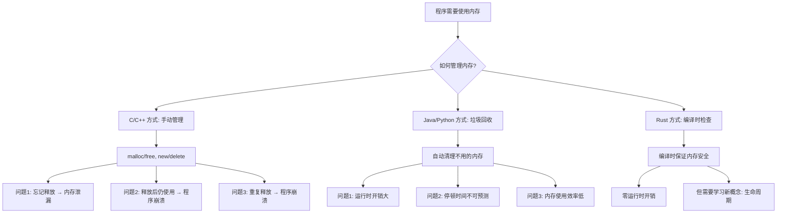

## 为什么需要生命周期标注？

让我用一个具体的例子来说明为什么需要生命周期：

### 问题场景：

```rust
// 这是一个会出错的例子（实际上编译不通过）
fn get_reference() -> &str {
    let s = String::from("hello");
    &s  // 错误！s 在函数结束时被销毁
}   // s 在这里被销毁了！

fn main() {
    let r = get_reference();  // r 指向一个已经被销毁的内存
    println!("{}", r);        // 危险！使用了悬垂指针
}
```

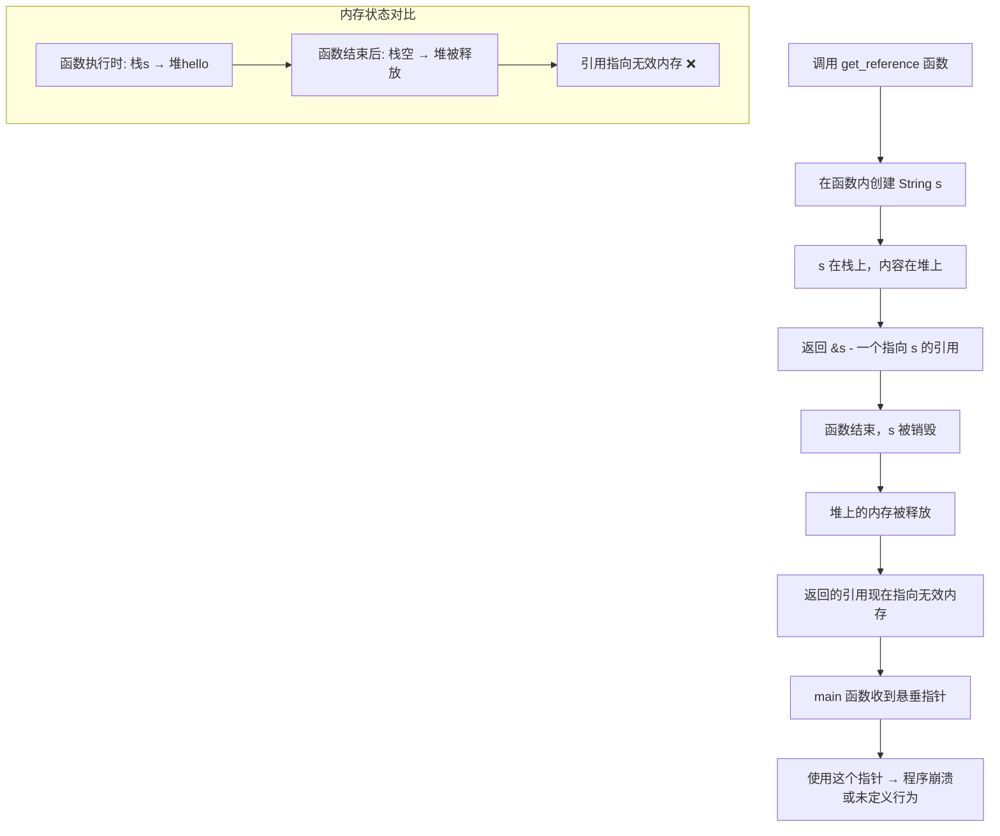

## 显式生命周期标注详解

### 1. 基础生命周期标注

```rust
fn longest<'a>(x: &'a str, y: &'a str) -> &'a str {
    if x.len() > y.len() { x } else { y }
}
```

**语法解释：**
- `<'a>` - 这是**生命周期参数**，`'a` 是一个名字（可以叫 `'b`、`'c` 等）
- `x: &'a str` - 参数 x 是一个字符串引用，生命周期是 `'a`
- `y: &'a str` - 参数 y 是一个字符串引用，生命周期也是 `'a`
- `-> &'a str` - 返回值也是一个字符串引用，生命周期是 `'a`

**这意味着什么？**

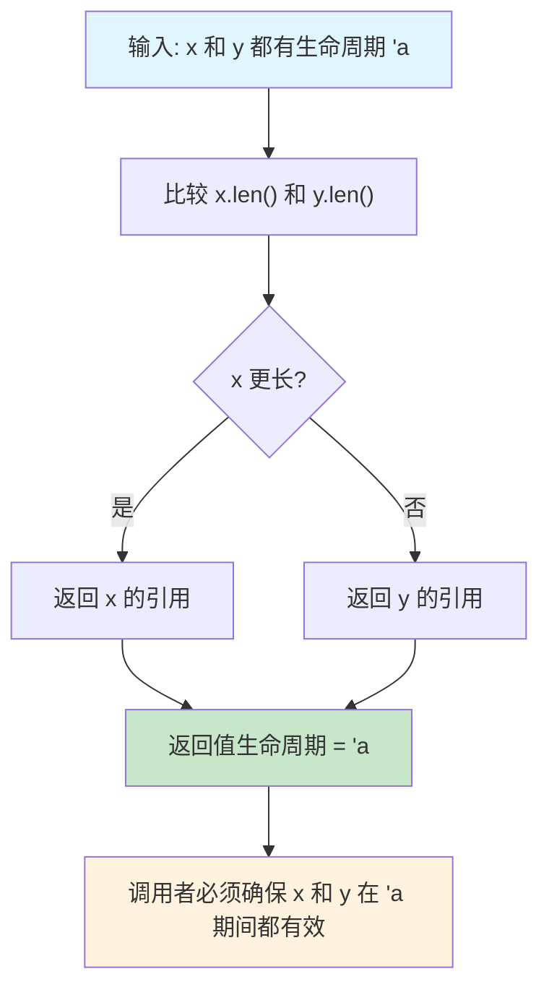

**实际使用示例：**

```rust
fn main() {
    let string1 = String::from("long string is long");
    let string2 = String::from("xyz");
    
    let result = longest(string1.as_str(), string2.as_str());
    println!("最长的字符串是: {}", result);
}
```

在这个例子中：
- `string1` 和 `string2` 都活到 `main` 函数结束
- `result` 引用其中一个字符串
- 因为两个字符串都活得足够长，所以没问题

### 2. 多个生命周期参数

```rust
fn complex_function<'a, 'b>(x: &'a str, y: &'b str) -> &'a str 
where
    'b: 'a,  // 'b 的生命周期至少和 'a 一样长
{
    println!("Processing: {}", y);
    x
}
```

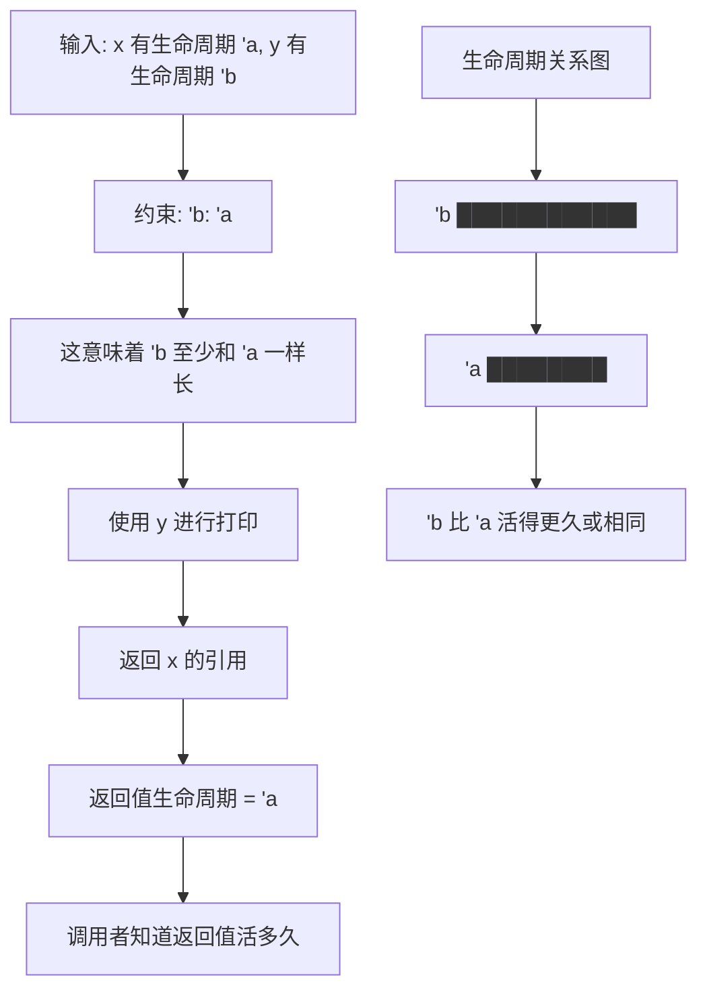

**约束 `'b: 'a` 的含义：**

- `'b: 'a` 读作："`'b` 比 `'a` 活得更久或相同"
- 这确保了我们可以安全地使用 `y`，即使返回值的生命周期是 `'a`

**使用示例：**

```rust
fn main() {
    let long_lived = String::from("我活得很久");
    {
        let short_lived = String::from("我活得较短");
        let result = complex_function(short_lived.as_str(), long_lived.as_str());
        println!("结果: {}", result);
    } // short_lived 在这里被销毁，但没关系，因为我们返回的是它的引用
}
```

## 生命周期省略规则详解

```rust
// 这些函数的生命周期是自动推断的
fn first_word(s: &str) -> &str {
    let bytes = s.as_bytes();
    for (i, &item) in bytes.iter().enumerate() {
        if item == b' ' {
            return &s[0..i];
        }
    }
    &s[..]
}

// 等价于
fn first_word_explicit<'a>(s: &'a str) -> &'a str {
    // ... 相同实现
    let bytes = s.as_bytes();
    for (i, &item) in bytes.iter().enumerate() {
        if item == b' ' {
            return &s[0..i];
        }
    }
    &s[..]
}
```

**省略规则的三条法则：**

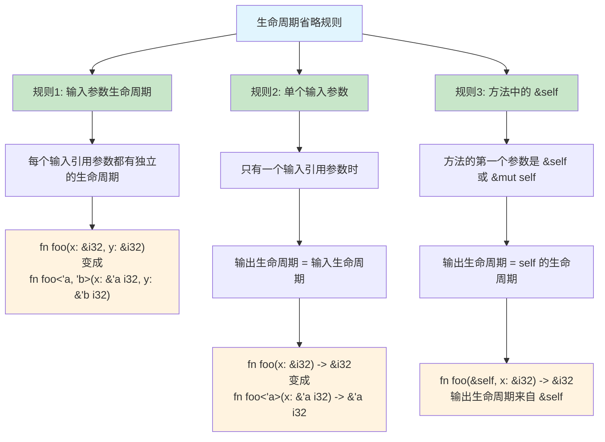

**实例分析：**

```rust
// 规则1 + 规则2 适用
fn first_word(s: &str) -> &str { /* ... */ }
// 编译器推断为：
fn first_word<'a>(s: &'a str) -> &'a str { /* ... */ }

// 规则1 适用，但规则2 不适用（多个输入参数）
fn longest(x: &str, y: &str) -> &str { /* ... */ }  // 编译错误！
// 编译器无法推断输出生命周期

// 规则3 适用
struct ImportantExcerpt<'a> {
    part: &'a str,
}

impl<'a> ImportantExcerpt<'a> {
    fn announce_and_return_part(&self, announcement: &str) -> &str {
        println!("Attention please: {}", announcement);
        self.part  // 返回值生命周期来自 &self
    }
}
```

**编译器的思考过程：**

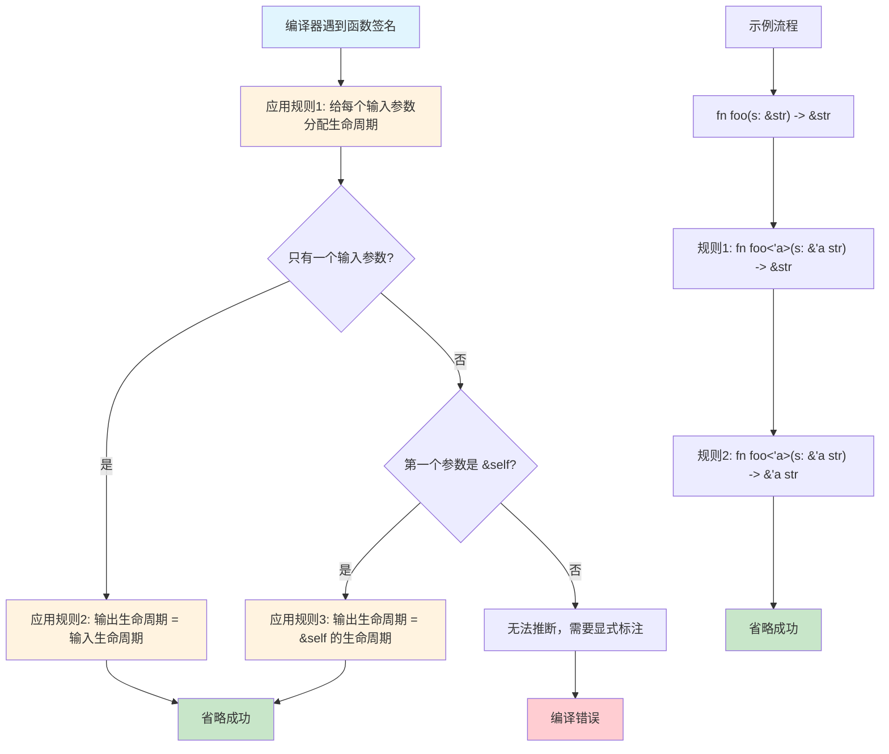

## 高阶生命周期边界 (HRTB) 详解

**什么是高阶生命周期边界？**

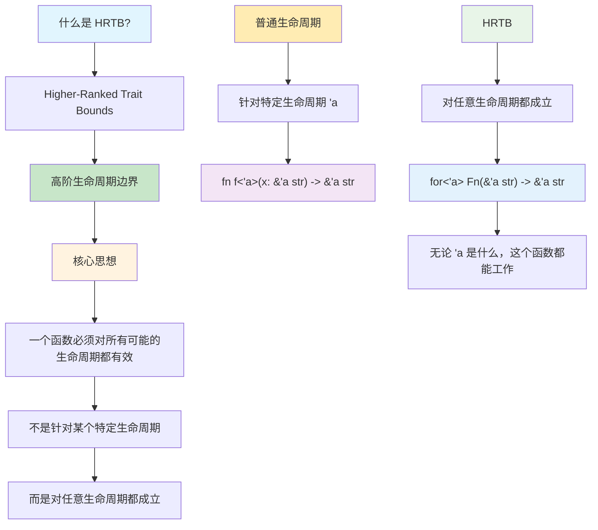

**为什么需要 HRTB？**

```rust
// 假设我们想写一个函数，接受任何能处理字符串的函数
fn process_string<F>(f: F) -> String
where
    F: Fn(&str) -> &str,  // 这样写有问题！
{
    let s = "hello";
    f(s).to_string()
}
```

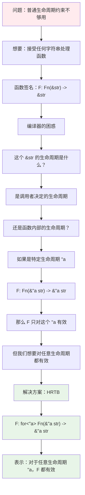

**对比：普通生命周期 vs HRTB**

```rust
// 普通生命周期：只对特定的生命周期 'a 有效
fn example1<'a, F>(f: F) -> String
where
    F: Fn(&'a str) -> &'a str,
{
    // 这里的 'a 是固定的
    let s = "hello";  // 这个 s 的生命周期必须是 'a
    f(s).to_string()  // 有问题！s 的生命周期可能不是 'a
}

// HRTB：对任意生命周期都有效
fn example2<F>(f: F) -> String
where
    F: for<'a> Fn(&'a str) -> &'a str,
{
    // 无论什么生命周期，f 都能处理
    let s = "hello";
    f(s).to_string()  // 没问题！
}
```

**使用示例：**

```rust
fn apply_to_str<F>(f: F) -> String
where
    F: for<'a> Fn(&'a str) -> &'a str,
{
    f("hello world").to_string()
}

// 实际应用场景
fn closure_example() {
    let uppercase = |s: &str| -> &str {
        // 这里只是演示，实际需要返回处理后的字符串
        s
    };
    
    let result = apply_to_str(uppercase);
    println!("{}", result);
}

// 更复杂的例子
fn process_any_string<F>(processor: F, input: &str) -> String
where
    F: for<'a> Fn(&'a str) -> &'a str,
{
    let processed = processor(input);
    format!("处理结果: {}", processed)
}

fn main() {
    let result = process_any_string(|s| s.trim(), "  hello  ");
    println!("{}", result);
}
```

**记忆要点：**

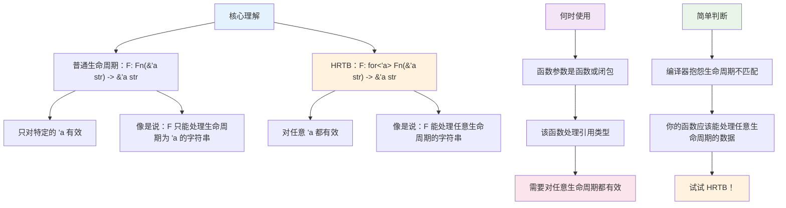

## 静态生命周期 (`'static`) 详解

**什么是 'static 生命周期？**

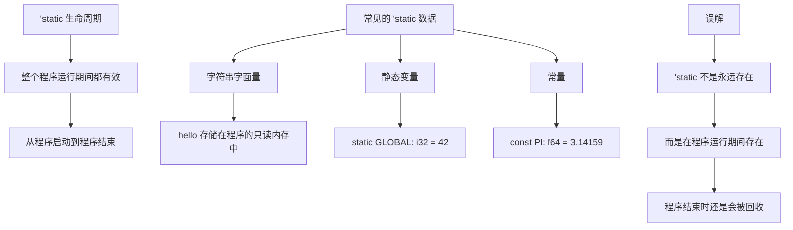

**静态生命周期的实际应用：**

```rust
// 'static 生命周期表示整个程序运行期间都有效
static HELLO: &'static str = "Hello, world!";

// 字符串字面量默认具有 'static 生命周期
fn get_static_str() -> &'static str {
    "This string lives for the entire program duration"
}

// 静态变量
static mut COUNTER: usize = 0;

// 常量也是 'static 的
const MAX_SIZE: usize = 100;

// 注意：'static 不等于永远存在
fn misleading_example() {
    let string = "hello".to_string();
    // let static_ref: &'static str = &string; // 编译错误！
    
    // 这个编译错误是因为 string 是在栈上创建的，
    // 函数结束时会被销毁，不能满足 'static 的要求
}
```

**'static 的常见误解：**

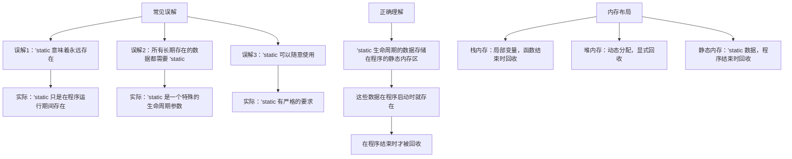

**正确使用 'static 的场景：**

```rust
// 1. 字符串字面量
fn get_greeting() -> &'static str {
    "Hello, Rust!"  // 字符串字面量自动具有 'static 生命周期
}

// 2. 静态变量
static CONFIG: &'static str = "development";

// 3. 常量
const VERSION: &'static str = "1.0.0";

// 4. 延迟初始化的静态数据
use std::sync::OnceLock;
static INSTANCE: OnceLock<String> = OnceLock::new();

fn get_instance() -> &'static String {
    INSTANCE.get_or_init(|| {
        "Lazy initialized".to_string()
    })
}

// 5. 错误的用法示例
fn wrong_static() -> &'static str {
    let local_string = String::from("I'm local");
    // &local_string  // 编译错误！局部变量不能有 'static 生命周期
    
    // 正确的做法：
    "I'm static"  // 使用字符串字面量
}
```

**'static 生命周期的约束关系：**

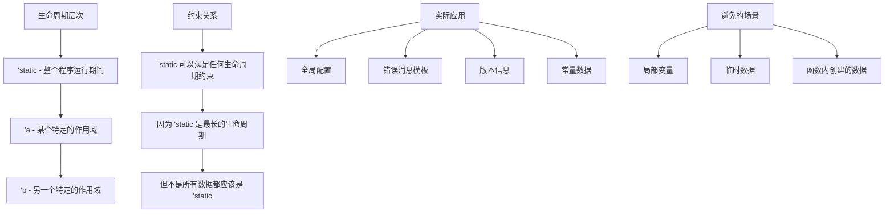

## 总结

1. **'static 生命周期**：数据在整个程序运行期间都有效
2. **常见用途**：字符串字面量、静态变量、常量
3. **注意事项**：不能将局部变量强制转换为 'static
4. **记忆要点**：'static 是最长的生命周期，但不是所有数据都需要它

---

## 下一步

继续阅读：
- [高级特质系统](./02_advanced_traits.md)
- [高级错误处理模式](./03_advanced_error_handling.md)