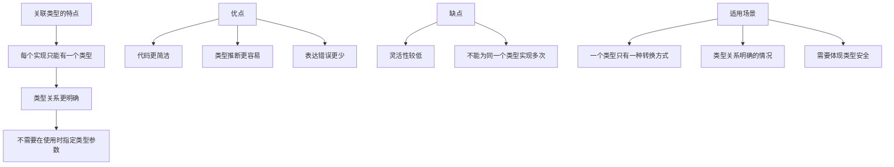
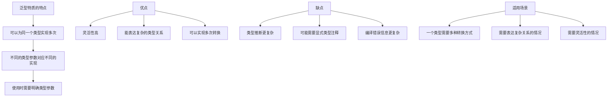
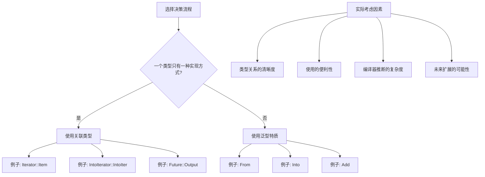
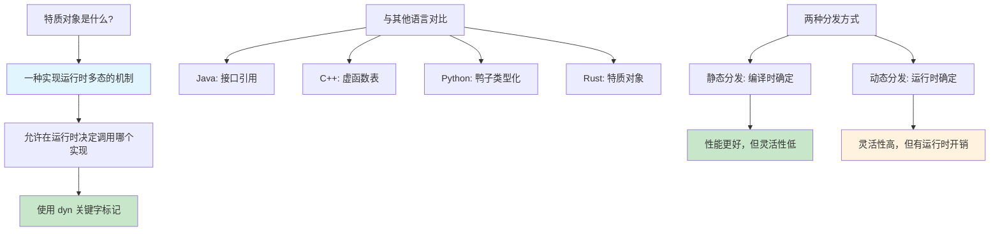
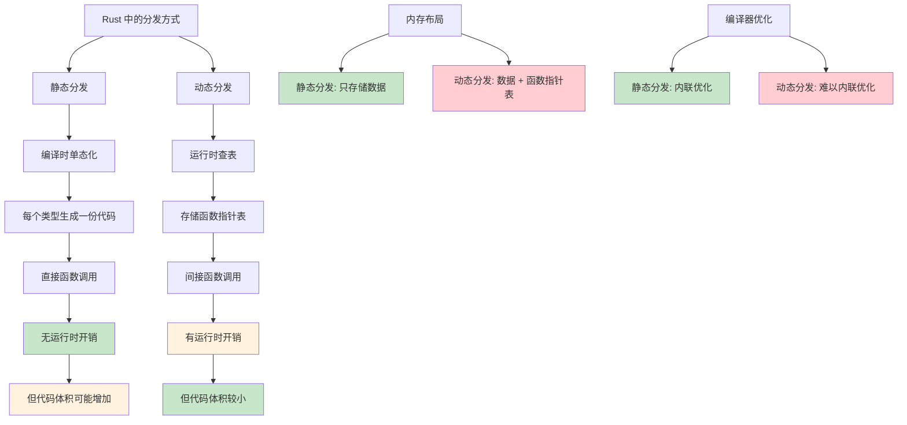
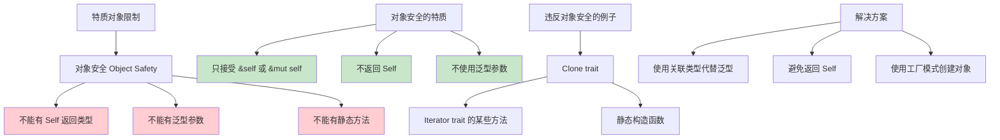
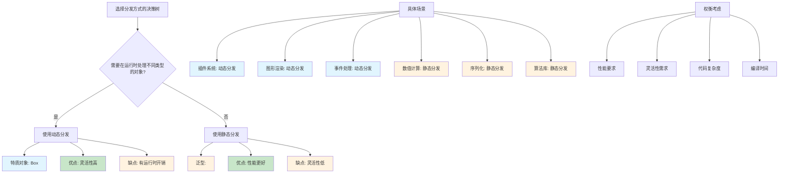
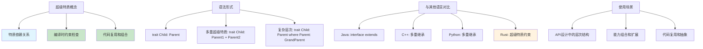
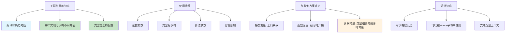

# Rust 高级特质系统

> 针对有 Node.js/Python/Java 经验的开发者设计，深入探讨 Rust 特质系统的高级特性

## 关联类型 vs 泛型的深入对比

**核心区别在于灵活性和明确性的权衡：**

### 关联类型：每个实现只能有一个类型

```rust
trait Iterator {
    type Item;  // 关联类型
    
    fn next(&mut self) -> Option<Self::Item>;
}

// 实现 Iterator 时必须指定具体的 Item 类型
struct Counter {
    current: usize,
    max: usize,
}

impl Iterator for Counter {
    type Item = usize;  // 只能有一个 Item 类型
    
    fn next(&mut self) -> Option<Self::Item> {
        if self.current < self.max {
            let current = self.current;
            self.current += 1;
            Some(current)
        } else {
            None
        }
    }
}
```



**使用示例：**

```rust
fn use_iterator<I>(iter: I) -> Vec<I::Item> 
where
    I: Iterator,
{
    iter.collect()  // 不需要指定Item类型，编译器自动推断
}

fn main() {
    let counter = Counter { current: 0, max: 5 };
    let nums = use_iterator(counter);
    println!("{:?}", nums);  // [0, 1, 2, 3, 4]
}
```

### 泛型：可以有多个实现

```rust
trait From<T> {
    fn from(value: T) -> Self;
}

// 可以为同一个类型实现多个 From
impl From<i32> for String {
    fn from(value: i32) -> Self {
        value.to_string()
    }
}

impl From<f64> for String {
    fn from(value: f64) -> Self {
        value.to_string()
    }
}

impl From<bool> for String {
    fn from(value: bool) -> Self {
        value.to_string()
    }
}
```



**使用示例：**

```rust
fn convert_to_string<T>(value: T) -> String 
where
    String: From<T>,  // 必须显式指定类型约束
{
    String::from(value)
}

fn main() {
    let from_int = convert_to_string(42);
    let from_float = convert_to_string(3.14);
    let from_bool = convert_to_string(true);
    
    println!("{}, {}, {}", from_int, from_float, from_bool);
}
```

### 何时使用哪一种？



## 特质对象和动态分发详解

### 与其他语言的多态机制对比

| 语言 | 多态实现方式 | 特点 | 性能 |
|------|-------------|------|------|
| **Java** | 接口引用 + 虚方法表 | 运行时类型检查，自动装箱 | 有虚方法调用开销 |
| **C++** | 虚函数表(vtable) | 手动管理内存，指针操作 | 虚方法调用开销，但可优化 |
| **Python** | 鸭子类型化 | 动态类型，极其灵活 | 解释执行，性能较低 |
| **Rust** | 特质对象 + 胖指针 | 内存安全，零成本抽象 | 可预测的开销，编译器优化 |

### 什么是特质对象？



### Demo 1: 基础图形绘制系统

```rust
trait Draw {
    fn draw(&self);
    fn area(&self) -> f64;
}

struct Circle {
    radius: f64,
}

struct Rectangle {
    width: f64,
    height: f64,
}

struct Triangle {
    base: f64,
    height: f64,
}

impl Draw for Circle {
    fn draw(&self) {
        println!("🔵 Drawing circle with radius {}", self.radius);
    }
    
    fn area(&self) -> f64 {
        std::f64::consts::PI * self.radius * self.radius
    }
}

impl Draw for Rectangle {
    fn draw(&self) {
        println!("⬜ Drawing rectangle {}x{}", self.width, self.height);
    }
    
    fn area(&self) -> f64 {
        self.width * self.height
    }
}

impl Draw for Triangle {
    fn draw(&self) {
        println!("🔺 Drawing triangle with base {} and height {}", self.base, self.height);
    }
    
    fn area(&self) -> f64 {
        0.5 * self.base * self.height
    }
}

// 动态分发：运行时多态
struct Canvas {
    shapes: Vec<Box<dyn Draw>>,
}

impl Canvas {
    fn new() -> Self {
        Self {
            shapes: Vec::new(),
        }
    }
    
    fn add_shape(&mut self, shape: Box<dyn Draw>) {
        self.shapes.push(shape);
    }
    
    fn render_all(&self) {
        println!("🎨 Rendering canvas with {} shapes:", self.shapes.len());
        for (i, shape) in self.shapes.iter().enumerate() {
            print!("  Shape {}: ", i + 1);
            shape.draw(); // 动态分发：运行时决定调用哪个实现
        }
    }
    
    fn total_area(&self) -> f64 {
        self.shapes.iter().map(|shape| shape.area()).sum()
    }
}

// 使用示例
fn main() {
    let mut canvas = Canvas::new();
    
    canvas.add_shape(Box::new(Circle { radius: 5.0 }));
    canvas.add_shape(Box::new(Rectangle { width: 10.0, height: 20.0 }));
    canvas.add_shape(Box::new(Triangle { base: 8.0, height: 6.0 }));
    
    canvas.render_all();
    println!("📊 Total area: {:.2}", canvas.total_area());
}
```

### Demo 2: 插件系统实现

```rust
trait Plugin {
    fn name(&self) -> &str;
    fn version(&self) -> &str;
    fn execute(&self, input: &str) -> String;
    fn description(&self) -> String {
        format!("{} v{}", self.name(), self.version())
    }
}

struct TextProcessorPlugin {
    name: String,
    version: String,
}

struct DataValidatorPlugin {
    name: String,
    version: String,
}

struct LoggerPlugin {
    name: String,
    version: String,
}

impl Plugin for TextProcessorPlugin {
    fn name(&self) -> &str { &self.name }
    fn version(&self) -> &str { &self.version }
    
    fn execute(&self, input: &str) -> String {
        format!("📝 Processed: {}", input.to_uppercase())
    }
}

impl Plugin for DataValidatorPlugin {
    fn name(&self) -> &str { &self.name }
    fn version(&self) -> &str { &self.version }
    
    fn execute(&self, input: &str) -> String {
        let is_valid = !input.is_empty() && input.len() > 3;
        format!("✅ Validation: {} - {}", input, if is_valid { "VALID" } else { "INVALID" })
    }
}

impl Plugin for LoggerPlugin {
    fn name(&self) -> &str { &self.name }
    fn version(&self) -> &str { &self.version }
    
    fn execute(&self, input: &str) -> String {
        let timestamp = std::time::SystemTime::now()
            .duration_since(std::time::UNIX_EPOCH)
            .unwrap()
            .as_secs();
        format!("📋 [{}] LOG: {}", timestamp, input)
    }
}

struct PluginManager {
    plugins: Vec<Box<dyn Plugin>>,
}

impl PluginManager {
    fn new() -> Self {
        Self {
            plugins: Vec::new(),
        }
    }
    
    fn register_plugin(&mut self, plugin: Box<dyn Plugin>) {
        println!("🔌 Registered plugin: {}", plugin.description());
        self.plugins.push(plugin);
    }
    
    fn process_data(&self, data: &str) -> Vec<String> {
        println!("⚙️  Processing '{}' through {} plugins:", data, self.plugins.len());
        
        self.plugins
            .iter()
            .map(|plugin| {
                let result = plugin.execute(data);
                println!("  {} -> {}", plugin.name(), result);
                result
            })
            .collect()
    }
    
    fn list_plugins(&self) {
        println!("📦 Available plugins:");
        for plugin in &self.plugins {
            println!("  - {}", plugin.description());
        }
    }
}

// 使用示例
fn main() {
    let mut manager = PluginManager::new();
    
    manager.register_plugin(Box::new(TextProcessorPlugin {
        name: "TextProcessor".to_string(),
        version: "1.0.0".to_string(),
    }));
    
    manager.register_plugin(Box::new(DataValidatorPlugin {
        name: "DataValidator".to_string(),
        version: "2.1.0".to_string(),
    }));
    
    manager.register_plugin(Box::new(LoggerPlugin {
        name: "Logger".to_string(),
        version: "1.5.2".to_string(),
    }));
    
    manager.list_plugins();
    println!();
    
    let results = manager.process_data("hello world");
    println!("\\n🎯 Final results: {:#?}", results);
}
```

### 静态分发 vs 动态分发的详细对比



### 特质对象的限制和要求



```rust
// ❌ 不能作为特质对象的特质
trait BadForObject {
    fn clone(&self) -> Self;        // 返回Self，不可以
    fn generic_method<T>(&self, x: T); // 泛型参数，不可以
    fn static_method();            // 静态方法，不可以
}

// ✅ 可以作为特质对象的特质
trait GoodForObject {
    fn method(&self);              // 可以
    fn mut_method(&mut self);      // 可以
    fn return_primitive(&self) -> i32;  // 可以
    fn with_parameters(&self, x: i32, y: &str); // 可以
}
```

### 何时使用哪种分发方式？



### 最佳实践和使用建议

```rust
// 1. 优先使用静态分发，必要时才用动态分发
fn best_practice_example() {
    // ✅ 推荐：当类型在编译时已知
    let circle = Circle { radius: 5.0 };
    let rectangle = Rectangle { width: 10.0, height: 20.0 };
    
    // 静态分发 - 性能更好
    process_shape_static(&circle);
    process_shape_static(&rectangle);
    
    // ✅ 必要时使用动态分发：类型需要在容器中混合存储
    let shapes: Vec<Box<dyn Draw>> = vec![
        Box::new(Circle { radius: 3.0 }),
        Box::new(Rectangle { width: 5.0, height: 8.0 }),
    ];
    
    for shape in &shapes {
        shape.draw(); // 动态分发
    }
}

fn process_shape_static<T: Draw>(shape: &T) {
    shape.draw();
}

// 2. 使用枚举代替特质对象（当类型数量有限时）
enum Shape {
    Circle(Circle),
    Rectangle(Rectangle),
    Triangle(Triangle),
}

impl Shape {
    fn draw(&self) {
        match self {
            Shape::Circle(c) => c.draw(),
            Shape::Rectangle(r) => r.draw(),
            Shape::Triangle(t) => t.draw(),
        }
    }
    
    fn area(&self) -> f64 {
        match self {
            Shape::Circle(c) => c.area(),
            Shape::Rectangle(r) => r.area(),
            Shape::Triangle(t) => t.area(),
        }
    }
}

fn enum_alternative_example() {
    // 枚举版本 - 无运行时开销，类型安全
    let shapes = vec![
        Shape::Circle(Circle { radius: 5.0 }),
        Shape::Rectangle(Rectangle { width: 10.0, height: 20.0 }),
        Shape::Triangle(Triangle { base: 8.0, height: 6.0 }),
    ];
    
    for shape in &shapes {
        shape.draw(); // 静态分发，通过模式匹配
    }
    
    let total_area: f64 = shapes.iter().map(|s| s.area()).sum();
    println!("Total area: {:.2}", total_area);
}

// 3. 智能指针的选择
fn smart_pointer_choices() {
    // Box<dyn Trait> - 独占所有权
    let owned_shape: Box<dyn Draw> = Box::new(Circle { radius: 5.0 });
    
    // Rc<dyn Trait> - 共享所有权（单线程）
    use std::rc::Rc;
    let shared_shape: Rc<dyn Draw> = Rc::new(Rectangle { width: 10.0, height: 20.0 });
    let shared_shape_clone = shared_shape.clone();
    
    // Arc<dyn Trait> - 共享所有权（多线程）
    use std::sync::Arc;
    let thread_safe_shape: Arc<dyn Draw> = Arc::new(Triangle { base: 8.0, height: 6.0 });
    
    // 使用示例
    owned_shape.draw();
    shared_shape.draw();
    thread_safe_shape.draw();
}
```

## 高级特质边界详解

### 特质边界的层次和语法

特质边界是Rust类型系统的核心组成部分，它允许我们对泛型参数施加约束，确保类型具有我们需要的能力。

```mermaid
graph TB
    A["特质边界的作用"] --> B["约束泛型参数的能力"]
    A --> C["编译时类型检查"]
    A --> D["启用特定的方法调用"]
    
    E["特质边界语法"] --> F["基础语法: T: Trait"]
    E --> G["多个约束: T: Trait1 + Trait2"]
    E --> H["where子句: where T: Trait"]
    E --> I["条件实现: impl<T: Trait>"]
    
    J["高级用法"] --> K["关联类型约束"]
    J --> L["高阶特质边界 HRTB"]
    J --> M["条件性特质实现"]
    J --> N["返回位置impl Trait"]
    
    O["与其他语言对比"] --> P["Java: 泛型通配符"]
    O --> Q["C++: 模板特化"]
    O --> R["Haskell: 类型类约束"]
    O --> S["Rust: 特质边界"]
    
    style A fill:#e3f2fd
    style E fill:#f3e5f5
    style J fill:#e8f5e8
    style O fill:#fce4ec
    style B fill:#e1f5fe
    style C fill:#c8e6c9
    style D fill:#c8e6c9
    style K fill:#fff3e0
    style L fill:#fff3e0
    style M fill:#fff3e0
    style N fill:#fff3e0
```



### 多重特质边界系统

```rust
use std::fmt::{Debug, Display};

// 多重特质边界函数
fn process_data<T>(data: &T) -> String
where
    T: Debug + Display + Clone,
{
    let mut result = String::new();
    result.push_str(&format!("📋 Processing: {}\\n", data));
    result.push_str(&format!("🔍 Debug: {:?}\\n", data));
    result.push_str(&format!("📄 Clone: {}\\n", data.clone()));
    result
}

// 条件性特质使用
fn analyze_data<T>(data: &T) -> String
where
    T: Display + Clone,
{
    format!("Data {} can be cloned: {}", data, data.clone())
}

// 比较不同类型
fn compare_data<T, U>(data1: &T, data2: &U) -> String
where
    T: Display,
    U: Display,
{
    format!("Comparing {} and {}", data1, data2)
}
```

### 返回位置impl Trait详解

```rust
// 基础的 impl Trait 返回
fn create_processor(kind: &str) -> impl Display + Clone {
    match kind {
        "simple" => SimpleProcessor { name: "Simple".to_string() },
        _ => SimpleProcessor { name: "Default".to_string() },
    }
}

// 带生命周期的 impl Trait
fn create_processor_with_data(data: &str) -> impl Display + '_ {
    struct DataProcessor<'a> {
        data: &'a str,
    }
    
    impl<'a> Display for DataProcessor<'a> {
        fn fmt(&self, f: &mut std::fmt::Formatter) -> std::fmt::Result {
            write!(f, "DataProcessor({})", self.data)
        }
    }
    
    DataProcessor { data }
}

// 迭代器和 impl Trait
fn create_number_iterator(start: i32, end: i32) -> impl Iterator<Item = i32> + Clone {
    (start..=end).filter(|&x| x % 2 == 0)
}

// 条件返回不同的 impl Trait
fn conditional_iterator(use_numbers: bool) -> impl Iterator<Item = String> {
    if use_numbers {
        (1..=3).map(|i| i.to_string()).collect::<Vec<_>>().into_iter()
    } else {
        vec!["a".to_string(), "b".to_string(), "c".to_string()].into_iter()
    }
}
```

## 超级特质 (Supertraits) 详解

### 超级特质的概念和层次结构

超级特质是Rust中实现特质继承的机制，它允许一个特质依赖于另一个特质的实现。



### 分层的输出系统

```rust
use std::fmt::{Display, Debug};

// 基础特质：可显示
trait Displayable {
    fn display_name(&self) -> String;
}

// 超级特质：可格式化输出（依赖Display）
trait Formattable: Display {
    fn formatted_output(&self) -> String {
        format!("Formatted: {}", self)
    }
    
    fn boxed_output(&self) -> String {
        let content = self.to_string();
        let border = "-".repeat(content.len() + 4);
        format!("{}\\n| {} |\\n{}", border, content, border)
    }
}

// 更高层次的特质：可装饰输出（依赖Formattable，间接依赖Display）
trait Decoratable: Formattable + Debug {
    fn outline_print(&self) {
        let output = self.to_string();
        let len = output.len();
        println!("{}", "*".repeat(len + 4));
        println!("*{}*", " ".repeat(len + 2));
        println!("* {} *", output);
        println!("*{}*", " ".repeat(len + 2));
        println!("{}", "*".repeat(len + 4));
    }
    
    fn decorated_output(&self) -> String {
        format!("🎨 {} 🎨\\n{}\\nDebug: {:?}", 
                self.display_name(), 
                self.boxed_output(),
                self)
    }
}

// 具体类型实现
#[derive(Debug)]
struct Product {
    name: String,
    price: f64,
}

impl Displayable for Product {
    fn display_name(&self) -> String {
        format!("Product: {}", self.name)
    }
}

impl Display for Product {
    fn fmt(&self, f: &mut std::fmt::Formatter) -> std::fmt::Result {
        write!(f, "{} (${:.2})", self.name, self.price)
    }
}

impl Formattable for Product {}

impl Decoratable for Product {}

// 通用函数：利用超级特质约束
fn print_fancy<T: Decoratable>(item: &T) {
    println!("=== {} ===", item.display_name());
    println!("{}", item.formatted_output());
    println!("\\nBoxed version:");
    println!("{}", item.boxed_output());
    println!("\\nDecorated version:");
    println!("{}", item.decorated_output());
}
```

## 特质中的关联常量详解

### 关联常量的概念和用途

关联常量为特质提供了编译时常量值，这些值与特质的特定实现相关联。



### 配置驱动的数据结构

```rust
// 定义配置特质
trait CollectionConfig {
    const INITIAL_CAPACITY: usize;
    const MAX_CAPACITY: usize;
    const GROWTH_FACTOR: f64 = 2.0; // 默认值
    const NAME: &'static str;
    
    fn validate_capacity(capacity: usize) -> bool {
        capacity <= Self::MAX_CAPACITY
    }
    
    fn next_capacity(current: usize) -> usize {
        let next = (current as f64 * Self::GROWTH_FACTOR) as usize;
        next.min(Self::MAX_CAPACITY)
    }
}

// 不同类型的配置
struct SmallConfig;
struct LargeConfig;

impl CollectionConfig for SmallConfig {
    const INITIAL_CAPACITY: usize = 4;
    const MAX_CAPACITY: usize = 64;
    const NAME: &'static str = "Small";
}

impl CollectionConfig for LargeConfig {
    const INITIAL_CAPACITY: usize = 128;
    const MAX_CAPACITY: usize = 65536;
    const GROWTH_FACTOR: f64 = 1.5; // 覆盖默认值
    const NAME: &'static str = "Large";
}

// 使用配置的动态数组
struct ConfigurableVec<T, C: CollectionConfig> {
    data: Vec<T>,
    config: std::marker::PhantomData<C>,
}

impl<T, C: CollectionConfig> ConfigurableVec<T, C> {
    fn new() -> Self {
        Self {
            data: Vec::with_capacity(C::INITIAL_CAPACITY),
            config: std::marker::PhantomData,
        }
    }
    
    fn push(&mut self, item: T) -> Result<(), String> {
        if self.data.len() >= C::MAX_CAPACITY {
            return Err(format!("Maximum capacity ({}) reached for {}", 
                              C::MAX_CAPACITY, C::NAME));
        }
        
        if self.data.len() == self.data.capacity() {
            let new_capacity = C::next_capacity(self.data.capacity());
            if !C::validate_capacity(new_capacity) {
                return Err(format!("Cannot grow beyond maximum capacity"));
            }
            self.data.reserve(new_capacity - self.data.capacity());
            println!("📈 {} collection grew to capacity: {}", C::NAME, new_capacity);
        }
        
        self.data.push(item);
        Ok(())
    }
    
    fn config_info(&self) -> String {
        format!(
            "ConfigurableVec<{}> - Initial: {}, Max: {}, Growth: {:.2}x",
            C::NAME, C::INITIAL_CAPACITY, C::MAX_CAPACITY, C::GROWTH_FACTOR
        )
    }
}
```

## 总结

**特质对象的核心价值：**

1. **运行时多态性** - 允许在运行时处理不同类型的对象
2. **代码复用** - 统一的接口处理多种实现
3. **插件架构** - 支持动态加载和扩展

**超级特质的核心价值：**

1. **层次化设计** - 建立清晰的能力层次结构
2. **代码复用** - 通过特质组合实现功能复用
3. **类型安全** - 编译时确保依赖关系正确

**关联常量的核心价值：**

1. **类型相关配置** - 每个类型可以有不同的编译时常量
2. **零运行时开销** - 编译时确定，无运行时查找
3. **类型安全参数** - 避免魔法数字，提高代码可读性

**使用建议：**

1. **性能敏感的代码** → 优先使用静态分发
2. **需要运行时灵活性** → 使用动态分发
3. **类型数量有限且已知** → 考虑使用枚举
4. **设计公共API** → 考虑对象安全性要求

---

## 下一步

继续阅读：
- [高级错误处理模式](./03_advanced_error_handling.md)
- [高级异步编程](./04_advanced_async.md)