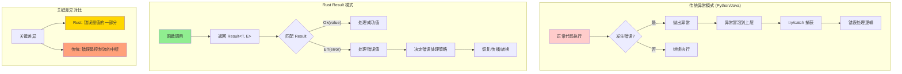
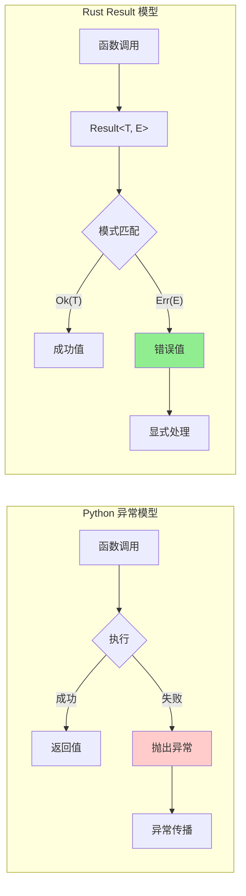
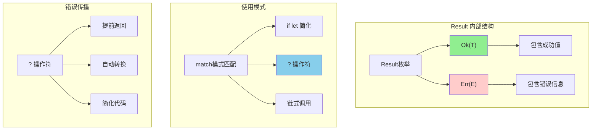
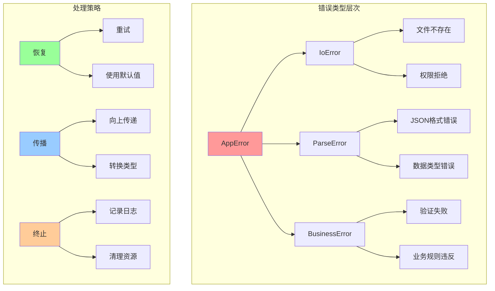
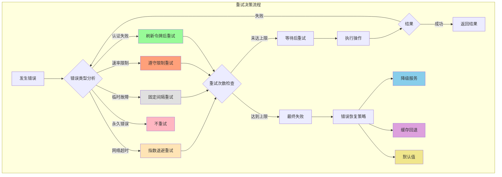
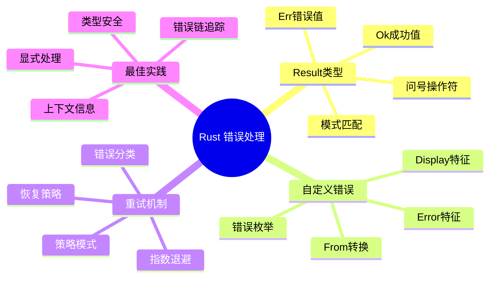

# Rust 高级错误处理模式

> 针对有 Python/Java/Node.js 经验的开发者定制，深度对比和详细讲解

## 🔄 错误处理范式的根本差异

### 概念映射表

| 你熟悉的语言 | 错误处理方式 | Rust 对应概念 | 核心差异 |
|-------------|-------------|--------------|----------|
| **Python** | `try/except` + 异常 | `Result<T, E>` | 显式 vs 隐式 |
| **Java** | `try/catch` + 检查异常 | `Result<T, E>` | 编译时强制 vs 运行时 |
| **Node.js** | `Error-first callbacks` + `Promise.catch()` | `Result<T, E>` + `?` 操作符 | 统一语法 vs 分散处理 |

### 思维模式转换图



### 错误处理模式对比图



## 🎯 为什么 Rust 选择这种方式？

### 核心问题对比

```rust
// Python: 隐式错误
def divide(a, b):
    return a / b  # 可能 ZeroDivisionError，但看不出来

// Java: 部分显式
public int divide(int a, int b) throws ArithmeticException {
    return a / b;  // 显式但冗长
}

// Rust: 完全显式且简洁
fn divide(a: i32, b: i32) -> Result<i32, String> {
    if b == 0 {
        Err("除零错误".to_string())
    } else {
        Ok(a / b)
    }
}
```

## 📊 Result<T, E> 核心概念

### Result 结构和使用



### 基本使用示例

```rust
use std::fs;

// 基础错误处理
fn read_config(path: &str) -> Result<String, String> {
    match fs::read_to_string(path) {
        Ok(content) => Ok(content),
        Err(err) => Err(format!("读取失败: {}", err)),
    }
}

// 使用 ? 操作符简化
fn read_and_parse(path: &str) -> Result<u32, Box<dyn std::error::Error>> {
    let content = fs::read_to_string(path)?;  // 自动错误传播
    let number = content.trim().parse::<u32>()?;  // 链式错误处理
    Ok(number)
}

// 调用示例
fn main() {
    match read_and_parse("config.txt") {
        Ok(num) => println!("数字: {}", num),
        Err(err) => println!("错误: {}", err),
    }
}
```

## 🏗️ 自定义错误类型

### 错误设计层次图



### 实用的错误类型实现

```rust
use std::error::Error;
use std::fmt;

// 自定义错误枚举
#[derive(Debug)]
pub enum AppError {
    Io(std::io::Error),
    Parse(String),
    Business(String),
}

// 实现 Display trait
impl fmt::Display for AppError {
    fn fmt(&self, f: &mut fmt::Formatter) -> fmt::Result {
        match self {
            AppError::Io(err) => write!(f, "IO错误: {}", err),
            AppError::Parse(msg) => write!(f, "解析错误: {}", msg),
            AppError::Business(msg) => write!(f, "业务错误: {}", msg),
        }
    }
}

// 实现 Error trait
impl Error for AppError {
    fn source(&self) -> Option<&(dyn Error + 'static)> {
        match self {
            AppError::Io(err) => Some(err),
            _ => None,
        }
    }
}

// 自动转换
impl From<std::io::Error> for AppError {
    fn from(err: std::io::Error) -> Self {
        AppError::Io(err)
    }
}

// 使用示例
fn process_file(path: &str) -> Result<u32, AppError> {
    let content = std::fs::read_to_string(path)?;  // IO错误自动转换
    
    let number = content.trim().parse::<u32>()
        .map_err(|_| AppError::Parse("无效数字".to_string()))?;
    
    if number == 0 {
        return Err(AppError::Business("数字不能为零".to_string()));
    }
    
    Ok(number)
}
```

## 🔄 错误恢复和重试机制

### 智能重试策略图



### 重试模式实现

```rust
use std::time::Duration;

// 重试策略
pub enum RetryStrategy {
    FixedInterval { interval: Duration, max_attempts: usize },
    ExponentialBackoff { initial: Duration, max_attempts: usize },
}

// 可重试错误特征
pub trait RetryableError {
    fn is_retryable(&self) -> bool;
}

// 为自定义错误实现重试逻辑
impl RetryableError for AppError {
    fn is_retryable(&self) -> bool {
        match self {
            AppError::Io(_) => true,       // IO错误可重试
            AppError::Parse(_) => false,   // 解析错误不重试
            AppError::Business(_) => false, // 业务错误不重试
        }
    }
}

// 重试执行器
pub struct RetryExecutor {
    strategy: RetryStrategy,
}

impl RetryExecutor {
    pub fn new(strategy: RetryStrategy) -> Self {
        Self { strategy }
    }
    
    pub fn execute<F, T, E>(&self, mut operation: F) -> Result<T, E>
    where
        F: FnMut() -> Result<T, E>,
        E: RetryableError,
    {
        let max_attempts = match &self.strategy {
            RetryStrategy::FixedInterval { max_attempts, .. } => *max_attempts,
            RetryStrategy::ExponentialBackoff { max_attempts, .. } => *max_attempts,
        };
        
        for attempt in 0..max_attempts {
            match operation() {
                Ok(result) => return Ok(result),
                Err(error) => {
                    if !error.is_retryable() || attempt == max_attempts - 1 {
                        return Err(error);
                    }
                    
                    // 计算等待时间并重试
                    let delay = self.calculate_delay(attempt);
                    std::thread::sleep(delay);
                }
            }
        }
        
        unreachable!()
    }
    
    fn calculate_delay(&self, attempt: usize) -> Duration {
        match &self.strategy {
            RetryStrategy::FixedInterval { interval, .. } => *interval,
            RetryStrategy::ExponentialBackoff { initial, .. } => {
                Duration::from_millis(initial.as_millis() as u64 * 2_u64.pow(attempt as u32))
            }
        }
    }
}

// 使用示例
fn unreliable_network_call() -> Result<String, AppError> {
    // 模拟70%失败率的网络调用
    if rand::random::<f64>() < 0.7 {
        Err(AppError::Io(std::io::Error::new(
            std::io::ErrorKind::TimedOut,
            "网络超时"
        )))
    } else {
        Ok("成功响应".to_string())
    }
}

fn main() {
    let retry_executor = RetryExecutor::new(RetryStrategy::ExponentialBackoff {
        initial: Duration::from_millis(100),
        max_attempts: 5,
    });
    
    match retry_executor.execute(unreliable_network_call) {
        Ok(response) => println!("✅ 最终成功: {}", response),
        Err(err) => println!("❌ 重试后仍失败: {}", err),
    }
}
```

## 🎯 学习要点总结

### 错误处理学习思维图



### 核心概念对比表

| 概念 | Python/Java | Node.js | Rust | 关键差异 |
|------|-------------|---------|------|----------|
| **错误表示** | 异常对象 | Error对象 | `Result<T, E>` | 值 vs 控制流 |
| **错误传播** | `throw`/`raise` | `throw`/`reject` | `?` 操作符 | 显式 vs 隐式 |
| **错误处理** | `try/catch` | `try/catch`/`.catch()` | 模式匹配 | 强制 vs 可选 |
| **类型安全** | 运行时检查 | 运行时检查 | 编译时保证 | 静态 vs 动态 |

### 学习路径建议

1. **掌握 Result<T, E>** - 理解 Rust 错误处理的核心
2. **熟练使用 ? 操作符** - 简化错误传播代码  
3. **设计错误类型** - 创建有意义的错误层次
4. **实现重试机制** - 处理临时性错误
5. **培养错误思维** - 将错误视为值而非异常

### 实践建议

- ✅ 优先使用 `Result<T, E>` 而不是 panic
- ✅ 为每个模块定义专门的错误类型
- ✅ 使用 `?` 操作符简化错误传播
- ✅ 提供有用的错误信息和上下文
- ✅ 区分可恢复和不可恢复的错误

---

**掌握了错误处理，下一章我们将学习异步编程的核心概念！** 🚀