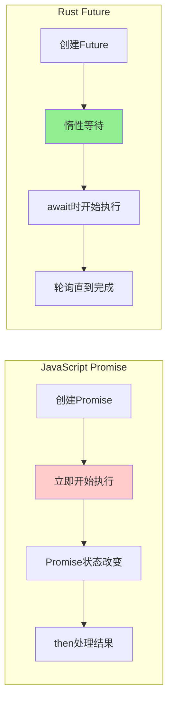
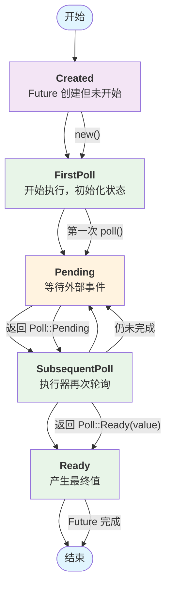
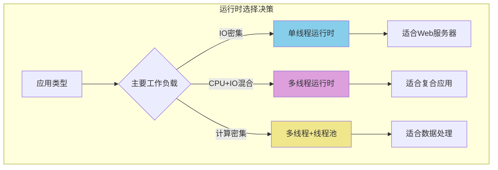
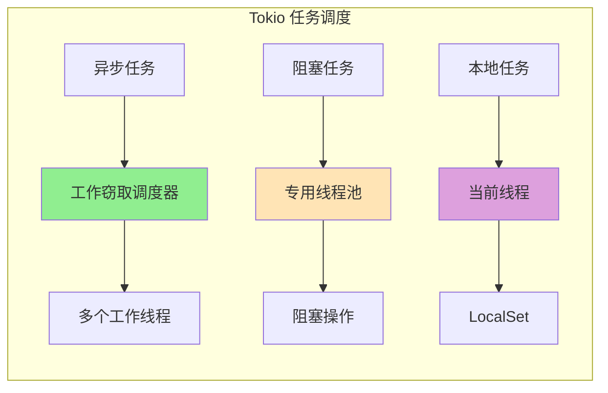
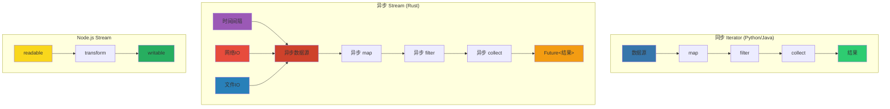
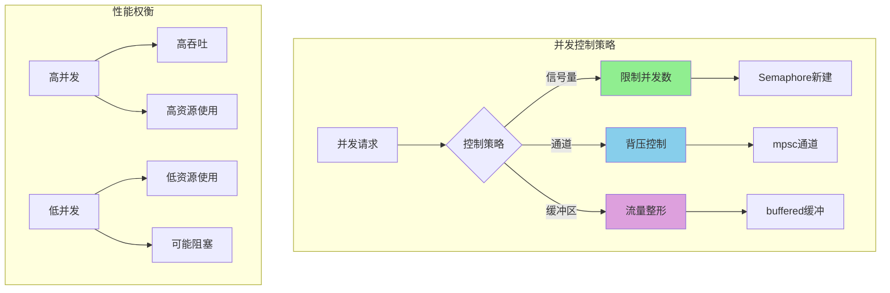
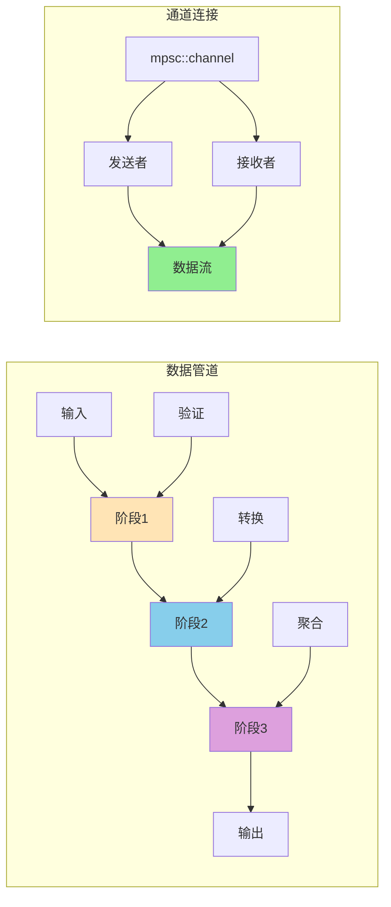
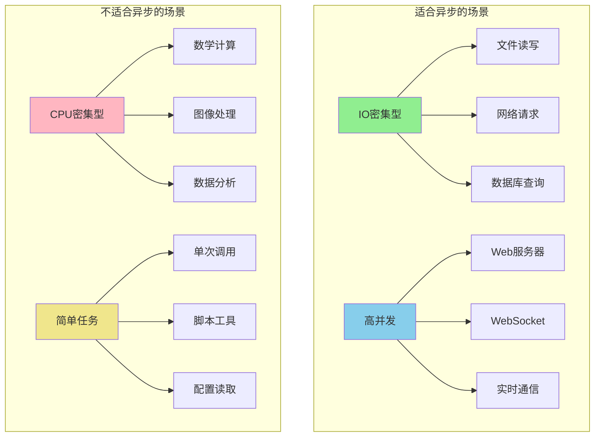
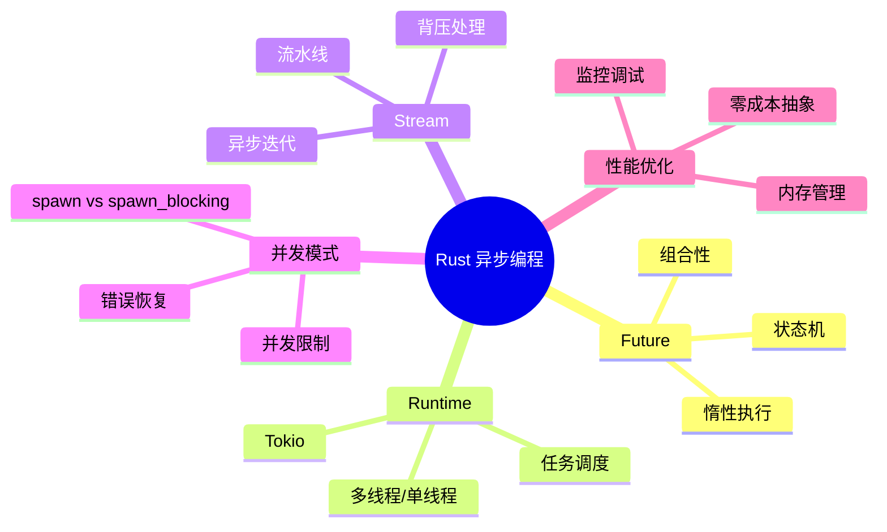

# Rust 高级异步编程详解

> 针对有 Python/Java/Node.js 经验的开发者定制，深度对比和详细讲解

## 🌊 异步编程范式的深层理解

### 异步编程概念映射表

| 你熟悉的语言 | 异步模型 | 核心概念 | Rust 对应概念 | 关键差异 |
|-------------|----------|----------|--------------|----------|
| **Node.js** | Event Loop + Callbacks/Promises | `setTimeout`, `Promise`, `async/await` | `Future`, `async/await`, `tokio::spawn` | 零成本抽象 vs 运行时开销 |
| **Python** | asyncio + 协程 | `asyncio.create_task()`, `await` | `tokio::spawn()`, `await` | 无GIL vs GIL限制 |
| **Java** | CompletableFuture + Virtual Threads | `CompletableFuture`, `ExecutorService` | `Future`, `tokio::task` | 编译时优化 vs 运行时调度 |

### 异步执行模型对比图

```mermaid
flowchart TB
    subgraph "Node.js 模型"
        A1[JavaScript 主线程] --> B1[Event Loop]
        B1 --> C1[Callback Queue]
        C1 --> D1[执行回调]
        D1 --> B1
        
        E1[libuv 线程池] --> F1[I/O 操作]
        F1 --> C1
        
        style A1 fill:#f9d71c
        style B1 fill:#27ae60
    end
    
    subgraph "Python asyncio 模型"
        A2[主线程] --> B2[事件循环]
        B2 --> C2[任务队列]
        C2 --> D2[协程执行]
        D2 --> B2
        
        E2[GIL 锁] --> F2[限制并行]
        F2 --> D2
        
        style A2 fill:#3776ab
        style E2 fill:#e74c3c
    end
    
    subgraph "Java 模型"
        A3[主线程] --> B3[Executor Service]
        B3 --> C3[线程池]
        C3 --> D3[任务执行]
        D3 --> E3[Future 完成]
        
        style A3 fill:#ed8b00
        style C3 fill:#2980b9
    end
    
    subgraph "Rust 模型"
        A4[任意线程] --> B4[Tokio Runtime]
        B4 --> C4[任务调度器]
        C4 --> D4[Future 轮询]
        D4 --> E4[零成本抽象]
        
        F4[编译时优化] --> G4[无运行时开销]
        G4 --> D4
        
        style A4 fill:#ce422b
        style F4 fill:#2ecc71
        style G4 fill:#f39c12
    end
```



## 🔄 Future 的核心原理

### Future 与 Promise 的关键区别



### 基本对比示例

```rust
// JavaScript: 立即执行
// const promise = new Promise(() => console.log("立即执行"));

// Rust: 惰性执行
async fn rust_future() {
    println!("只有被 await 时才执行");
}

fn main() {
    let future = rust_future(); // 创建但不执行
    // 只有 runtime.block_on(future) 才会执行
}
```

### Future 状态机的内部机制



### 简化的 Future 实现

```rust
use std::future::Future;
use std::pin::Pin;
use std::task::{Context, Poll};
use std::time::{Duration, Instant};

// 简单的计时器 Future
struct Timer {
    start: Option<Instant>,
    duration: Duration,
}

impl Timer {
    fn new(duration: Duration) -> Self {
        Self { start: None, duration }
    }
}

impl Future for Timer {
    type Output = ();
    
    fn poll(mut self: Pin<&mut Self>, _cx: &mut Context<'_>) -> Poll<()> {
        let start = self.start.get_or_insert(Instant::now());
        
        if start.elapsed() >= self.duration {
            Poll::Ready(())
        } else {
            Poll::Pending
        }
    }
}

// 使用示例
async fn example() {
    Timer::new(Duration::from_millis(100)).await;
    println!("计时完成！");
}
```

## 🎯 Tokio 运行时核心概念

### 运行时类型选择图



### 基本运行时配置

```rust
use tokio::runtime::Runtime;

// 1. 单线程运行时 (类似 Node.js)
let rt = tokio::runtime::Builder::new_current_thread()
    .enable_all()
    .build()?;

// 2. 多线程运行时 (默认)  
let rt = tokio::runtime::Builder::new_multi_thread()
    .worker_threads(4)
    .enable_all()
    .build()?;

// 3. 使用示例
rt.block_on(async {
    // 异步任务
    tokio::spawn(async {
        println!("并发任务执行中...");
    });
    
    // 阻塞任务（在专用线程池）
    let result = tokio::task::spawn_blocking(|| {
        // CPU密集型工作
        (0..1000000).sum::<u64>()
    }).await?;
    
    println!("计算结果: {}", result);
});
```

### 任务调度机制图



### 简化的任务示例

```rust
use tokio::task;
use std::time::Duration;

async fn task_examples() {
    // 并发任务
    let task1 = tokio::spawn(async {
        tokio::time::sleep(Duration::from_millis(100)).await;
        "任务1完成"
    });
    
    let task2 = tokio::spawn(async {
        tokio::time::sleep(Duration::from_millis(50)).await;
        "任务2完成"
    });
    
    // 阻塞任务
    let blocking_task = task::spawn_blocking(|| {
        std::thread::sleep(Duration::from_millis(200));
        "阻塞任务完成"
    });
    
    // 等待所有任务
    let (r1, r2, r3) = tokio::join!(task1, task2, blocking_task);
    
    println!("{:?}, {:?}, {:?}", r1?, r2?, r3?);
}
```

## 🌊 Stream 处理核心概念

### Stream vs Iterator 本质区别



### 基本对比示例

```rust
// Iterator: 同步，内存中数据
let numbers = vec![1, 2, 3, 4, 5];
let result: Vec<i32> = numbers
    .iter()
    .map(|x| x * 2)
    .filter(|&&x| x > 5)
    .cloned()
    .collect(); // 立即完成

// Stream: 异步，随时间产生数据
use futures::StreamExt;

async fn stream_example() {
    let stream = futures::stream::iter(0..5)
        .map(|x| x * 2)
        .filter(|&x| async move { x > 5 })
        .collect::<Vec<_>>()
        .await; // 异步完成
}
```

### 自定义 Stream 实现

```rust
use futures::Stream;
use std::pin::Pin;
use std::task::{Context, Poll};
use tokio::time::{Duration, Interval};

struct TimerStream {
    interval: Interval,
    count: usize,
    max: usize,
}

impl TimerStream {
    fn new(interval: Duration, max: usize) -> Self {
        Self {
            interval: tokio::time::interval(interval),
            count: 0,
            max,
        }
    }
}

impl Stream for TimerStream {
    type Item = usize;
    
    fn poll_next(mut self: Pin<&mut Self>, cx: &mut Context<'_>) -> Poll<Option<usize>> {
        if self.count >= self.max {
            return Poll::Ready(None);
        }
        
        match self.interval.poll_tick(cx) {
            Poll::Ready(_) => {
                let current = self.count;
                self.count += 1;
                Poll::Ready(Some(current))
            }
            Poll::Pending => Poll::Pending,
        }
    }
}

// 使用示例
async fn stream_processing() {
    use futures::StreamExt;
    
    let results: Vec<String> = TimerStream::new(Duration::from_millis(100), 5)
        .map(|n| format!("Item: {}", n))
        .collect()
        .await;
    
    println!("处理结果: {:?}", results);
}
```

## 🔧 高级异步模式

### 并发控制模式图



### 并发限制实现

```rust
use tokio::sync::Semaphore;
use std::sync::Arc;

struct ConcurrencyLimiter {
    semaphore: Arc<Semaphore>,
}

impl ConcurrencyLimiter {
    fn new(max_concurrent: usize) -> Self {
        Self {
            semaphore: Arc::new(Semaphore::new(max_concurrent)),
        }
    }
    
    async fn execute<F, Fut, T>(&self, task: F) -> Result<T, &'static str>
    where
        F: FnOnce() -> Fut,
        Fut: std::future::Future<Output = T>,
    {
        let _permit = self.semaphore.acquire().await
            .map_err(|_| "无法获取许可")?;
        
        Ok(task().await)
    }
}

// 使用示例
async fn limited_concurrent_tasks() {
    let limiter = ConcurrencyLimiter::new(3);
    
    let tasks: Vec<_> = (0..10).map(|i| {
        let limiter = limiter.clone();
        tokio::spawn(async move {
            limiter.execute(|| async {
                println!("任务 {} 执行中", i);
                tokio::time::sleep(Duration::from_millis(100)).await;
                i
            }).await
        })
    }).collect();
    
    for task in tasks {
        let _ = task.await;
    }
}
```

### 异步管道模式图



### 简化的管道实现

```rust
use tokio::sync::mpsc;

// 简单的三阶段管道
async fn pipeline_example() {
    let (tx1, mut rx1) = mpsc::channel(10);
    let (tx2, mut rx2) = mpsc::channel(10);
    let (tx3, mut rx3) = mpsc::channel(10);
    
    // 阶段1: 数据验证
    let stage1 = tokio::spawn(async move {
        while let Some(data) = rx1.recv().await {
            let validated = format!("validated_{}", data);
            let _ = tx2.send(validated).await;
        }
    });
    
    // 阶段2: 数据处理
    let stage2 = tokio::spawn(async move {
        while let Some(data) = rx2.recv().await {
            let processed = data.to_uppercase();
            let _ = tx3.send(processed).await;
        }
    });
    
    // 阶段3: 输出结果
    let stage3 = tokio::spawn(async move {
        while let Some(data) = rx3.recv().await {
            println!("最终结果: {}", data);
        }
    });
    
    // 发送测试数据
    for i in 0..5 {
        let _ = tx1.send(format!("data_{}", i)).await;
    }
    drop(tx1); // 关闭管道
    
    // 等待所有阶段完成
    let _ = tokio::join!(stage1, stage2, stage3);
}
```

## 🚀 异步编程最佳实践

### 异步使用场景图



### 性能对比示例

```rust
use std::time::Instant;

// 顺序 vs 并发性能对比
async fn performance_comparison() {
    // 顺序执行
    let start = Instant::now();
    task1().await;
    task2().await; 
    task3().await;
    let sequential = start.elapsed();
    
    // 并发执行
    let start = Instant::now();
    let (_, _, _) = tokio::join!(task1(), task2(), task3());
    let concurrent = start.elapsed();
    
    println!("顺序执行: {:?}", sequential);
    println!("并发执行: {:?}", concurrent);
    println!("性能提升: {:.2}x", 
        sequential.as_secs_f64() / concurrent.as_secs_f64());
}

async fn task1() { tokio::time::sleep(Duration::from_millis(100)).await; }
async fn task2() { tokio::time::sleep(Duration::from_millis(100)).await; }
async fn task3() { tokio::time::sleep(Duration::from_millis(100)).await; }
```

### 异步编程思维图



### 核心概念对比表

| 概念 | Node.js | Python | Java | Rust |
|------|---------|--------|------|----- |
| **执行模型** | 立即执行 | 需要loop | 线程池 | 惰性+编译优化 |
| **内存安全** | 运行时检查 | 运行时检查 | 运行时检查 | 编译时保证 |
| **并发限制** | 手动控制 | asyncio.Semaphore | Executor配置 | 零成本抽象 |
| **错误处理** | try/catch | try/except | try/catch | Result<T,E> |
| **性能开销** | V8优化 | 解释器开销 | JVM开销 | 接近零开销 |

### 学习路径建议

1. **掌握 Future 概念** - 理解惰性执行和状态机
2. **熟练 Tokio 运行时** - 选择合适的运行时配置
3. **掌握 Stream 处理** - 异步数据流的处理模式
4. **实现并发控制** - 信号量、通道和管道模式
5. **性能调优** - 监控和优化异步应用

### 实践建议

- ✅ 对 IO 密集型任务使用异步
- ✅ 对 CPU 密集型任务使用 `spawn_blocking`
- ✅ 使用 `Semaphore` 控制并发数量
- ✅ 用 `Stream` 处理大量数据
- ✅ 监控任务调度和内存使用

---

**掌握了异步编程，下一章学习并发编程的高级模式！** 🚀