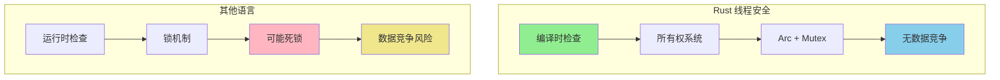
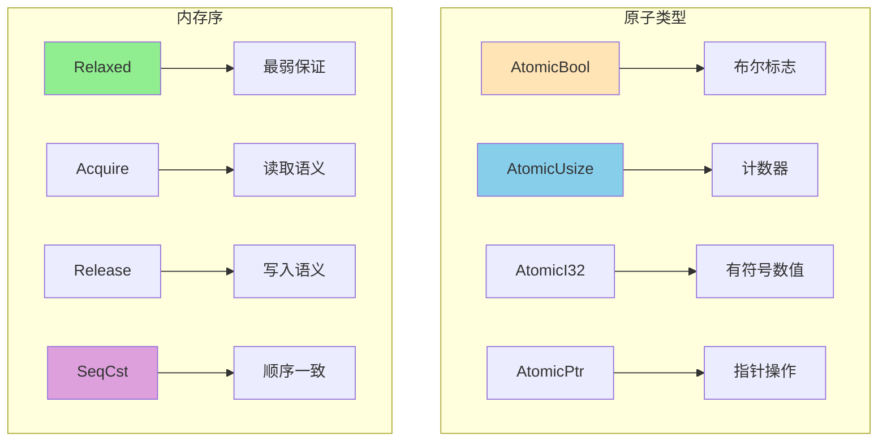
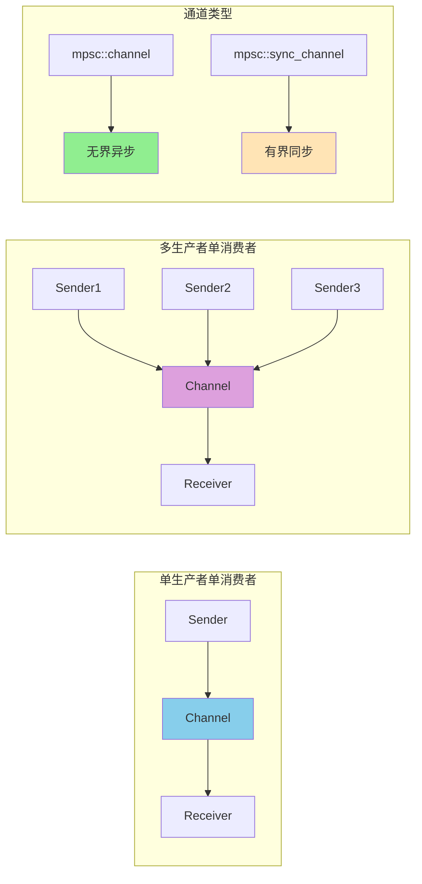
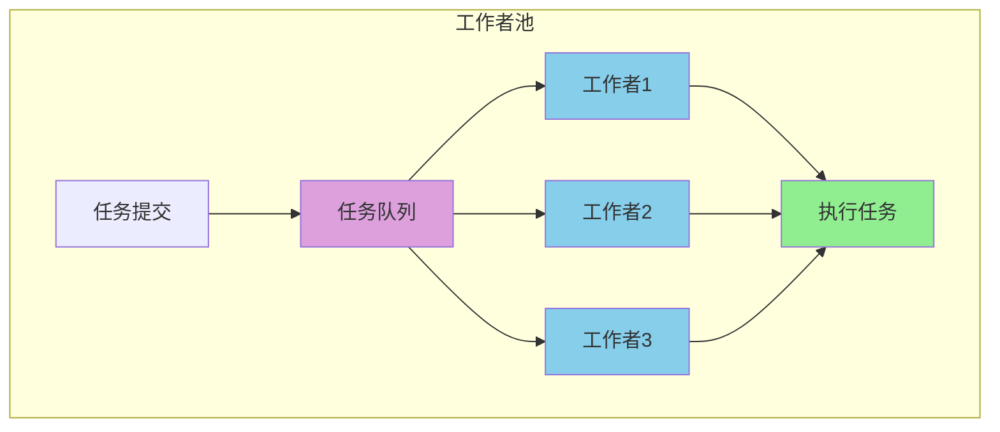
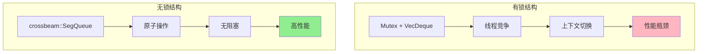
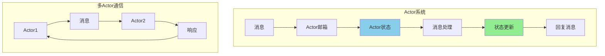
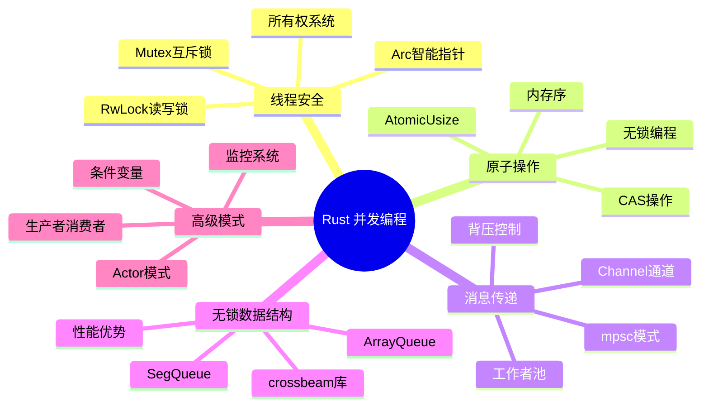

# Rust 高级并发模式详解

> 针对有 Python/Java/Node.js 经验的开发者定制，深度对比和详细讲解

## 🧵 并发模型的根本差异

### 并发模型概念映射表

| 你熟悉的语言 | 并发模型 | 核心机制 | Rust 对应概念 | 关键差异 |
|-------------|----------|----------|--------------|----------|
| **Python** | GIL + 多进程/多线程 | `threading.Thread`, `multiprocessing.Process` | `std::thread`, `Arc<Mutex<T>>` | 无GIL限制 vs GIL限制 |
| **Java** | 线程 + 锁 + 并发集合 | `Thread`, `synchronized`, `ConcurrentHashMap` | `thread::spawn`, `Mutex`, `Arc` | 编译时安全 vs 运行时检查 |
| **Node.js** | 单线程 + 事件循环 | `Worker Threads`, `SharedArrayBuffer` | `tokio::spawn`, `crossbeam` | 真正的并行 vs 单线程异步 |

### 并发模型对比图


## 🔒 线程安全核心概念

### Rust vs 其他语言的线程安全



### 基本线程安全示例

```rust
use std::sync::{Arc, Mutex};
use std::thread;

// 1. 编译失败的例子（Rust 阻止数据竞争）
/*
let mut counter = 0;
let handles: Vec<_> = (0..10).map(|i| {
    thread::spawn(move || {
        counter += 1; // 编译错误！
    })
}).collect();
*/

// 2. 正确的线程安全做法
fn safe_counter_example() {
    let counter = Arc::new(Mutex::new(0));
    let handles: Vec<_> = (0..10).map(|i| {
        let counter = Arc::clone(&counter);
        thread::spawn(move || {
            let mut num = counter.lock().unwrap();
            *num += 1;
            println!("线程 {} 计数: {}", i, *num);
        })
    }).collect();
    
    for handle in handles {
        handle.join().unwrap();
    }
    
    println!("最终计数: {}", *counter.lock().unwrap());
}

// 3. 读写锁示例
use std::sync::RwLock;

fn rwlock_example() {
    let data = Arc::new(RwLock::new(0));
    
    // 多个读取者
    let readers: Vec<_> = (0..3).map(|i| {
        let data = Arc::clone(&data);
        thread::spawn(move || {
            let num = data.read().unwrap();
            println!("读取者 {} 看到: {}", i, *num);
        })
    }).collect();
    
    // 一个写入者
    let data_clone = Arc::clone(&data);
    let writer = thread::spawn(move || {
        let mut num = data_clone.write().unwrap();
        *num = 100;
        println!("写入者更新值为: {}", *num);
    });
    
    for reader in readers {
        reader.join().unwrap();
    }
    writer.join().unwrap();
}
```

## ⚡ 原子操作核心概念

### 原子操作类型图



### 基本原子操作示例

```rust
use std::sync::atomic::{AtomicUsize, AtomicBool, Ordering};
use std::sync::Arc;
use std::thread;

// 1. 简单的原子计数器
fn atomic_counter_example() {
    let counter = Arc::new(AtomicUsize::new(0));
    
    let handles: Vec<_> = (0..10).map(|i| {
        let counter = Arc::clone(&counter);
        thread::spawn(move || {
            // 原子递增
            let old = counter.fetch_add(1, Ordering::SeqCst);
            println!("线程 {} 增加计数: {} -> {}", i, old, old + 1);
        })
    }).collect();
    
    for handle in handles {
        handle.join().unwrap();
    }
    
    println!("最终计数: {}", counter.load(Ordering::SeqCst));
}

// 2. 信号标志通信
fn atomic_flag_example() {
    let flag = Arc::new(AtomicBool::new(false));
    let data = Arc::new(AtomicUsize::new(0));
    
    // 写入线程
    let flag_writer = Arc::clone(&flag);
    let data_writer = Arc::clone(&data);
    let writer = thread::spawn(move || {
        // 更新数据
        data_writer.store(42, Ordering::Relaxed);
        // 设置标志（Release 保证数据更新对读取者可见）
        flag_writer.store(true, Ordering::Release);
        println!("写入者: 数据已准备");
    });
    
    // 读取线程
    let flag_reader = Arc::clone(&flag);
    let data_reader = Arc::clone(&data);
    let reader = thread::spawn(move || {
        // 等待标志（Acquire 确保能看到数据更新）
        while !flag_reader.load(Ordering::Acquire) {
            std::hint::spin_loop();
        }
        let value = data_reader.load(Ordering::Relaxed);
        println!("读取者: 读到数据 {}", value);
    });
    
    writer.join().unwrap();
    reader.join().unwrap();
}

// 3. 性能计数器
struct AtomicCounter {
    success: AtomicUsize,
    errors: AtomicUsize,
}

impl AtomicCounter {
    fn new() -> Self {
        Self {
            success: AtomicUsize::new(0),
            errors: AtomicUsize::new(0),
        }
    }
    
    fn record_success(&self) {
        self.success.fetch_add(1, Ordering::Relaxed);
    }
    
    fn record_error(&self) {
        self.errors.fetch_add(1, Ordering::Relaxed);
    }
    
    fn stats(&self) -> (usize, usize) {
        (
            self.success.load(Ordering::Relaxed),
            self.errors.load(Ordering::Relaxed),
        )
    }
}
```

## 🌐 消息传递并发模式

### Channel 通信机制图



### 基本 Channel 使用

```rust
use std::sync::mpsc;
use std::thread;

// 1. 基础消息传递
fn basic_channel_example() {
    let (tx, rx) = mpsc::channel();
    
    // 发送者线程
    thread::spawn(move || {
        let messages = vec!["Hello", "from", "Rust"];
        for msg in messages {
            tx.send(msg).unwrap();
        }
    });
    
    // 接收者（主线程）
    for received in rx {
        println!("收到: {}", received);
    }
}

// 2. 多生产者单消费者
fn multiple_producers() {
    let (tx, rx) = mpsc::channel();
    
    // 创建多个生产者
    for i in 0..3 {
        let tx = tx.clone();
        thread::spawn(move || {
            tx.send(format!("来自生产者 {}", i)).unwrap();
        });
    }
    drop(tx); // 关闭原始发送者
    
    // 消费者
    for msg in rx {
        println!("消费: {}", msg);
    }
}

// 3. 有界通道（背压控制）
fn bounded_channel_example() {
    let (tx, rx) = mpsc::sync_channel(2); // 容量为2
    
    // 生产者
    let producer = thread::spawn(move || {
        for i in 0..5 {
            match tx.send(i) {
                Ok(_) => println!("发送 {}", i),
                Err(_) => println!("发送失败"),
            }
        }
    });
    
    // 消费者（延迟处理）
    thread::spawn(move || {
        std::thread::sleep(std::time::Duration::from_millis(100));
        for item in rx {
            println!("处理 {}", item);
            std::thread::sleep(std::time::Duration::from_millis(200));
        }
    });
    
    producer.join().unwrap();
}
```

### 工作者池模式图



### 简化的工作者池实现

```rust
use std::sync::{Arc, Mutex, mpsc};
use std::thread;

type Job = Box<dyn FnOnce() + Send + 'static>;

struct ThreadPool {
    workers: Vec<Worker>,
    sender: mpsc::Sender<Job>,
}

struct Worker {
    thread: thread::JoinHandle<()>,
}

impl ThreadPool {
    fn new(size: usize) -> Self {
        let (sender, receiver) = mpsc::channel();
        let receiver = Arc::new(Mutex::new(receiver));
        
        let mut workers = Vec::with_capacity(size);
        for id in 0..size {
            let receiver = Arc::clone(&receiver);
            let thread = thread::spawn(move || {
                loop {
                    let job = receiver.lock().unwrap().recv();
                    match job {
                        Ok(job) => {
                            println!("工作者 {} 执行任务", id);
                            job();
                        }
                        Err(_) => break,
                    }
                }
            });
            workers.push(Worker { thread });
        }
        
        ThreadPool { workers, sender }
    }
    
    fn execute<F>(&self, f: F) where F: FnOnce() + Send + 'static {
        self.sender.send(Box::new(f)).unwrap();
    }
}

// 使用示例
fn thread_pool_example() {
    let pool = ThreadPool::new(4);
    
    for i in 0..8 {
        pool.execute(move || {
            println!("任务 {} 完成", i);
            std::thread::sleep(std::time::Duration::from_millis(100));
        });
    }
    
    std::thread::sleep(std::time::Duration::from_secs(2));
}
```

## 🔄 无锁数据结构

### 无锁 vs 有锁性能图



### 基本无锁队列使用

```rust
use crossbeam::queue::{ArrayQueue, SegQueue};
use std::sync::Arc;
use std::thread;

// 1. 无界无锁队列
fn unbounded_queue_example() {
    let queue = Arc::new(SegQueue::new());
    
    // 生产者
    let q1 = Arc::clone(&queue);
    let producer = thread::spawn(move || {
        for i in 0..10 {
            q1.push(i);
            println!("推入: {}", i);
        }
    });
    
    // 消费者
    let q2 = Arc::clone(&queue);
    let consumer = thread::spawn(move || {
        for _ in 0..10 {
            while let Some(item) = q2.pop() {
                println!("弹出: {}", item);
                break;
            }
        }
    });
    
    producer.join().unwrap();
    consumer.join().unwrap();
}

// 2. 有界无锁队列
fn bounded_queue_example() {
    let queue = Arc::new(ArrayQueue::new(5));
    
    let q1 = Arc::clone(&queue);
    thread::spawn(move || {
        for i in 0..10 {
            match q1.push(i) {
                Ok(_) => println!("成功推入: {}", i),
                Err(value) => println!("队列满，失败: {}", value),
            }
        }
    }).join().unwrap();
}
```

## 🎯 高级并发模式

### Actor 模式架构图



### 简化的 Actor 实现

```rust
use std::sync::mpsc;
use std::thread;

#[derive(Debug)]
enum Message {
    Increment,
    Decrement,
    GetValue(mpsc::Sender<i32>),
    Stop,
}

struct CounterActor {
    receiver: mpsc::Receiver<Message>,
    value: i32,
}

impl CounterActor {
    fn new() -> (mpsc::Sender<Message>, Self) {
        let (sender, receiver) = mpsc::channel();
        (sender, CounterActor { receiver, value: 0 })
    }
    
    fn run(mut self) {
        while let Ok(msg) = self.receiver.recv() {
            match msg {
                Message::Increment => self.value += 1,
                Message::Decrement => self.value -= 1,
                Message::GetValue(reply) => {
                    let _ = reply.send(self.value);
                }
                Message::Stop => break,
            }
        }
    }
}

// 使用示例
fn actor_example() {
    let (sender, actor) = CounterActor::new();
    
    // 启动 Actor
    thread::spawn(move || actor.run());
    
    // 发送消息
    sender.send(Message::Increment).unwrap();
    sender.send(Message::Increment).unwrap();
    
    // 查询值
    let (reply_tx, reply_rx) = mpsc::channel();
    sender.send(Message::GetValue(reply_tx)).unwrap();
    let value = reply_rx.recv().unwrap();
    println!("Actor 值: {}", value);
    
    sender.send(Message::Stop).unwrap();
}
```

## 🚀 并发编程最佳实践

### 并发模式选择图

```mermaid
flowchart TB
    subgraph 使用场景
        A[数据访问模式] --> B{读写比例}
        B -->|读多写少| C[Arc + RwLock]
        B -->|读写平衡| D[Arc + Mutex]
        B -->|高频计数| E[AtomicUsize]
        
        F[通信需求] --> G{通信模式}
        G -->|任务分发| H[Channel]
        G -->|状态隔离| I[Actor模式]
        G -->|高性能队列| J[无锁队列]
    end
    
    style C fill:#87CEEB
    style D fill:#DDA0DD
    style E fill:#90EE90
    style H fill:#FFE4B5
    style I fill:#F0E68C
    style J fill:#98FB98
```



### 并发编程思维图



### 核心概念对比表

| 概念 | Python | Java | Node.js | Rust |
|------|--------|------|---------|------|
| **线程安全** | GIL限制 | 运行时检查 | 单线程 | 编译时保证 |
| **共享状态** | 手动同步 | synchronized | Worker | 所有权系统 |
| **错误处理** | 异常 | 异常 | 回调/Promise | Result<T,E> |
| **性能开销** | 解释器 | JVM | V8优化 | 零成本抽象 |
| **内存管理** | GC | GC | GC | 所有权+RAII |

### 学习路径建议

1. **掌握所有权并发** - 理解 Arc、Mutex、RwLock
2. **学习原子操作** - AtomicUsize、内存序、CAS
3. **实践消息传递** - Channel、工作者池模式
4. **探索无锁编程** - crossbeam、无锁数据结构
5. **应用高级模式** - Actor模式、条件变量

### 实践建议

- ✅ 优先使用消息传递而非共享状态
- ✅ 对频繁访问的计数器使用原子类型
- ✅ 读多写少场景使用 RwLock
- ✅ 考虑使用无锁数据结构提升性能
- ✅ 监控并发性能和资源使用

---

**掌握了并发编程，下一章学习 Rust 的高级特性和宏编程！** 🚀