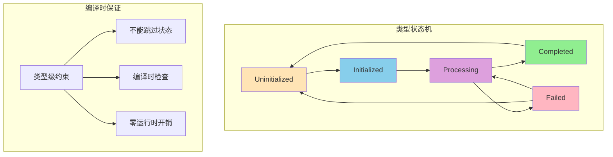
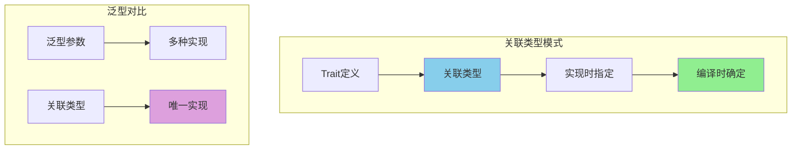
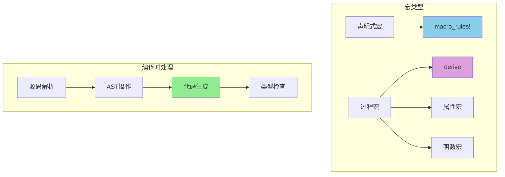
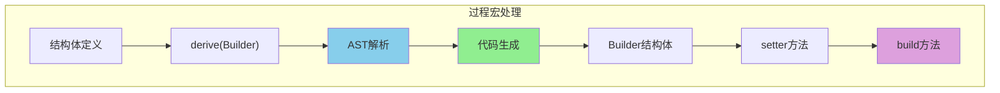
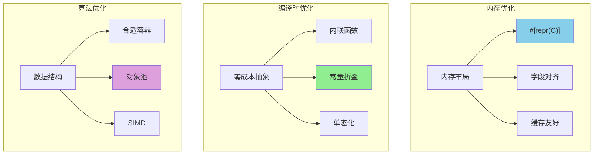
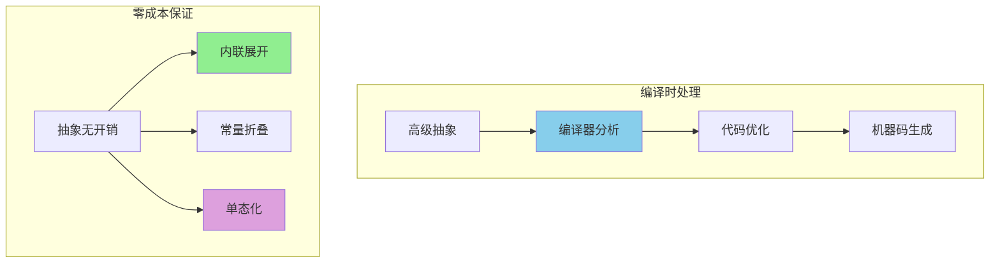
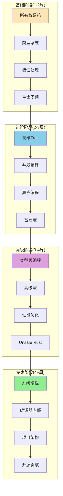
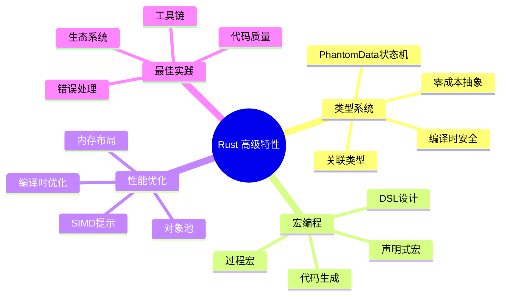

# Rust 高级特性：类型系统、宏编程、性能优化

> 针对有 Python/Java/Node.js 经验的开发者定制，深度对比和详细讲解

## 🚀 高级类型系统深度解析

### 类型系统概念映射表

| 你熟悉的语言 | 类型系统特性 | 核心概念 | Rust 对应概念 | 关键差异 |
|-------------|----------|----------|--------------|----------|
| **Python** | 动态类型 + Duck Typing | `hasattr()`, `isinstance()` | Trait 系统 | 编译时类型检查 vs 运行时 |
| **Java** | 面向对象 + 接口 | `interface`, `extends`, Generics | Trait + 泛型 | 组合型系 vs 子类型系 |
| **Node.js/TS** | 结构化类型 | `interface`, `type`, Union Types | Trait + 关联类型 | 零成本抽象 vs 运行时检查 |

### 类型系统深度对比


## 🔍 类型级编程的威力

### PhantomData 类型状态机图



### 基本类型状态机示例

```rust
use std::marker::PhantomData;

// 状态类型
struct Uninitialized;
struct Processing;
struct Completed;

// 类型状态机
struct StateMachine<S> {
    _state: PhantomData<S>,
    data: String,
}

impl StateMachine<Uninitialized> {
    fn new() -> Self {
        Self {
            _state: PhantomData,
            data: String::new(),
        }
    }
    
    fn initialize(mut self, data: String) -> StateMachine<Processing> {
        self.data = data;
        StateMachine {
            _state: PhantomData,
            data: self.data,
        }
    }
}

impl StateMachine<Processing> {
    fn complete(self) -> StateMachine<Completed> {
        StateMachine {
            _state: PhantomData,
            data: self.data,
        }
    }
}

impl StateMachine<Completed> {
    fn get_result(&self) -> &str {
        &self.data
    }
}

// 使用示例
fn type_state_example() {
    let machine = StateMachine::new()
        .initialize("数据".to_string())
        .complete();
    
    println!("结果: {}", machine.get_result());
}
```

### 关联类型高级应用图



### 基本关联类型示例

```rust
// 基本容器抽象
trait Container {
    type Item;
    
    fn add(&mut self, item: Self::Item);
    fn len(&self) -> usize;
}

// Vec实现
struct MyVec<T> {
    items: Vec<T>,
}

impl<T> Container for MyVec<T> {
    type Item = T;
    
    fn add(&mut self, item: T) {
        self.items.push(item);
    }
    
    fn len(&self) -> usize {
        self.items.len()
    }
}

// 数学运算trait
trait Math: Copy {
    fn add(self, other: Self) -> Self;
    fn mul(self, other: Self) -> Self;
}

impl Math for i32 {
    fn add(self, other: Self) -> Self { self + other }
    fn mul(self, other: Self) -> Self { self * other }
}

// 使用示例
fn container_example() {
    let mut vec: MyVec<i32> = MyVec { items: Vec::new() };
    vec.add(1);
    vec.add(2);
    println!("容器大小: {}", vec.len());
}
```

## 🔮 宏编程的核心概念

### 宏编程层次图



### 基本声明式宏示例

```rust
// 简单的代码生成宏
macro_rules! create_struct {
    ($name:ident { $($field:ident: $type:ty),* }) => {
        struct $name {
            $($field: $type,)*
        }
        
        impl $name {
            fn new($($field: $type),*) -> Self {
                Self { $($field),* }
            }
        }
    };
}

// 使用宏生成结构体
create_struct!(Person {
    name: String,
    age: u32
});

// 函数式管道宏
macro_rules! pipe {
    ($value:expr) => { $value };
    ($value:expr, $func:expr) => { $func($value) };
    ($value:expr, $func:expr, $($rest:expr),+) => {
        pipe!($func($value), $($rest),+)
    };
}

// 简单的HTML DSL
macro_rules! html {
    ($tag:ident { $content:expr }) => {
        format!("<{}>{}</{}>", stringify!($tag), $content, stringify!($tag))
    };
}

// 宏使用示例
fn macro_example() {
    let person = Person::new("Alice".to_string(), 30);
    
    let result = pipe!(
        vec![1, 2, 3, 4],
        |v| v.into_iter().map(|x| x * 2).collect::<Vec<_>>(),
        |v: Vec<i32>| v.into_iter().sum::<i32>()
    );
    
    let html = html!(div { "Hello World" });
    
    println!("结果: {}, HTML: {}", result, html);
}
```

### Builder模式过程宏图



### Builder模式手动实现

```rust
// 目标结构体
#[derive(Debug)]
struct User {
    name: String,
    age: u32,
    email: String,
}

// Builder结构体
struct UserBuilder {
    name: Option<String>,
    age: Option<u32>,
    email: Option<String>,
}

impl User {
    fn builder() -> UserBuilder {
        UserBuilder::new()
    }
}

impl UserBuilder {
    fn new() -> Self {
        Self {
            name: None,
            age: None,
            email: None,
        }
    }
    
    fn name(mut self, name: String) -> Self {
        self.name = Some(name);
        self
    }
    
    fn age(mut self, age: u32) -> Self {
        self.age = Some(age);
        self
    }
    
    fn email(mut self, email: String) -> Self {
        self.email = Some(email);
        self
    }
    
    fn build(self) -> Result<User, &'static str> {
        Ok(User {
            name: self.name.ok_or("缺少name字段")?,
            age: self.age.ok_or("缺少age字段")?,
            email: self.email.ok_or("缺少email字段")?,
        })
    }
}

// 使用示例
fn builder_example() {
    let user = User::builder()
        .name("Alice".to_string())
        .age(30)
        .email("alice@example.com".to_string())
        .build()
        .unwrap();
    
    println!("用户: {:?}", user);
}
```

## 🚀 性能优化核心技巧

### 性能优化策略图



### 基本性能优化示例

```rust
use std::mem;

// 内存布局优化
#[repr(C)]
struct OptimizedStruct {
    large: u64,   // 8字节
    medium: u32,  // 4字节
    small: u16,   // 2字节
    tiny: u8,     // 1字节
}

// 简单对象池
struct SimplePool<T> {
    items: Vec<T>,
}

impl<T: Default> SimplePool<T> {
    fn new() -> Self {
        Self { items: Vec::new() }
    }
    
    fn get(&mut self) -> T {
        self.items.pop().unwrap_or_default()
    }
    
    fn put(&mut self, item: T) {
        self.items.push(item);
    }
}

// 缓存友好的矩阵
struct Matrix {
    data: Vec<f64>,
    rows: usize,
    cols: usize,
}

impl Matrix {
    fn new(rows: usize, cols: usize) -> Self {
        Self {
            data: vec![0.0; rows * cols],
            rows,
            cols,
        }
    }
    
    // 行优先访问（缓存友好）
    fn row_sum(&self) -> f64 {
        self.data.iter().sum()
    }
    
    // 列优先访问（缓存不友好）
    fn col_sum(&self) -> f64 {
        let mut sum = 0.0;
        for col in 0..self.cols {
            for row in 0..self.rows {
                sum += self.data[row * self.cols + col];
            }
        }
        sum
    }
}

fn performance_example() {
    println!("结构体大小: {} 字节", mem::size_of::<OptimizedStruct>());
    
    let mut pool = SimplePool::<String>::new();
    let item = pool.get();
    pool.put(item);
    
    let matrix = Matrix::new(100, 100);
    let sum1 = matrix.row_sum();
    let sum2 = matrix.col_sum();
    
    println!("行求和: {}, 列求和: {}", sum1, sum2);
}
```

### 零成本抽象核心概念图



### 编译时优化示例

```rust
// 编译时常量
const fn compute_table_size(rows: usize, cols: usize) -> usize {
    rows * cols
}

const TABLE_SIZE: usize = compute_table_size(100, 100);

// 条件编译
#[cfg(debug_assertions)]
fn debug_log(msg: &str) {
    println!("DEBUG: {}", msg);
}

#[cfg(not(debug_assertions))]
#[inline(always)]
fn debug_log(_msg: &str) {
    // Release模式下完全优化掉
}

// 泛型特化
trait Process<T> {
    fn process(&self, data: T) -> T;
}

struct Processor;

impl Process<i32> for Processor {
    #[inline(always)]
    fn process(&self, data: i32) -> i32 {
        data * 2 + 1  // 针对i32优化
    }
}

impl Process<f64> for Processor {
    #[inline(always)]
    fn process(&self, data: f64) -> f64 {
        data.mul_add(2.0, 1.0)  // 使用FMA指令
    }
}

// 零成本迭代器
struct ZeroRange {
    current: usize,
    end: usize,
}

impl ZeroRange {
    fn new(start: usize, end: usize) -> Self {
        Self { current: start, end }
    }
}

impl Iterator for ZeroRange {
    type Item = usize;
    
    #[inline(always)]
    fn next(&mut self) -> Option<usize> {
        if self.current < self.end {
            let current = self.current;
            self.current += 1;
            Some(current)
        } else {
            None
        }
    }
}

fn zero_cost_example() {
    debug_log("这在debug模式显示");
    
    let processor = Processor;
    let int_result = processor.process(42i32);
    let float_result = processor.process(3.14f64);
    
    println!("i32: {}, f64: {}", int_result, float_result);
    
    // 零成本迭代
    for i in ZeroRange::new(0, 3) {
        println!("迭代: {}", i);
    }
}
```

## 🎯 学习路径和最佳实践

### 学习路径规划图



### 最佳实践总结

```rust
// 代码质量实践
fn best_practices_example() {
    // ✅ 使用有意义的类型
    type UserId = u64;
    type Result<T> = std::result::Result<T, AppError>;
    
    // ✅ 优先使用Option和Result
    fn find_user(id: UserId) -> Option<User> {
        // 实现查找逻辑
        None
    }
    
    // ✅ 避免过度使用clone()
    fn process_data(data: &[i32]) -> Vec<i32> {
        data.iter().map(|x| x * 2).collect()
    }
    
    // ✅ 使用合适的错误处理
    fn read_config() -> Result<Config> {
        let content = std::fs::read_to_string("config.toml")?;
        parse_config(&content)
    }
}

#[derive(Debug)]
struct User {
    id: u64,
    name: String,
}

#[derive(Debug)]
struct Config {
    name: String,
}

#[derive(Debug)]
enum AppError {
    Io(std::io::Error),
    Parse(String),
}

impl From<std::io::Error> for AppError {
    fn from(err: std::io::Error) -> Self {
        AppError::Io(err)
    }
}

fn parse_config(_content: &str) -> Result<Config, AppError> {
    Ok(Config {
        name: "app".to_string(),
    })
}

type Result<T> = std::result::Result<T, AppError>;
```

## 🎯 学习要点总结

### Rust高级特性核心思维图



### 核心概念对比表

| 特性 | Python | Java | TypeScript | Rust |
|------|--------|------|------------|------|
| **类型安全** | 运行时 | 编译时 | 编译时 | 编译时+所有权 |
| **性能** | 解释器 | JVM | V8优化 | 原生机器码 |
| **内存管理** | GC | GC | GC | 所有权+RAII |
| **抽象能力** | 强 | 强 | 强 | 非常强 |
| **并发安全** | GIL限制 | 运行时 | 单线程 | 编译时保证 |
| **元编程** | 装饰器 | 注解 | 类型操作 | 宏系统 |

### 学习建议

1. **循序渐进** - 从基础概念到高级特性
2. **实践驱动** - 通过项目练习加深理解
3. **社区参与** - 加入Rust社区交流学习
4. **持续更新** - 关注Rust新特性和最佳实践

### 实践建议

- ✅ 优先使用安全的Rust代码
- ✅ 合理使用泛型和trait抽象
- ✅ 注重性能优化和内存布局
- ✅ 善用编译时检查和优化
- ✅ 积极使用Rust工具链

---

**🎉 恭喜！你已经掌握了 Rust 的高级特性！**

通过系统学习，你现在能够：
- 构建高性能、内存安全的应用
- 设计优雅的类型安全API
- 使用宏进行元编程
- 优化代码性能到极致

**继续你的 Rust 之旅，构建令人惊叹的软件！** 🦀